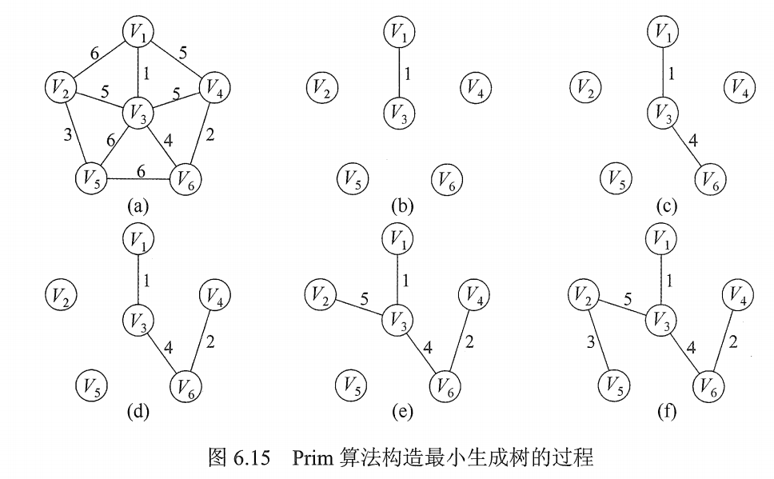
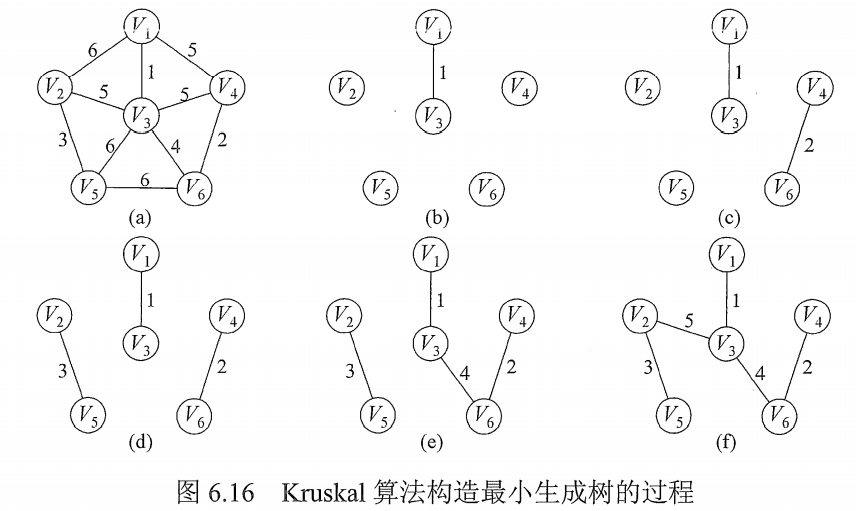

# 最小生成树

对于一个带权连通无向图 $G=(V<E)$​ ，生成树是不同的，每棵树的权（树中所有边的权值之和）也可能不同。

设 R 为 G 的所有生成树的集合，若 T 为 R 中边的权值之和最小的那颗生成树，则称 T 为 G 的**最小生成树（Minimum-Spanning-Tree，MST）**。

显然，最小生成树可能不唯一的，但最小生成树的边的权值之和是唯一的。最小生成树的边数为顶点数减 1。

Prime算法和Kruskal算法都是基于贪心算法的策略。

## 一. Prime 算法（普里姆）

图1.Prim 算法构造最小生成树的过程

初始时任取一顶点，加入树 T；

之后选择与当前树 T 中顶点集合距离最近的顶点，将该顶点和相应的边加入树 T。

以此类推，直到图中所有顶点都并入树 T。

伪代码：

~~~c
void Prime(G,T){
    T = Ø;		//初始化空树
    U = {w};	//添加任一顶点 w
    while( (V-U) != Ø ){	//若树中不含全部顶点
        设 (u,v) 是使 u∈U 与 v∈(V-U) 且权值最小的边;
        T = T∪{ (u,v) };	//边归入树
        U = U∪{V};			//顶点归入树
    }
}
~~~

Prim 算法时间复杂度为 $O(|V|^2)$​​​​ ，不依赖于 $|E|$ ，适用于求解**边稠密的图**的最小生成树。

## 二. Kruskal 算法（克鲁斯卡尔）

图2.Kruskal 算法构造最小生成树的过程

Kruskal 算法是按权值递增的次序选择合适的边来构造最小生成树的方法。

初始时，将所有的 n 个顶点视为 n 个无边的非连通图 $T=\{V,\{\}\}$ ，每个顶点都自成一个连通分量。

然后按照边的权值由小到大排序，不断选择当前未被选择过的且权值最小的边。
若该边依附的顶点落在 T 中的不同连通分量上，则将此边加入 T；否则舍弃此边而选择下一条权值最小的边。

以此类推，直到 T 中所有顶点都在一个连通分量上。

伪代码：

~~~c
void Kruskal{
    T = V;		//初始化树
    numS = n;	//连通分量数
    while( numS > 1 ){
        从 E 中取出权值最小的边 (v,u);
        if( v 和 u 属于 T 中不同的连通分量){
        	T = T∪{ (u,v) };	//将此边加入生成树
        	numS--;				//连通分量数减 1
        }
    }
}
~~~

通常在 Kruskal 算法中，采用堆来存放边的集合，因此每次选择最小权值边需要 $O(\log|E|)$ 的时间。
此外，由于生成树 T 中的所有边可视为一个等价类，因此每次添加新的边的过程类似求解等价类的过程，由此可以采用并查集的数据结构来描述 T 。

从而构造 T 的总的时间复杂度为 $O(|E|\log|E|)$ 。

因此，Kruskal 算法适合**边稀疏而顶点较多**的图。

2021.08.06
