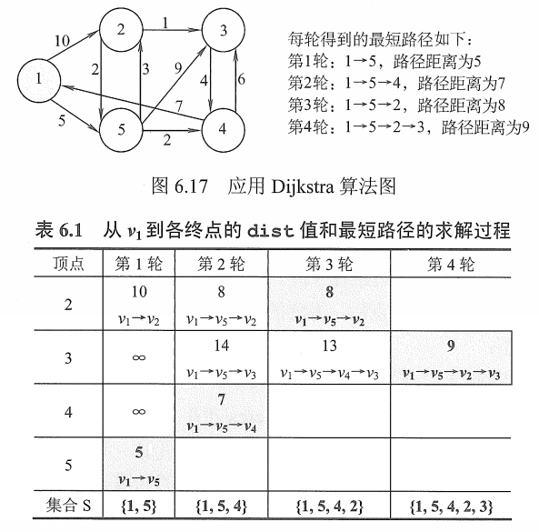
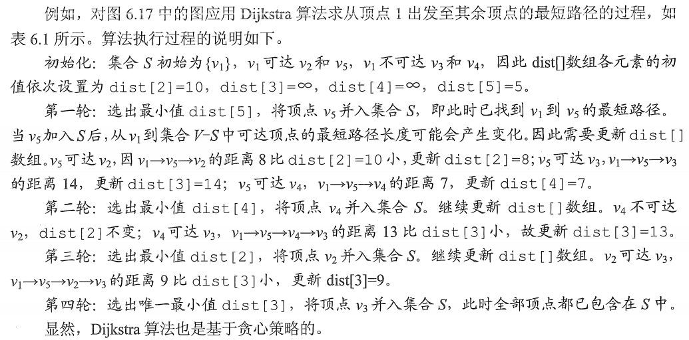
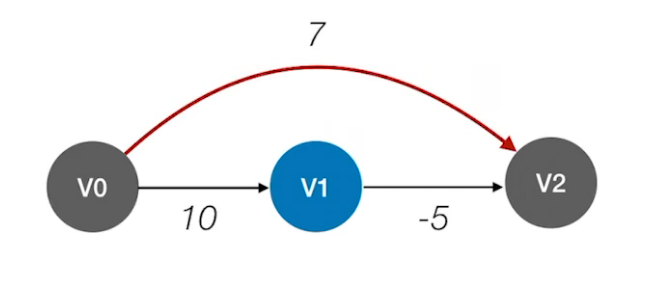

# 单源最短路径-Dijkstra

## 一. Dijkstra 算法

Dijkstra 算法设置了一个集合 S 记录已求得的最短路径的顶点，初始时把源点 $v_0$ 放入 S，集合 S 每并入一个新顶点 $v_i$ ，都要修改源点 $v_0$ 到集合 V-S 中顶点中顶点当前的最短路径长度值。

需要两个辅助数组：

- dist[]：记录从源点 $v_0$ 到其他各顶点当前的最短路径长度，它的初态为：若从 $v_0$ 到 $v_i$ 有弧，则 dist[i] 为弧上的权值；否则置 dist[i] 为 $\infty$ 。
- path[]：path[i] 表示从源点到顶点 i 之间的最短路径的前驱结点。在算法结束时，可根据其值追溯得到源点 $v_0$ 到顶点 $v_i$ 的最短路径

假设从顶点 0 出发，即 $v_0 = 0$ ，集合 S 最初只包含顶点 0，邻接矩阵 arcs 表示带权有向图，$arcs[i][j]$ 表示有向边 <i,j> 的权值，若不存在有向边 <i,j>，则 $arcs[i][j]$ 为 $\infty$ 。

DijKstra 算法的步骤如下（不考虑对 path[] 的操作）：

1. 初始化：集合 S 初始为 $\{0\}$，dist[] 的初始值为 $dist[i]=arcs[0][i],i=1,2,...,n-1$ 。
2. 从顶点集合 V_S 中选出 $v_j$ ，满足 $dist[j]=Min(dist[i]|v_i\in V-S)$ ，$v_j$ 就是当前求得的一条从 $v_0$ 出发的最短路径的终点，令 $S=S\cup\{j\}$ 。
3. 修改从 $v_0$ 出发到集合 V-S 上任一顶点 $v_k$ 可达的最短路径长度：若 $dist[j]+arcs[j][k]<dist[k]$ ，则更新 $dist[k]=dist[j]+arcs[j][k]$ 。
4. 重复第 2、3 步共 n-1 次，直到所有顶点都包含在 S 中。

图1. Dijkstra 算法举例

图 1 为 Dijktra 算法的举例，不过只是人算。

图2. Dijkstra 算法举例的过程

图 2 为对图 1 使用 Dijkstra 算法的过程。

不过王道这上面都只是为了让你会做题，所以只讲了怎么脑子里算出来。

使用邻接矩阵表示时，时间复杂度为 $O(|V|^2)$ 。
使用带权的邻接表表示时，虽然修改 dist[] 的时间可以减少，但由于在 dist[] 中选择最小分量的时间不变，时间复杂度仍为 $O(|V|^2)$ 。

图3. Dijstra 算法不适用有负权值

注意的是，当边上带有负权值时，Dijkstra 算法并不适用。

如图所示，初始顶点为 V0，则由 Dijstra 算法得出的会是 V0-V2 为最短路径，但显然 V0-V1-V2 才是最短路径。

## 二. 我自己做的一道算法题

虽然这题除了 Dijstra 算法，还要多考虑一各东西。

来自 PTA 甲级第三题：

>1003 Emergency (25 分) 
>
>As an emergency rescue team leader of a city, you are given a special map of your country. The map shows several scattered cities connected by some roads. Amount of rescue teams in each city and the length of each road between any pair of cities are marked on the map. When there is an emergency call to you from some other city, your job is to lead your men to the place as quickly as possible, and at the mean time, call up as many hands on the way as possible. 
>
>**Input Specification:**
>
>Each input file contains one test case. For each test case, the first line contains 4 positive integers: $N (≤500)$​​​ - the number of cities (and the cities are numbered from 0 to $N−1$​​​), M - the number of roads, $C_1$​​​  and $C_2$​​​  - the cities that you are currently in and that you must save, respectively. The next line contains $N$​​​ integers, where the i-th integer is the number of rescue teams in the i-th city. Then $M$​​ lines follow, each describes a road with three integers $c_1$​​  , $c_2$​  and $L$, which are the pair of cities connected by a road and the length of that road, respectively. It is guaranteed that there exists at least one path from $C_1$​​  to $C_2$​​​ . 
>
>**Output Specification:**
>
>For each test case, print in one line two numbers: the number of different shortest paths between $C_1$​  and $C_2$  , and the maximum amount of rescue teams you can possibly gather. All the numbers in a line must be separated by exactly one space, and there is no extra space allowed at the end of a line.
>
>**Sample Input:**
>
>5 6 0 2
>1 2 1 5 3
>0 1 1
>0 2 2
>0 3 1
>1 2 1
>2 4 1
>3 4 1
>
>**Sample Outpur:**
>
>2 4

~~~python
# 读第一行
a = input().split(sep = " ")
a = list( map( int , a) )
city_num = int( a[0] )
road_num = int( a[1] )
start_city = int( a[2] )
end_city = int( a[3] )
# 读第二行
a = input().split(sep = " ")
city_population = list( map( int , a) )
# 读第三行
road = [ [ 0 for i in range(0,city_num) ] for j in range(0,city_num) ]
for i in range(0,road_num):
    a = input().split(sep=" ")
    a = list(map(int, a))
    road[ a[0] ][ a[1] ] = a[2]
    road[ a[1] ][ a[0] ] = a[2]

# 开始 Dijkstra 算法
# 初始化
final = [0]*city_num
dist = list(road[start_city])
inf = float("inf")
for i in range(0,city_num):
    if dist[i] == 0 and i != start_city:
        dist[i] = inf
# 需要记录输出的结果
shortest_path_num = [0]*city_num
shortest_path_num[start_city] = 1
people_num = list(city_population)
# 中间使用到的变量
current_city = start_city
next_city = -1
while 0 in final:
    # 处理当前城市
    ## 处理当前城市的 final
    final[current_city] = 1
    # 处理当前城市的 dist, 并同时统计最短路径数、最多人数
    for i in range(0,city_num):
        # 对于未到达过，且当前城市可到达的城市，称为 i
        if final[i] == 0 and road[current_city][i] != 0:
            # 计算由当前城市到城市 i 的新的距离
            new_dist = dist[current_city] + road[current_city][i]
            # 如果新距离 = 旧距离
            if new_dist == dist[i] :
                # 说明到 i 新增了当前城市的路径数
                shortest_path_num[i] += shortest_path_num[current_city]
                # 计算由当前城市到城市 i 的新的人数
                new_people = people_num[current_city] + city_population[i]
                # 如果新人数大于旧人数
                if new_people > people_num[i]:
                    # 修改当前最短路径到城市 i 的总人数设为新人数
                    people_num[i] = new_people
            # 如果新距离 < 旧距离
            elif new_dist < dist[i] :
                # 修改城市 i 的最短距离为新距离
                dist[i] = new_dist
                # 重置最短路径条数为当前城市的路径数
                shortest_path_num[i] = shortest_path_num[current_city]
                # 修改当前最短路径到城市 i 的总人数设为新人数
                new_people = people_num[current_city] + city_population[i]
                people_num[i] = new_people
    # 选择下一个城市
    # 找到未处理的城市中距离最小的城市
    min_dist = float("inf")
    for i in range(0, city_num):
        if final[i] == 0 and dist[i] <= min_dist :
                min_dist = dist[i]
                next_city = i
    # 找到 next_city 的上一个城市
    current_city = next_city
print("%d %d" % (shortest_path_num[end_city],people_num[end_city]) )
~~~

2021.08.07
