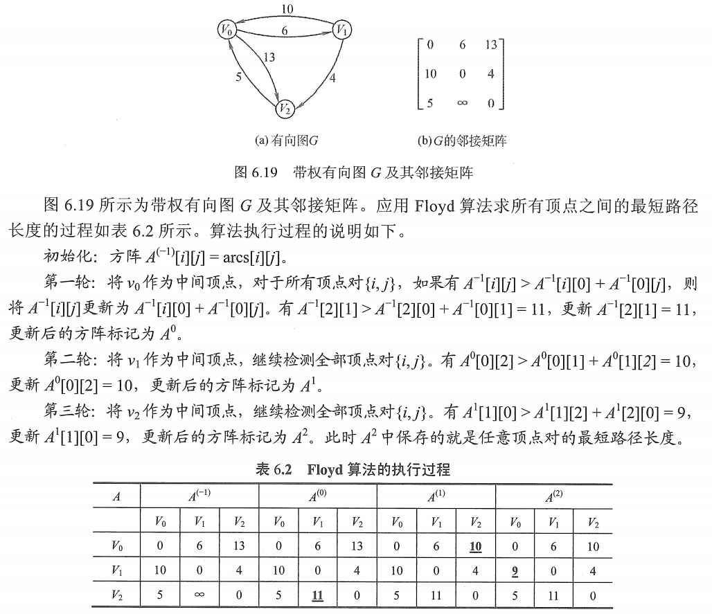

# 各顶点间最短路径-Floyd

递推产生一个 n 列方阵序列 $A^{(-1)},A^{(0)},A^{(1)},...,A^{(n-1)}$ ，其中 $A^{(k)}[i][j]$ 表示从顶点 $v_i$ 到顶点 $v_j$ 的路径长度，k 表示绕行第 k 个顶点（以 $v_k$ 为中转顶点）的运算步骤。

初始时 $A^{-1}$ ，对于任意两个顶点 $v_i$ 和 $v_j$ ，若它们之间存在边，则以此边上的权值作为它们之间的最短路径长度；若它们之间不存在有向边，则以 $\infty$ 作为它们之间的最短路径长度。

以后逐个尝试加入允许以顶点 $k,(k=0,1,2,...,n-1)$​ 为中转顶点。
若以增加了中转顶点后，得到的路径比原本的路径长度减少了，则以此新路径代替原路径。

图1. Floyd 算法举例

Floyd 算法举例：

1. 初始时：

   k = -1，表示此时不允许任何一个结点作为中间结点，即所有结点只能通过直接连接的方式到达其他结点。

    $A^{(-1)}$​​ 与邻接矩阵相同。

   同时需要设置一个 path[] 矩阵记录到该顶点的路径的直接前驱。
   $$
   A^{(-1)}[i][j] =
   \left[\begin{matrix}
   0&6&13\\
   10&0&4\\
   5&\infty&0
   \end{matrix}\right]
   ,path^{(-1)}[i][j] =
   \left[\begin{matrix}
   -1&-1&-1\\
   -1&-1&-1\\
   -1&-1&-1
   \end{matrix}\right]
   $$
   

2. 第一轮运算：

   k = 0，表示允许以 $v_0$​​ 作为中间结点，来到达其他结点。

   对每个结点 $v_i$​​ 遍历，尝试经 $v_0$​​ 达到其他结点 $v_j$​​ ，
   若 $v_i$​​ 从 $v_0$​​ 达到 $v_j$​​ 的距离，小于，当前 $A^{(0)}[i][j]$​​ 中的距离（即上一轮 $v_i$​​ 直接到达 $v_j$​​ 的距离），则更新 $A^{(0)}[i][j]$​​ ，并修改 $path[i][j]=0$​​ 。
   $$
   A^{(-1)}[i][j] =
   \left[\begin{matrix}
   0&6&13\\
   10&0&4\\
   5&11&0
   \end{matrix}\right]
   ,path^{(-1)}[i][j] =
   \left[\begin{matrix}
   -1&-1&-1\\
   -1&-1&-1\\
   -1&0&-1
   \end{matrix}\right]
   $$
   这里，修改了 $A[2][1]=11,path[2][1]=0$ 。

3. 第二轮运算：

   k = 1，表示允许以 $v_0,v_1$​​ 作为中间结点，来到达其他结点。

   对每个结点 $v_i$​ 遍历，尝试经 $v_0,v_1$​ 达到其他结点 $v_j$​ ，

   若 $v_i$ 从达以 $v_0,v_1$ 作为中间结点到 $v_j$ 的距离，小于，上一轮（ $v_i$ 直接到达 $v_j$ ）的距离，则更新 $A[i][j]$ ，并修改 $path[i][j]=0$ 。
   $$
   A^{(-1)}[i][j] =
   \left[\begin{matrix}
   0&6&10\\
   10&0&4\\
   5&11&0
   \end{matrix}\right]
   ,path^{(-1)}[i][j] =
   \left[\begin{matrix}
   -1&-1&1\\
   -1&-1&-1\\
   -1&0&-1
   \end{matrix}\right]
   $$
   这里，修改了 $A[0][1]=10,path[0][2]=1$​​ 。

4. 第三轮运算：

   k = 2，表示允许以 $v_0,v_1,v_2$​​ 作为中间结点，来到达其他结点。

   对每个结点 $v_i$ 遍历，尝试经 $v_0,v_1$ 达到其他结点 $v_j$ ，
   若 $v_i$ 以 $v_0,v_1,v_2$ 作为中间结点达到 $v_j$ 的距离，小于，上一轮（ $v_i$ 直接到达 $v_j$ ）的距离，则更新 $A[i][j]$ ，并修改 $path[i][j]=0$ 。
   $$
   A^{(-1)}[i][j] =
   \left[\begin{matrix}
   0&6&10\\
   9&0&4\\
   5&11&0
   \end{matrix}\right]
   ,path^{(-1)}[i][j] =
   \left[\begin{matrix}
   -1&-1&1\\
   2&-1&-1\\
   -1&0&-1
   \end{matrix}\right]
   $$
   这里，修改了 $A[1][0]=9,path[1][0]=2$​​​​​ 。

   结束。

不过王道书上这个例子，一开始所有结点都是相连的，只有一次中转。

实际上可以自己尝试一下 0-1-2-3 这样的图使用 Floyd 算法。

会发现，每次 $v_i$​ 若能通过中转结点到达原本无法到达的 $v_j$​ ，那么 $A[i][j]$​ 就会由 $\infty$​ 更新为路径权值之和，即记录为可到达了。
例如这里 0-1-2-3 这样的图， $v_0$​ 到 $v_2,v_3$​ ，假定权值都为 1。
在 k=1 的运算中，修改 $A[0][2]=2,path[0][2]=1$​ ；
在 k=2 的运算中，修改 $A[0][3]=3,path[0][3]=2$​ ；

本质上是一个三重循环：

~~~c
 for(k=0;k<n;k++)	//中转站0~k
	for(i=0;i<n;i++)	//i为起点
		for(j=0;j<n;j++)	//j为终点
			if(d[i][j]>d[i][k]+d[k][j]){	//松弛操作 
				d[i][j]=d[i][k]+d[k][j]; 
				path[i][j] = k;
             }
~~~

Floyd 算法的时间复杂度为 $O(|V|^3)$ 。
不过由于其代码紧凑，并且不包含其他复杂的数据结构，因此隐函的常数系数是很小的，即便对于中等规模的输入来说，它仍然是相当有效的。

Floyd 算法**允许**图中有带负权值的边，但**不允许**有包含带负权值的边组成的回路。

2021.08.07
