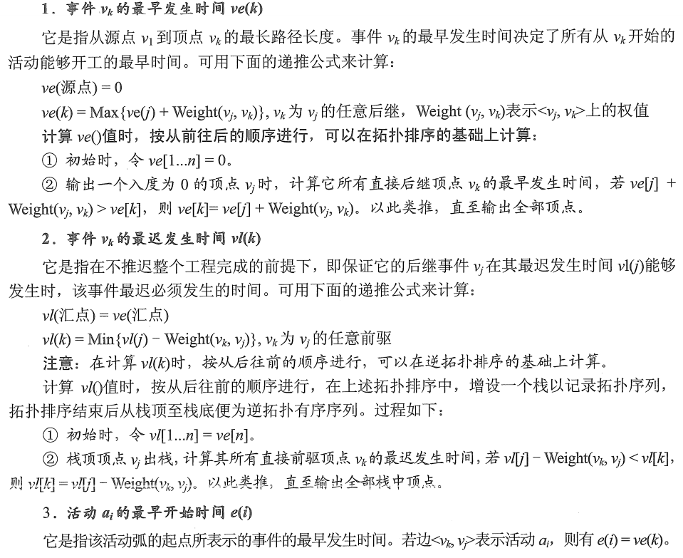
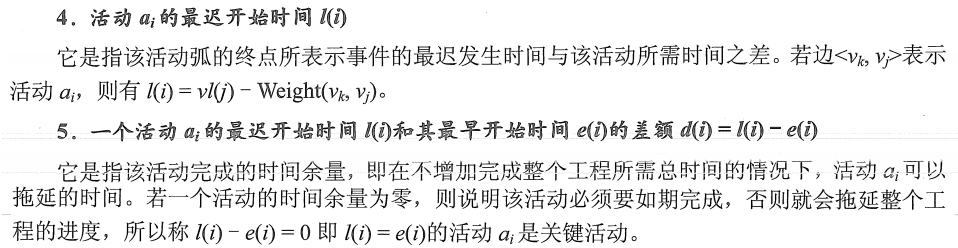
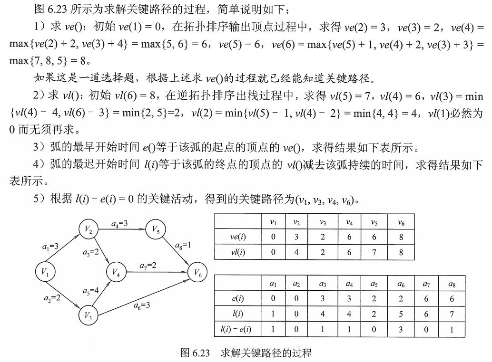

# 关键路径

在带权有向图中，以顶点代表事件，以有向边代表活动，以边上的权值代表完成该活动的开销，称为**用边表示活动的网络**，简称 **AOE 网** 。

AOE 网和 AOV 网都是**有向无环图**，只是顶点和边的含义，有权无权的不同。

AOE 网的性质：

1. 只有在某个顶点所代表的时间发生后，从该顶点出发的各有向边所代表的活动才能开始。
2. 只有在进入某顶点的各有向边所代表的活动都已经结束时，该顶点所代表的事件才能发生。

在 AOE 网中仅有一个入度为 0 的顶点，称为**开始顶点（源点）**，它表示整个工程的开始；
网中也仅存在一个出度为 0 的顶点，称为**结束顶点（汇点）**，它代表整个工程的结束。

在 AOE 网中，有些活动是可以并行进行的。从源点到汇点的有向路径可能有多条，并且这些路径长度可能不同。完成不同路径上的活动所需的时间虽然不同，但是只有所有路径上的活动都已完成，整个工程蔡算结束。
因此，从源点到汇点的所有路径中，具有最大路径长度的路径称为**关键路径**，而把关键路径上的活动称为**关键活动**。

显然，完成整个工程的最短时间就是关键路径的长度，即关键路径上各活动花费开销的总和。
因此，找到了关键活动，就找到了关键路径，也就可以得出最短完成时间。

需要的参数定义：

1. 事件 $v_k$ 的最早发生时间 $ve(k)$ 
2. 事件 $v_k$ 的最晚发生时间 $vl(k)$ 
3. 活动 $a_i$ 的最早开始时间 $e(i)$ 
4. 活动 $a_i$ 的最晚发生时间 $l(i)$ 
5. 活动 $a_i$ 的最晚发生时间和其最早开始时间的差额 $d(i)=l(i)-e(i)$ 

这些参数详细介绍如图：

​	

图1. 参数详细介绍

图2. 参数详细介绍

求关键路径的算法步骤：

1. 从源点出发，令 $ve(源点)=0$ ，按拓扑有序求其余顶点的最早发生时间 $ve()$ ；
2. 从汇点出发，令 $vl(汇点)=ve(汇点)$ ，按逆拓扑有序求其余顶点的最迟发生时间 $vl()$ ；
3. 根据各顶点的 $ve()$​ 值求所有弧的最早开始时间 $e()$​ ；
4. 根据各顶点的 $vl()$ 值求所有弧的最早开始时间 $l()$ ；
5. 求 AOE 网中所有活动的差额 $d()$ ，找出所有 $d()=0$ 的活动构成关键路径。

这里举一个例子：

图3. 求关键路径举例

稍微注意的两点：

1. 关键路径上的所有活动都是关键活动，它是决定整个工程的关键因素，因此可通过加快关键活动来缩短整个工程的工期。但也不能任意缩短关键活动，因为一旦缩短到一定程度，该关键活动就可能变为非关键活动。
2. 网中的关键路径并不唯一，且对于有几条关键路径的网，只提高一条关键路径上的关键活动速度并不能缩短整个工程的工期，只有加快那些包括在所有关键路径上的关键活动才能达到缩短工期的目的。

2021.08.08