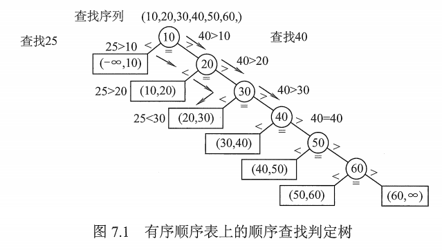

# 顺序查找

顺序查找又称**线性查找**，主要用于在线性表中进行查找。

## 一. 一般线性表的顺序查找

查找成功，返回数据元素；查找失败，返回失败信息。

通常的，一般人最开始想到的，不带哨兵的算法，就不写了，非常简单。

带哨兵的算法：

~~~c
typedef struct{
    ElemType * elem;	//存储元素，0 号单元留空
    int TableLen;		//表长
} SSTable;

int Search_Seq( SSTable ST, ElemType key){
    ST.elem[0] = key;	//将 0 号单元内容设为要查找的 key
    for( i = ST.TableLen; ST.elem[i] != key; i--)//直到与 key 相等，或 i=0 才结束循环
	return i;	//成功返回 i ；失败返回 0
}
~~~

带哨兵的好处就是，省去了每次判断数据是否越界。

实际上很多算法引入哨兵，就可以避免很多不必要的语句，从而提高程序效率。

假定每个元素查找概率相等：

查找成功时的平均查找长度 $ASL_{成功}=\frac{1+2+...+n}{n}=\frac{n+1}{2}$​ 。时间复杂度 $O(n)$ 。

查找失败时的平均查找长度 $ASL_{失败}=n+1$​ 。

## 二. 有序表的顺序查找

若查找之前就已经直到表是关键字有序的，则查找失败就不用再比较到表的另一端就能返回查找失败的信息，从降低顺序查宅失败的平均查找长度。

例如，表是增序，查询关键字为 key，当查找到第 i 个元素的关键字大于 key 时，就可返回查找失败信息了。

图1. 有序顺序表上的顺序查找判定树

可以用图 1 所示的判定树来描述有序顺序表的查找过程。
（仅仅是用来描述查找过程，而不是说表的结构是这样的）

树中的圆形结点表示有序顺序表中存在的元素；

树中的矩形结点称为**失败结点**，描述的是不在有序表中的数据值的集合。
若有 n 个结点，则相应的有 **n+1** 个失败结点。
若查找到失败结点，则说明查找不成功。

假定每个元素查找概率相等：

查找成功时的平均查找长度 $ASL_{成功}=\frac{n+1}{2}$ ，和一般线性表一样。

查找失败时的平均查找长度 $ASL_{失败}=\frac{1+2+...+(n-1)+n+n}{n+1}=\frac{n}{2}+\frac{n}{n+1}$​ 。每个失败结点的查找长度为其所连接的上一个圆心结点所在的层数。

2021.08.10