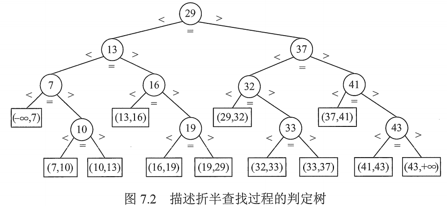

# 折半查找

又称**二分查找**，仅适用于有序的顺序表。

~~~c
int Binary_Search( SeqList L, ElemType key){
    int low = 0;
    int high = L.TableLen-1;
    int mid = 0;
    while(low < high){
        mid = (low+high) / 2;
        if( L.elem[mid] == key )
            return mid;
        else if( L.elem[mid] > key )
            high = mid - 1;
        else
            low = mid +1;
    }
    return -1;	//查找失败，返回 -1
}
~~~

折半查找的过程可以用二叉树来描述（仅仅是用来描述查找过程，而不是说表的结构是这样的）。

图1. 描述折半查找的判定树

假定每个元素查找概率相等：

查找成功时的平均查找长度： 
$$
\begin{aligned}
ASL_{成功}
&=\frac{2^0\times 1+2^1\times 2+...+2^{h-1}\times h}{n}
\\&=\frac{n+1}{n}\log_2(n+1)-1
\\&\approx \log_2(n+1)-1
\end{aligned}
$$
其中 $h$ 为树高，且元素个数为 $n$ 时，$h=\lceil\log_s(n+1)\rceil$ 。

时间复杂度 $O(\log_2 n)$ 。

图 1 中的 $ASL_{成功}=\frac{1\times 1+2\times 2+3\times 4+4\times 4}{11}=3$​ ， $ASL_{失败}=\frac{3\times 4+4\times 6}{12}=\frac{11}{3}$​ 。

显然，折半查找适合具有随机存储特性的线性表。因此仅仅适合顺序存储结构，不适合链式存储结构，其要求数据元素按照关键词有序排序。

补充：

若折半查找选择 mid 向**下**取整，则构造出的二叉判定树中每个结点的**右**子树结点数 - **左**子树结点数 = 0 或 1；
若折半查找选择 mid 向**上**取整，则构造出的二叉判定树中每个结点的**左**子树结点数 - **右**子树结点数 = 0 或 1。

可见，折半查找的二叉判定树也是平衡二叉树。

2021.08.10