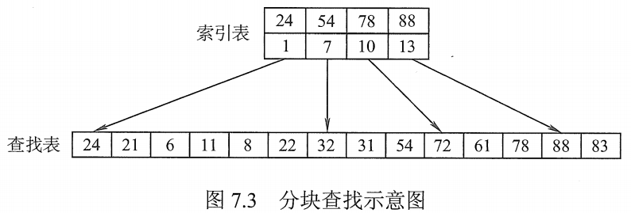

# 分块查找

分块查找又称**索引顺序查找**。它吸取了顺序查找和折半查找各自的有点，既有动态结构，有适于快速查找。

分块查找的基本思想：

将查找表分为若干子块。块内元素可以无序，但块之间是有序的，即便第一块中的最大关键字元素小于第二块中的所有记录的关键字，以此类推。

在建立一个索引表，所有表中每个元素含有各块的最大关键字和各块中的第一个元素的地址，索引表按关键字有序排列。

分块查找过程分为两步：第一步是在索引表中确定待查记录所在的块，可以顺序查找或折半查找索引表；第二步是在块内顺序查找。

图1.分块查找示意图

分块查找的平均查找长度为索引查找和块内查找的平均长度之和：
$$
ASL=L_I+L_S
$$
其中， $L_I$ 是索引查找的平均查找长度， $L_S$​ 是块内查找的平均查找长度。

将长度为 n 的查找表均匀的分为 b 块，每块有 s 个记录，在等概率情况下，若在块内和索引表中均采用顺序查找，则平均查找长度为：
$$
\begin{aligned}
ASL&=L_I+L_S
\\&=\frac{b+1}{2}+\frac{s+1}{2}
\\b=\frac{n}{s},&=\frac{n+s^2+2s}{2s}
\end{aligned}
$$
若 $b=\sqrt{s}$​ 则此时平均查找长度为最小值 $ASL=\sqrt{n}+1$ 。

若对索引表采用折半查找，则：
$$
\begin{aligned}
ASL&=L_I+L_S
\\&=\lceil \log_2(b+1)\rceil+\frac{s+1}{2}
\end{aligned}
$$
2021.08.10