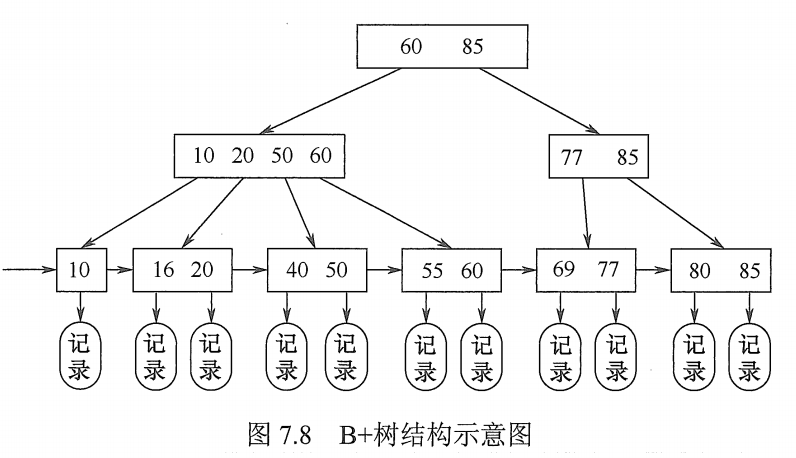

# B 树与 B+ 树

## 一. B 树及其基本操作

B 树又称**多路平衡查找树**

B 树中所有结点的孩子个数的最大值称为 **B 树的阶**，通常用 m 表示。

一棵 m 阶的 B 树或为空树，或为满足如下特性的 m 叉树：

1. 树中每个结点至多有 m 棵子树，即至多含有 m-1 个关键字。

2. 若根节点不是终端结点，则至少有 2 颗子树。

3. 除根结点外的所有非叶结点至少有 $\lceil\frac{m}{2}\rceil$ 棵子树，即至少含有 $\lceil\frac{m}{2}\rceil-1$ 个关键字。

4. 所有非叶结点的结构如下：

   

   
图1.非叶结点的结构

   其中 $K_i(i=1,2,...,n)$​ 为结点的关键字，且满足 $K_1<K-2<...<k_n$​ ；

    $P_i(i=1,2,...,n)$​ 为指向子树根节点的指针，且指针 $P_{i-1}$​ 所指的子树中所有结点的关键字均小于 $K_i$​ ，指针 $P_{i}$​ 所指的子树中所有结点的关键字均小于 $K_i$​ ；

   其中 $n$ 为结点中关键字的个数，且 $\lceil\frac{m}{2}\rceil<n<m-1$ ；

5. 所有叶结点都出现在同一层次上，并且不带信息。

   实际上这些叶结点是逻辑上存在的**失败结点**，而实际上在物理上是不存在这些也结点的。

   比如图 2 中的叶结点只是逻辑上的，现实根本不存在，指向它们的指针也只是 NULL 而非地址。

B 树是所有结点的平衡因子都等于 0 的多路平衡查找树。

图2.一棵 5 阶 B 树

B 树的性质：

1. 结点的孩子个数等于结点中关键字个数加 1。
2. 如果根节点没有关键字就没有子树，此时 B 树为空；如果根结点有关键字，则其子树必然大于等于 2 棵。
3. 除根节点外的所有非终端结点至少有 $\lceil\frac{m}{2}\rceil$ 棵子树，图 2 为例就是至少 3 棵子树，至多 m 棵子树。
4. 结点中关键字从左到右递增有序，关键字两侧均有指向子树的指针，左边指针所指子树的所有关键字均小于该关键字，右边指针所指子树的所有关键字均大于该关键字。
5. 所有叶结点均在同一层（最底层），代表查找失败的位置。

## 二. B 树的查找

与二叉树类似，只是 B 树中每个结点是多个关键字的有序表，所以在每个结点中不是像二叉树那样的二路分支，而是多路分支。

B 树的查找包含两个基本操作：

1. 在 B 树中找到结点；
2. 在结点内找到关键字。

由于 B 树常存储在磁盘上，因此前一个查找操作是在磁盘上进行的；后一个查找操作是在内存中进行的。

即先从磁盘将结点调入内存，再对结点内进行顺序查找或折半查找。

在 B 树上查找到某个结点后，先在结点有序表中查找，若找到则查找成功。否则按照对应的指针信息，到所指的子树中去查找。如果直到最后指针指向了叶结点（失败结点，或说指针为 NULL），则查找失败。

## 三. B 树的高度（磁盘存取次数）

由 B 树的查找可知，B 树的大部分操作所需的磁盘存储次数与 B 树的高度成正比。

首先说明，B 树中的叶结点是逻辑上的失败结点，所以 B 树的高度不包含叶结点这一层。

若 $n\geq 1$ 则对任意一棵包含 n 个关键字、高度为 h、阶数为 m 的 B 树：

1. 每个结点最多 m 棵子树，m-1 个关键字，所以有 $n\leq (m-1)(1+m+m^2+...+m^{h-1})=m^h-1$ ，因此有：
   $$
   h\geq\log_m(n+1)
   $$

2. 若让每个结点中的关键字个数达到最少，则容纳同样多关键字的 B 树的高度达到最大。

   就是每个结点放最少的关键字呗，由 B 树的定义，最少也就是每个结点子树最少为 $\lceil\frac{m}{2}\rceil$ 。

   不过根节点特殊一点，也就是第一层最少 1 个结点，第二层最少 2 个结点。

   除根节点之外，每个非终端至少有 $\lceil\frac{m}{2}\rceil$ 棵子树，于是
   第一层最少 1 个结点，
   第二层最少 2 个结点。
   第三层至少 $2\lceil\frac{m}{2}\rceil$ 个结点，
   第四层至少 $2\lceil\frac{m}{2}\rceil^1$ 个结点，
   ...，
   第 n 层至少 $2\lceil\frac{m}{2}\rceil^{h-2}$​ 个结点。

   则叶结点（失败结点）共有 $2\lceil\frac{m}{2}\rceil^{h-2}$​ 个。

   二对于 n 个关键字的 B 树，查找不成功的结点就是 $n+1$ 个，于是有 $n+1\geq2\lceil\frac{m}{2}\rceil^{h-1}$​ ，即：
   $$
   h\leq\log_{\lceil\frac{m}{2}\rceil}(\frac{n+1}{2})+1
   $$

总结，若 $n\geq 1$​ 则对任意一棵包含 n 个关键字、高度为 h、阶数为 m 的 B 树，满足：
$$
\log_m(n+1)\leq h\leq\log_{\lceil\frac{m}{2}\rceil}(\frac{n+1}{2})+1
$$
例如，对于一个 3 阶 B 树共有 8 个关键字，则其高度范围为 $2\leq h\leq 3.17$ 。

## 四. B 树的插入

将关键字 key 插入 B 树的过程如下：

1. 定位：

   利用前述的 B 树查找算法，找出插入该关键字的最底层的某个非叶结点。

   王道这描述是真离谱，现在又用最底层了，而最底层明明是逻辑上的叶结点。
   这里的意思是找到叶结点（失败结点）上一层的，要插入的结点。

   显然，插入操作的插入位置当然一定是在失败结点上一层插入。

2. 插入：

   在 B 树种，每个非失败结点的关键字个数都在区间 $[\lceil\frac{m}{2}\rceil-1,m-1]$ ​内。

   如果插入后的结点关键字个数小于等于 m-1，则可以直接插入，没有问题。

   如果插入后的结点关键字个数大于了 m-1，则必须对结点进行分裂。

分裂：

取一个新节点。
方便叙述，暂且把要插入 key 的结点称为原结点，

把插入 key 后的原结点，
从中间的位置 $\lceil\frac{m}{2}\rceil$ 将其中的关键字分为两部分，
其左部分（不含 $\lceil\frac{m}{2}\rceil$ 位置的关键字）包含的关键字放在原结点中，
右部分（不含 $\lceil\frac{m}{2}\rceil$ 位置的关键字）包含的关键字放到新结点中，
中间 $\lceil\frac{m}{2}\rceil$​​ 位置的关键字则插入到原结点的父结点中。

如果中间 $\lceil\frac{m}{2}\rceil$​ 位置的关键字则插入到原结点的父结点中的操作，导致了父结点的关键字个数，也大于了 m-1，则需继续对父结点进行分裂的操作。

如果分裂的操作传到了根节点，即根节点也进行了分裂操作，而根节点没有父节点。
所以我们会创建一个新结点，作为新的根结点，即作为旧的根结点的父结点，将旧根结点中间 $\lceil\frac{m}{2}\rceil$​​​ 位置的关键字则插入到新根节点中。
所以对根结点进行分裂操作，会导致 B 树的高度增加 1。

图3. 结点分裂的举例

## 五. B 树的删除

若删除后的结点的关键字个数少于了 $\lceil\frac{m}{2}\rceil-1$ ，则需要进行合并操作。
（因为除根结点外的所有非叶结点至少有 $\lceil\frac{m}{2}\rceil$ 棵子树，即至少含有 $\lceil\frac{m}{2}\rceil-1$​ 个关键字。）

当被删除关键字 key 不在叶结点上一层的结点中时，可以用 key 的前驱（或后继） key' 来代替 key，然后再相应的结点中删除 key'，这样，就可以将删除操作转变为一定是对叶结点上一层的结点中的结点进行的删除操作。

因此只需要讨论对叶结点上一层的结点中的结点进行的删除操作的情况：

方便叙述，暂且把进行删除操作的结点称为删除结点。

1. 直接删除关键字。

   若删除后的删除结点的关键字个数大于等于 $\lceil\frac{m}{2}\rceil-1$ ，则直接删除，没问题。

2. 兄弟够借。

   若删除结点在删除前的关键字个数等于 $\lceil\frac{m}{2}\rceil-1$​ ，且与此结点相邻的右（或左）兄弟结点的关键字个数大于等于 $\lceil\frac{m}{2}\rceil-1$​ ，则调整右（或左）兄弟结点、双亲结点、删除结点，就可以完成删除操作。

   以右兄弟结点为例，因为右兄弟结点减少一个关键字也满足 B 树的要求，而删除结点删除一个结点后仅仅只差一个结点就满足 B 树的要求。于是，
   把右兄弟结点的最小关键字，给双亲结点的指向右兄弟结点的指针的左边的关键字，
   把双亲结点的指向右兄弟结点的指针的左边的关键字，给给删除结点，
   然后删除删除结点中的关键字。

3. 兄弟不够借。

   若删除结点在删除前的关键字个数等于 $\lceil\frac{m}{2}\rceil-1$ ，且与此结点相邻的右（或左）兄弟结点的关键字个数均等于 $\lceil\frac{m}{2}\rceil-1$ ，则将关键字删除后与左（或右）兄弟结点及双亲结点中的关键字进行合并。

图4. B 树删除关键字的后两种情况举例

在合并过程中，双亲结点的关键字个数会减少 1.
若双亲结点不是根节点，且合并时导致双亲结点关键字少于 $\lceil\frac{m}{2}\rceil-1$ ，则又要与它自己的兄弟结点进行调整或合并操作，并重复上述步骤，直到符合 B 树的要求为止。

若删除导致 B 树进行的调整操作，传到了根节点，并不一定会使得 B 树的高度减少 1。
只有当双亲结点是根结点并且关键字减少到 0（此前必然是根节点关键字为 1，只有两颗子树的情况），则直接将根结点删除，合并后的根节点成为新的根结点。这样的情况，B 树的高度才会减少 1。

## 六. B+ 树的基本概念

B+ 树是应数据库所需而出现的一种 B 树的变形树。

一棵 m 阶的 B+ 树需满下列条件：

1. 每个分支节点最多有 m 棵子树（孩子节点）。

2. 非叶根结点至少有 2 棵子树，其他每个分支结点至少有 $\lceil\frac{m}{2}\rceil$​​ 棵子树。

   王道这个词用的也太迷惑了。

   非叶根结点，意思是本身不是叶子结点的根结点。
   例如，刚开始的空树，插入一两个关键字，那么此时只有一个根结点，则此时根结点就是叶子结点，也就是叶根结点。

   当然后面多了之后，这个根结点有了子树后，那就为不是叶子结点的根结点了。（也就是王道说的非叶根结点）

3. 结点的子树个数与关键字个数相等。

4. 所有叶结点包含全部关键字及指向相应记录的指针，叶结点中将关键字按大小顺序排列，并且相邻叶结点按大小顺序互相链接起来。

5. 所有分支结点（可视为索引的索引）中仅包含它的各个子结点（即下一级的索引块）中关键字的最大值及指向其子结点的指针。

m 阶的 B+ 树与 m 阶的 B 树的主要差异如下：

1. 在 B+ 树中，具有 n 个关键字的结点只含有 n 棵子树，即每个关键字对应一棵子树；

   而在 B 树中，具有 n 个关键字的结点只含有 n+1 棵子树。

2. 在 B+ 树中，每个结点（非根的内部结点）的关键字个数 n 的范围是 $\lceil\frac{m}{2}\rceil\leq n\leq m$ 。

   在 B 树中，每个结点（非根的内部结点）的关键字个数 n 的范围是 $\lceil\frac{m}{2}-1\rceil\leq n\leq m-1$ 。

3. 在 B+ 树中，叶结点包含信息，所有非叶结点仅起索引作用，非叶结点中的每个索引项只含有对应子树的最大关键字和指向该子树的指针，不含有该关键字对应记录的存储地址。

4. 在 B+ 树中，叶结点包含了全部关键字，即在非叶结点中出现的关键字也会出现在叶结点中；

   而在 B 树中，叶结点包含的关键字和其他结点包含的关键字是不重复的。

图5. 4阶B+树示意图

图 5 为一棵 4 阶 B+ 树。

可以看出分支结点的某个关键字是其对应子树中的最大关键字的副本。

通常，B+ 树种有两个头指针：一个指向根节点；一个指向关键字最小的叶结点。
因此 B+ 树可以进行两种查找运算：一种是从根节点开始多路查找；一种是从最小关键字开始的顺序查找。

B+ 树的查找、插入和删除操作和 B 树基本类似。

但是在查找过程种，非叶结点上的关键字等于给定值时并不终止，而是继续向下查找，直到叶结点的关键字为止（获得该关键字对应的指向记录的指针）。

所以在 B+ 树中查找时，无论查找成功与否，每次查找都是一条从根结点到叶结点的路径。

2021.08.12
