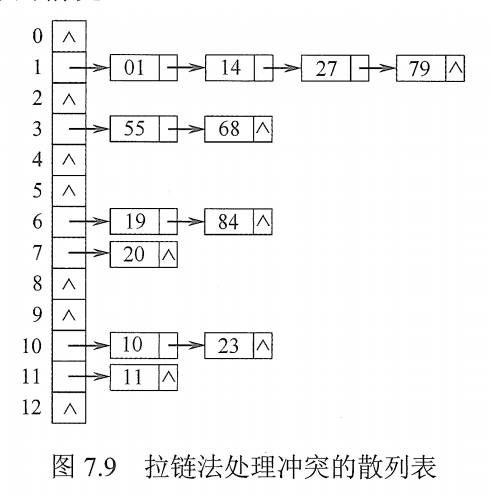

# 散列表

## 一. 散列表的基本概念

**散列函数**：一个把查找表中的关键字映射成该关键字对应地址的函数，记为 $Hash(key)=Addr$ ，这里的地址可以是数组下标，索引或内存地址等）。

散列函数是可能会把两个或两个以上的不同关键字映射到同一地址的，称这种情况为**冲突**。
这些发生碰撞的不同关键字称为**同义词**。

**散列表**：根据关键字而直接进行访问的数据结构。
也就是说，散列表建立的关键字和存储地址之间的一种直接映射关系。

理想情况下，对散列表的查找时间复杂度为 $O(1)$ ，即与表中元素的个数无关。

## 二. 散列函数的构造方法

构造散列函数时，必须注意以下几点：

1. 散列函数的定义域必须包含全部需要存储的关键字，而值域的范围则依赖于散列表的大小或地址范围。
2. 散列函数计算出来的地址应该能等概率、均匀地分布在整个地址空间中，从而减少冲突的发生。
3. 散列函数应尽量见到那，能够在较短的时间内计算处任一关键字对应的散列地址。

常用的散列函数：

### 2.1 直接定址法

直接取关键字的某个线性函数指为散列地址，散列函数为：
$$
H(key)=key或H(key)=a\times key+b
$$
式中，$a,b$ 是常数。

这种方法计算最简单，且不会产生冲突。

适合关键字的分布基本连续的情况，若关键分布不连续，空位较多，则会造成存储空间的浪费。

### 2.2 除留余数法

假定散列表表厂为 m，取一个不大于 m 但最接近或等于 m 的质数，利用以下公式把关键字转换成散列地址，散列函数为：
$$
H(key)=key\%p
$$
这是一种最简单、最常用的方法。

除留余数法的关键是选好 p，使得每个关键字通过该函数转换后等概率地映射到散列空间上地任一地址，从而尽可能减少冲突的可能性。

### 2.3 数字分析法

设关键字是 r 进制数，而 r 个数码在各位上出现的频率不一定相同，可能在某些位上分布均匀一些，每种数码出现的机会均等；而在某些位上分布不均匀，只有几种数码经常出现。

此时应该选取数码分布较为均匀的若干位作为散列地址。

这种方法适合于已知关键字集合，若更换了关键字，则需要重新构造新的散列函数。

### 2.4 平方取中法

取关键字的平方值得中间几位作为散列地址。

具体取多少位要视实际情况而定。
这种方法得到得散列地址与关键字的每位都有关系，因此使得散列地址分布比较均匀，适用于关键字的每位取值都不够均匀或均小于散列地址所需的位数。

## 三. 处理冲突的方法

用 $H_i$ 表示处理冲突中第 $i$ 次探测得到的散列地址。
假设得到的另一个散列地址 $H_1$​ 仍然发生冲突，只得继续球下一个散列地址 $H_2$ ，依次类推，直到 $H_k$ 不发生冲突为止，则 $H_k$ 为关键字在表中的地址。

### 3.1 开放定址法

开放定址法，指可存放新表项的空闲地址既向它的同义词表项开放，又向它的非同义词表项开放。

其数学递归公式为：
$$
H_i=[H(key)+d_i]\%m
$$
式中，$H(key)$ 为散列函数；$i=0,1,2,...,k,(k\leq m-1)$ ； m 表示散列表表长；$d_i$​ 为增量序列。

对于增量序列的选择不同，就有下面 4 种取法：

#### 3.1.1 线性探测法

当对增量序列 $d_i$​ 的选择为 $d_i=0,1,2,3,4,...,m-1$​​ 时，就称为线性探测法。

可能出现当散列地址 i 已存入关键字，则同是散列地址 i 的关键字的同义词就只能存入散列地址 i+1，这样就占用了散列地址 i+1，导致原本散列地址为 i+1 的关键字只得也往旁边存......这样造成大量的元素存在了相邻的散列地址上**聚集（或堆积）**起来，大大降低了查找效率。

#### 3.1.2 平方探测法

当对增量序列 $d_i$ 的选择为 $d_i=0^2,1^2,-1^2,2^2,-2^2,3^2,-3^2,...,k^2,-k^2$ 时，其中 $k\leq \frac{m}{2}$​ ，就称为平方探测法，又称为**二次探测法**。

**注意**，要求 m 必须是一个可以表示为 $4k+3$ 的素数（质数）。

平方探测法是一种较好的处理冲突的方法，可以避免 "堆积" 问题，缺点是它不能探测散列表上的所有单元，但至少能探测到一半单元。

#### 3.1.3 再散列法

当对增量序列 $d_i$​​ 的选择为 $d_i=Hash_2(key)$​​ 时，就称为再散列法，又称**双散列法**。

需要使用两个散列函数，当第一个散列函数 $H(key)$ 得到的地址发生冲突时，则利用第二个散列函数 $Hash_2(key)$ 计算该关键字的增量。

它的具体散列函数形式如下：
$$
H_i=[H(key)+i\times Hash_2(key)]\%m
$$
初始探测位置 $H_0=H(key)\%m$ 。 $i$ 是冲突的次数，初始为 0。

在再散列法种，最多经过 m-1 次探测就会遍历表中所有位置，回到 $H_0$ 位置。

#### 3.1.4 伪随机序列法

当对增量序列 $d_i$​ 的选择为 $d_i=$​​​ 伪随机数序列时，就称为伪随机序列法。

另：

在开放地址法中，删除一个元素时，不能简单地直接删除，因为若直接删除了元素，就会导致计算其他元素的散列地址时出现错误。
因此，要删除一个元素时，可以给该元素做一个删除标记，进行逻辑删除。这样仍然认为这个散列地址是被使用着的，就不会导致计算其他元素的散列地址时出错了。
当然副作用是空间利空率下降，所以需要每经过一段时间，对散列表进行整理，将有删除标记的元素物理删除，及其其他操作。

### 3.2 拉链法（链接法，chaining）

图1.拉链法解决冲突

即将同义词都存储在一个线性链表中，这些同义词都用着同一散列地址。

拉链法适用于经常进行插入和删除的情况。

## 四. 散列查找及性能分析

查找过程与构造散列表的过程基本一致：

1. 初始化 $Addr=Hash(key)$​ ；
2. 检测查找表中地址为 Addr 的位置上是否有记录，
   若无记录，返回查找失败；
   若有记录比较它与 key 的值；若相等，则返回查找成功，否则执行步骤 3；
3. 用给定的处理冲突方法计算下一个散列地址，并把 Addr 置为此地址，进行步骤 2。

平均查找长度 ASL，都是根据题目来算的，很简单就不写了。

散列表的查找效率取决于三个因素：散列函数、处理冲突的方式、**装填因子**（装载因子）。

散列表的装填因子一般记为 $\alpha$​ ，定义为一个表的装满程度，即：
$$
\alpha=\frac{表中记录数n}{散列表长度m}
$$
散列表的平均查找长度 ASL **依赖于散列表的装填因子 $\alpha$** ，而不直接依赖于 n 或 m。

直观的看， $\alpha$​ 越大，记录越满，发生冲突的可能性越大，反之越小。

2021.08.12

