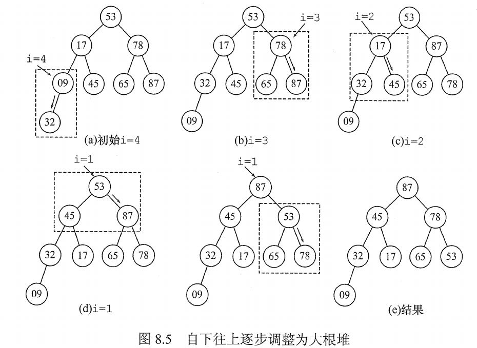

# 选择排序

选择排序的基本思想：每一趟（第 i 躺）在后面 $n-i+1(i=1,2,...,n-1)$ 待排序中选取关键字最小的元素，作为有序子序列的第 i 个元素，直到第 n-1 趟做完，待排序元素只剩下 1 个就不用再选了。

## 一. 简单选择排序

~~~c
void SelectSort(ElemType A[], int n){
    for( i = 0; i < n-1; i++){
        min = i;
        for( j = i+1; j < n; j++)
            if( A[j] < A[min])
                min = j;
        if( min != i)
            swap( A[i], A[min] );
    }
}
~~~

空间复杂度：$O(1)$ ；

时间复杂度：$O(n^2)$ 。

算法稳定性：**不稳定**。

## 二. 堆排序

堆的定义如下，n 个关键字序列 $L[1...n]$ 称为堆，当且仅当该序列满足：

1.  $L(i)\geq L(2i)$​ 且 $L(i)\geq L(2i+1)$​ ；
2. 或满足 $L(i)\leq L(2i)$ 且 $L(i)\leq L(2i+1)$ 。

则可将该一维数组视为一棵完全二叉树。

满足条件 1 的堆称为**大根堆（大顶堆）**，大根堆的最大元素存放在根结点，且其任一非根结点的值大于等于其双亲结点值。
满足条件 2 的堆称为**小根堆（小顶堆）**，小根堆的最小元素存放在根结点，且其任一非根结点的值小于等于其双亲结点值。

堆排序的思路：
首先将存放在 $L[1...n]$ 中的 n 个元素建成初始堆，由于堆本身的特点（以大根堆为例），堆顶元素就是最大值。
输出堆顶元素后，通常将堆底元素送入堆顶，此时根结点已不满足大根堆的性质，堆被破坏，将堆顶元素向下调整使其继续保持大顶堆的性质，再输出堆顶元素。
如此重复，直到堆中仅剩一个元素为止。

两个问题：
如何将无序序列构造成初始堆。
输出堆顶元素后，如何将剩余元素调整成新的堆。

### 2.1 初始堆的构造

n 个结点的完全二叉树，最后一个结点是第 $\lfloor n/2\rfloor$​​ 个结点的孩子。

对第 $\lfloor n/2\rfloor$ 个结点为根的子树筛选（对于大根堆，若根结点的关键字小于左右孩子中关键字较大者，则交换），使该子树成为堆。

之后向前依次对个结点（ $\lfloor n/2\rfloor-1\sim1$ ） 为根的子树进行筛选，看该结点是否大于其左右子结点的值，若不大于，则将左右子结点中的 较大值与之交换，交换后可能破坏下一级的堆，于是继续采用上述方法构造下一级的堆，直到以该结点为根的子树构成堆为止。

反复利用上述调整堆的方法建堆，知道根节点。

图1.大根堆的构建示意

### 2.2 输出堆顶元素后，对堆的调整

输出栈顶元素后，将堆的最后一个元素与栈顶元素交换，此时堆的性质被破坏，需要向下进行筛选。

也就是上述的调整方法，以根结点为来一次就好了。

### 2.3 算法实现

建立大根堆的算法：

~~~c
void BuildMaxHeap( ElemType A[], int len){
    for( int i = len/2; i > 0; i--){	// 从 i= n/2(向下取整)~1，反复调整堆
        HeadAdjust(A,i,len); //调整堆的函数
    }
}

void HeadAdjust( ElemType A[], int k, int len){
    A[0] = A[k];	//A[0]暂存子树的根结点
    for( i = 2*k; i <= len; i *= 2){	//沿 key 较大的子结点向下筛选
        if( i < len && A[i] < A[i+1] )	// 取 key 较大的子结点的下标
            i++;
        if( A[0] >= A[i])	// 如果 A[0] >= A[i]，下面的都比 A[0] 小了，停止
            break;
        else{	// 否则，较大子结点的值覆盖根结点
            A[k] = A[i];	
            k = i;	//修改 k 的值，指向下一次循环的根结点
        }
    }
    A[k] = A[0];	//最后，把被筛选结点的值放入最终的位置。
}
~~~

调整的时间与高度，有关为 $O(h)$ 。

下面是堆排序算法：

~~~c
void HeapSort( ElemType A[], int len){
    BuildMaxHeap(A,len);	//初始建堆
    for( i = len; i > 1; i--){
        Swap( A[i], A[1] );	//输出堆顶元素（和堆底元素交换）
        HeadAdjust(A,1,i-1);	//调整，把剩余 i-1 个元素整理成堆。
    }
    //也就是每次将最大的堆顶元素，放到，数组的最后面的有序序列的前的第一个，
	//然后调整堆时，不调整最后面的有序序列
}
~~~

空间复杂度：$O(1)$ 。

时间复杂度：$O(n\log_2 n)$ 。其中建堆时间为 $O(n)$ ，每次调整时间为 $O(h)$ 。

算法稳定性：**不稳定**。

2021.08.13