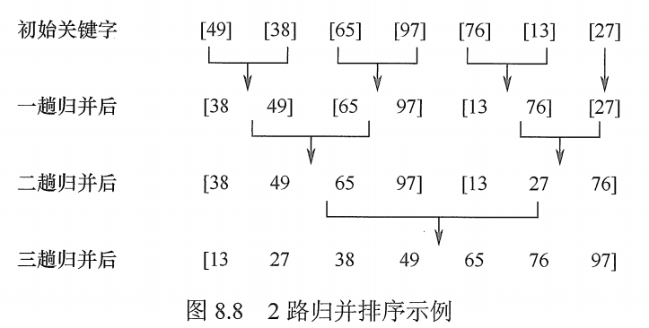
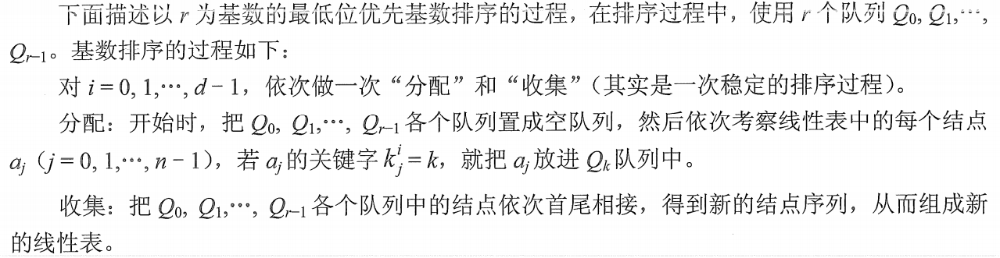
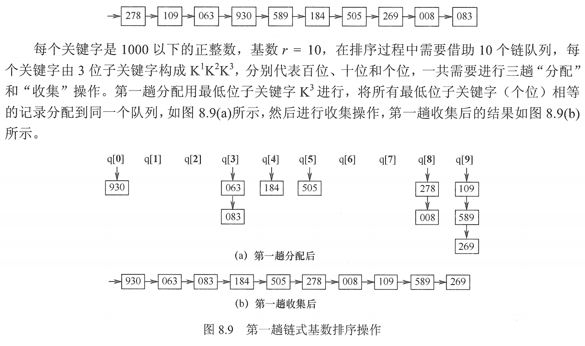
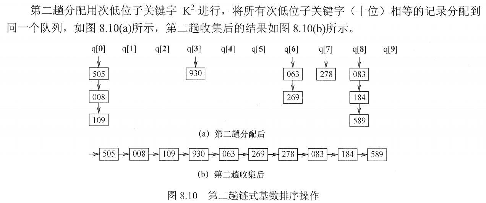
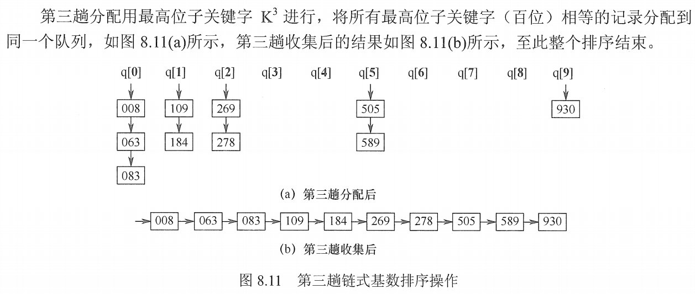

# 归并排序和基数排序

## 一. 归并排序

归并的含义是，将两个或两个以上的有序表组合成一个新的有序表。

假定待排序表含有 n 个记录，则可将其视为 n 个有序的子表，每个子表的长度为 1，然后两两合并，得到 $\lfloor n/2 \rfloor$ 个长度为 2 或 1 的有序表；继续两两归并......直到合并为一个长度为 n 个有序表为止。

这种排序算法称为 **2 路归并排序**。

图1. 2 路归并排序示意

下面是 Merge() 函数的实现，作用是堆两个相邻的有序表归并为一个有序表：

~~~c
ElemType * B = (ElemType *) malloc( (n+1) * sizeof( ElemType) );	//辅助数组 B
void Merge( ElemType A[], int low, int mid, int high){
    //表 A[] 分为左子表low ~ mid，右子表mid+1 ~ high,各自有序。
    for( int k = low; k <= high; k++)	//将 A 中所有元素复制到 B 中
        B[k] = A[k];
    
    for( i = low, j = mid+1, k = i; i <= mid && j <= high; k++){
	//比较 B 的左右两段中的元素，较小值复制到 A 中
        if(B[i] <= B[j]){
			A[k] = B[i];	
            i++;
        }
        else{
			A[k] = B[j];
            j++
        }
    }
    while( i<= mid ){ 	//若左子表没有检测完，剩余元素直接复制进 A
		A[k] = B[i];
        k++;
        i++;
    }
    while( j<= high ){ 	//若右子表没有检测完，剩余元素直接复制进 A
		A[k] = B[j];
        k++;
        j++;
    }
}
~~~

归并排序：

~~~c
void MergeSort(ElemType A[],int low,int high){
    if( low < high){
        int mid = (low+high) / 2;	//从中间划分为两个子序列
        MergeSort(A, low, mid);	//对左侧子序列进行递归排序
        MergeSort(A, mid+1, high);	//对右侧子序列进行递归排序
        Merge(A, low, mid, high);	//最后的一次归并
    }
}
~~~

空间复杂度：$O(n)$ ；

时间复杂度：$O(n\log_2 n)$ ；每趟归并的时间复杂度为 $O(n)$ ，一共进行 $\lceil\log_2 n\rceil$ 躺归并。

算法稳定性：稳定。

## 二. 基数排序

基数排序，是很特别的排序方法，不基于比较和移动进行排序，而基于关键字各位的大小进行排序。

假设长度为 n 的线性表中每个结点 $a_j$ 的关键字由 d 元组$(k_j^{d-1},k_j^{d-2},...,k_j^{1},k_j^{0})$ 组成，且满足 $0\leq k_j^i\leq r-1(0\leq j < n,0\leq i<d-1)$ ，r 表示 r 进制数。
其中 $k_j^{d-1}$ 为最主位关键字， $k_j^{0}$ 为最次位关键字。

为了实现多关键字排序，通常有两种方法：

第一种是**最高位优先（MSD）**法，按关键字权重递减依次逐层划分成若干更小的子序列，最后将所有子序列依次连接成一个有序序列。

第二种是**最底位优先（LSD）**法，按关键字权重递增依次进行排序，最后形成一个有序序列。

不过基数排序没有算法实现，我也就直接把王道上面过程放这里好了。

图2.基数排序每趟会分配+收集

通常采用链式基数排序，假设对如下 10 个记录进行排序：

图3.第 1 趟排序

图4.第 2 趟排序

图4.第 3 趟排序

空间复杂度：$O(r)$​ ；r 为基数，或 r 为需要的辅助存储空间（r 个队列：r 个队头指针和 r 个队尾指针）

时间复杂度：$O(d*(n+r))$ ；基数排序需要进行 d 躺分配与收集，每趟分配需要 $O(n)$ ，收集需要 $O(r)$ 。

算法稳定性：稳定。

2021.08.13