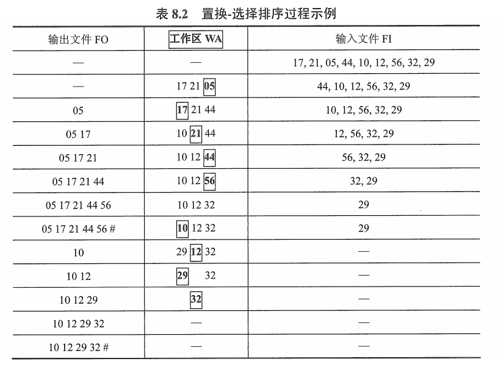
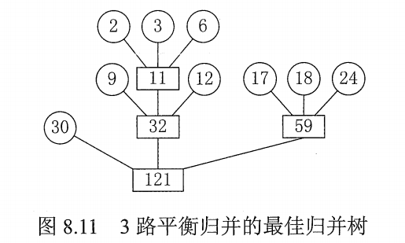
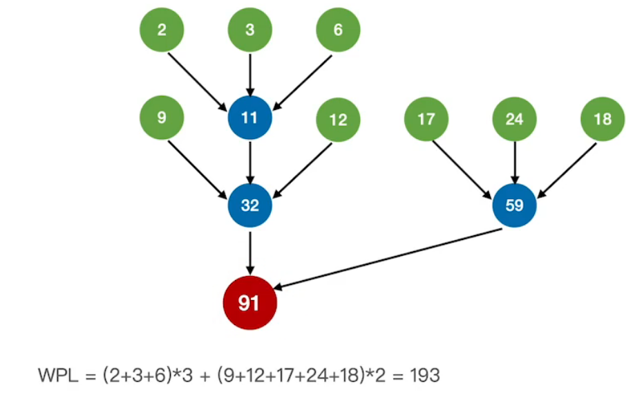
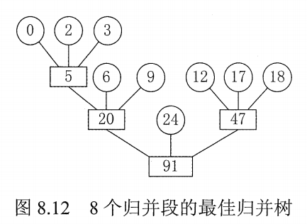

# 外部排序

外部排序算法比较复杂，应该是不会在算法设计上进行考查的。

本节的主要内容有：

1. 外部排序指待排序文件较大，内存依次放不下，需存放在外村的文件排序。
2. 为了减少平衡归并树种外村读写次数所采取的方法：增大归并路数、减少归并段个数。
3. 利用败者树增大归并路数。
4. 利用置换-选择排序增大归并段长度来减少归并段个数。
5. 利用长度不等的归并段，进行多路平衡归并，需要构造最佳归并树。

## 一. 外部排序的基本概念

没啥好解释的。

外部排序就是待排序文件太大了，排序过程中涉及到了内存和外村之间的交换。

## 二. 外部排序的方法

外部排序通常采用归并排序法。

分为两个相对独立的阶段：

1. 根据内存缓冲区的大小，将外存上的文件分为若干长度为 l 的子文件，依次读入内存并利用内部排序方法对它们进行排序，并将排序后得到的有序子文件重新写回外村，称这些有序子文件为**归并段**或**顺串**；
2. 对这些归并段进行逐趟归并，使归并段（有序子文件）逐渐由小到达，直至得到整个有序文件为止。

$$
外部排序总时间=内部排序所需时间+外存信息读写时间+内部归并所需时间
$$

显然的，外存信息读写时间远大于内部排序时间和内部归并时间。

因此应着力减少 I/O 次数。

一般地，对 r 个初始归并段，做 k 路平衡归并，归并树可用严格 k 叉树（只有度为 0 或 k 的结点的 k 叉树）来表示。

第一趟可将 r 个初始归并段归并为 $\lceil r/k \rceil$​ 个归并段；以后每趟归并将 m 个个初始归并段归并为 $\lceil m/k \rceil$​ 个归并段，直至最后形成一个大的归并段为止。

而 $树的高度=\lceil \log_k^r \rceil =归并趟数S$ 。可见，只要增大归并路数 k，或减少初始归并段个数 r，都能减少归并趟数 S，进而减少 I/O 次数，从而达到提高外部排序速度的目的。

## 三. 多路平衡归并与败者树

若采用通常的 k 路归并排序，则 k 个元素中选出关键字最小的记录需要比较 k-1 次。每趟归并 n 个元素需要做 $(n-1)(k-1)$ 次比较。S 趟归并总共需要的比较次数为：
$$
\begin{aligned}
S(n-1)(k-1)&=\lceil \log_k r \rceil(n-1)(k-1)
\\&=\frac{\lceil \log_2 r \rceil}{\lceil \log_2 k \rceil}(n-1)\lceil(k-1)
\end{aligned}
$$

注意到，该式是随 k 的增大而增大的，因此内部归并的时间也会随 k 的增大而增大， 这将抵消由于增大 k 而减少外存访问次数的效益。因此不能使用普通的内部归并排序算法。

**败者树**是树形选择排序的一种变体，可视为一个完全二叉树。

k 个叶结点分别存放 k 个归并段在归并过程中当前参加比较的记录，内部结点用来记忆左右子树中的 "失败者" ，而让胜者往上继续进行比较，一直到根结点。若比较两个数，大的为失败者，小的为胜利者，则根结点指向的数为最小数。

因为 k 路归并的败者树深度为 $\lceil \log_2k \rceil$ ，因此 k 个记录中选择最小关键字，最多只需要 $\lceil \log_2k \rceil$ 次比较，所以总的比较次数为：
$$
\begin{aligned}
S(n-1)\lceil \log_2k \rceil&=\lceil \log_k r \rceil(n-1)\lceil \log_2k \rceil
\\&=(n-1)\lceil \log_2 r \rceil
\end{aligned}
$$
可见，使用败者树后，内部归并的比较次数与 k 无关。

因此，只要内存空间允许，就可以增加归并路数 k ，减少外存访问次数同时也不会增长内部排序时的时间花费。

需要说明的是，归并路数 k 也不是越大越好，因为 k 增大，则需要相应的增加输入缓冲区的个数，若可供使用的内存空间不变时，势必会减少每个缓冲区的容量，又使得内存、外存的交换数据次数增加。

## 四. 置换-选择排序（生成初始归并段）

减少初始归并段个数 r，也就是生成初始归并段时尽可能地更长。

设初始待排序文件为 FI，初始归并段输出文件为 FO，内存工作区为 WA。
FO 和 WA 的初始状态为空，WA 可容纳 w 个记录。

置换-选择算法的步骤如下：

1. 从 FI 输入 w 个记录到工作区 WA。
2. 从 WA 中选出其中关键字最小值的记录，记为 MINIMAX 记录。
3. 将 MINIMAX 记录输出到 FO 中去。
4. 若 FI 不空，则从 FI 中输入下一个记录到 WA 中。
5. 从 WA 中所有关键字比 MINIMAX 记录的关键字大的记录中选出最小记录，作为新的 MINIMAX 记录。
6. 重复第 3 步~第 5 步，直至在 WA 中选不出新的 MINIMAX 记录为止，由此得到一个初始归并段，输出一个归并段的结束标志到 FO 中去。
7. 重复第 2 步~第 6 步，直至 WA 为空，由此得到全部初始归并段。

图1. 置换-选择算法举例

置换-选择算法，在 WA 中选择 MINIMAX 记录的过程需利用败者树来实现。

可见，生成的初始归并段长度不等。

若不计输入、输出的时间，则对 n 个记录的文件而言，生成所有初始归并段所需时间为 $O(nlog_2w)$​ 。

（不过奇怪了，那这样岂不是每次输出一个记录，就要读入一个记录，相当于一直在 I/O 啊。不会很慢吗？还是说，这样做的时间开销是值得的，只是没讲？）

## 五. 最佳归并树

文件经过置换-选择排序后，得到的是长度不等的初始归并段。

下面讨论如何组织长度不等的初始归并段的归并顺序。

利用哈夫曼树，虽然前面讲得哈夫曼树是二叉树，实际上哈夫曼树为 m 叉树都可。

各叶结点表示一个初始归并段，权值表示该归并段的长度，叶结点到根结点的路径长度表示其参加归并的趟数，各非叶结点代表归并成的新归并段，根结点表示最终生成的归并段。

**树的带权路径长度 WPL 为归并过程中的总读记录数，即 $I/O 次数 = 2\times WPL$ 。**
（那我感觉这里的长度应该是指该归并段的磁盘块数，而不是归并段的关键字个数）

例如，经过置换-选择排序后，我们得到了 9 个长度不等的归并段，各自的长度为： 9，30，12，18，3，17，2，6，24 。假定做 3 路归并。

于是可以画出其哈夫曼树：

图2. 9个归并段3路归并的哈夫曼树-最佳归并树

图 2 哈夫曼树的带权路径长度 WPL = 446，也就是最佳归并树。

然而，这是一个比较幸运的情况。

如果说，我们是 8 个初始归并段做 3 路归并呢。

结果如下：

图3. 8个归并段3路归并的哈夫曼树-非最佳归并树

但这各哈夫曼树并不是最佳归并树。

注意到，主要是因为最后是 2 个长的归并段进行 2 路归并，没有充分利用 3 路归并。

于是，我们可以添加一个长度为 0 的 "虚段"，然后在以哈夫曼树的原则构造。

结果为：

图4. 8个归并段3路归并的最佳归并树

这样构成的哈夫曼树，才是这种情况下的最佳归并树，其 WPL = 163。

原因是，将最后才进行的长的归并段的 2 路归并，变成了长度最短的 2 个归并段的二路归并。

补充：k 叉的最佳归并树一定是一棵严格的 k 叉树。

如何判定添加虚段的数目，也就是如何使得结点个数可以构成严格的 k 叉树：

设度为 0 的结点有 $n_0$​ 个，度为 k 的结点有 $n_k$​ 个，则对于一棵严格 k 叉树来说，有 $n_0=(k-1)n_k+1$​ ，由此可得 $n_k=\frac{n_0-1}{k-1}$​​​ 。即 $n_0$ 要使得 $n_k=\frac{n_0-1}{k-1}$ 为整数，才能为一棵严格 k 叉树。

1. 若 $(n_0-1)\%(k-1)=0$ ，则说明这 $n_0$ 个叶结点（初始归并段）正好可以构成 k 叉归并树。此时，内结点有 $n_k$ 个。

2. 若 $(n_0-1)\%(k-1)=u\ne 0$​ ，则说明这 $n_0$​ 个叶结点（初始归并段），其中有 u 个多余，不能包含在 k 叉归并树中。

   为使得 $n_k=\frac{n_0-1}{k-1}$ 为什么，则加上 $(k-1)-u$ 个虚段就好了。

2021.08.14

