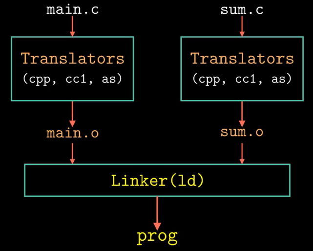

# 编译器驱动程序

**本文中以下操作环境为：**
Ubuntu 20.04.2 LTS
gcc version 9.4.0 (Ubuntu 9.4.0-1ubuntu1~20.04.1)

大多数编译系统提供**编译器驱动程序（compiler driver）**，它代表用户在需要时调用：语言预处理器、编译器、汇编器、链接器。

例如，此处有两个 C 语言源文件：

~~~C++
//main.c
int sum(int* a, int n);

int array[2] = {1, 2};

int main(){
    int val = sum(array,2);
    return val;
}

//sum.c
int sum(int* a, int n){
    int i, s = 0;
    for(i = 0; i < n; i++){
        s += a[i];
    }
    return s;
}
~~~

目录结构为：

~~~shell
lzb125@lzb125-VirtualBox:~/my_c_c++$ ls
main.c  sum.c
~~~

使用 GNU 编译系统构造该程序，则需通过在 shell 中输入下列命令来调用 GCC 驱动程序。

~~~
gcc -Og -o prog main.c sum.c
~~~

其中，

- -Og

  Optimize debugging experience

  -Og 选项使得优化并不会干扰 debug。
  对于标准的编辑-编译-debug 周期来说，它是标准的优化等级选择，它提供合理的优化等级，同时保持快速的编译和良好的 debug 体验。

  在实际项目中，为了程序的性能，通常采用 -O1 或-O2 的优化选项。

- -o

  output file

  指定输出的可执行文件的文件名。

  此处指定的文件名为 prog，若不指定，则默认输出的可执行文件名为 a.out。

实际过程：

~~~shell
lzb125@lzb125-VirtualBox:~/my_c_c++$ gcc -Og -o prog main.c sum.c
lzb125@lzb125-VirtualBox:~/my_c_c++$ ls
main.c  prog  sum.c
~~~

可见，执行命令后生成了可执行文件 prog。

图1. 链接生成可执行文件

如图一所示，概括了从 ASCII 码源文件翻译成为可执行目标文件时的行为。

下面对该过程进行细分讲解。

先删除 prog，把文件夹恢复成初始状态：

~~~C++
lzb125@lzb125-VirtualBox:~/my_c_c++$ rm ./prog
lzb125@lzb125-VirtualBox:~/my_c_c++$ ls
main.c  sum.c
~~~

## 预处理

驱动程序首先运行 **C 语言预处理器（cpp，c preprocessor）**，它将 C 的源程序 main.c 翻译成一个文本文件的中间文件 main.i。

我们可以使用下列命令来调用 cpp 执行这个操作。

~~~shell
cpp -o main.i main.c
~~~

当然，也可以传入 -E 选项来使用 gcc 完成相同的任务。

~~~shell
gcc -E -o main.i main.c
~~~

其中 -E 选项用于限制 gcc 只进行预处理，而不进行后续编译、汇编、链接的操作。

实际过程：

~~~shell
lzb125@lzb125-VirtualBox:~/my_c_c++$ cpp -o main.i main.c
lzb125@lzb125-VirtualBox:~/my_c_c++$ cpp -o sum.i sum.c
lzb125@lzb125-VirtualBox:~/my_c_c++$ ls
main.c  main.i  sum.c  sum.i
~~~

可见，对 main.c，sum.i 进行的预处理，文件夹中多出了经过预处理之后的 main.i，sum.i。

查看一下 main.i，sum.i 的内容：

~~~C++
lzb125@lzb125-VirtualBox:~/my_c_c++$ cat main.i
# 1 "main.c"
# 1 "<built-in>"
# 1 "<command-line>"
# 31 "<command-line>"
# 1 "/usr/include/stdc-predef.h" 1 3 4
# 32 "<command-line>" 2
# 1 "main.c"
int sum(int* a, int n);

int array[2] = {1, 2};

int main() {
    int val = sum(array,2);
    return val;
}
lzb125@lzb125-VirtualBox:~/my_c_c++$ cat sum.i
# 1 "sum.c"
# 1 "<built-in>"
# 1 "<command-line>"
# 31 "<command-line>"
# 1 "/usr/include/stdc-predef.h" 1 3 4
# 32 "<command-line>" 2
# 1 "sum.c"
int sum(int* a, int n){
    int i, s = 0;
    for(i = 0; i < n; i++){
        s += a[i];
    }
    return s;
}
~~~

可见的确是进行了预处理，而且仍然是文本文件。

## 编译

接下来，驱动程序运行 **C 编译器（cc，c compiler）**，它将预处理生成的中间文件翻译成一个文本文件的汇编语言文件。

命令：

~~~shell
cc -S -o main.s main.i
~~~

同样可以以 -S 选项来使用 gcc 完成相同的任务。

~~~shell
gcc -S -o main.s main.i
~~~

其中 -S 选项表示只对文件进行编译，而不进行后续汇编、链接的操作。

实际过程：

~~~shell
lzb125@lzb125-VirtualBox:~/my_c_c++$ cc -S -o main.s main.i
lzb125@lzb125-VirtualBox:~/my_c_c++$ cc -S -o sum.s sum.i
lzb125@lzb125-VirtualBox:~/my_c_c++$ ls
main.c  main.i  main.s  sum.c  sum.i  sum.s
~~~

多出了 main.s 和 sum.s 文件。

查看一下 main.s：

~~~C++
lzb125@lzb125-VirtualBox:~/my_c_c++$ cat main.s
	.file	"main.c"
	.text
	.globl	array
	.data
	.align 8
	.type	array, @object
	.size	array, 8
array:
	.long	1
	.long	2
	.text
	.globl	main
	.type	main, @function
main:
.LFB0:
	.cfi_startproc
	endbr64
	pushq	%rbp
	.cfi_def_cfa_offset 16
	.cfi_offset 6, -16
	movq	%rsp, %rbp
	.cfi_def_cfa_register 6
	subq	$16, %rsp
	movl	$2, %esi
	leaq	array(%rip), %rdi
	call	sum@PLT
	movl	%eax, -4(%rbp)
	movl	-4(%rbp), %eax
	leave
	.cfi_def_cfa 7, 8
	ret
	.cfi_endproc
.LFE0:
	.size	main, .-main
	.ident	"GCC: (Ubuntu 9.4.0-1ubuntu1~20.04.1) 9.4.0"
	.section	.note.GNU-stack,"",@progbits
	.section	.note.gnu.property,"a"
	.align 8
	.long	 1f - 0f
	.long	 4f - 1f
	.long	 5
0:
	.string	 "GNU"
1:
	.align 8
	.long	 0xc0000002
	.long	 3f - 2f
2:
	.long	 0x3
3:
	.align 8
4:
~~~

可见编译生成的汇编语言文件，仍然是一个文本文件，且已经将 C 语言翻译成了汇编语言。

## 汇编

然后，驱动程序运行**汇编器（as，assembler）**，它将汇编语言文件翻译成一个**可重定位目标文件（relocatable object file)** 。

命令：

~~~shell
as -o main.o main.s
~~~

同样可以以 -c 选项来使用 gcc 完成相同的任务。

~~~shell
gcc -c -o main.o main.s
~~~

其中 -c 选项表示只对文件进行汇编，而不进行后续链接的操作。

实际上，我们可以直接使用，从 main.c，main.i 或 main.s 一步就得到 main.o 文件

~~~shell
gcc -c -o main.o main.c
~~~

不过，咱还是一步一步来吧。

实际过程：

~~~shell
lzb125@lzb125-VirtualBox:~/my_c_c++$ as -o main.o main.s
lzb125@lzb125-VirtualBox:~/my_c_c++$ as -o sum.o sum.s
lzb125@lzb125-VirtualBox:~/my_c_c++$ ls
main.c  main.i  main.o  main.s  sum.c  sum.i  sum.o  sum.s
~~~

接着，查看一下 main.o：

~~~C++
lzb125@lzb125-VirtualBox:~/my_c_c++$ cat main.o
ELF>@@
��UH��H���H�=��E��E���GCC: (Ubuntu 9.4.0-1ubuntu1~20.04.1) 9.4.0GNU�zRx
\                                                                     %E�C
%)main.carraymain_GLOBAL_OFFSET_TABLE_sum	��������
                                                        �������� .symtab.strtab.shstrtab.rela.text.data.bss.comment.note.GNU-stack.note.gnu.property.rela.eh_frame @%`0
p10p,:�J�b�]@�
�8
  	0-�llzb125@lzb125-VirtualBox:~/my_c_c++$ 
~~~

发现 main.o 不再是文本文件，而是**二进制文件**，其内容为计算机可以执行的**机器码**，因此此处以文本文件进行查看，只会看到乱码。

## 链接

最后，驱动程序运行**链接器程序（ld）**，将 main.o 和 sum.o 以及一些必要的系统目标文件组合起来，创建一个**可执行目标文件（executable object file）** prog.exe。

注：链接器的英文实际是 linker，但在 Linux 系统中往往缩写为 ld 表示链接器。即便 ld 是 loader 或 link editor 的缩写。

原因，引用自维基百科：

> On Unix and Unix-like systems, the linker is known as "ld". Origins of the name "ld" are "LoaDer" and "Link eDitor". The term "loader" was used to describe the process of loading external symbols from other programs during the process of linking.

命令：

~~~shell
ld -o prog main.o sum.o [system object files and args]
~~~

注意，除了 main.o 和 sun.o 以外，还需要链接一些其它的必要的文件。

对于我们这个程序来说，需要：crt1.o，crti.o，crtbeginT.o，crtend.o，crtn.o 这五个目标文件。

其中 crt 为 **c runtime** 的缩写。

所以仅仅

~~~shell
ld -o prog main.o sum.o
~~~

是不行的，会报错：

~~~shell
lzb125@lzb125-VirtualBox:~/my_c_c++$ ls
main.c  main.i  main.o  main.s  sum.c  sum.o
lzb125@lzb125-VirtualBox:~/my_c_c++$ ld -o prog main.o sum.o
ld: 警告: 无法找到项目符号 _start; 缺省为 0000000000401000
lzb125@lzb125-VirtualBox:~/my_c_c++$ 
~~~

具体命令如图所示：

~~~shell
ld -static -o prog main.o sum.o \
/usr/lib/x86_64-linux-gnu/crt1.o \
/usr/lib/x86_64-linux-gnu/crti.o \
/usr/lib/gcc/x86_64-linux-gnu/9/crtbeginT.o \
-L/usr/lib/gcc/x86_64-linux-gnu/9 \
-L/usr/lib \
--start-group -lgcc -lgcc_eh -lc --end-group \
/usr/lib/gcc/x86_64-linux-gnu/9/crtend.o \
/usr/lib/x86_64-linux-gnu/crtn.o
~~~

运行过程：

~~~shell
lzb125@lzb125-VirtualBox:~/my_c_c++$ ld -static -o prog main.o sum.o \
> /usr/lib/x86_64-linux-gnu/crt1.o \
> /usr/lib/x86_64-linux-gnu/crti.o \
> /usr/lib/gcc/x86_64-linux-gnu/9/crtbeginT.o \
> -L/usr/lib/gcc/x86_64-linux-gnu/9 \
> -L/usr/lib \
> --start-group -lgcc -lgcc_eh -lc --end-group \
> /usr/lib/gcc/x86_64-linux-gnu/9/crtend.o \
> /usr/lib/x86_64-linux-gnu/crtn.o
lzb125@lzb125-VirtualBox:~/my_c_c++$ ls
main.c  main.i  main.o  main.s  prog  sum.c  sum.i  sum.o  sum.s
~~~

生成了可执行文件 prog。

## 运行

要执行可执行文件 prog，在 shell 中输入其文件名即可。

~~~shell
lzb125@lzb125-VirtualBox:~/my_c_c++$ ./prog
~~~

shell 调用操作系统中一个叫作**加载器（loader）**的函数，它将可执行文件 prog 中的代码和数据复制到内存，然后将控制转移到这个程序的开头。

由于我们的程序中并未写有任何输出的代码，所以运行 prog 并不会有任何输出，不过我们可以通过

~~~shell
echo $? 
~~~

该命令是显示上一条命令的执行结果（其返回值），于是我们可以观察到 prog 是否正常运行。

~~~shell
lzb125@lzb125-VirtualBox:~/my_c_c++$ ./prog
lzb125@lzb125-VirtualBox:~/my_c_c++$ echo $?
3
~~~

可见，1+2=3 程序正常运行了！

2023.03.02
