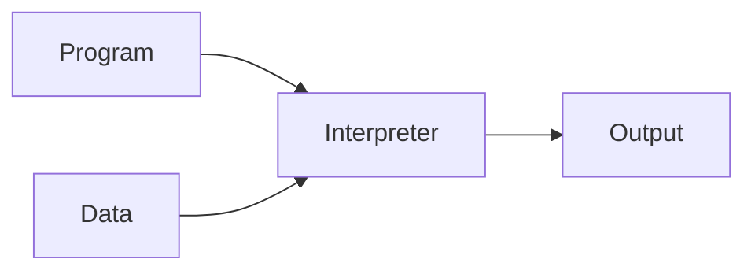

# introduction

There are two major approches to implementting programming languages: compilers and interpreters.

This class is mostly about compilers.

But I do want to say a few words about interprets here in the first lecture.

So what does an interpreter do?

Interpreter takes as input your program that you wrote and whatever data that you want to run the program on.

It produces the output directly, Meaning that it doesn't do any processing of the program before it executes it.
