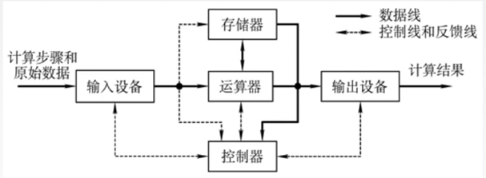
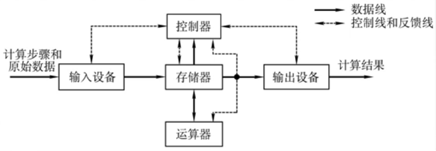
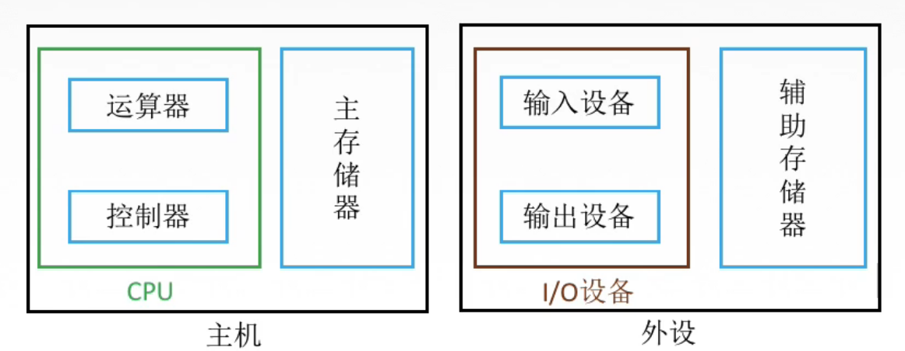

# 计算机系统的组成

图1.经典的冯·诺伊曼计算机框图

图2.以存储器为中心的计算机结构框图

软件与硬件**在逻辑上**是等效的。

同样的功能，可以通过软件或硬件的方法来完成，都能完成，所以在逻辑上的等效的。

并不能直接说软件和硬件是相同的。

图3.现代计算机的组成框图

运算器与控制器在逻辑关系与电路结构上联系十分紧密，于是在实际设计中，往往将这两大部件集成在同一芯片上，统称为**中央处理器**（Central Processing Unit，CPU）。

CPU加上**主存储器**，叫做**主机**。

这里的主存储器是存放程序与数据，可以直接与CPU交换信息的。下面辅存不属于主存储器。

把输入与输出设备简称为**I/O设备**（Input/Output Equipment）

I/O设备加上**辅助存储器**（辅存，外存），称为**外设**。

2020.08.18