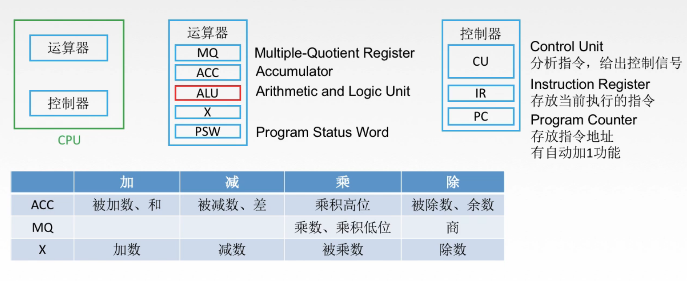
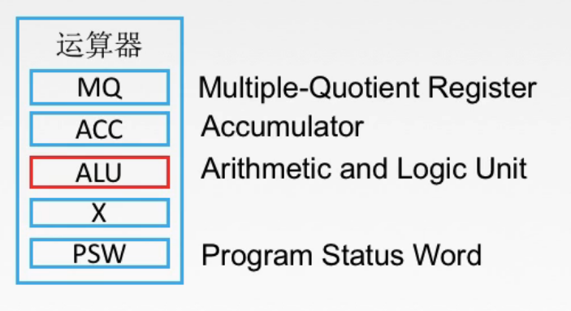
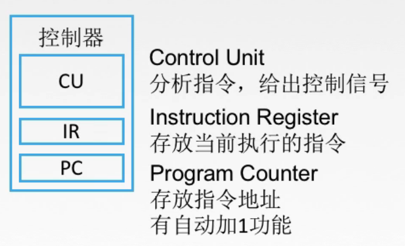
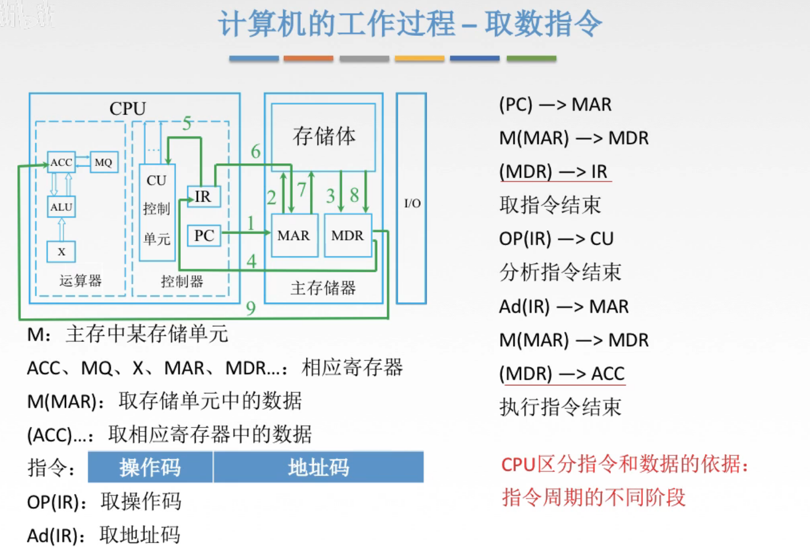

# 控制器、运算器工作过程

## 一. CPU

图1.CPU

图2.运算器

**运算器**

ALU（Arithmetic Logic Unit，算术逻辑单元）：是运算器的核心部件，主要采用组合逻辑的设计方式。

其他都为寄存器：

MQ（Multiplier-Quotient Register，乘商计算器）

ACC（Accumulator，累加器）

X（通用计算器）：因为通用计算器有很多个，所以这里写成X表示是使用的某一个通用计算器。

PSW（Program Status Word。程序状态字寄存器）：例如程序计算有无溢出，有无进位，可提供给控制器做下一步指令的判断，特别是跳转指令。

图3.控制器

**控制器**

CU（Control Unit，控制单元）：主要采用时序逻辑的设计方式。

IR（Instuction Register，指令寄存器）：存放当前执行的指令。

PC（Program Counter，程序计数器）：存放当前欲执行指令的地址，有自动+1的功能。

## 二.  取数指令流程

图4.取数指令流程

主存储器中：

MAR（Memory Address Register，存储器地址寄存器）：存放欲访问的存储单元的地址。

MDR（Memory Data Register，存储器数据寄存器）：存放从存储体某单元取出的代码，或者准备往某存储单元存入的代码。

指令：指令包含了操作码与地址码。

如何看懂这个流程？

1. 单独的正常的名称，如 ACC、MQ、MAR、MDR......，都指这个物体/东西；
   M，指主存储体中的某个存储单元。
2. 加上括号，如（MAR）、（MDR）、（IR）......，指这个部件里面的内容；
3. 再加上括号前面的，如M（MAR）、OP（IR）、AD（IR）......，指对这个部件里的内容进行操作；
   M（MAR）：根据MAR中的地址，在M中取其存储单元中的数据；
   OP（IR）：对IR中的内容取其操作码；
   AD（IR）：对IR中的内容取其地址码。
4. 箭头 $\rightarrow$ ，指将数据传递给下一个。

那么这个流程里有两处将（MDR）传递出去，CPU是如何区分指令与数据，从而传给IR还是ACC的呢？
根据指令的不同阶段区分。

比如这个取数指令，自然第一次的（MDR）是指令，第二次的（MDR）是要处理的数据。

2020.08.18