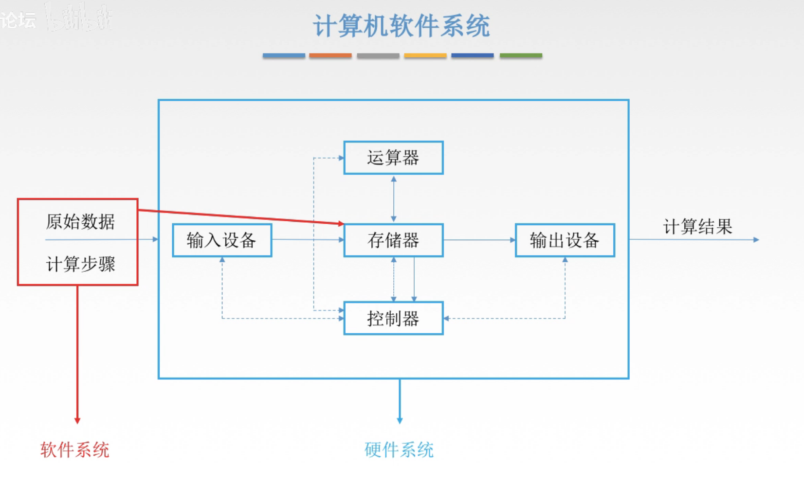
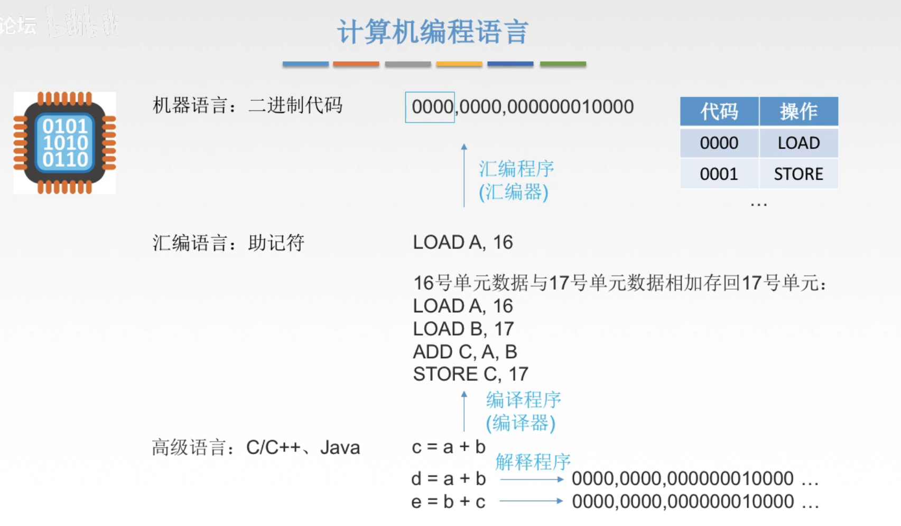

# 软件系统

## 一. 软件系统



<center>图1.软件系统</center>

软件分类：

1. 系统软件：管理整个计算机系统，使系统资源得到合理调度。
   如操作系统（OS），数据库管理系统（DBMS），......
2. 应用软件：完成用户特定任务，使用系统软件提供的资源接口。
   如QQ，微信，Word，......

## 二. 编程语言



<center>图2.编程语言</center>

1. 原本只有机器语言，因为机器语言不直观，于是做了一个表，0000对应LOAD，0001对应STORE，然后干脆就写个程序让计算机自动转换得了，人们就可以不用写0000，而直接写LOAD（汇编语言），让计算机自己翻译为0000。

   从汇编语言翻译为机器语言的程序叫做**汇编程序**（汇编器），作用是将汇编语言翻译为机器语言。

2. 汇编语言还是有点麻烦，c=a+b这个事情都要写好几行，于是又发明了高级语言，写个程序让计算机自动把高级语言的c=a+b翻译为汇编语言，这下人们就只需要简单的写c=a+b就行了。

   把高级语言翻译为汇编语言的这个过程叫做编译，完成这个过程的程序叫做**编译程序**（编译器）。
   当然，也可以从高级语言，不经过汇编语言，直接翻译为机器语言，这也叫做编译。

   （为啥我书上说叫翻译程序，然后翻译分为编译和解释）

3. 高级语言编译时，有两种策略。

   ```c
   c=a+b;
   d=a+b;
   e=b+c;
   ```

   第一种是**编译程序**，一次性全部编译后再执行。
   那么这时，程序并不是完全按照所写的步骤来的，比如这里举得例子，c，都等于a+b，所以在给d赋值时就可以直接把c的值传过去，而不用按照写的程序一样重复的在计算一次d=a+b了。

   第二种是**解释程序**，即一句一句的翻译后立即执行。

   这时，由于是翻译一句立即执行一句，所以完全考虑不到代码的前后联系，也就做不到刚才编译中的省事的做法。

   （感觉就是C语言和R语言的区别= =）

总结一下：

1. 编译：由高级语言转换到低级语言都叫编译。
2. 汇编：由汇编语言转换到机器语言叫汇编。

2020.08.19