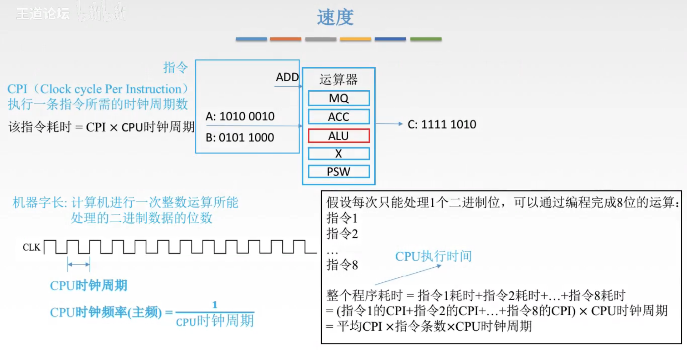
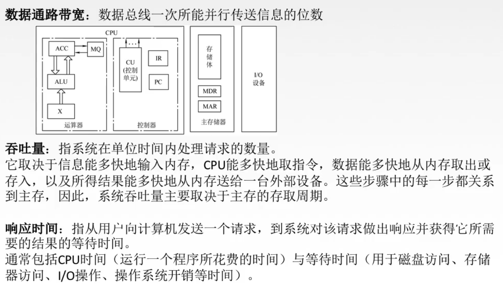

# 性能指标

## 一. 容量

存储器的容量应该包括**主存容量**和**辅存容量**。

**主存容量**是指主存中存放二进制代码的**总位数**，即：存储容量 $=$ 存储单元个数 $\times$ 存储字长。

系统能支持的最大容量 $=2^n\times$ 存储字长。 $n$ 为译码器接入的线的根数。

最大容量并不一定等于存储容量。毕竟我也可以存储体里不足 $2^n$ 个存储单元。

单位的转化：

byte，字节的单位为 $B$ ，即1B=8bit。

 $\begin{cases}2^{10}:K\\2^{20}:M\\2^{30}:G\\2^{40}:T\end{cases}$ ，

## 二. 速度

图1.

**CPU时钟周期**：

CPU的时钟周期

**CPU时钟频率（主频）**：

CPU时钟频率（主频） $\begin{aligned}=\frac{1}{\text{CPU时钟周期}}\end{aligned}$ 

**CPI**（Clock cycle Per Instruction）：

执行一条指令所需的时钟周期。

于是，一条指令的耗时=该指令CPI $\times$ CPU时钟周期。

 $\begin{aligned}整个程序耗时&=指令1耗时+...+指令n耗时\\&=(指令1的\text{CPI}+...+指令n的\text{CPI})\times \text{CPU}时钟周期\\&=平均\text{CPI}\times 指令条数\times\text{CPU}时钟周期\end{aligned}$ ，

图1假设的是程序为一个加法A+B，并且是每次只能处理1位二进制位，则假设这个加法程序为8个指令。

图2.

**IPS**（Instructions Per Second）：

 $\begin{aligned}\text{IPS}=\frac{1}{\text{CPI}\times \text{CPU时钟周期}}=\frac{主频}{\text{CPI}}\end{aligned}$ ，每秒执行多少条指令。

**MIPS**（Million Instructions Per Second）：

 $\begin{aligned}\text{MIPS}=\text{IPS}\times10^{-6}=\frac{指令条数}{执行时间}\times10^{-6}=\frac{主频(\text{MHz})}{\text{CPI}}\end{aligned}$ ，每秒执行多少百万条指令。就是换个单位，因为IPS通常都很大。

**MFLOPS**（Million Floating-point Operations Per Second）

 $\text{MFLOPS}=\frac{浮点操作次数}{执行时间}\times10^{-6}$ ，每秒执行多少百万次浮点运算。

**GFLOPS**（Giga Floating-point Operations Per Second）

 $\text{GFLOPS}=\frac{浮点操作次数}{执行时间}\times10^{-9}$ ，每秒执行多少十亿次浮点运算。

**TFLOPS**（Tera Floating-point Operations Per Second）

 $\text{TFLOPS}=\frac{浮点操作次数}{执行时间}\times10^{-12}$ ，每秒执行多少万亿次浮点运算。

图2.

**数据通路带宽**：

数据总线一次所能并行传送信息的位数。

**吞吐量**：

系统单位时间内处理请求的数量。

**响应时间**：

指从用户向计算机发送一个请求，到系统对该请求做出相应并获得它所需要的结果的等待时间。

2020.08.19