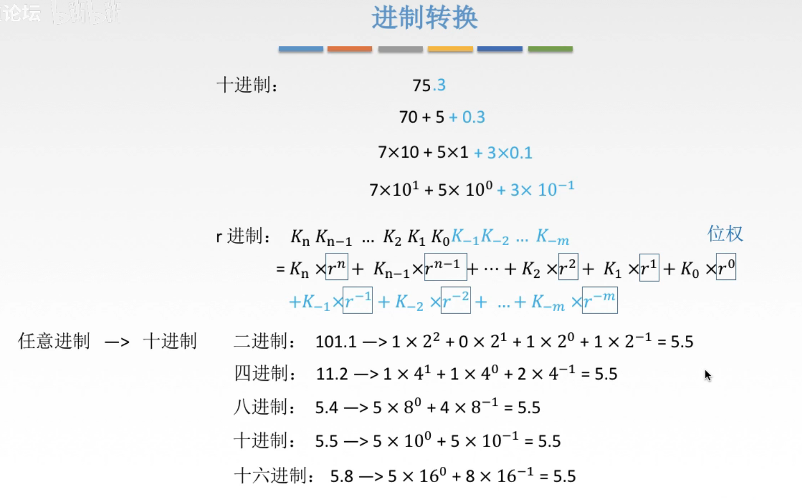
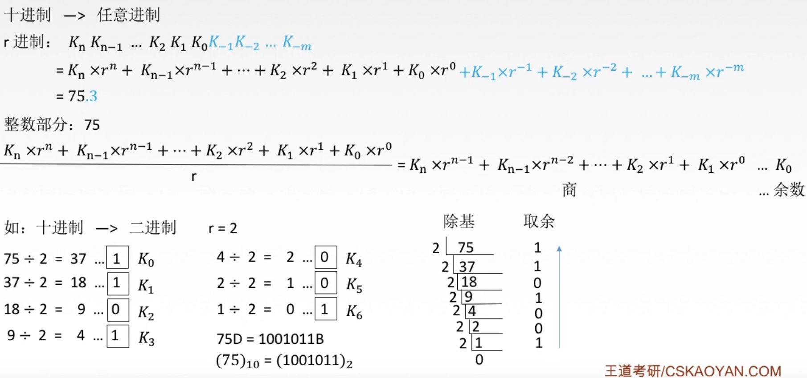
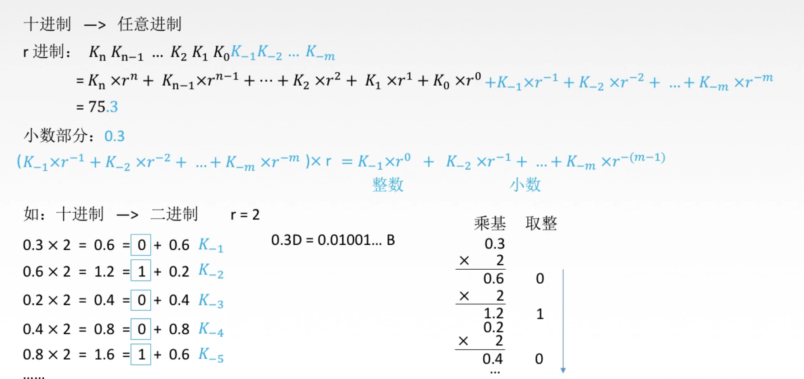
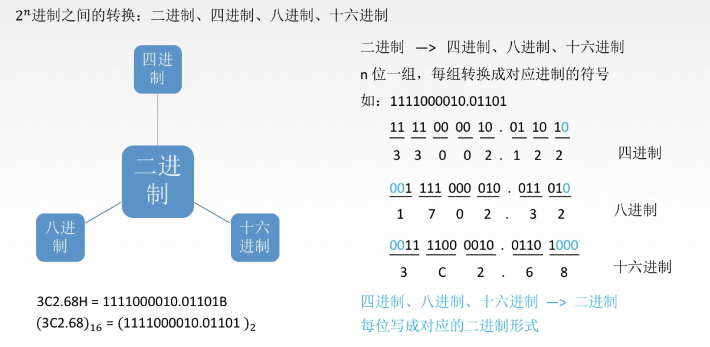
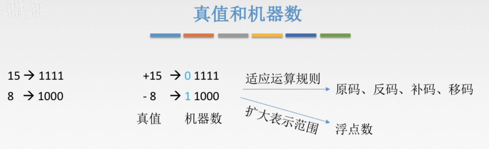

# 进制转换

## 一. 任意进制与十进制

### 1.1 其他进制转换为十进制：

图1.其他进制转换为十进制

**按权展开相加法**：每一位的数乘以位权再相加，整数部分与小数部分相同不用分开讨论。

### 1.2 十进制转换其他进值：

**整数部分**

图2.十进制转换为其他进制，整数部分

整数部分每次除以一个r，得到的余数就是低位的K，一直重复，直到商为0。

图2右下部分为**除基取余法**，取余数最后结果从下往上写，因为先得到的结果是低位的，后的到的结果是高位的。

图2下方 75D=1001011B，其中D代表十进制，B代表二进制。

**小数部分**

图3.

小数部分每次乘以一个r，得到的整数就是高位的K，一直重复，但并不一定能够结束，这个操作可能能够一直进行下去，这种情况看题目给出保留多少位。

图3右下部分为**乘基取整法**，取整数最后结果从上往下写，因为先得到的结果是高位的，后的到的结果是低位的。

## 二.  $2^n$ 进制之间的转换

### 2.1 二进制转换 $2^n$ 进制

注意到，二进制的10两位刚好为4个不同状态，为四进制的一位；

二进制的101三位为8个不同状态，为八进制的一位；

二进制的1010四位为16个不同状态，为十六进制的一位；

于是二进制转换为 $2^n$ 进制：

图4.二进制转换2^n进制

图4左下角，H表示十六进制。

### 2.2  $2^n$ 进制转换二进制

就是倒过来，把 $2^n$ 进制的每一位转换为二进制，连起来就好了。

## 三. 真值与机器数

真值：就是实际中带符号的数。

机器数：一个数在计算机中的二进制表示形式。

因为计算机只能存储0/1嘛，自然没法存储+/-，所以我们写出来的+15，-8，为真值，那么计算机为了表示正负，于是采用最高位表示，最高位为0为正，为1为负，那么计算机中实际存储的数就是机器数。

2020.08.21