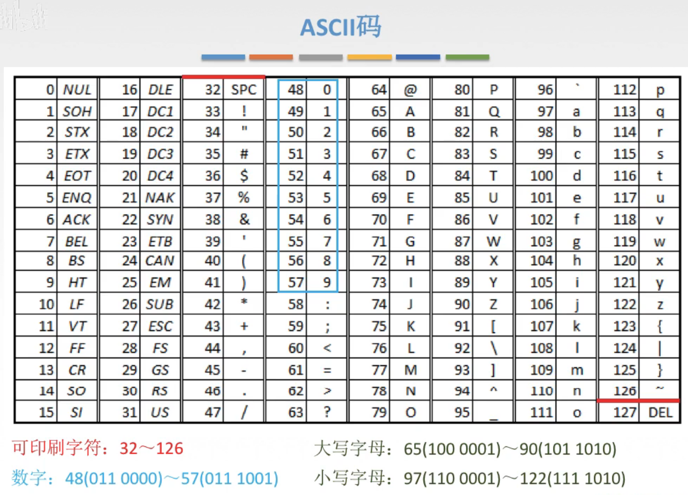
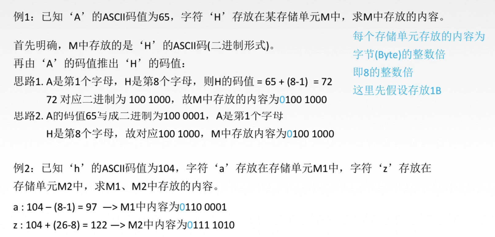
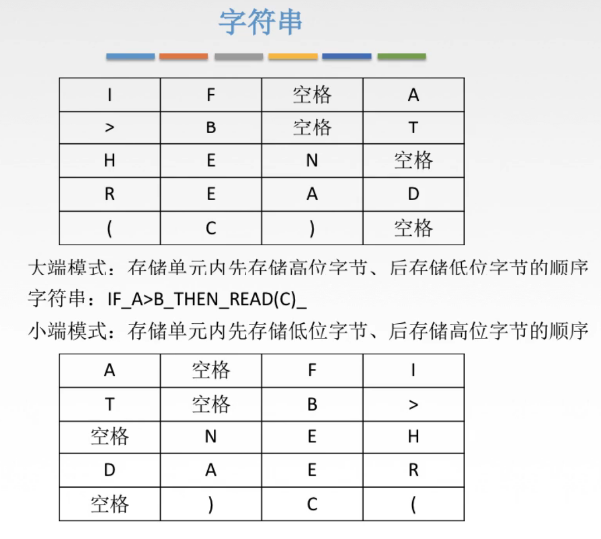
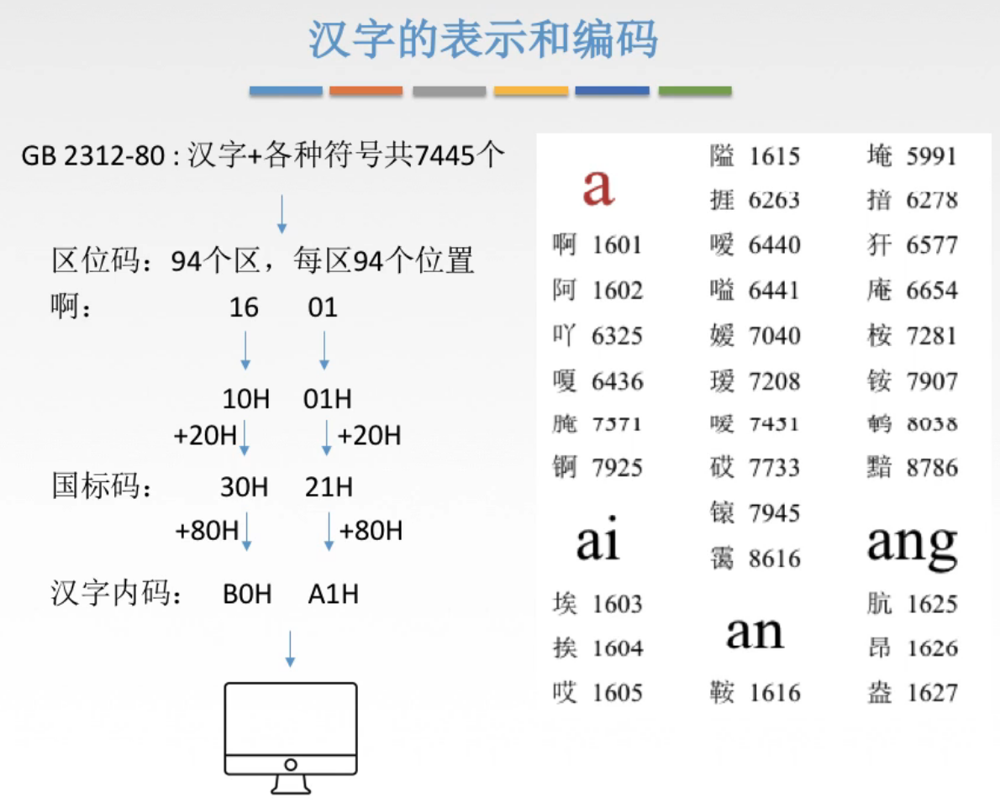

# 字符与字符串

## 一. ASCLL码

类似的，建立字符与二进制关系的双射。

因为常用的字符，128个，所以使用7位二进制代码就可以表示完（ $2^7=128$ ）
（其实把我觉得可能不止128或者不足128个，只是多了点又没必要用8位，少了点那就物尽其用把128个用完。当然是我猜的，说不定是因为得留着第8位干啥，所以只能用7位二进制代码呢。）

图1.ASCLL码

通用控制符：32个，0\~31；
可印刷字符：32\~126；
数字：48（011 0000）\~57（011 1001），011开头，0（0000）\~9（1001）；
大写字母：65（100 0001）\~90（100 1010），100开头，A（0001）\~Z（1010）；
小写字母：97（110 0001）\~122（110 1010），110开头，a（0001）\~z（1010）。

看王道视频说是不用记。

**例题**：

图2.ASCLL码例题

例题假设的一个存储单元为1字节。

## 二. 字符串

图3.字符串存储方式

图3中，作为例子的要存储的字符串为：IF_A>B_THEN_READ(C)（_表示空格，打空格看不见）。

假设一个存储单元存储4字节，那么就是将字符串划分为4个一组存储。

（存储单元这么画，一般来说从左到右从上到下，地址增加）

1. **大端模式**：

   存储单元内先存储高位字节、后存储低位字节。
   举例就是IF>A，先存I，再存F...

2. **小端模式**：

   存储单元内先存储低位字节、后存储高位字节
   举例就是IF>A，先存A，再存>...

## 三. 汉字的表示和编码

图4.汉字的表示和编码

（以下理解不一定正确，但是理解起来还挺方便的。）

同样是在汉字与二进制之间建立双射。

但是因为汉字+各种符号太多了，比如这里就有共7445个，那么按照以往的用一个二进制数来映射至少就需要13位二进制代码（ $2^{13}=8192$ ） ，这13位的处理起来就非常不舒服了。

于是采用**区位码**的形式来建立双射，分为94个区，每个区94个位置（ $94\times 94=8836$ ）。

（其实就是用两个二进制数来映射，也就是一个二维数组嘛，这样就用两个字节就能表示完了）

94的话，只需要7位二进制代码就能表示完了，于是就需要两个7位的二进制代码。
实际上就是采用两个1字节的数来表示。

在设计时，对于原本ASCLL码中的前32个通用控制字符就没有必要重新编码了，于是留出前32个空位给通用控制字符。

所以**国标码**也就是区位码的两个数都加上32（十六进制是20H）。

但是呢，如果就这样采用国标码的话，还是会和ASCLL码产生冲突，毕竟二进制代码都是一样的。考虑到ASCLL码只用了7位，其最高位始终是0。

同样的我们的两个二进制数也只用了7位，于是我们把我们的最高位都换成1，这样就能区别开汉字编码与ASCLL码，当计算机识别最高位为1，为汉字，为0为ASCLL码。

而最高位换成1，相当于加上120（80H，1000 0000B）。

于是**机内码**，为国标码的两个数都再加上128（80H）。

2020.8.21