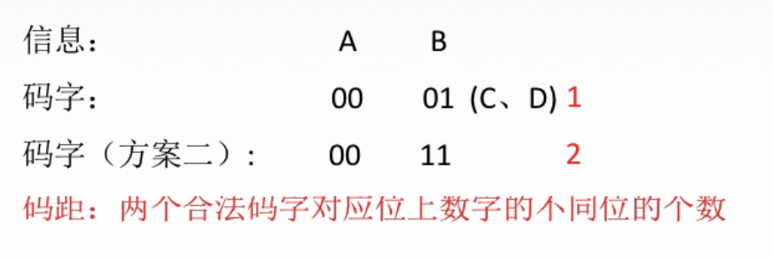
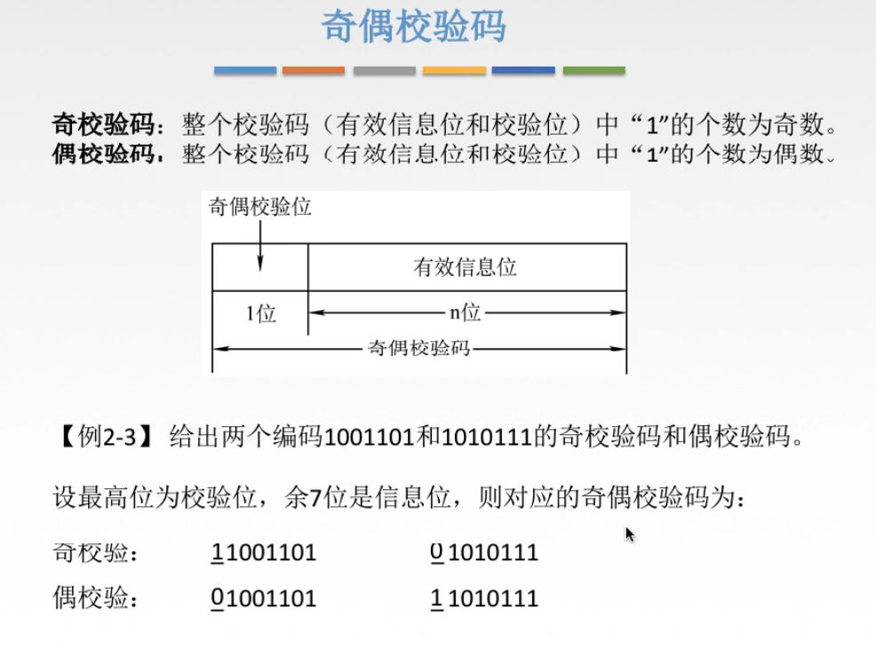

# 205 校验原理、奇偶校验码

## 一. 校验原理简介

图1.校验原理示意

图1的意思是，现在从一台电脑传递信息给另一台电脑，

如果采用方案一，即便A（00）B（01）C（10）D（11），那么如果传递过去的信息出错了，可能中间有1/0变成了0/1，但是我们无法判断它是否是正确的。因为每一个二进制代码都有着含义。

但是如果采用方案二，使用A（00）B（11），不使用（01）（10），那么如果传递过去的信息出错了，我接收到的信息中有（01）（10），那么我就可以知道我接受到的信息出错了。

**码距**：两个合法码字对应位上数字不同的个数。

方案一的码距为1，方案二的码距为2。

当整个编码中的最小码距大于1时，就可以具有判断是否出错的能力了。

## 二. 奇偶校验码

图2.奇偶校验码

奇/偶校验码，只额外需要1位就足够了。
因为一位补上1/0，已经使得整个信息中1的个数为奇数/偶数，再多要位数，也只能补0，没有作用多此一举了，所以只需要1位就足够了。

奇/偶校验码，只能检测奇数次的错误。
毕竟要是出现了两次1/0的改变，但是整体的1的个数是不会变的。

奇/偶校验，也就增加了这个编码中的最小码距。
比如上文的方案一，通过奇/偶校验，也就使得其最小码距变为了2。

2020.08.21