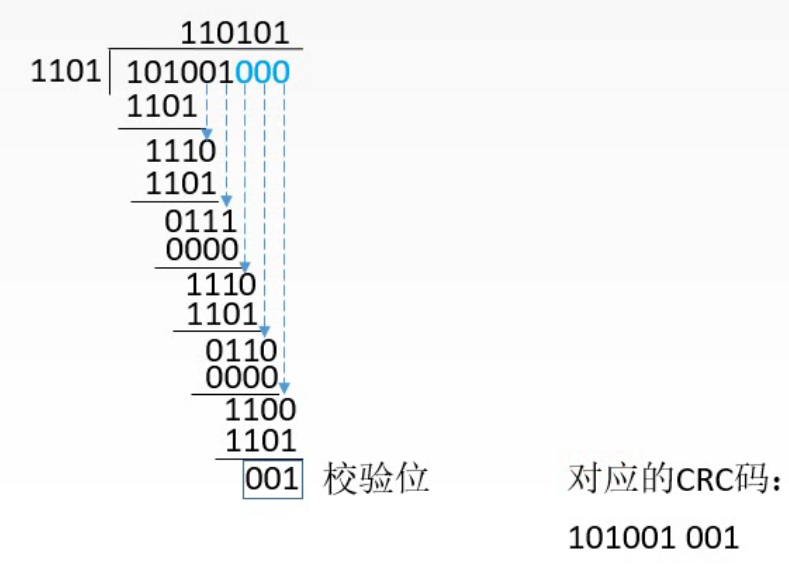
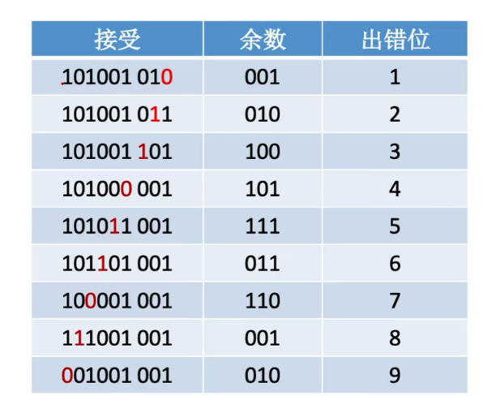
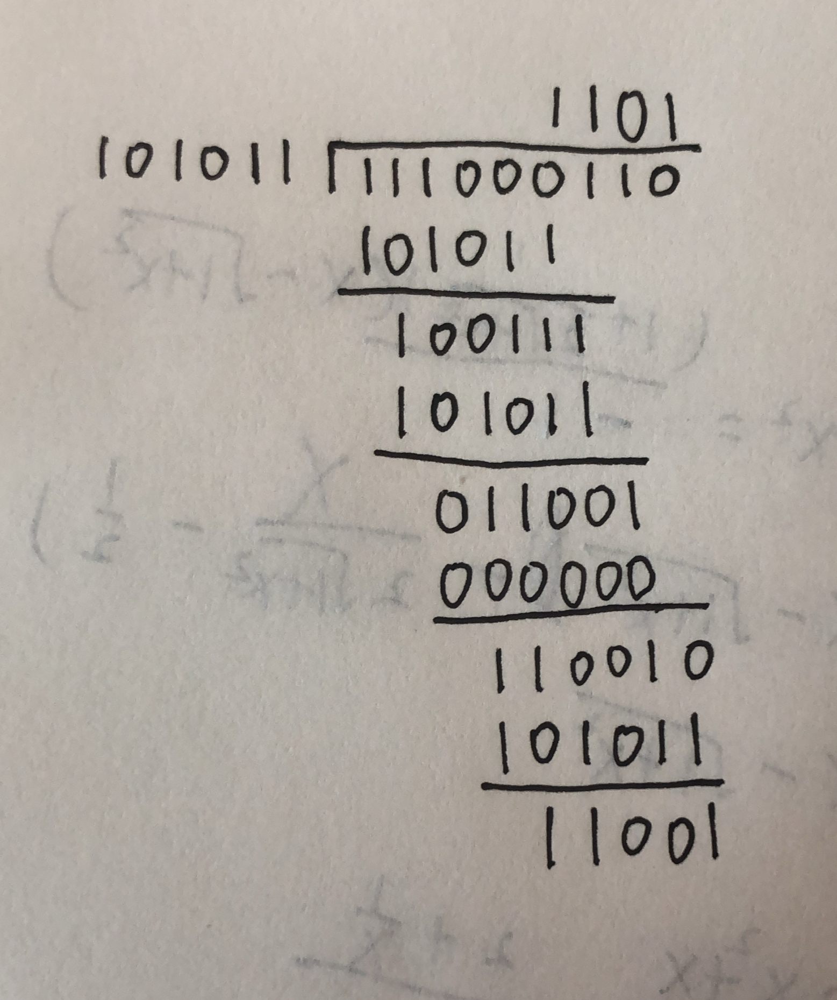

# 循环冗余校验码

循环冗余校验码（CRC码）

只要求会做题就行了。

假设有K位信息位，R位校验位。

**例题一**

题目：设生成多项式为 $G(x)=x^3+x^2+1$ ，信息码为101001，求对应的CRC码。

解：

1. 确定K、R以及生成多项式对应的二进制码。

   K=信息码的长度=6；
   R=生成多项式的最高次幂=3；
   校验码位数=K+R=9。

   写出生成多项式的各项系数构成的二进制码：
   生成多项式 $G(x)=1\cdot x^3+1\cdot x^2+0\cdot x^1+1\cdot x^0$ ，对应二进制码1101；

2. 移位

   信息码左移动R位，补0。
   这里是左移R=3位，为101001 000。

3. 相除

   对移位后的信息码101001000，用生成多项式对应二进制码1101进行模2除法，最后的余数就是校验位。

   

   
图1.模2除法

   模2除法。
   10100100首位是1就写1，比如第一步是1010，虽然1101比1010大，但还是商第一个还是写1而不是0。
   每一步，比如第一步 $\frac{1010}{1101}$ ，不是通常除法的相减，而是异或得到111，然后补上10100100的中1010的下一位0。

   最后的结果001为校验位
   于是得到对应的CRC码为101001 001

4. 检错

   发送信息101001001。

   接收信息101001001，将接收到的信息用1101进行模2除法，余数为000，没有出错。

   接收信息1010010 $\color{red}1$ 1，将接收到的信息用1101进行模2除法，余数为010，此时查询余数与出错位的关系表，可确定出错位置。
   
   
   
   
图2.余数与出错位关系表。

   
   实际上并不总是能够指出出错位置，如这题，本身校验位是 3 位，而整个信息是 9 位，如图 2，余数为 010 对应的出错位为 2 或 9 处。
   当然如果校验位3位，整个信息是 4+3=7 位，就可以指出出错位置。
   
   这个余数与出错位的对应关系，只与生成多项式有关，改变原本要传输的信息，是不会改变余数与出错位的关系的。

主要这题给的出的不太好，因为校验位是3位，而整个信息都是5+3=9位了， $2^3=8$ 表示不完9个位置。

再来一题

**例题二**

题目：若信息码字为111000110，生成多项式为 $G(x)=x^5+x^3+x+1$ ，则计算出的CRC校验码为（）（选择题，我就直接算了。）

解：

校验位位数=生成多项式最高次幂=5，
生成多项式对应的二进制码101011，
111000110对101011进行模2运算，结果为11001。

图3.模2除法

做错了，没有后面添 5 个 0 然后再进行模 2 除法。

虽然结果是对的。

2020.08.22