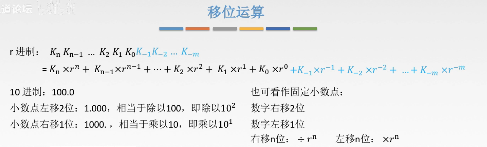
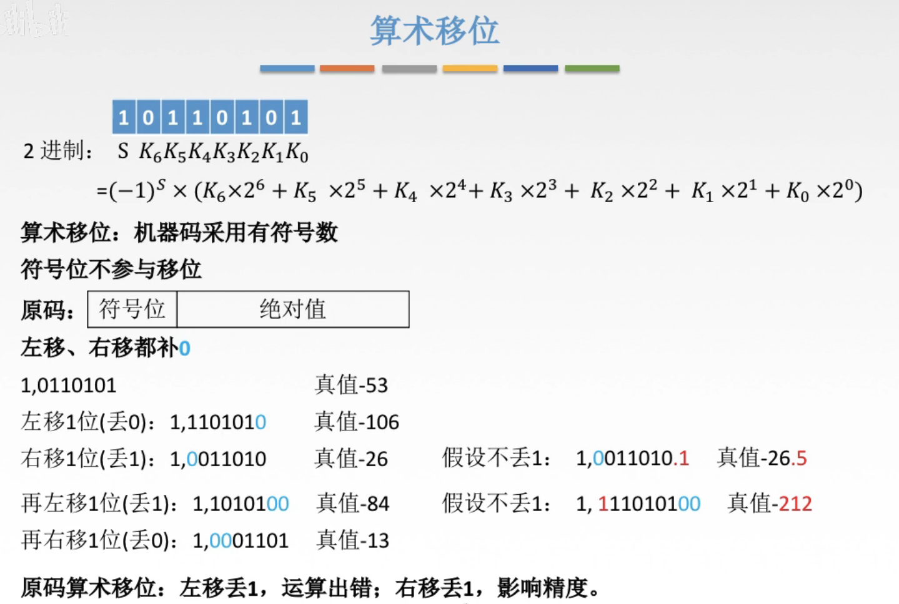
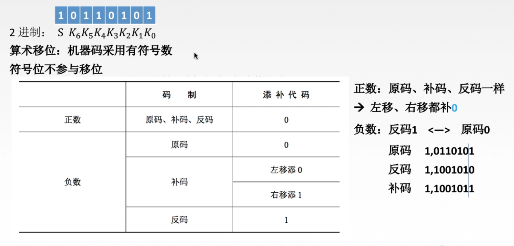
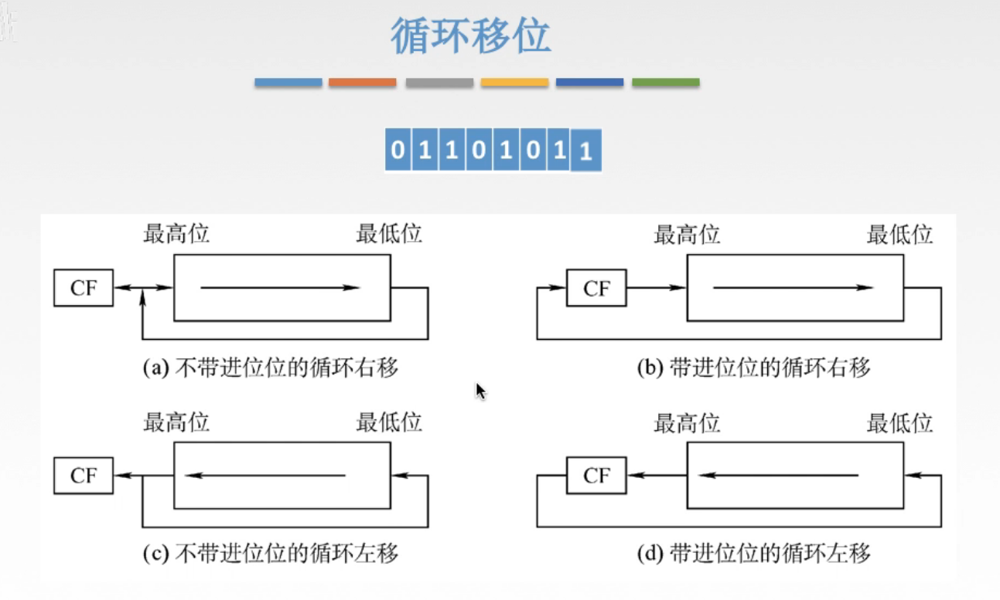

# 移位运算

## 一. 移位运算

图1.移位运算

在r进制下，小数点左移n位，相当于除以 $r^n$ ；小数点右移n位，相当于乘以 $r^n$ 。

当然，因为定点数中我们是早已约定好了的小数点的位置，所以通常都是移动数字。

在r进制下，数字左移n位，相当于乘以 $r^n$ ；数字右移n位，相当于除以 $r^n$ 。

### 1.1 逻辑移位

对于无符号数的移位，称为逻辑移位。

图2.对无符号数的逻辑移位

这种就很简单了，移动后补0就行。

### 1.2 算术移位

对有符号数的移位，称为算术移位。

由于对于负数，原码、补码、反码的处理方式不同，所以其算术移位的处理方式也不同。

#### 原码

对原码来说，符号位不参与移位，移位后补0。
如果左移丢失1，运算出错；右移动丢失1，影响精度。

图3.原码的算术移位

#### 反码

反码，正数与原码相同；而负数因为是原码除了符号位取反，所以与原码相反。

对反码来说，符号位不参与移位，
正数，移位后补0；负数，移位后补1。

#### 补码

补码，正数与原码相同；
负数是反码末位+1，当然可能产生进位，于是在补码从低位到高位的第一个1往左（不含该1），是与反码一一致，往右（含该1）与原码一致。

对于补码来说，符号位不参与移位，
正数，移位后补0；负数，左移补0，右移补1。

图4.移位规则总结

双符号位移位，高位符号位不参与移位，低位符号位参与。

## 循环移位

就是原本移位后要舍弃的位，拿来补上产生的空位。

图5.循环移位

CF（Carry Flag），进位位。

不带CF的循环移位，就是CF中的一位不参与循环移位，直接把原要舍去的位接在新空位上就好了。还是原本的8位的二进制代码在循环移位。

带CF的循环移位，就是CF中的一位参与循环移位，整体就是一个9位的二进制在循环移位了，在最高位前面还有一位CF。

## 本节知识点回顾

图6.本节总结脑图，重点

2020.08.25