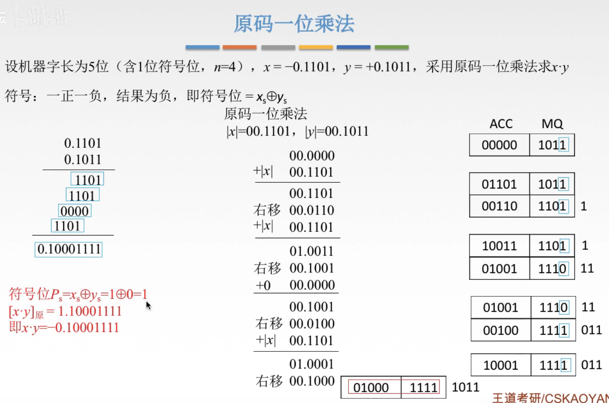
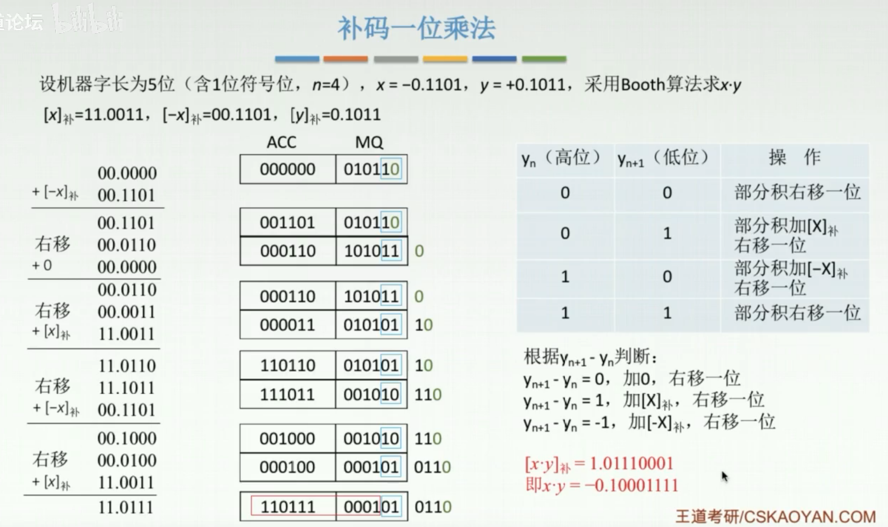
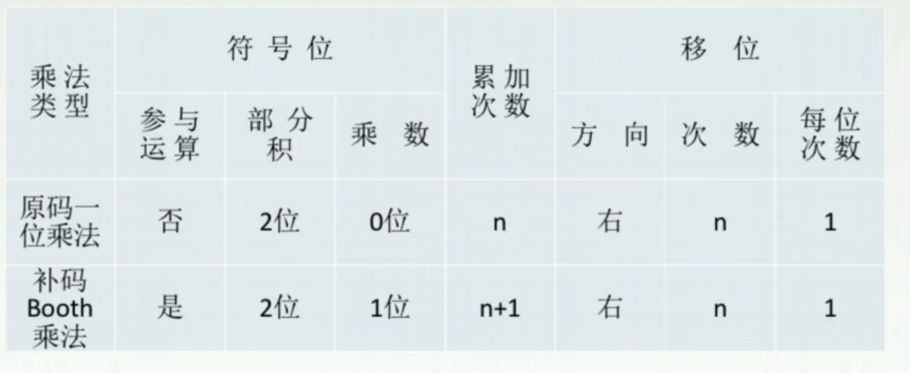

# 乘法运算

乘除运算，会做题就行，不是重点，不要求对其原理进行太深入的理解。

## 一. 原码一位乘法

图1.原码一位乘法

符号位和数值位分开计算。

符号位：
采用异或运算，结果的符号位= $x_s\bigoplus y_s$ 。相同为0，不同为1。

数值位：

说起来还有点麻烦，但其实很简单。

图1左边是平常手算的乘法，相当于每次乘，数字左移一位放置。然后总和加起来。

图1右边就是计算机中的算法，讲原本的手算算法，最后算一次加法变为了在过程中多次相加，左移一位放置变为了逻辑右移来实现。

详细说明， $x(被乘数)\times y(乘数)$ 。

1. 首先因为符号位与数值位分开计算，所以将x,y取绝对值 $|x|=00.1101,|y|==00.1011$ ，这里用两位符号位判断进位。
2. 然后将0写入ACC，乘数 $|y|$ 数值位写入MQ。
3. 取MQ最低位，乘以 $|x|$ ，结果与ACC内的值相加，称为部分积，保存到ACC中。
4. 将ACC与MQ逻辑右移1位，ACC移出低位放置于MQ空出高位上。
   因为符号位和数值位分开运算，所以相当于逻辑右移。毕竟正数的原码逻辑移位和算术移位都是一样的。
5. 循环进行第3，4步，直到MQ中的 $|y|$ 每一位都进行过操作，乘过了。
6. 此时ACC与MQ中拼接的二进制就是其数值结果。
7. 将符号位结果与数值结果接起来，就是最终结果（原码形式）。

## 二. 补码一位乘法

 

图2.补码booth算法

补码 booth 算法，符号位也参与计算。（毕竟补码就是为了让符号位一起运算的）

MQ中的后两位决定了下一步的操作。

具体操作： $x(被乘数)\times y(乘数)$ 。

1. 计算出 $[x]_{补},[-x]_{补},[y]_{补}$ ，在这里被乘数 $x$ 取两位符号位，乘数 $y$ 取一位符号位。
2. 将0写入ACC，将 $[y]_{补}$ 写入MQ，注意的是需要在  $[y]_{补}$ 后补一位附加位0。
3. 根据MQ最低两位，进行下一步操作，进行对应操作后得到部分积，
4. ACC和MQ右移1位，ACC移出低位放置于MQ空出高位上。
   **注意，此时ACC中为补码的算术移位**。看图2中第3个右移。
5. 循环进行第3，4步，直到原本写入MQ中的每一位都进行过操作，乘过了。
6. 此时ACC与MQ中拼接的二进制就是其最终结果（补码形式）。

## 三. 两种乘法对比

图3.对比

符号位：

原码一位乘法：不参与运算，符号位单独运算，部分积采用2位符号位，乘数无符号位。
补码Booth乘法：参与运算，部分积采用2位符号位，乘数1位符号位。

累加次数：

原码一位乘法：n次。
补码Booth乘法：n+1次。

移位：

原码一位乘法：把ACC和MQ看着整体，原码的逻辑右移。
因为符号位和数值位分开运算，所以相当于逻辑右移。毕竟正数的原码逻辑移位和算术移位都是一样的。
补码Booth乘法：把ACC和MQ看着整体，补码的算术右移。

2020.08.26

