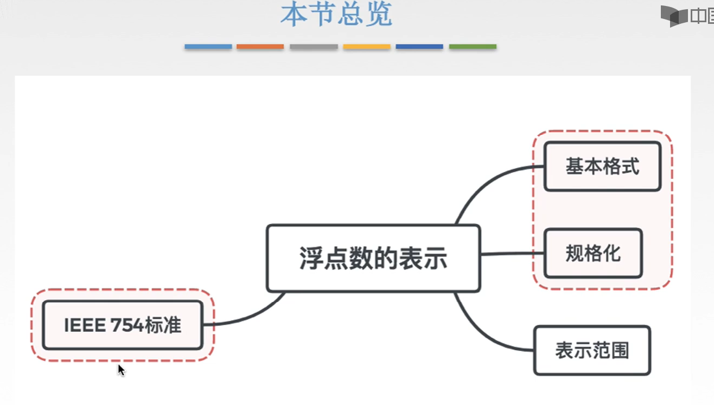
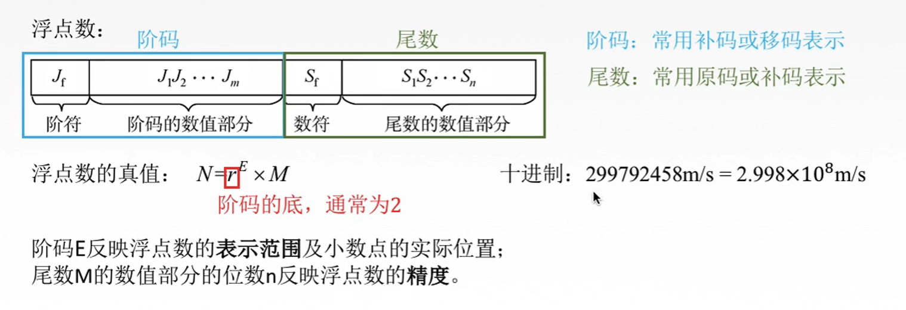
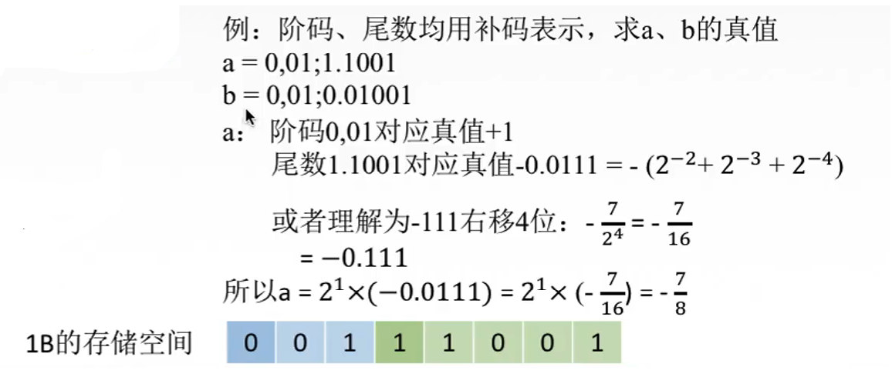
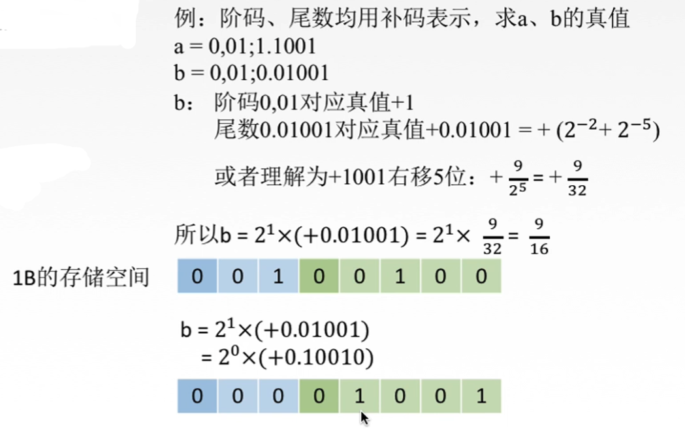
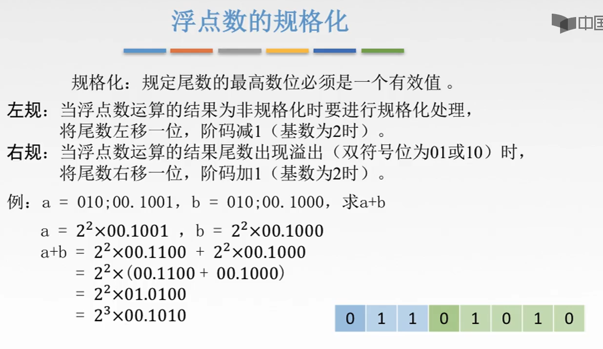
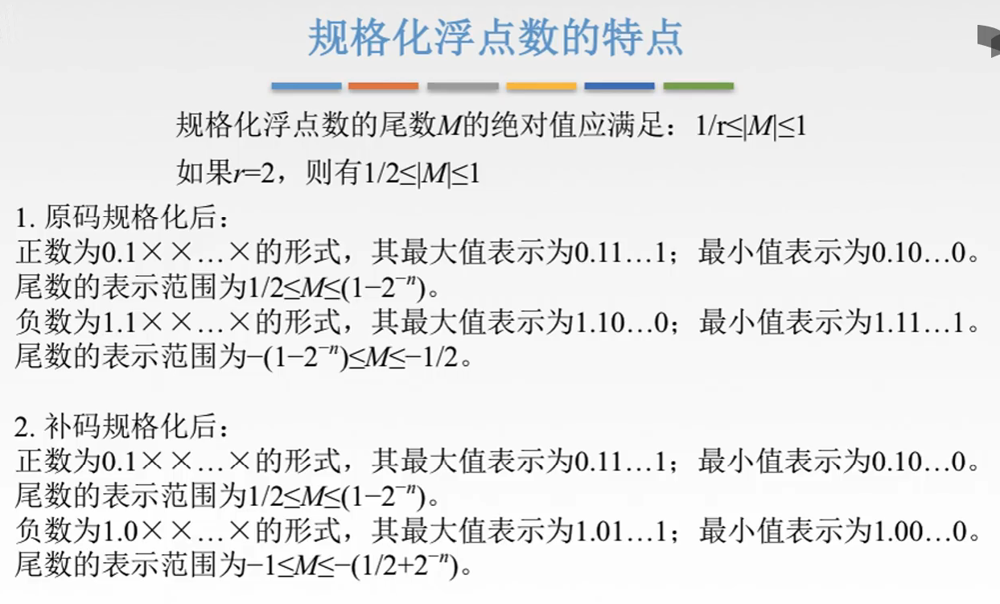
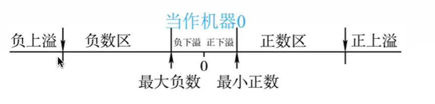
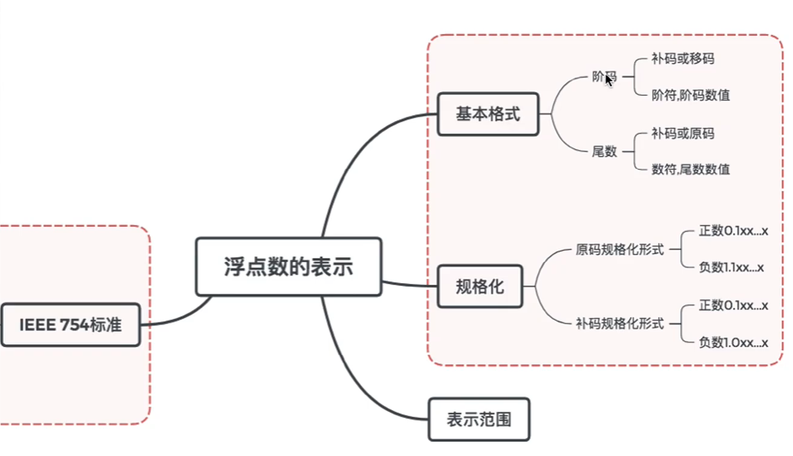

# 浮点数的表示

这节的框架

# 一. 基本格式

图2.基本组成

浮点数 $N=S\times r^j$ ，由**阶码** $j$ 和**尾数** $S$ 两部分组成。 $r$ 为基数，通常为2。
阶码
是整数，阶符和阶码数值位位数m合起来反映浮点数的表示范围及小数点的实际位置；
阶码，常用补码或移码表示。

尾数
是小数，其数值位位数n反映了浮点数的精度；尾数的符号 $S_f$ 代表浮点数的正负。
尾数，常用原码或补码表示。

其实就是采用的科学计数法的表示方法。

图3.浮点数的补码形式存储

例如图3，a的补码形式 $\underbrace{0,01}_{阶码};\underbrace{1.1001}_{尾数}$ ，
阶码0,01表示真值+1，
尾数1.1101表示真值-0.0111。
整个表示 $-0.0111\times2^{+1}=-0.111=-\frac{7}{8}$ 。

在1B的存储空间中，实际存储为：00111001。

图4.b的存储问题

对b，会发现一个问题。

可知补码的b，0,01;0.01001，表示 $0.10110\times2^{+1}$ ，而如果存入1B的存储单元，为00100100，缺少了末位的1。
注意到 $0.10111\times2^{+1}$ ，显然是可以写为 $1.0111\times2^{0}$ 的，于是可以存储为00001001。

发现只要尾数的数值位最高位为0，都可以进行这种操作，于是下面就是浮点数的规格化。

# 二. 规格化

图5.浮点数的规格化

**规格化**：
指尾数的数值位最高位必须是一个有效值。

基数为2的情况下，

原码：
正数：0.1xxx...；
负数：1.1xxx...。

补码：
正数：0.1xxx...；
负数：1.0xxx...。（毕竟是原码取反+1）

**左规**：
将尾数左移一位，阶码减1（基数为2时）。

也就是上面图4讲的b的情况。

**右规**：
将尾数右移一位，阶码加1（基数为2时）。

如图5讲的情况，当 $a+b$ 的值出现溢出时（双符号位为01/10），可以通过右规的方式来存储。

#### 浮点数规格化的特点：

浮点数规格化后尾数 $M$ 的应满足 $\frac{1}{r}\leq |M|\leq 1$ 。

如果r=2，则为 $\frac{1}{2}\leq |M|\leq 1$ 。

图6.浮点数规格化特点

# 三. 表示范围与溢出

图6已经给出了浮点数，原码和补码分别的表示范围。

以补码为例，可以注意到补码浮点数的表示范围在负数区和正数区之间存在一个无法表示的区间（0还是可以表示的）。

图7.补码浮点数表示范围

当浮点数的阶码大于最大阶码时，称为**上溢**；

当浮点数的阶码小于最小阶码时，称为**下溢**；

上溢时，需要进行中断处理（中断处理是个啥，没学不知道，我暂时就理解为，对溢出的特殊处理吧）。

下溢时，因为溢出的数的绝对值非常接近0，很小，所以通常将尾数的各位强置为0，即当作**机器零**来处理。

机器零，指本身这个浮点数是不为0的，画在数轴上是0周围非常接近的区间内，但是把它处理为0，然后当作0处理。
区别一下真值零，真值零是这个数真值就是0。

## 本节框架

图8.本节框架

2020.08.29