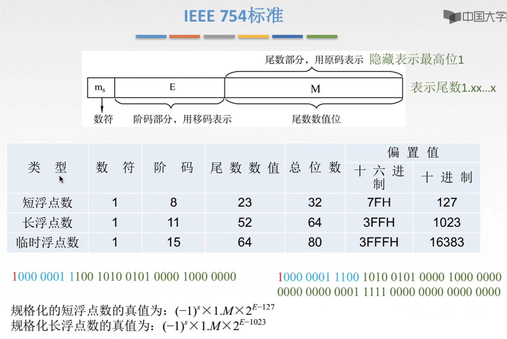
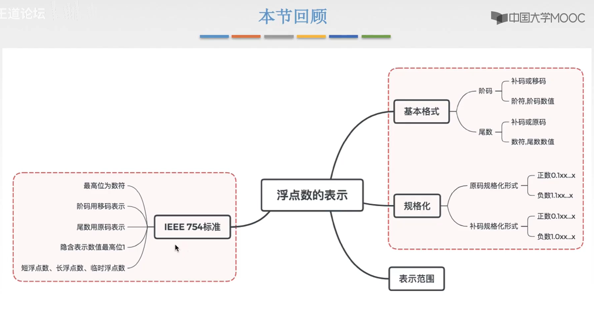

# IEEE 754 标准

图1.IEEE 754标准

数符提到了最前面，后面的尾数其实只有尾数的数值位，而没有也没必要再存一个符号位了。

阶码采用移码存储，注意的是这里的移码为：原码+0111 1111（127），而并未通常的：补码+1111 1111（128）。

尾数采用原码存储，由于原码的规范化，无论如何数值位最高位都是1，所以就不用存储这个1了，隐藏存储，意思就是默认尾数存在着一个最高位为1，实际存储的二进制是在1之后的。

由IEEE 754标准表示的浮点数，又可分为规约形式的浮点数，非规约形式的浮点数，特殊值。

### 规约形式的浮点数

数符 $S$ ，阶码 $j$ ，尾数数值位 $M$ 。

以32位浮点数为例。

当指数部分 $0000\quad0001(1)\leq j\leq0111\quad1111(254)$ 时，且尾数部分实际存储的最高位为1（并不是默认隐藏的1），就叫做**规约形式的浮点数**（看名字意思就是符合IEEE 754规约的浮点数？）。

此时，真值 $=(-1)^s\times r^{j-127}\times 1.M$ 。
因为移码存储，偏移值是+127，所以计算真值时要减回来嘛。

### 特殊值

1. 当指数部分 $j=0000\quad 0000(0)$ ，同时尾数数值位 $M=0$ 时，表示 $\pm 0$ （取决于数符）。
2. 当指数部分 $j=1111\quad 1111(255)$ ，同时尾数数值位 $M=0$ 时，表示 $\pm \infty$ （取决于数符）。
3. 当指数部分 $j=1111\quad 1111(255)$ ，同时尾数数值位 $M\ne0$ 时，表示 $NaN$ （Not a Number），非数。
   比如 $0/0,\infty/\infty,0\times\infty...$ 这种操作就会返回NaN。

### 非规约形式的浮点数

当指数部分 $j=0000\quad0000(0)$ 时，且尾数数值位 $M\ne 0$ 时，为**非规约形式的浮点数**。

此时，真值 $=(-1)^s\times r^{j-126}\times 0.M$ 。
注意当为非规约形式时，减去的是126，而非127；隐藏存储的1也变为了0.

通常当一个数字非常接近0才会用非规约形式来表示。

图2.IEEE 754一些规定与绝对值范围

以单精度浮点数（短浮点数，32位）为例，其规范化浮点数绝对值范围为：

最小值： $j=1,M=0\Rightarrow 2^{1-127}\times 1.0=2^{-126}$ ，
最大值： $j=[0111 1111]_{移}(254),M=\underbrace{111...111}_{23位}\Rightarrow 2^{254-127}\times 1.\underbrace{111...111}_{23位}=2^{127}\times(2^1-2^{-23})$ 。 

其实这里可以看出为什么当为非规约形式数时，是减去126，
因为当为非规约形式时，最大值为 $j=0,M=\underbrace{111...111}_{23位}\Rightarrow 2^{0-126}\times 0.\underbrace{111...111}_{23位}=2^{-126}\times (2^0-2^{23})$ ，其值是与规约形式的最小值非常接近的，只差了 $2^{-23}$ 。

## 本节回顾

图3.本节回顾

2020.09.02

