# 加法器

有了上一节的基础，与、或、非什么的，那么这节就是讲如何用这些来设计一个加法器。

## 一. 半加器

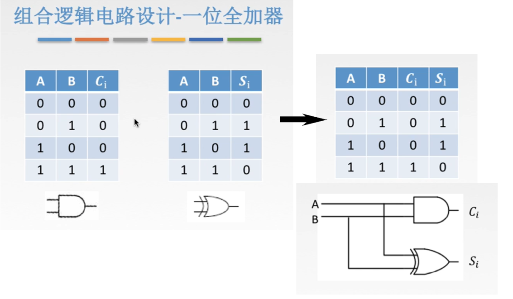

图1.与异或实现一位加法

上一节讲到，二进制加法中共有四种情况， $A+B=\begin{cases}0+0=00\\0+1=01\\1+0=01\\1+1=10\end{cases}$ ，那正好异或的结果和计算后的低位 $S_i$ 相同，与的结果和进位的数 $C_i$ 。

所以，如图1所示，我们使用与和异或来实现一位加法。
输入 $A,B$ ，输出 $S_i,C_i$ 。
电路设计如图1右下所示。

这个叫做**半加器**，能够计算一位加法，可以输出和 $S_i$，进位 $C_i$ ，但不能处理进位 $C_i$ 。

## 二. 全加器

但这只是最简单的情况。
加法运算中，最低位自然是不用考虑进位的影响的，但除了最低位外的每一位除了自身的加法外，还需要加上低位的进位。
于是每一位的加法，输入值应该为 $A_i,B_i,C_{i-1}$ ，即这一位的 $A_i,B_i$ 与低位的进位数 $C_{i-1}$ 。输出值为 $S_i,C_i$ ，即这一位的和 $S_i$ 与这一位的进位 $C_i$ 。

继续设计。

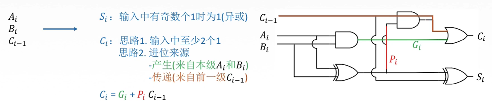

图2.改进一下

和 $S_i$ ，

应该为 $S_i=A_i+B_i+C_{i-1}$ ，发现只要1为奇数个， $S_i$ 就等于1，否则为0。于是只要经过两次异或，就能够得到 $S_i$ ，即 $S_i=(A\bigoplus B)\bigoplus C$ 。

进位 $C_i$ ，

1. 首先 $A_i,B_i$ 如果都是1，那么进位 $C_i=1$ ，于是 $A,B$ 进行与，结果为 $G_i=A\cdot B$ ，叫作进位产生信号，出来的是图2中的绿线。

   当 $A_i=B_i=1(G_i=1)$ 时，那么无论 $C_{i-1}$ 为0/1，进位 $C_i$ 都为1。这就是或的逻辑，于是 $C_{i-1}$ 与 $G_i$ 进行或，得到进位 $C_i$ 。

2. 但是还存在00，01，10的情况。

   使用一次异或，就得到了1的数量，或者说 $A,B$ 的和，记为 $P_i=A\bigoplus B$ ，叫作进位传递信号。
   然后写写逻辑， $\begin{cases}P_i=1,C_{i-1}=1\Rightarrow C_i=1\\P_i=1,C_{i-1}=0\Rightarrow C_i=0\\P_i=0,C_{i-1}=1\Rightarrow C_i=0\\P_i=0,C_{i-1}=0\Rightarrow C_i=0\end{cases}$ ，
   这里就利用与门的"屏蔽"作用：
   如果 $P_i=0$ ，那么输出必为0， $C_{i-1}$ 无法通过与门；
   如果 $P_i=1$ ，那么输出取决于 $C_{i-1}$ ，即 $C_{i-1}$ 通过；
   怪不得说与门的"屏蔽"作用，
   只要 $P_i=1$ ，说明 $A_i,B_i$ 里有一个1，那么进位 $C_{i}$ 就取决于 $C_{i-1}$ 为多少，给人感觉就是通过 $P_i$ 来控制 $C_{i-1}$ 是否传递下去。

最后 $G_i$ 和 $P_i\cdot C_{i-1}$ 通过或门，就得到了 $C_i$ ，即 $\begin{aligned}C_i&=G_i+P_i\cdot C_{i-1}\\&=(A\bigoplus B)+(A_i\bigoplus B_i)\cdot C_{i-1}\end{aligned}$ 。

一位全加器就完成啦。
把这一位全加器封装起来，抽象一下：

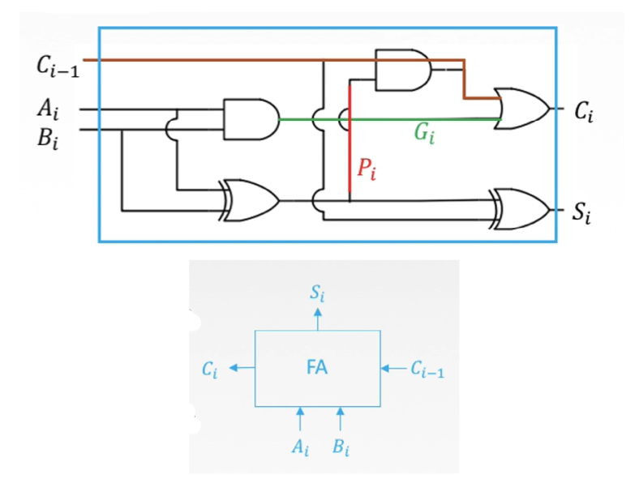

图3.一位全加器

变成图3下面的样子。

输入为 $A_i,B_i,C_{i-1}$ ，输出为 $S_i,C_i$ 。

这个就叫做一位**全加器**，相比半加器，把进位也处理了。

## 三. 串行全加器

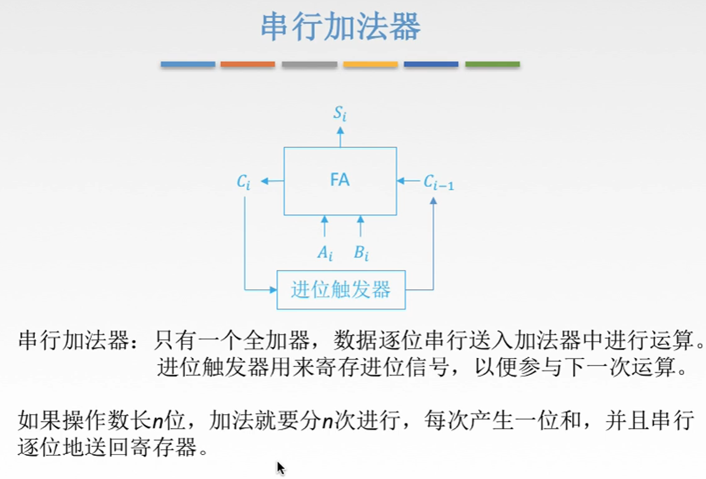

图4.串行加法器

**串行加法器**：

只由一个全加器组成，每次计算一位。

进位触发器，就理解为能够存放1位二进制位的存储单元，计算下一位时，再传进去。

当然，这样也太慢了。
每次一位一位的送来，计算，然后结果也是一位一位的传给寄存器。
如果操作数有n位，那就得进行n次。

## 四. 并行加法器

### 4.1 串行进位的并行加法器

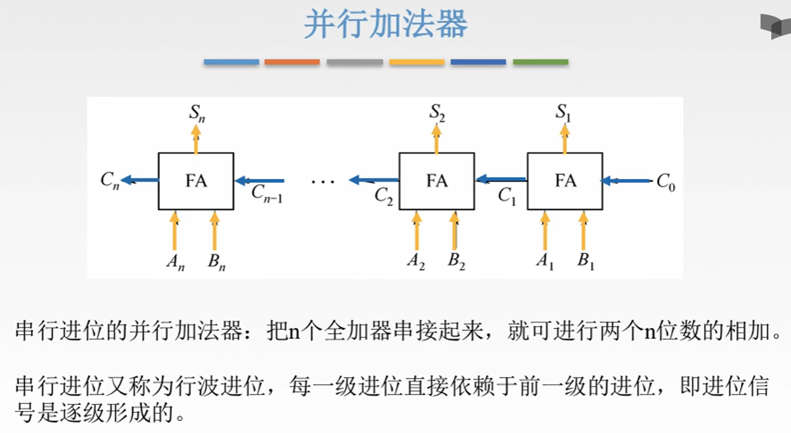

图5.串行进位的并行加法器

**串行进位的并行加法器**：

把n个全加器串联起来，这样两个数的每一位都可以同时输入，每一位都算好了 $A_i\bigoplus B$ 了，
但是，仍然要等待低位的进位 $C_{i-1}$ ，才能计算出 $S_i,C_i$ 。

串行进位又被称为**行波进位**。（难道意思是像一个波从低位传递过去，传到的位就完成了计算？）

当然这个还是很慢。

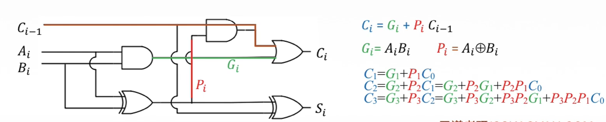

图6.简单分析一下

注意到，$C_{i}=G_i+P_i\cdot C_{i-1}$ ，而 $C_{i-1}$ 可以继续写下去，于是 $C_i$ 最终可以写为只与 $P_i,G_i,C_0$ 有关的表达式。

所以不用一位一位的等待进位传递过来了。

### 4.2 并行进位的并行加法器

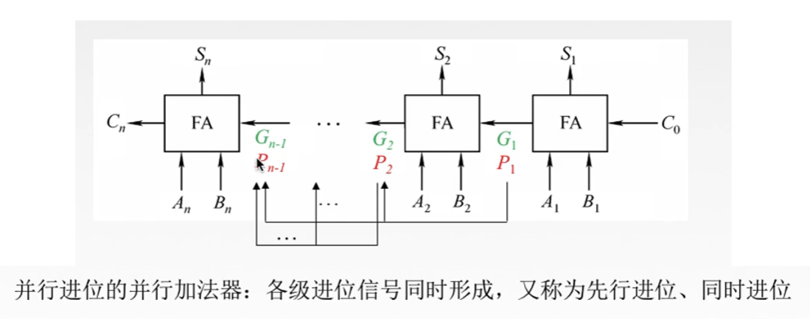

图7.并行进位的并行加法器

每一位并行完成计算出 $P_i,G_i$ ，然后将 $P_i,G_i$ 传给高位的每一位。
这样，每一位都可以并行完成计算，输出结果了。

传递的不再是 $C_{i-1}$ 了，也不用等待一位一位的传递了。

并行进位又称**先行进位**，**同时进位**。

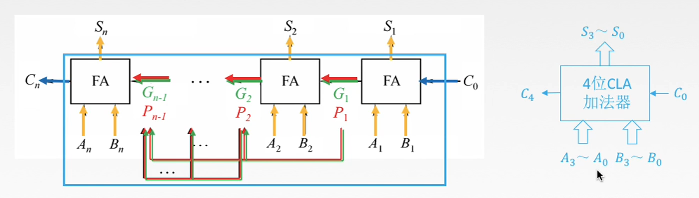

图8.封装起来

把这个封装起来，抽象一下。

就变成了4位CLA加法器（CLA，Carry-Lookahead Adders，超前进位加法器）。

## 五. 组合一下

那么同样的思路，把多个4位CLA给串起来，那就可以处理更多位的数据了。

### 5.1 单级先行进位方式

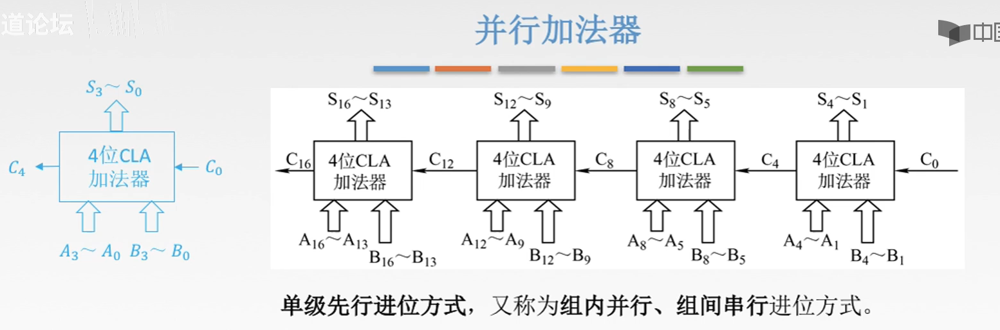

图9.单级先行进位方式

单级先行进位方式，又称**组内并行，组间串行**进位方式。

组内是并行的，但是组件传递的还是 $C_i$ ，每组还是需要等待低位组传递上来进位。

### 5.2 多级先行进位方式

当然同样的思路，也可以想到让组间也是并行啦。

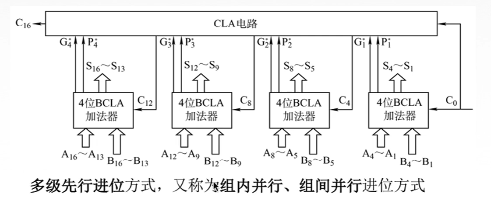

图10.多级先行进位方式

多级先行进位方式，又称**组内并行，组间并行**进位方式。

组内，组间都是并行的，不过这个时候需要专门的电路来实现。

## 六. ALU芯片的组织

根据前面的知识我们知道，有了一块4位ALU芯片，那么怎么扩展它的操作位数呢。

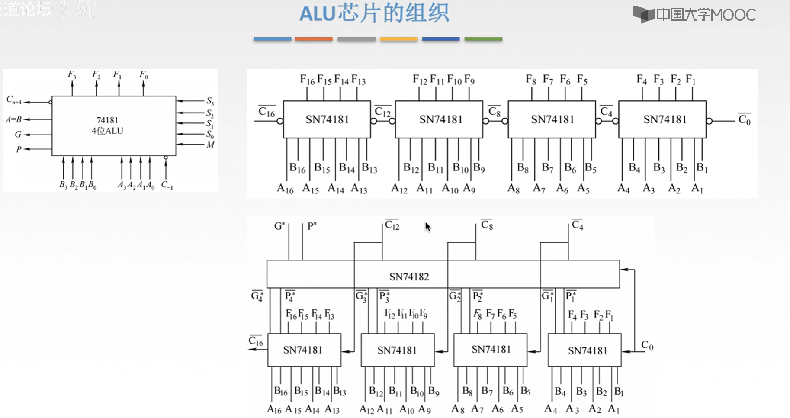

图11.ALU连接方法

第一种，
像图4，串行加法器那样，连接一个暂存的单元，然后每次这个单元把数据又送进去。
这里图11没有画。

第二种，
图11上方这种，把多块4位ALU芯片串起来，也就是单级先行进位的方式。

第三种，
图11下方这种，多块4位ALU，再接上一个把每个单元产生的中间信号组织起来的芯片，完成组内，组间都并行的方式。

## 七. 本节总览

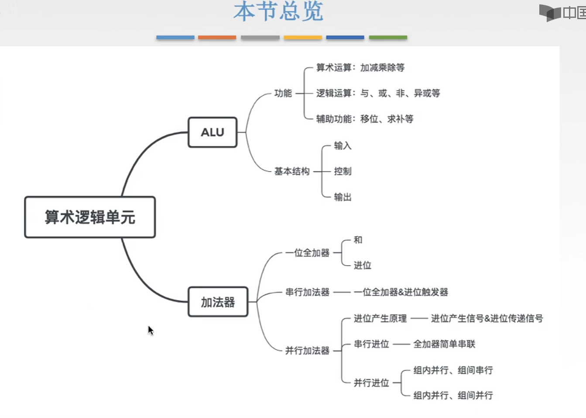

图12.本节总览

2020.09.03