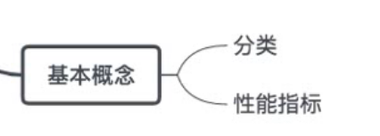
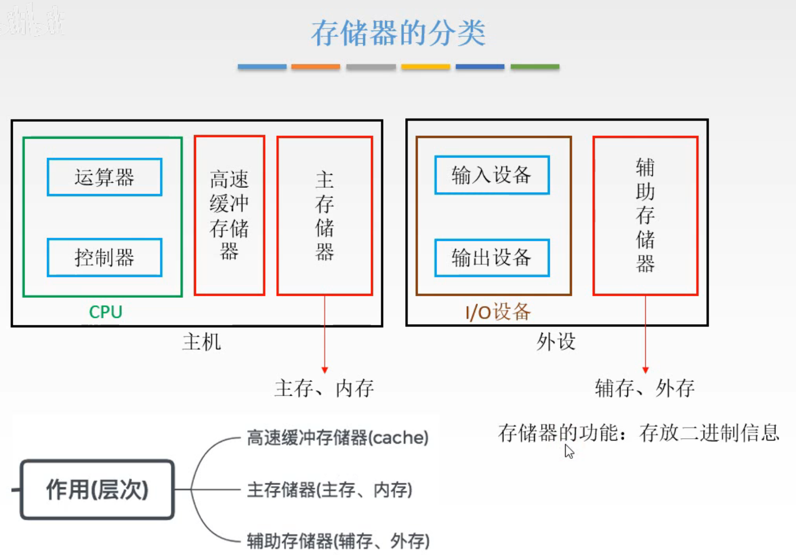
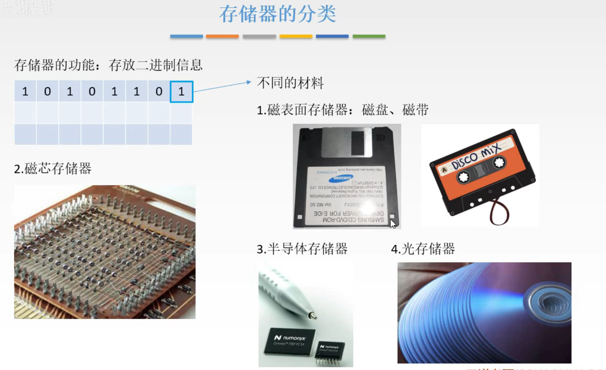
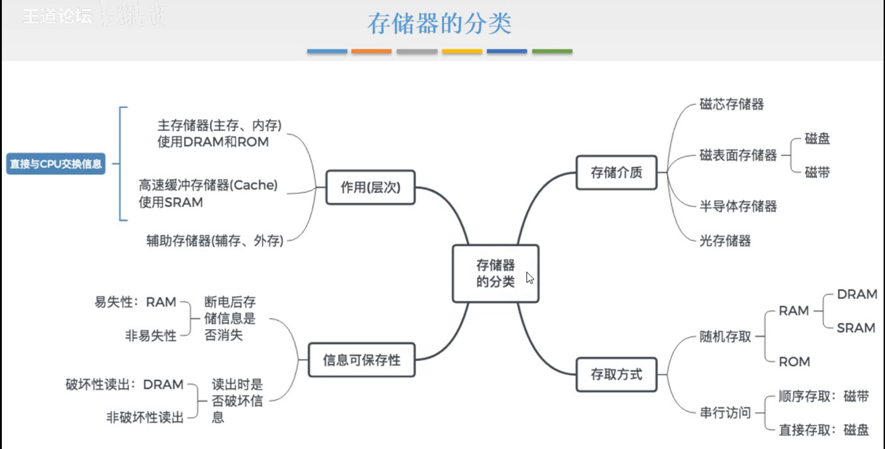
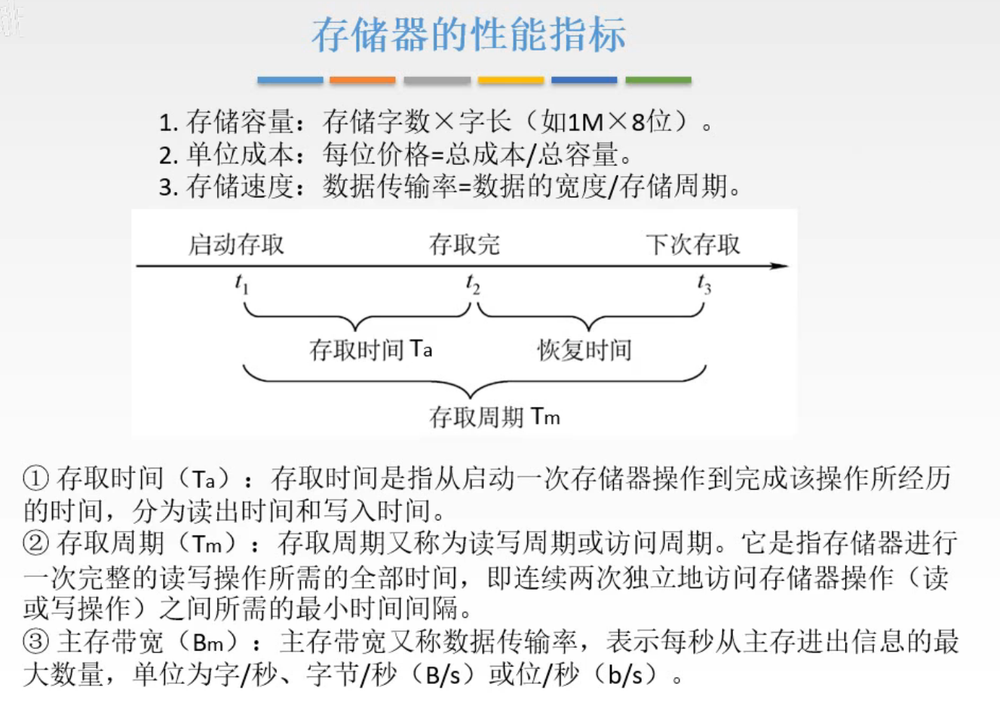
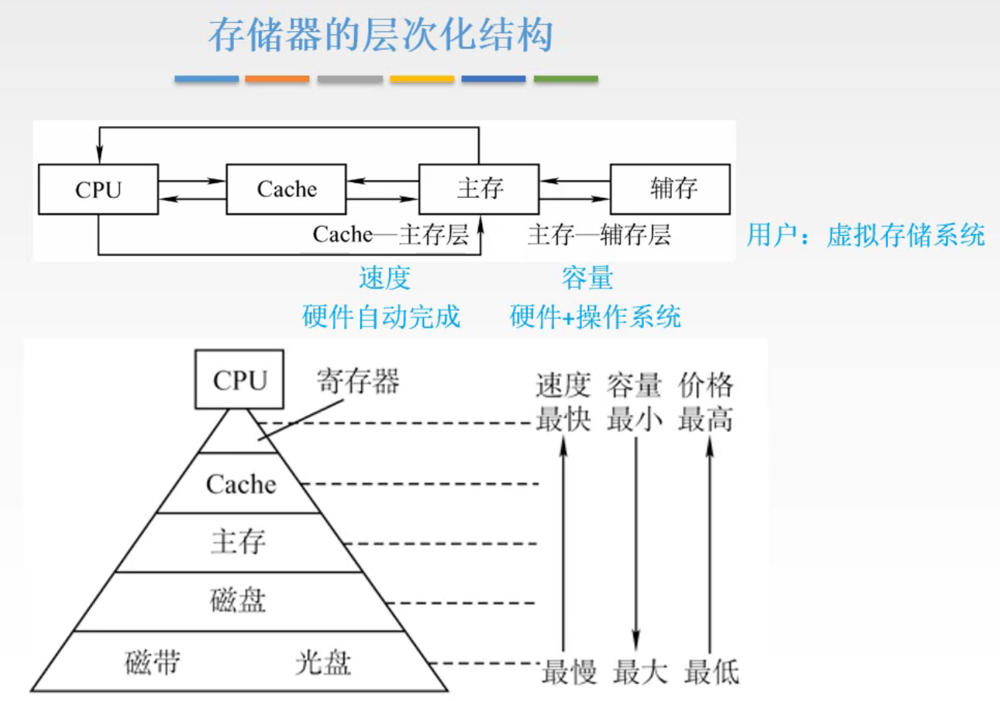

# 基本概念

这一节补充一些存储系统的零碎的概念。

图1.分类与性能指标

也就是之前本章总览里的分类和性能指标。

## 一. 分类

### 1.1 以作用（层次）分类

图2.以作用分类

存储器可分为可与CPU直接交流的主存，可归为外设的辅存。

当然主机中除了主存外，还增加了一个用于系统性能提升的高速缓冲存储器Cache。

So， $以作用(层次)分类\begin{cases}高速缓冲存储器\text{Cache}\\主存储器\\辅助存储器\end{cases}$ 。

当然不管是什么存储器，存储的都是二进制信息。

### 1.2 以材料分类

那么存放二进制信息，用到不同的材料和结构。

以材料来分类：

图3.以材料来分类

分为： $以材料分类\begin{cases}磁表面存储器：磁盘、磁带\\磁芯存储器\\半导体存储器\\光存储器\end{cases}$ 。

### 1.3 以存取方式分类

图4.以存取方式分类

随机存取:存取时间与存储单元位置无关。
顺序存取:存取时间与存储单元位置有关。
直接存取:先定位到一个小区域，再进行顺序存取。

分为： $\text{以存取方式分类}\begin{cases}随机存取:RAM,ROM\\顺序存取:磁带\\直接存取:磁盘\end{cases}$ 。

### 1.4 以信息的可保存性分类

分为： $以信息的可保存性分类\begin{cases}易失性存储器:RAM\\非易失性存储器\end{cases}$ 。

还有个以破坏性读出分类，DRAM的方式是破坏性读出，不是这个方式的就叫非破坏性读出存储器。

### 1.5 合并起来画个图

图5.总结

## 二. 性能指标

图6.存储器的性能指标

主要分为3个：

1. 存储容量：

   一般写成 $存储字数(存储单元个数)\times 字长$ 的形式，反映存储芯片的结构。

2. 单位成本：

   容量本身单位是位嘛，单位成本就是每位要花多少钱呗。

3. 存储速度：

   数据传输率（主存带宽，Bm）=数据的宽度/存取周期。（是除以存取周期，不是存取时间啊，恢复时间也要算进去）

   下面是一些概念：

   存取时间（Ta）：看图6。

   存取周期（Tm）：看图6。

   主存带宽（Bm）：又称数据传输率，表示每秒从主存进出信息的最大数量。
   这里的最大，是指最大，当我们用数据的宽度/存取周期计算出来Bm，那其实是认为存储器是一直在工作的状态，而实际上存储器是可能不会一直在工作的，所以会低于Bm。

## 三. 存储器的层次化结构

图7.存储器的层次化结构

先看图7上方的图。

Cache与主存主要是解决CPU与主存速度不匹配的问题，
由硬件自动完成。

主存和辅存主要是解决存储系统容量不够的问题，
由硬件和操作系统完成。（所以这一层详细还需要到操作系统这门课里去看）
对于用户来说，就形成了虚拟存储系统。

看图7下方的图。

把CPU中的寄存器也考虑为存储系统，那么就是图7下方的图。

离CPU越近，速度越快，容量越小（当然是想容量大啊，但是为了速度么办法），价格越高。

## 四. 本节回顾

图8.本节回顾

2020.09.05