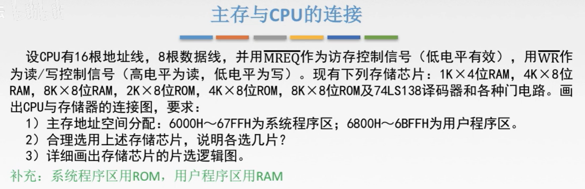
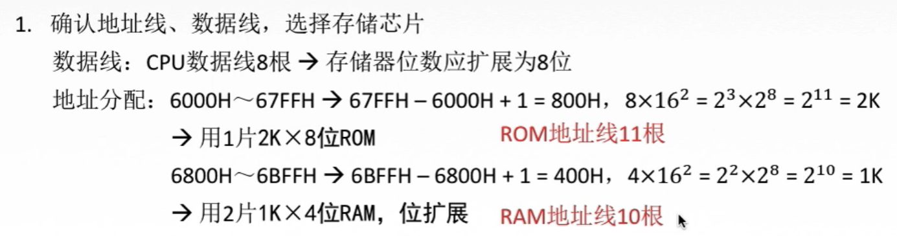
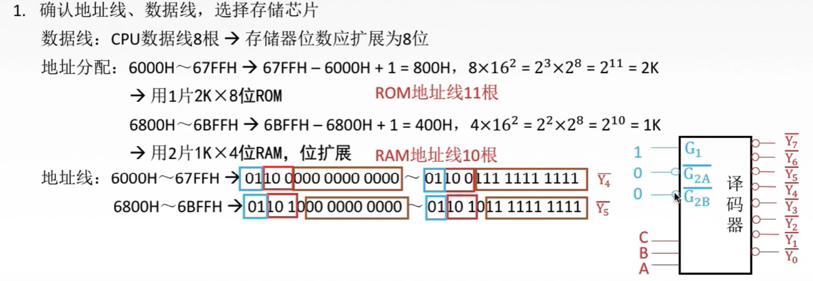
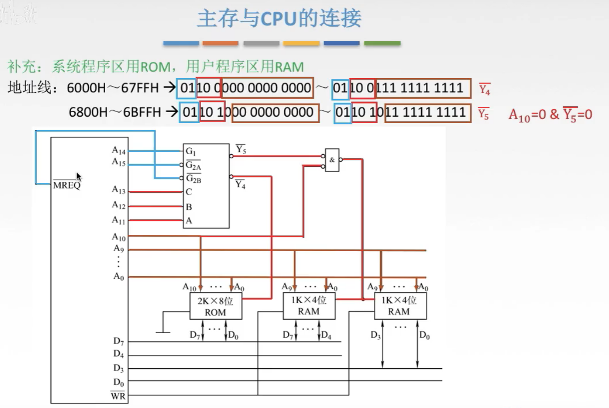
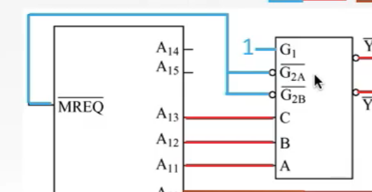
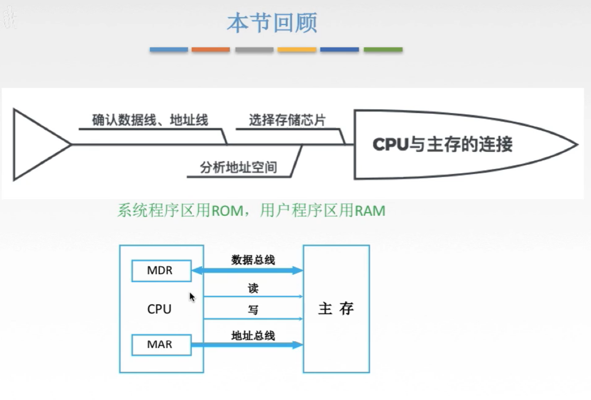

# 主存与CPU的连接例题

## 一. 例题

图1.例题

先读下题：

 $\overline{MREQ}$ ，意思就是低电平有效，作为访存控制信号的意思就是组为译码器的开关，访存控制意思就是决定整个存储器是否工作。 $\overline{MREQ}$ 是在CPU上的接口，接到译码器的使能端上。

 $\overline{WR}$ 作为读/写控制信号，意思用一根线，低电平为写，高电平为读。

存储芯片有RAM和ROM，因为这里我还没学，所以先补充一下：系统程序区用ROM，用户程序区用RAM。

门电路就是与门、或门、非门这些。

开始解题：

图2.

**第一步：确认地址线、数据线、选择存储芯片。**

数据线：
因为CPU的数据线是8根，所以存储器的位应该扩展为8位。

选择存储芯片：
首先看主存地址空间分配：
 $6000\text{H}\sim 67FF\text{H}$ 为系统程序区，用ROM； $6800\text{H}\sim 6BFF\text{H}$ 为用户程序区，用RAM。

计算系统程序区的存储空间大小： $67FFH-6000H+1H=800H=8\times 16^2=2^3\times 2^8=2K$ 。
刚好就有一个 $2K\times 8$ 位的ROM，所以选择用1片 $2K\times 8$ 位ROM。

计算用户程序区的存储空间大小： $6BFFH-6800H+1H=200H=4\times 16^2=2^2\times 2^8=1K$ 。
没有刚好合适的，如果用 $4K\times8$ 位RAM太浪费啦，所以选择用2片 $1K\times 4$ 位RAM进行位扩展来实现。

地址线：
所以ROM地址线为11根；RAM的地址线为10根。

图2.

接下来分析存储器，译码器如何与CPU连接。

首先把地址空间写成以CPU地址线根数（16根）的位数的二进制形式：
ROM： $6000\text{H}\sim 67FF\text{H}$ ：0110 0000 0000 0000~0110 0111 1111 1111 ，
RAM： $6800\text{H}\sim 6BFF\text{H}$ ：0110 1000 0000 0000~0110 1011 1111 1111 。

显然，ROM低位11位表示地址，RAM低位10位表示地址线（图2下方橙色框选部分）
ROM： $6000\text{H}\sim 67FF\text{H}$ ：0110 0[**000 0000 0000**]~0110 0[**111 1111 1111**]，
RAM： $6800\text{H}\sim 6BFF\text{H}$ ：0110 10[**00 0000 0000**]~0110 10[**11 1111 1111**]。

然后是选片的问题，题目给出的是3-8译码器，即从3个二进制位变为8个不同的控制信号。所以要选择3位作为译码器的控制信号。
以低位占用最多的存储器为准，向其高位选3位，作为译码器的控制信号。（图2下方红色框选部分）
ROM： $6000\text{H}\sim 67FF\text{H}$ ：01[**10 0**]000 0000 0000~01[**10 0**]111 1111 1111，
RAM： $6800\text{H}\sim 6BFF\text{H}$ ：01[**10 1**]000 0000 0000~01[**10 1**]011 1111 1111。
所以当译码器的 $CBA$ 为100=4时，通 $\overline{Y_4}$ ， $\overline{Y_4}$ 连通ROM；当译码器的 $CBA$ 为101=5时，通 $\overline{Y_5}$ ， $\overline{Y_5}$ 连通两个RAM；

剩下最高位的两位，发现始终为01（图2下方蓝色框选部分），于是可以用作译码器的使能端，因为使能端刚好需要100。这就有了10，而再用 $\overline{MREQ}$ 连接上一个使能端，就能控制译码器工作了。
注意 $\overline{MREQ}$ 这样有横线，低电平有效的，只能和有小圆圈的相连，也就是同为低电平的相连。在这里就是 $\overline{MREQ}$ 可以连到 $\overline{G_{2A}},\overline{G_{2B}}$ ，但不能连到 $G_1$ 。

图4.画图连线

橙色线：
地址线，RAM只用连接 $A_0\sim A_{9}$ ，ROM则连接 $A_0\sim A_{9}$ 加上 $A_{10}$ 。

红色线：
从CPU的 $A_{11}\sim A_{13}$ 出来，连接到寄存器的 $ABC$ ；
寄存器出来 $\overline{Y_4}$ ，连接到ROM；
寄存器出来 $\overline{Y_5}$ ，不能直接连接到RAM，因为注意到地址的 $A_{10}$ ，在RAM的地址中只有 $A_{10}=0$ 的地址，所以当 $A_{10}=1$ 时不能去访问RAM，所以访问RAM同时被 $\overline{Y_5}$ 和 $A_{10}$ 决定，也就是当  $\overline{Y_5}=0,A_{10}=0$ 时才连通RAM，于是通过将  $\overline{Y_5}$ 和 $A_{10}$ 通过与非电路后在与两个RAM相连。

蓝色线：
CPU的 $A_{14},A_{15}$ 分别与与 $G_1,\overline{G_{2A}}$ 相连，充当使能信号。
然后题目要求使用 $\overline{MREQ}$ 来进行访存控制，于是把 $\overline{MREQ}$ 连上 $\overline{G_{2B}}$ ，因为 $A_{14},A_{15}$ 恒为10，这样就起到了控制作用。

当然，并不一定要到 $A_{14},A_{15}$ ，比如：

图5.蓝色线另一种接线方式

将 $G_1$ 恒接一个1信号，然后把 $\overline{MREQ}$ 接到 $\overline{G_{2A}},\overline{G_{2B}}$  ，这样也行。
实际上其他线也可以改变，比如译码器可以只用一位就可以完成控制，但是这道题只给了3-8译码器，所以只能用3位了。

数据线：
ROM直接连到 $D_0\sim D_7$ 。
RAM一块连到 $D_0\sim D_3$ ，另一块连到 $D_4\sim D_7$ 。

读/写控制线：
RAM直接连接CPU。
ROM的读/写控制线是一个静态的状态， 直接给它一个信号就可以了，比如这里是低电平有效，如图4就直接接地，表示低电平就可以了。

## 二. 本节回顾

图6.本节回顾

图6下方图，自己看上面的做题步骤回忆吧，我懒得写了。

系统程序区用ROM，用户程序区用RAM。

图6下方图的意思是，虽然设计的时候可能会把MDR，MAR这俩寄存器放在CPU里，但MDR，MAR还是属于主存的。

2020.09.05