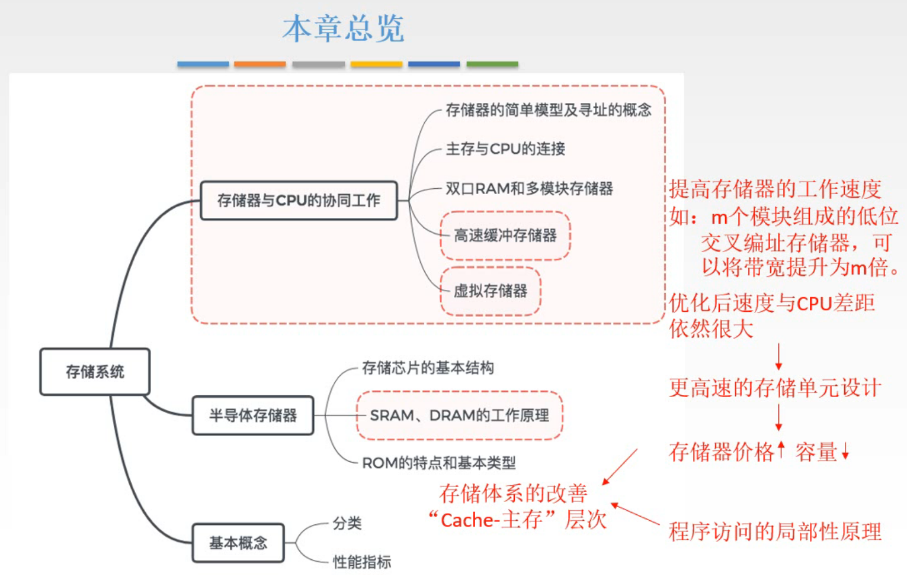
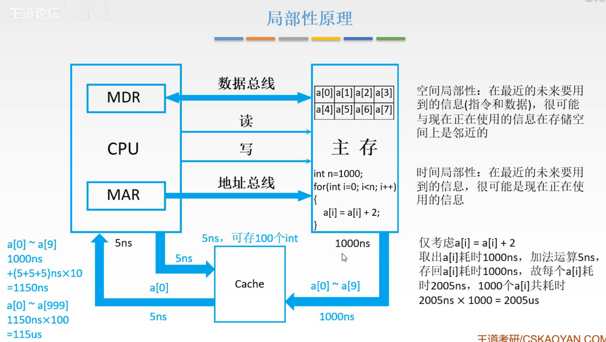
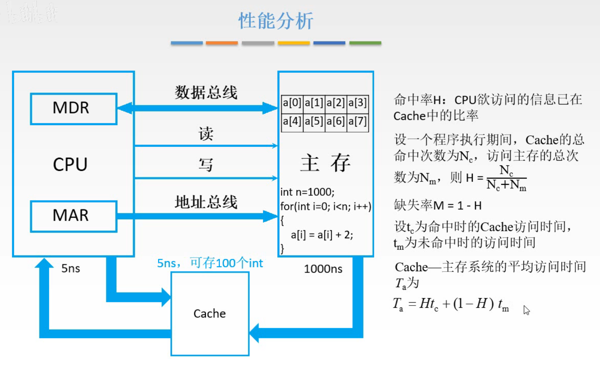
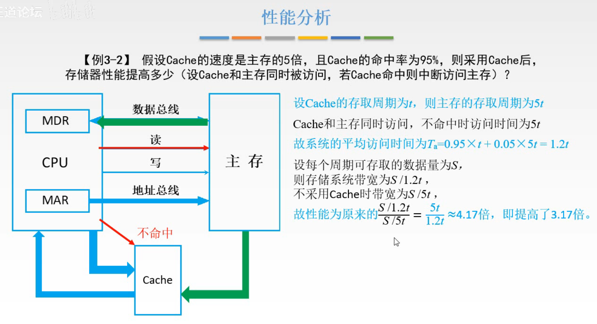
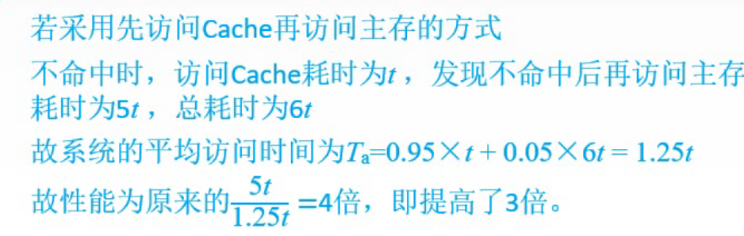
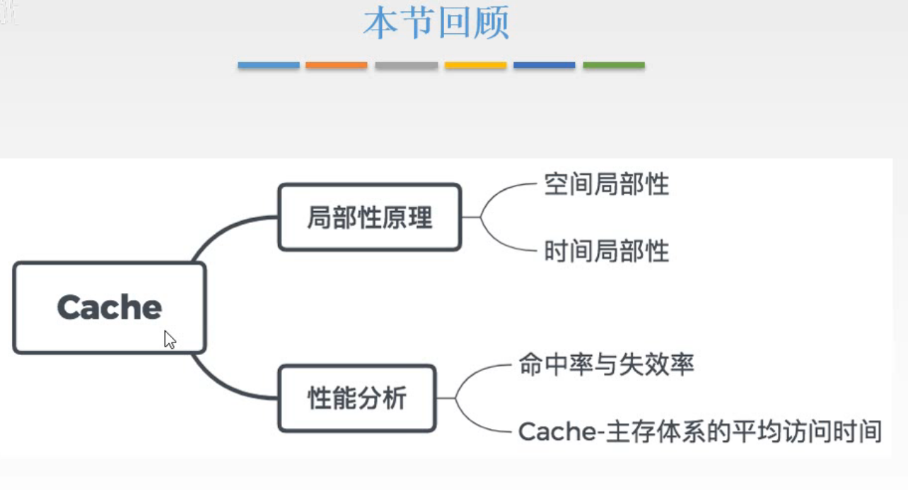

# 局部性原理、性能分析

图1.本章总览

前面讲了，我们建立的存储器的简单模型，并提供了一些对外的接口，基于这些接口，对CPU和主存进行了连接。这样CPU和主存就能相互协同工作了。

但是由于CPU的运行速度比主存快太多，所以想要提高系统的工作效率，就要提高主存的速度。
于是有双口RAM，多模块存储器（单体多位，多体并行：高位交叉编址、低位交叉编址）的方案，来提升存储器的工作速度。

但是速度差距仍然很大。
继续优化存储器，尽量优化电路，采用了更复杂的电路，确实是可以提高存储器运行速度，但同时也会使得存储器价格变高，容量变小。这就难以接受了。

后来发现了程序访问的局部性原理，也就是CPU实际上每次访问的地方只是很小的一块，那么把要访问的数据放到这种优化后贵的，容量小，但速度快的存储器（Cache）里，让CPU去访问它。

于是引入了层次化的设计理念，即使用"Cache-主存"这样的存储体系。

## 一. 局部性原理

图2.局部性原理

CPU和主存进行连续，因为CPU内部的寄存器，电路比较复杂，暂存的位数有限，所以CPU到主存中取数据，通常都是一个一个的取。
比如图2中进行的操作是把1000个数自增2，CPU就是取a[0]，加2，送回主存，然后取a[1]......，

而Cache和主存一块存储器，所以Cache与主存之间的数据交流一次就能进行很多位，以块为单位。
如图2中，可以一次性将主存中的a[0]~a[99]，100个存到Cache中。
而后CPU就可以直接从Cache中读取数据了。

来分析两种方式的用时：

图2中，假设进行的操作为把数组中1000个数自增2，假设主存的存取周期是1000ns，Cache的存取周期是5us，和存100个int；CPU完成加法操作5ns。

1. CPU从主存中取数：
   取a[0]，1000ns；完成加法5ns；存回主存1000ns。
   完成1000次操作共耗时 $(1000+5+1000)ns\times1000=2005us$ 。
2. CPU从Cache中取数。
   从主存取10个数到Cache，1000ns；CPU从Cache中取1个数+完成加法+送回Cache，（5+5+5）ns；CPU完成10个数的加法，150ns；
   完成100次操作共耗时 $(1000+150)ns\times100=115us$ 。快了一个数量级。
   （为什么没有算Cache存回主存的时间，因为可以通过一些方法，比如CPU一边再算，Cache一边把Cache中算好的结果存回去。反正只是想让你知道第二个方法快，这里的过程就不要细究啦。）

当然能有这么快的提升来源于局部性原理。

**局部性原理**包括**时间局部性**和**空间局部性**：

1. 空间局部性：

   在最近的未来要用到的信息（指令和数据），很可能与现在正在使用的信息在存储空间上是邻近的。

   比如指令通常是顺序存放，顺序执行的；数据一般也是以向量，数组等形式存储在一起。

2. 时间局部性：

   在最近的未来要用到的信息，很可能是现在正在使用的信息。

   比如程序中存在循环，对一组数据循环进行操作。

## 二. 性能分析

可以发现有可能要访问的数据不在Cache中，那么此时读取数据就需要讲要读取的数据所在的一整块调入Cache中，再调入CPU，用时就变为了主存+Cache的用时。

图3.命中率，平均访问时间

用**命中率** $H$ 来衡量Cache的效率，命中率是指CPU要访问的信息已在Cache内的比率。

设一个程序执行期间，Cache的总命中次数为 $N_c$ ，访问主存的次数为 $N_m$ ，则：
$$
H=\frac{N_c}{N_c+N_m}
$$
与之相对的概念，缺失率 $M=1-H$ 。

设 $t_c$ 为命中时的Cache访问时间， $t_m$ 为未命中时的访问时间，

注意这里 $t_m$ 为未命中时的访问时间，而未命中时有两种读取方式，一种是主存-Cache-CPU，用时为主存+Cache的耗时；另一种是主存同时给CPU和Cache发送数据，用时为主存的耗时，这种方式可能下一次命中（具体看题目是什么方式，如下面例题）。

则，Cache-主存系统，的**平均访问时间** $T_a$ 为：
$$
T_a=Ht_c+(1-H)t_m
$$
系统的**访问效率** $\begin{aligned}e=\frac{t_c}{T_a}\times100\%\end{aligned}$ ，意思就是，访问 Cahce 的时间与平均时间之比。

当 Cache 全未命中时，$e=0\%$ 。
当 Cache 全命中时，$e=100\%$ 。

也就是，Cache 命中的越多，则 $T_a$ 越小，越接近 $t_c$ ， $e$ 越接近 $1$ 。
Cache 命中的越少，则 $T_a$ 越大，$e$ 越接近 $0$ 。

## 三. 例题

图4.例题

读题：

题目中的括号内中的方式是指，CPU同时访问Cache和主存，如果命中，用时为Cache耗时；如果不命中，用时为主存耗时。

解题：

设Cache的存取周期为t，则主存的存取周期为5t；
推出，系统的平均访问时间 $T_a=0.95t+0.05\times 5t=1.2t$ ；
所以性能为原本的 $\frac{5t}{1.2t}\approx 4.17$ 倍，即提高了 $3.17$ 倍。

解答完毕。

图4里写了一堆，只写蓝色的部分就行了，不用写那么多。

图5.换一种访存方式的解题

来讨论一下按照之前的方式，也就是CPU先访问Cache，未命中再访问主存。

看图5吧，也就是未命中的用时变为了 $t+5t=6t$ 。

再提一下系统的**访问效率**，刚才的解题为 $e=\frac{t}{1.2t}\times 100\%=83.3\%$ ，现在这个方式是 $e=\frac{t}{1.25t}\times 100\%=80\%$ 。

## 四. 本节回顾

图6.本节回顾

2020.09.06