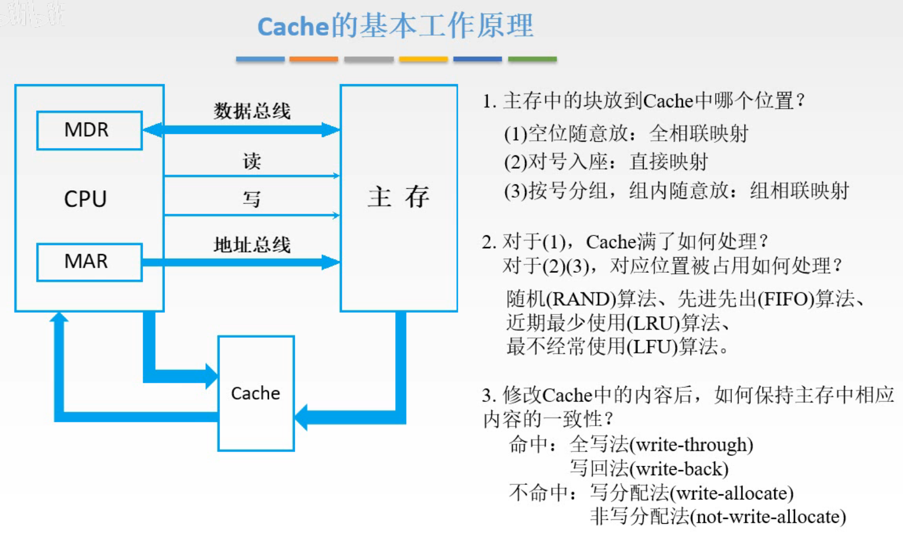
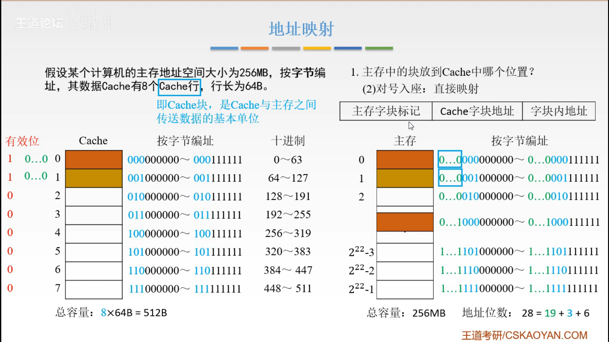
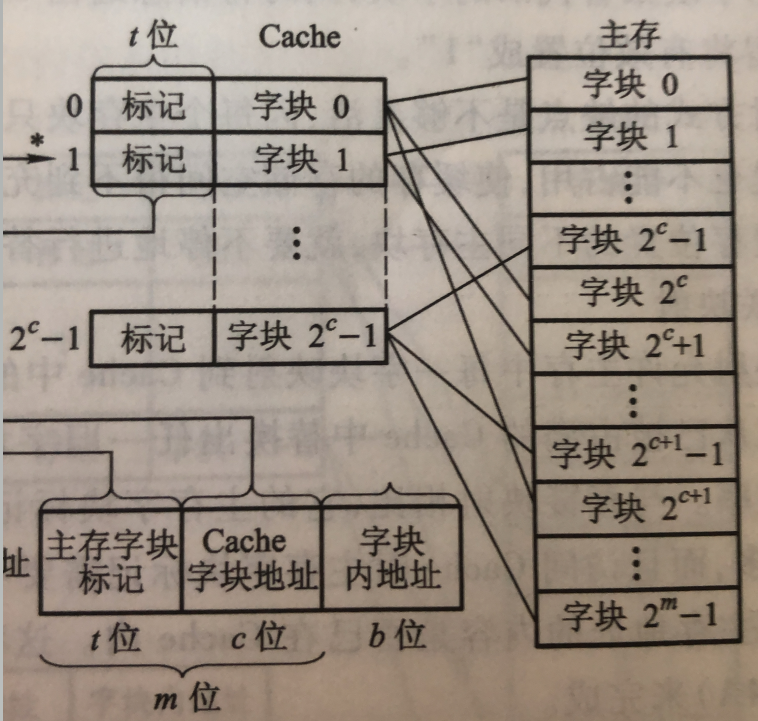
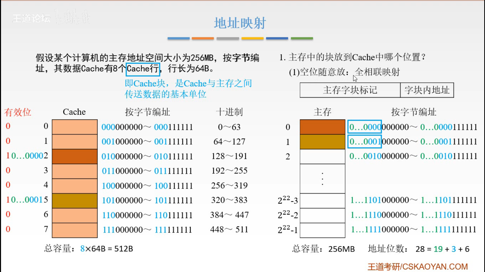
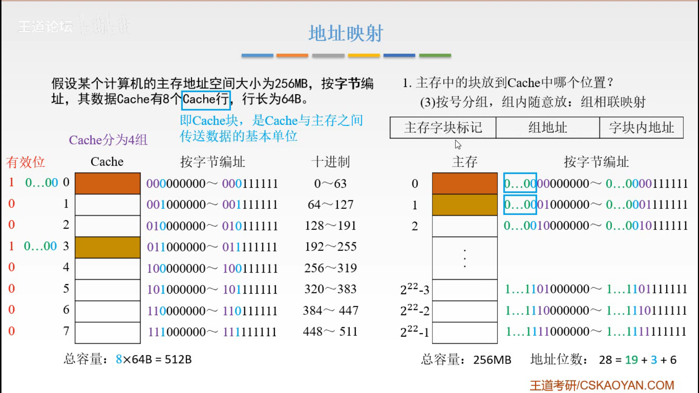
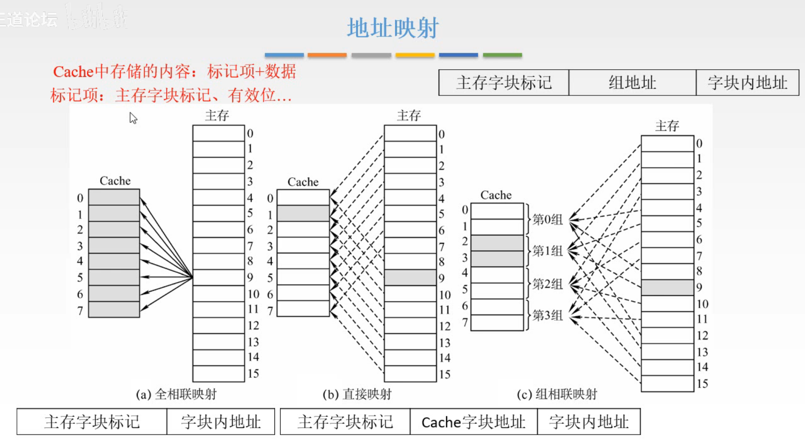
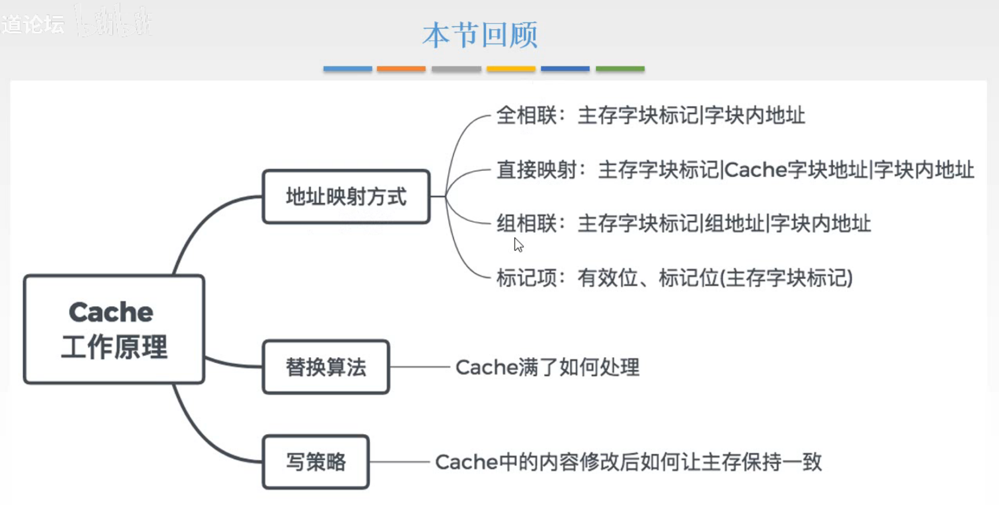

# 地址映射方式

上一节说到，引入了Cache，讲了性能提升指标。这一节讲，这样的体系如何进行协同的工作。

图1.三个方面的问题

大致有三个方面的问题

第一个问题：

显然 Cache 的空间比主存小很多，所以从主存中读取的字块，应该放在 Cache 中的什么位置呢，采用什么样的映射方式。

第二个问题：

对全相联映射，如果Cache满了，会如何处理。
对直接映射和组相联映射，对应的缓存块或组被占用，如何处理。

第三个问题：

Cache中的内容本身是主存中读取的副本，那么当修改了Cache中的内容后，如何保证主存中的内容一致，先立即传回主存，还是等待数据位置要被其他数据使用时再写回主存。如果未命中时，直接修改了主存的数据，是否还要将主存的数据传输到Cache中。

这一节解决第一个问题。

## 一. 地址映射方式

Cache和主存的传输是一次传输很多字，也就是一个字块，所以下面都多以字块为基本单位来说明。

### 1.1 直接映射。

首先能想到的最简单的方式，将主存中的字块（主存块）与Cache中的字块（缓存块）建立映射关系，因为主存块多于缓存块，所以一个缓冲块会对应多个主存块的映射关系。

图2.直接映射

现在分析图2

首先解释一下假设，Cache中有8个Cache行，行长为64B，Cache行也就是Cache块（缓存块），即Cache和主存之间传输数据的基本单位，一个字块。行长就是缓存块的长度，这里就是64字节。

可以想到，Cache块的长度为64B，于是可以使用6位二进制000000，用于Cache块内的排序（用于区别Cache块内不同字节），为**字块内地址**。
有8组，至少需要使用最高3位对8块Cache块进行编址，为**Cache字块地址**，以区别不同Cache块。

直接映射，可以想到，主存的第0块存入Cache的第0块，主存的第1块存入Cache的第1块......主存的第7块存入Cache的第7块，然后到第8块时，又从Cache的第0块开始......以此循环。
对应关系为，存入Cache块号=主存块编号 mod Cache块数量。

图3.直接映射示意，c为缓存块数

当然存入时，不仅需要将主存块的数据存入缓存块，因为直接映射，Cache块与主存块是一对多的关系，如果Cache只存主存块的数据的话，CPU从一块Cache块中读取数据无法知道自己读取的是该Cache块对应的主存中的那块（因为一对多嘛），而且从Cache传数据回主存，也不知道应该传给哪个主存块。

所以还要存其主存地址，当然我们并不需要将字块的首字节地址都存下来，按直接映射的方式，对应同一Cache块的主存块的地址的最低9位都是相同的，并不需要存，所以只需要存入对应主存块的高位（图2为高位的19位）就行了，存入的高位为**主存字块标记**。

这样将**主存地址**分为了三截：**主存字块标记，缓存字块地址，字块内地址。**
当Cache接收到CPU送来的主存地址后，

1. 根据Cache字块地址找到对应的Cache块，
2. 根据主存字块标记与Cache快的存储的标记是否相同进行判断，
   如果不同，或有效位为0，则未命中；从主存中读入新字块替代旧字块，同时将信息送往CPU；并修改主存字块标记；如果有效位原本未0，修改为1。
3. 如果相同且有效位为1，则可以根据字块内地址，找到Cache块中对应的字节，取出。

当然，因为多对一的关系，同一个Cache块被多个主存块对应，那么如何判定主存块存入Cache块时，这块Cache块没有被另一个主存块占用呢。
所以在前面还需要添加一位**有效位**，来说明该Cache块的占用情况，1为占用中，0为未占用。

所以直接映射，除了存储主存块的数据，还要存储 $1+19$ 位。

直接映射这种方式每个主存块只能够放置在对应的缓存块中，而不能放置在其他地方。
显然不太灵活，如果CPU刚好要多次访问主存中对应同一Cache块的主存块，就会导致只能在这个Cache块进行多次替换数据，而明明其他缓冲块是闲置状态却无法利用。

### 1.2 全相联映射

全相联映射：主存块可以映射到Cache中任何一块缓冲块上。

这样当某Cache块被占用时，就可以使用其余的空闲的Cache块了。

图4.全相联映射

全相联映射，没有限制固定的映射关系。

所以自然也是要通过一位有效位来判断要存入的Cache块是否被占用，才能存入。

同样的，没有固定的映射关系，和直接映射一样，一块Cache块仍然对应多个主存块，所以需要存储存入Cache块的主存块的地址，来知道Cache块对应的是哪一块主存块的数据。
当然也不用存完主存块地址的所有位，因为可以存入同一Cache块的主存块的地址的低6位都是相同的（也就是字块内地址都是相同的顺序），所以只需要存入高位（22位），为主存字块标记。

于是全相联映射，除了存入主存块内的数据外，还需要存储 $1+22$ 位。

这样将**主存地址**分为了两截：**主存字块标记，字块内地址。**
当Cache接收到CPU送来的主存地址后，

1. 根据主存字块标记，与每一块Cache块的存储的标记进行对比是否相同进行判断，

2. 如果找到了主存字块标记相同且有效位为1（命中），则可以根据字块内地址，找到Cache块中对应的字节，取出。

### 1.3 组相联映射

组相联映射：是对直接映射与全相联映射的折中结合。

原本直接映射虽然只需要直接对比一个Cache块的主存地址标记，但是对Cache块的利用率低，
全相联映射对Cache块利用高了，但是存储的主存地址标记位数变多了，而且需要和所有的Cache块对比才能知道是否命中。

于是两者结合一下，把Cache中的Cache块分组，分为Q组，每组R个Cache块。对组来说，是直接映射，主存块对应着固定的Cache块组；而主存块在存入组中时，是对组中R个Cache块都可以存入的，为全相联映射。

对应关系为，存入Cache块组号=主存块编号 mod 组数。

图5.组相联映射

如图5，将Cache块分为4组，每组两个。

4组只需要两位二进制位就可以表示，所以使用Cache**最高两位**作为组号，**组地址**。

而主存则采用主存地址中，直接映射中的Cache字块地址的**低两位**（图中紫色两位），作为Cache组号对应的两位二进制位。

比如我要将主存中1存入Cache，根据组号01，应该存入Cache的01组中，即第2或3块Cache；然后到底是存入2还是3，就随意，找个空闲的存入就好了。

同样的，Cache还是一对多的关系（虽然对应的少了点但还是一对多），所以仍然要存主存地址的组号前的高位。
当然也有有效位。

于是组相联映射，除了存入主存块内的数据外，还需要存储 $1+20(28-6-2)$ 位。

这样将**主存地址**分为了两截：**主存字块标记，组地址，字块内地址。**
当Cache接收到CPU送来的主存地址后，

1. 根据组地址，找到对应的组，

2. 根据主存字块标记，与组中每一块Cache块的存储的标记进行对比是否相同进行判断，

   组相联映射，就只需要对比组中的每一块啦。

3. 如果找到了主存字块标记相同且有效位为1（命中），则可以根据字块内地址，找到Cache块中对应的字节，取出。

这个过程图5中Cache的蓝色二进制位就没有用到。
如果分为8组，就用到了，毕竟8组需要3位二进制位表示，其实分为8组就是直接映射。
如果分为1组，就是全相连映射。

**二路组相联**：一个组中有两个Cache块。

一个组中有几个Cache块，就是几路组相联。

### 1.4 三种地址映射方式图

图6.三种地址映射方式

Cache中存储的内容为：标记+数据。

标记里有：有效位、主存字块标记、...，这里在后面解决开头写的后面两个问题时，还会在标记中上加一点东西。（学回来啦，标记中还可能会有一位脏位）

## 二. 本节回顾

图7.本节回顾

2020.09.07