# 替换算法、写策略

本节解决：

1. 当 Cache 存满了之后，如何处理，比如我要往Cache中存入一个字块，那么此时应该将Cache中哪个字块传回主存，替换为新的字块呢。
2. Cache 中的内容修改后，如何让主存保持一致。

## 一. 替换算法

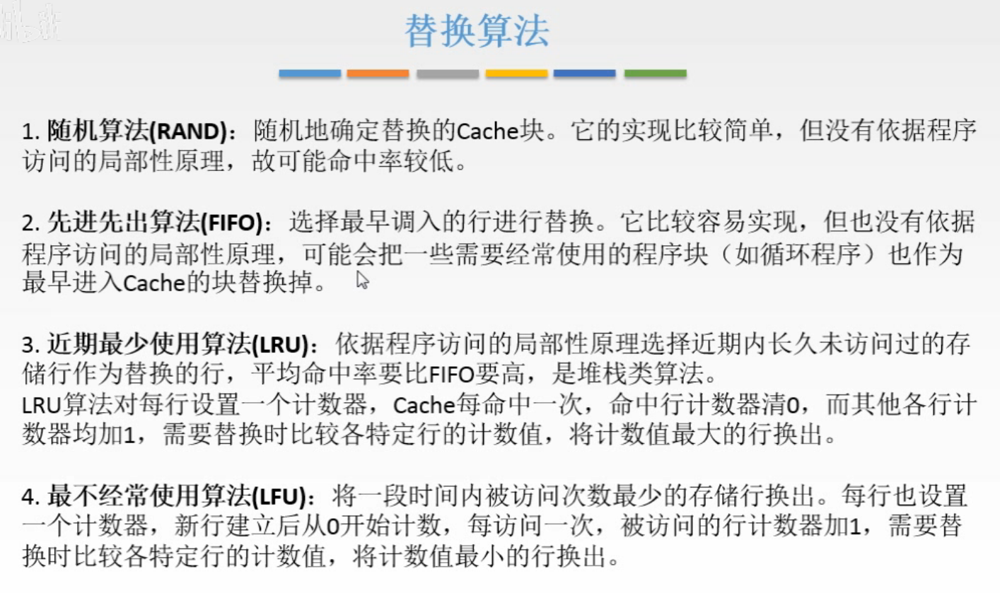

图1.替换算法

替换算法：

1. 随机算法（RAND，Random）

   随机的选择一个Cache块进行替换。

   考试的时候一般不用，了解知道就行。

2. 先进先出算法（FIFO，First-In-First-Out）

   选择最早调入Cache的字块替换掉。

   但是没有根据访存的局部性原理来设计，最早调入的信息可能不久还要用到，比如循环程序。

   需要掌握，能够手动操作。

3. 近期最少使用算法（Least Recently Used）

   选择近期使用得最少的Cache块进行替换。

   比较好的利用了**访存局部性原理**，平均命中率比FIFO的高。

   对每行设置一个计数器，Cache每命中一次，对命中行的计数器清0，其他行计数器+1，选择替换时，对比各行计数器，选择最大数的行进行替换。

   计数器的值表示该 Cache 块距离上一次 CPU 访问它的时间。

4. 最不经常使用算法（Least Frequently Used）

   选择一段时间内被访问次数最少的Cache块进行替换。

   每行设置一个计数器，每次是新行（被替换后）计数器清0，每行被访问一次，计数器+1，选择替换时，对比计数器，选择最小数的行进行替换。
   
   计数器的值表示该 Cache 块被访问的次数。

计算机组成原理里主要是学习FIFO和LRU。

以题目来解释：

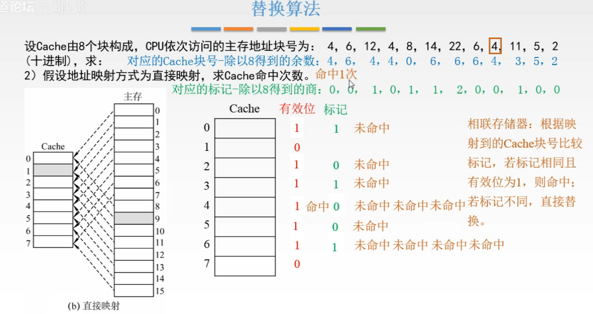

图2.直接映射

**直接映射**方式：

因为直接映射的映射关系是固定的，所以不存在使用什么替换算法。

刚开始有效位都为0；
4   mod 8 = 4，未命中，调入Cache，有效位修改为1；
6   mod 8 = 6，未命中，调入Cache，有效位修改为1；
12 mod 8 = 4，对比12地址中和当前Cache块4的标记，不同，未命中，进行替换；
（主存12和主存4的内容当然不一样啦，这里对比标记是计算机进行的操作，人嘛一眼就看出现在要访问是主存块12，而Cache块里是主存块4的内容，肯定未命中啦。）
4   mod 8 = 4，对比4地址中和当前Cache块4的标记，不同，未命中，进行替换；
8   mod 8 = 0，未命中，调入Cache，有效位修改为1；
14 mod 8 = 6，对比14地址中和当前Cache块6标记，不同，未命中，进行替换；
22 mod 8 = 6，对比22地址中和当前Cache块6的标记，不同，未命中，进行替换；
6   mod 8 = 6，对比6地址中和当前Cache块6的标记，不同，未命中，进行替换；
4   mod 8 = 4，对比4地址中和当前Cache块4的标记，相同，**命中**；
11 mod 8 = 3，未命中，调入Cache，有效位修改为1；
5   mod 8 = 5，未命中，调入Cache，有效位修改为1；
2   mod 8 = 2，未命中，调入Cache，有效位修改为1；

所以Cache命中次数为1次。

**相联存储器**：与对应的Cache块号进行标记的比较，若标记与当前将要访问的地址标记相同，且有效位为1，则命中。

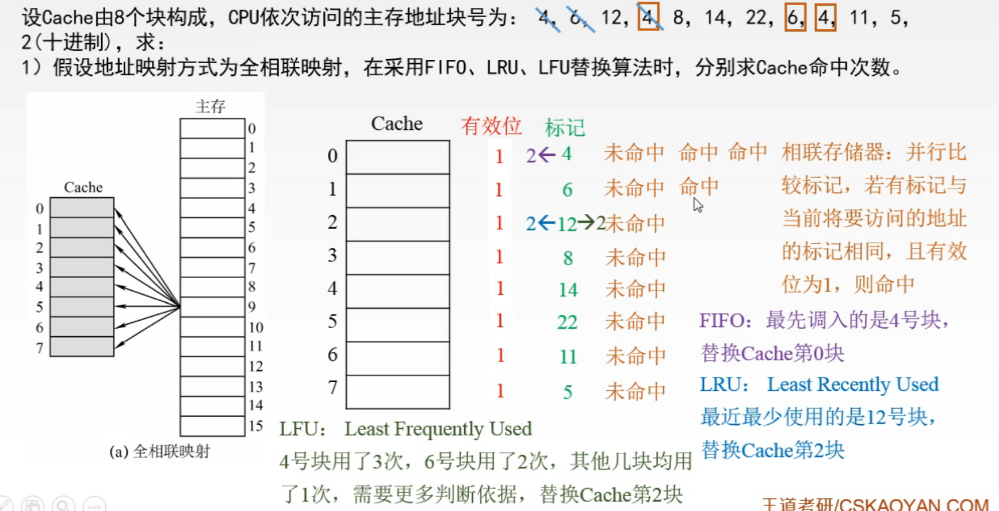

图3.全相联映射

**全相联映射**方式：

采用全相联映射时，就需要考虑当使用不同的替换算法时，进行的操作是不同的。

刚开始有效位都为0；
4，未命中，调入Cache块0，有效位修改为1；
6，未命中，调入Cache块1，有效位修改为1；
12，未命中，调入Cache块2，有效位修改为1；
4，命中；
8，未命中，调入Cache块3，有效位修改为1；
14，未命中，调入Cache块4，有效位修改为1；
22，未命中，调入Cache块5，有效位修改为1；
6，命中；
4，命中；
11，未命中，调入Cache块6，有效位修改为1；
5，未命中，调入Cache块7，有效位修改为1；
2，未命中，此时Cache存满了，

1. 按照FIFO算法，应该替换Cache块4；

2. 按照LRU算法，应该替换Cache块2；

   如何看出最近最少使用，把访问主存块号从尾到头的顺序看：
   4，6，12，4，8，14，22，6，4，11，5，2。
   把前面重复出现的划掉：
   ~~4~~，~~6~~，12，~~4~~，8，14，22，6，4，11，5，2。
   于是12就是最近最少使用的。于是替换Cache块2。

3. 按照LFU算法，应该替换Cache块2；

   可知Cache块4使用了3次，Cache块6使用了2次，其他Cache块都只使用了1次，所以还是没法判断应该替换哪块，这里的内容是在<操作系统>中，判断出来应该替换12，即Cache块2。

所以Cache命中3次。

**相联存储器**：对所有Cache块**并行**的比较标记，若有标记与当前将要访问的地址标记相同，且有效位为1，则命中。

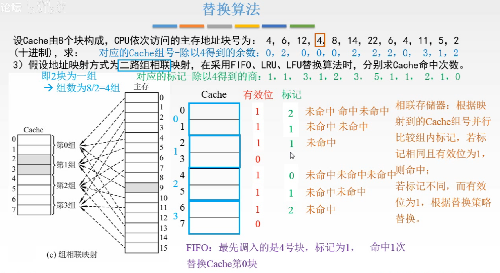

组相联映射

**组相联映射**方式：

同样需要考虑当使用不同的替换算法时，进行的操作是不同的。

题目为，假设地址映射方式为二路组相联映射，就是指多少个Cache块一组。

由于还是采用刚才的方法来分析，写着有点麻烦，所以我们通常采用表格的方式来分析组相联映射。

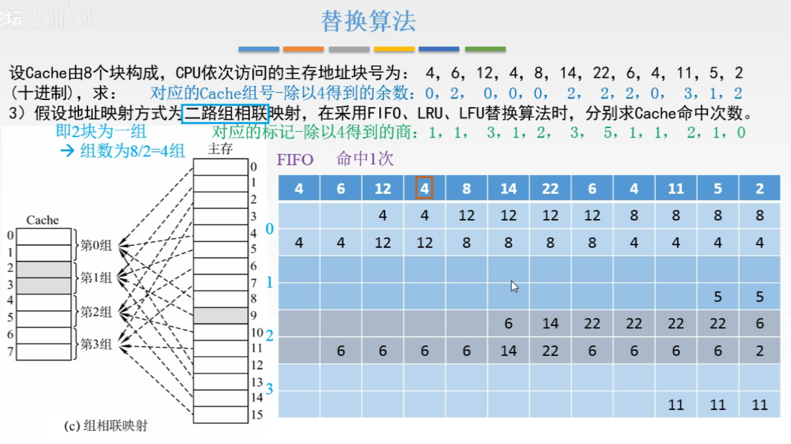

图5.组相联映射，表格分析，FIFO

画一个表格，从左往右X轴表示时刻，上面横排表示当前要存入Cache的主存块；Y轴表示Cache块，分组；

分析FIFO算法：
第1列，4，未命中，4mod4=0，调入第0组，因为分析的是FIFO算法，所以放在第0组的下面；
第2列，6，未命中，6mod4=2，调入第2组，同样的理由，新存入的放在下面；
第3列，12，未命中，12mod4=0，调入第0组，将4顶上去，12放在下面；
第4列，4，命中；
第5列，8，未命中，8mod4=0，调入第0组，因为是FIFO算法，所以应该替换4，刚好最上面就是最先存入的，于是把8放在最下面，顶上去，变为12，8，就把4替换掉了；
第6列，14，未命中，14mod4=2，调入第2组，将6顶上去，14放在下面；
第7列，22，未命中，22mod4=2，调入第2组，同样的，因为是FIFO算法，所以将22放在最下面，最顶上最先存入的6就被替换了；
第8列，6，未命中，6mod4=2，调入第2组，将组中最顶上最先存入的14替换掉，6放在最下面。
第9列，4，未命中，4mod4=0，调入第0组，12，8变为8，4；
第10列，11，未命中，11mod3，调入第3组，最下面；
第11列，5，未命中，5mod4=1，调入第1组，最下面；
第12列，2，未命中，2mod4=2，调入第2组，将组中最顶上最先存入的22替换掉，2放在最下面。

所以FIFO算法，Cache命中1次。

**相联存储器**：与对应的Cache块组中的所有Cache块并行的比较标记，若组中有标记与当前将要访问的地址标记相同，且有效位为1，则命中。

其实感觉就是数据结构中的堆栈（可惜我数据结构还没学= =）

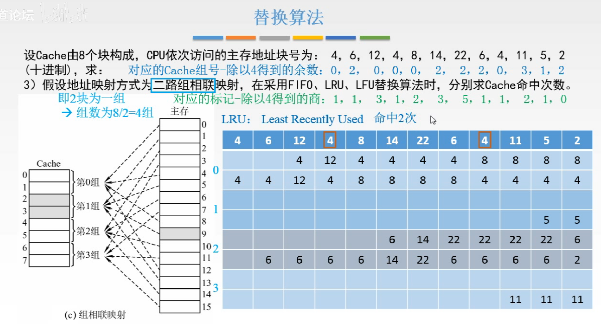

图6.组相联映射，表格分析，LRU

分析LRU算法：
第1列，4，未命中，4mod4=0，调入第0组，还是最下面；
第2列，6，未命中，6mod4=2，调入第2组，还是最下面；
第3列，12，未命中，12mod4=0，调入第0组，放在最下面，最下面就表示最近使用的Cache块；
第4列，4，命中，因为是LRU算法，所以现在最近使用到了4，所以把4放在最下面，顶上去，变为12，4；
第5列，8，未命中，8mod4=0，调入第0组，最上面的4就是最近最少使用的Cache块，所以把8放在最下面，4被顶出去；
......下面就懒得写啦。

所以LRU算法，Cache命中2次。

至于LFU算法，涉及到操作系统的知识，这里就不说了，学操作系统的时候看。

## 二. 写策略

这里是解决Cache与主存保持一致的问题。

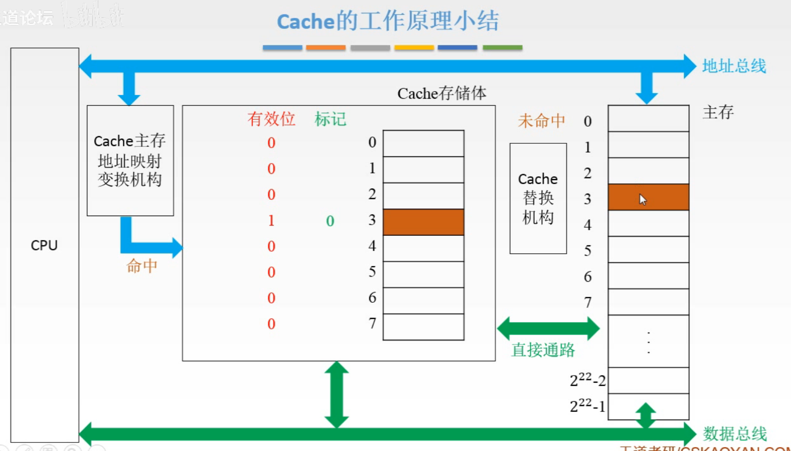

图7.详细点的CPU-Cache-主存结构

总线，意思就是共用的。

先回顾一下工作流程：

CPU给出地址，这个地址同时给主存和Cache，

给Cache，地址经过Cache主存地址映射变换机构，如果命中，Cache把数据通过数据总线传给CPU；

给主存，如果未命中，在Cache替换机构的控制下，主存和Cache通过一个直接通路进行数据交换，然后由Cache传给CPU；当然也可以进行替换的同时，将数据从主存传给CPU。

### 2.1 当Cache命中时

#### 2.1.1 写回法（write-back）

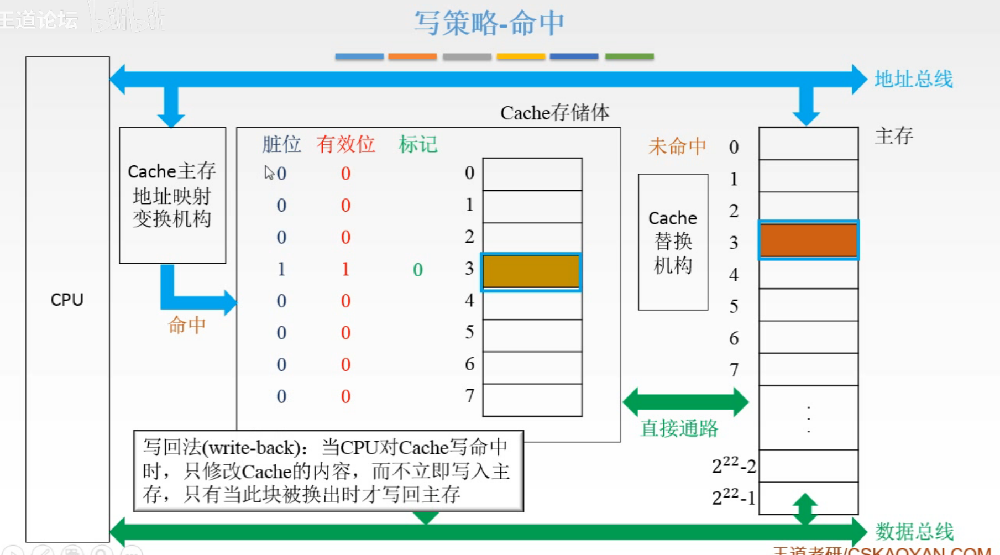

图8.写回法

图8中的Cache块3已经调入了主存块3，现在如果CPU对Cache块3中的数据进行了修改，于是现在Cache块3与主存块3的数据就不同了。

那么为了知道Cache块3的数据是否被改动过，所以在前面新增一位**脏位**，为1表示该Cache块中数据被改动过，为0则没有改动与主存块3数据相同。

（所以这个方法的标记中是多一个脏位的。）

显然可以注意到，我们没有必要改动一次就立即把Cache块3写回主存保存，毕竟可能之后还会改动Cache块3的数据，所以只需要在Cache块3要被替换时进行操作就行了。

这样，当Cache块3被替换时，可以通过脏位判断，是写回主存，还是直接覆盖。

#### 2.1.2 全写法（写直通法，write-through）

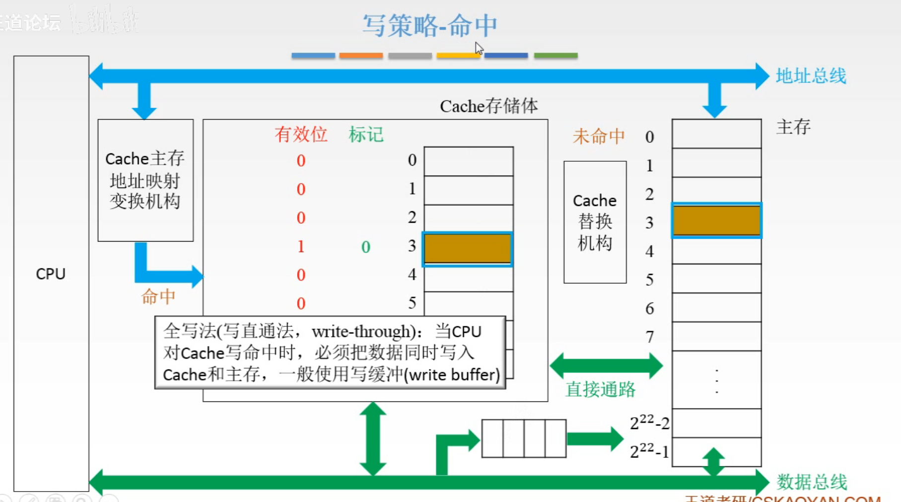

图9.全写法

全写法，在修改Cache块3的数据时，也把主存块3的数据改掉。

这样的方法不用新增一位脏位来判断Cache块和主存块的数据异同。

又因为写Cache和写主存的时间差距非常大，所以再加入一个**写缓冲**，写缓存的作用是可以暂存一些写回的操作。
比如CPU修改了Cache中的数据，于是CPU同时写入Cache和写缓冲，写缓冲再控制将内容写入主存，写入写缓冲的速度是快于写入主存的。
这样CPU写入Cache和写缓冲后就可以继续做事啦，而不用直接写入主存等待主存写完。比如CPU再写修改一次Cache中的数据，那么又同时写入Cache和写缓冲，写缓冲只需要依次将CPU的修改操作将主存中的内容修改就行了。

当然，存在的问题是，如果写入操作太频繁，是会溢出的。
溢出就是说，我写缓冲只能暂存4次操作，你CPU写入太频繁了，写缓冲都来不及写入主存，CPU第5次写入操作就来了，那就没法暂存啦。

### 2.2 当Cache未命中时

#### 2.2.1 写分配法（write-allocate）

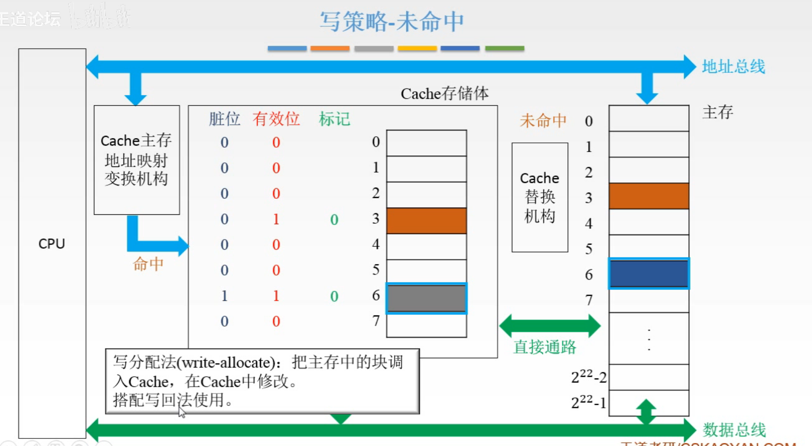

图10.写分配法

写分配法：把主存中的块调入Cache，在Cache中修改。

当要修改的内容不在Cache中，未命中。

将主存块调入Cache块，修改Cache块中的内容。
因为只修改了Cache块，而没有修改主存块，所以需要增加一位**脏位**。

可知，写分配法通常搭配写回法使用。

#### 2.2.2 非写分配法（not-write-allocate）

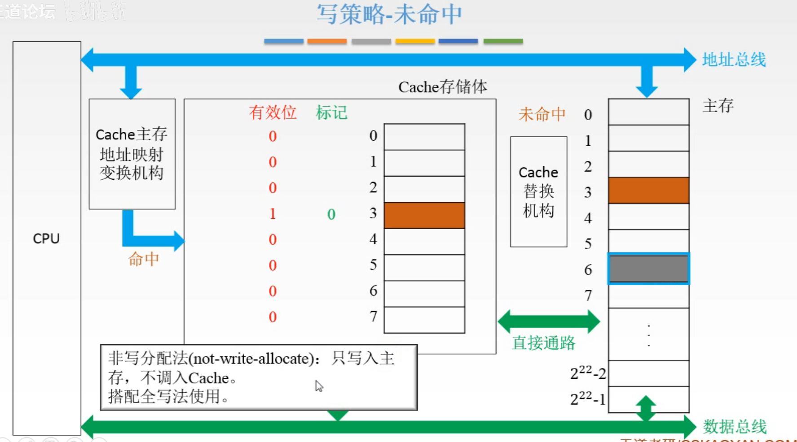

图11.非写分配法

非写分配法：

未命中时，就直接修改主存的内容就好啦。

通常搭配全写法使用。

### 2.3 写策略对比

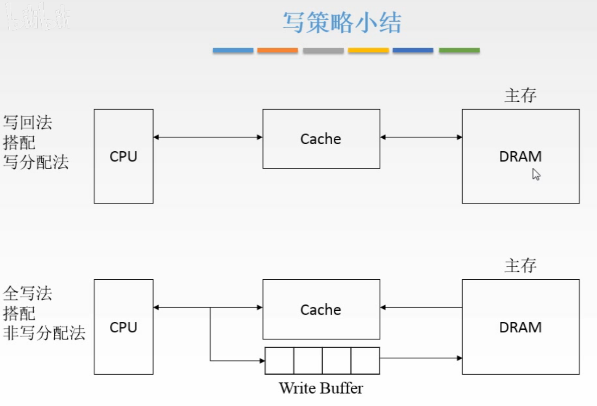

图12.写策略小结

写回法+写分配法：

不需要增加写缓冲，考虑了局部性原理，减少了访存的次数，但是需要增加一位脏位。

全写法+非写分配法：

就是需要写缓冲，不需要额外的一位脏位。写入频繁时，写缓冲可能溢出。

结合两者，我们可以使用多级Cache：

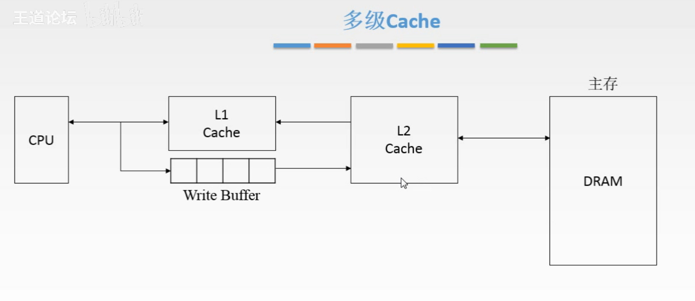

图12.多级Cache

在CPU和第一级Cache之间，使用全写法+非写分配法，因为CPU写入Cache和CPU写入写缓冲都是很快的；

第一级Cache对第二级Cache，使用全写法。
CPU改变L1 Cache中的数据，同时通过写缓冲改变L2 Cache对应的数据。

第二级Cache对主存，使用写回法。
当L2 Cache中数据要被替换时，才写回主存。

这个图，离CPU越远，速度越慢，容量越大。

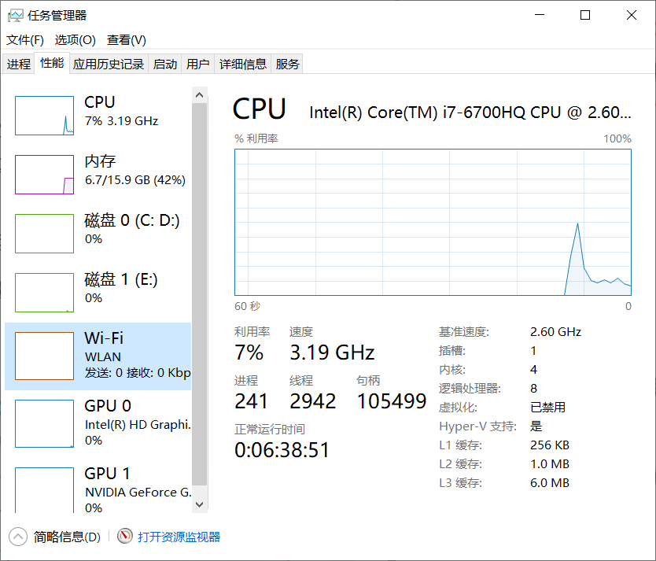

图14.

实际上，你可以在任务管理器中看到各级Cache的大小，如图14右下角。

## 三. Cache回顾

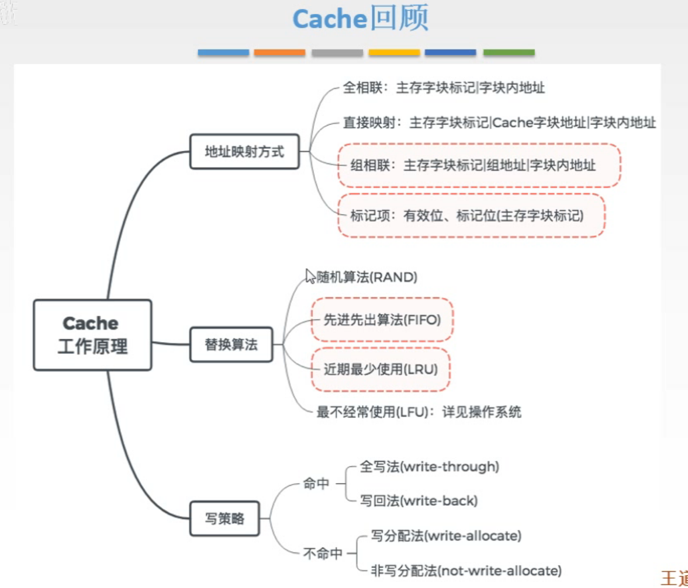

图14.Cache回顾

Cache，是为了解决CPU和主存速度不匹配的问题。

依靠的原理，是局部性原理。

要解决三个问题：地址映射，替换，写策略。

2020.09.08

