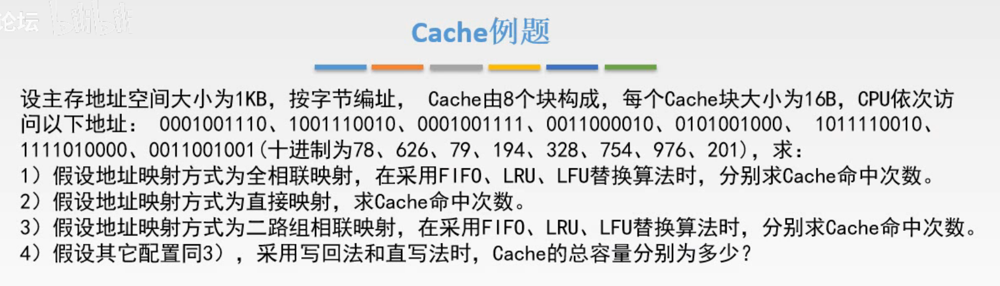
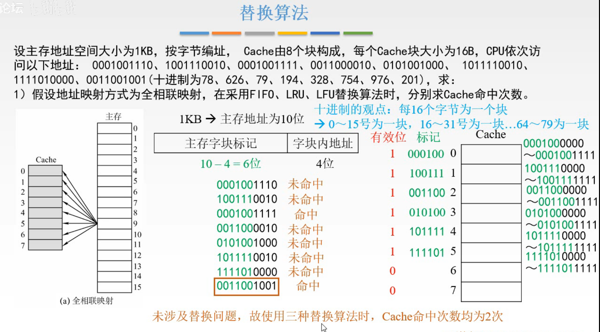
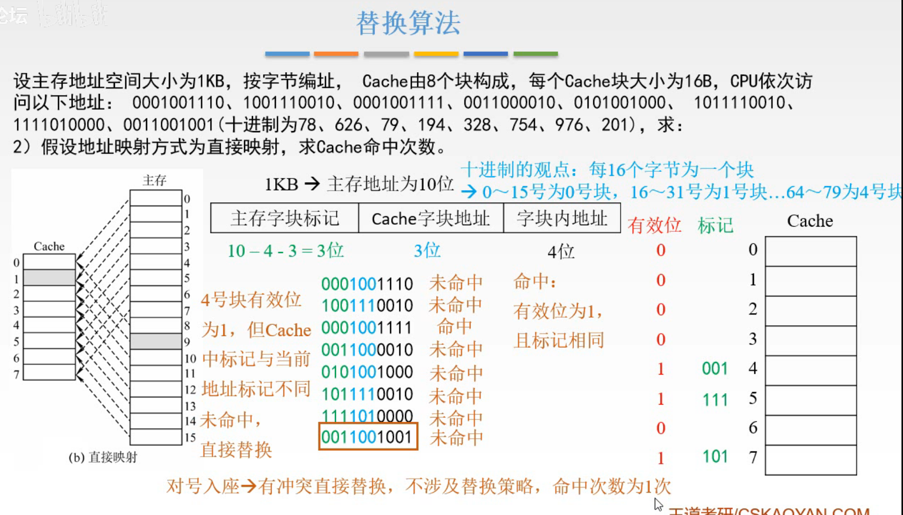
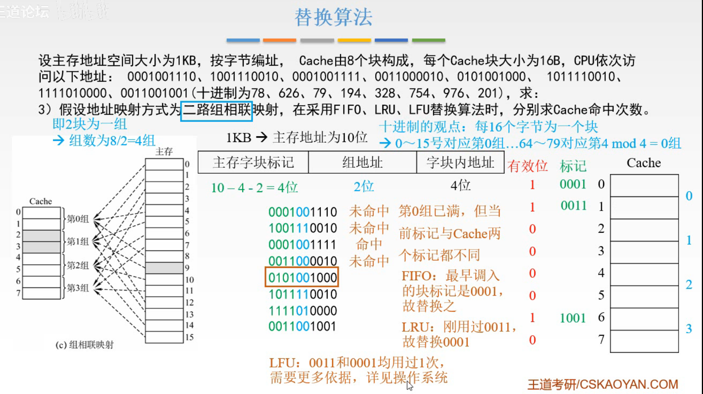
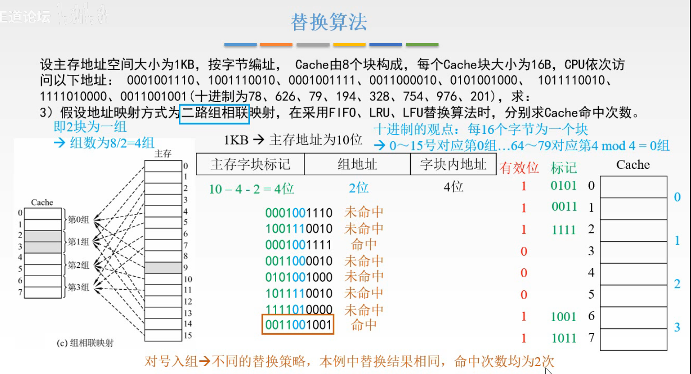
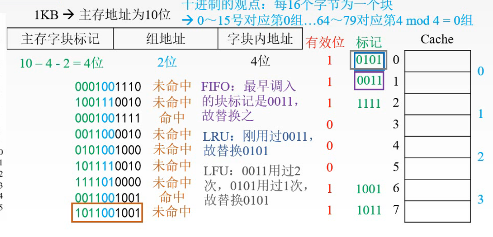
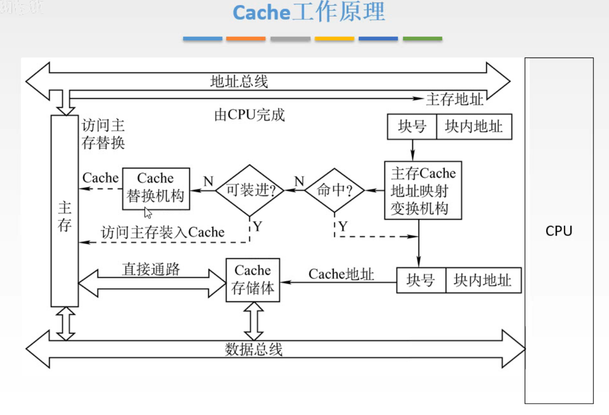
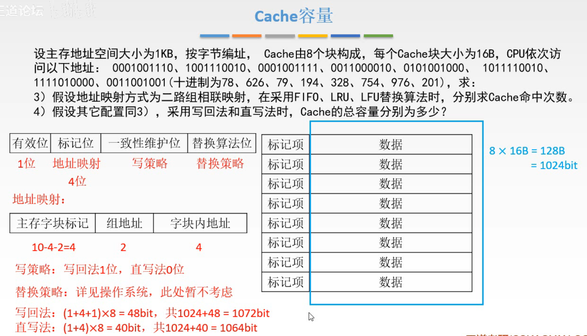
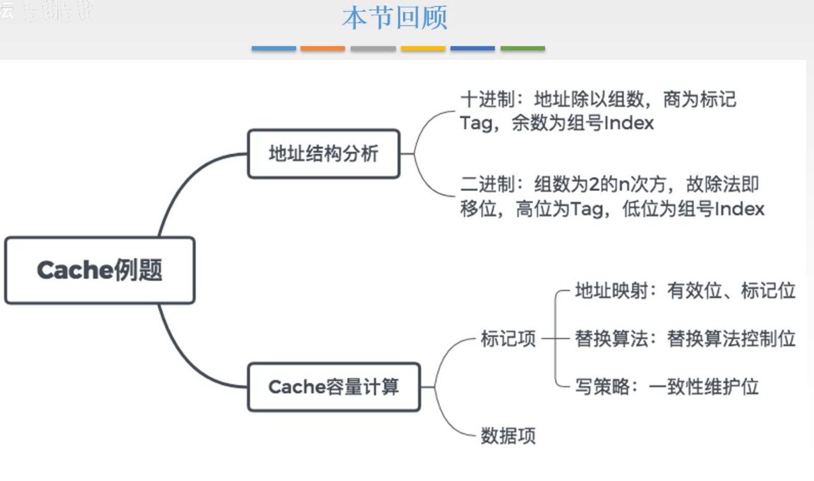

# Cache例题

这一节，通过例题，来学习两点：

1. 从主存地址的二进制形式来分析地址映射，和替换算法。
2. Cache容量的计算。

## 一. 例题

图1.例题

### 1.1 第一问

图2.第一问，全相联映射

全相联映射。

首先确认主存地址的分段：

主存地址空间大小位1KB，所以为10位地址，
Cache块大小为16B，为了区别Cache块中16个字节需要4位，所以字块内地址为4位；
所以主存字块标记为10-4=6位。

然后开始流程：

**000100** 1110，未命中，调入Cache块1，有效位为1；（有效位、主存字块标记也是存入Cache中的）
100111 0010，未命中，调入Cache块2，有效位为1；
**000100** 1111，命中，都是000100这个主存块里的数据；
**001100** 0010，未命中；调入Cache块3，有效位为1；
010100 1000，未命中；调入Cache块4，有效位为1；
101111 0010，未命中；调入Cache块5，有效位为1；
111101 0000，未命中；调入Cache块6，有效位为1；
**001100** 1001，命中，都是00100这个主存块里的数据；

因为没有设及到替换问题，所以使用三种替换算法，Cache命中次数都为2次。

### 1.2 第二问

图3.第二问，直接映射

直接映射。

还是首先确认主存地址分段：

主存地址空间大小位1KB，所以为10位地址，
字块内地址，因为Cache块大小为16B，所以子块内地址为4位；
Cache字块地址，因为有8块Cache块，所以Cahce字块地址为3位；
主存字块标记，10-3-4=3位。

然后开始流程：

000 100 1110，未命中，100，调入Cache块4，有效位为1；
100 111 0010，未命中，111，调入Cache块7，有效位为1；
000 100 1111，命中，Cache块地址与标记相同，且有效位为1；
001 100 0010，未命中；100，标记不同，调入Cache块4；
010 100 1000，未命中；100，标记不同，调入Cache块4；
101 111 0010，未命中；111，标记不同，调入Cache块7；
111 101 0000，未命中；101，调入Cache块5，有效位为1；
001 100 1001，未命中，100，标记不同，调入Cache块4；

直接映射就不存在什么替换算法啦，Cache命中次数为1次。

### 1.3 第三问

图4.第三问，组相联映射

组相联映射。

还是首先确认主存地址分段：

主存地址空间大小位1KB，所以为10位地址，
字块内地址，因为Cache块大小为16B，所以子块内地址为4位；
组地址，因为为二路组相联映射，分为4组，所以组地址为2位；
主存字块标记，10-2-4=4位。

然后开始流程：

0001 00 1110，未命中，00，调入第0组，有效位为1；
1001 11 0010，未命中，11，调入第3组，有效位为1；
0001 00 1111，命中，00，第0组中有标记相同，且有效位为1；
0011 00 0010，未命中；00，调入第0组，有效位为1，第0组存满了；
0101 00 1000，未命中；00，与第0组中两个Cache块标记都不同，
按照FIFO，0001先存入，应该替换0001；
按照LRU，0011最近才被使用，应该替换0001；
按照LFU，都使用了1次，根据操作系统那里的知识应该替换0001；
1011 11 0010，未命中；11，第3组中无标记相同的，调入第3组；
1111 01 0000，未命中；01，调入第1组，有效位为1；
0011 00 1001，命中，00，第0组中有标记相同的；

图5.第三问，组相联映射

因为替换结果相同，所以Cache命中次数为2次。

图6.接着访问一个地址

为了再熟悉一下不同替换算法，那就接着再访问一个地址吧，

1011 00 1001，未命中，00，与第0组中两个Cache块标记都不同，
按照FIFO，0011先存入，应该替换0011；
按照LRU，0101最近才被使用，应该替换0101；
按照LFU，0101使用了1次，0011使用了2次，应该替换0101；

### 1.4 Cache工作原理

回顾一下

图7.Cache工作原理

CPU发出地址，会有专门的机构，把它拆分成块号+块内地址；

因为块号是不影响映射的，所以只把块号交给主存Cache地址映射变换机构；

然后判断是否命中，如果命中，就进行地址的变换，变换好之后，对应到Cache中的某一个位置，把这个位置的数据直接交给CPU，就不需要主存给CPU了。

如果没有命中，判断是否可以直接存入，如果当前位置被占用，就需要根据替换算法进行操作；
把主存中相应的块放入Cache块。

（实际上我没有太懂这里说的地址转换是什么东西，网上查了一下，好像设计到逻辑地址，虚拟地址，貌似是操作系统的东西，所以这图就放这里，先别理解吧，等后面学了操作系统应该就知道了。）

## 二. 第4问，Cache容量

图8.计算Cache容量

Cache中不止存有数据，还有标记项，所以Cache容量=标记项+数据。

而**标记项=有效位+主存字块标记+脏位+替换算法位**。
替换算法位就是用于替换算法的计数器什么的，详细内容在操作系统里，这里暂时不考虑替换算法位。

有效位：1位；

主存字块标记：10-4-2=4位

脏位：
使用写回法，脏位1位；
使用全写法，无脏位。

在这个题中，共8块Cache块，所以写回法就比全写法多存8bit。

写回法： $(1+4+1)\times8+16\times8=48+1024=1072\text{bit}$ ；
全写法： $(1+4)\times8+16\times8=40+1024=1064\text{bit}$ 。 

## 三. 本节回顾

图9.本节回顾

2020.09.09