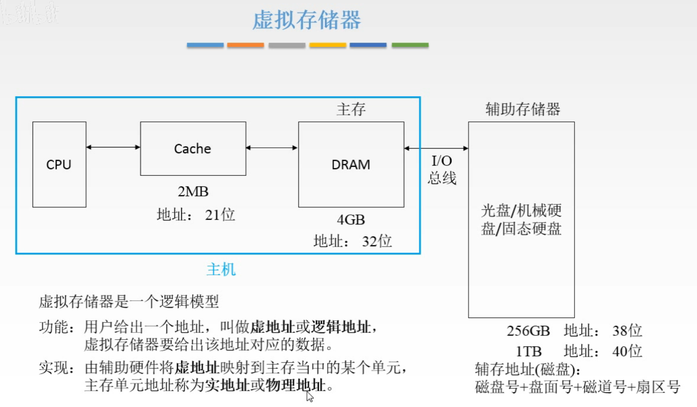
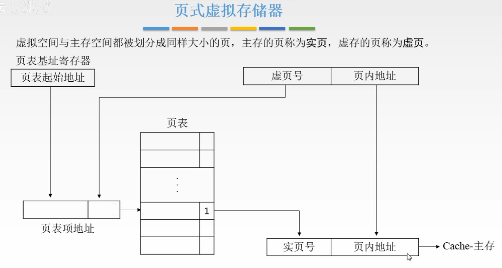
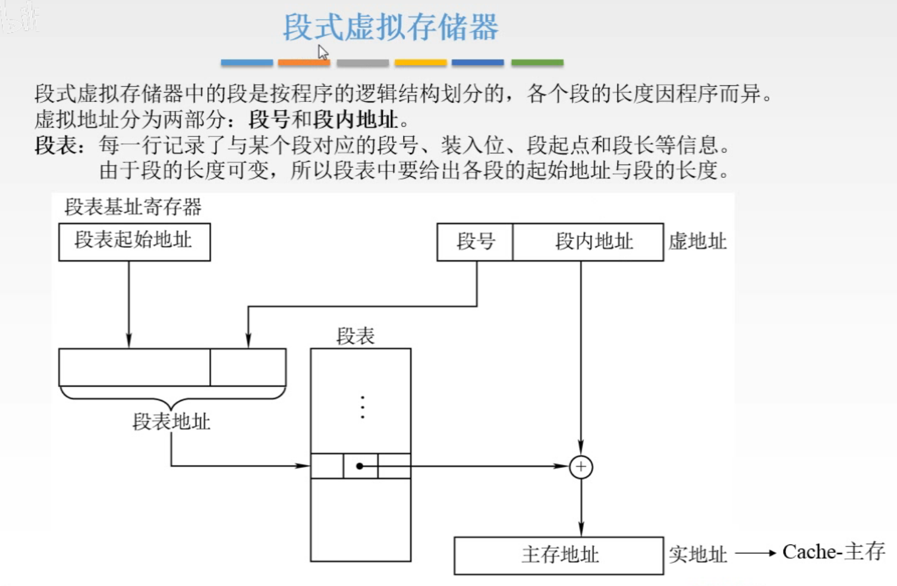
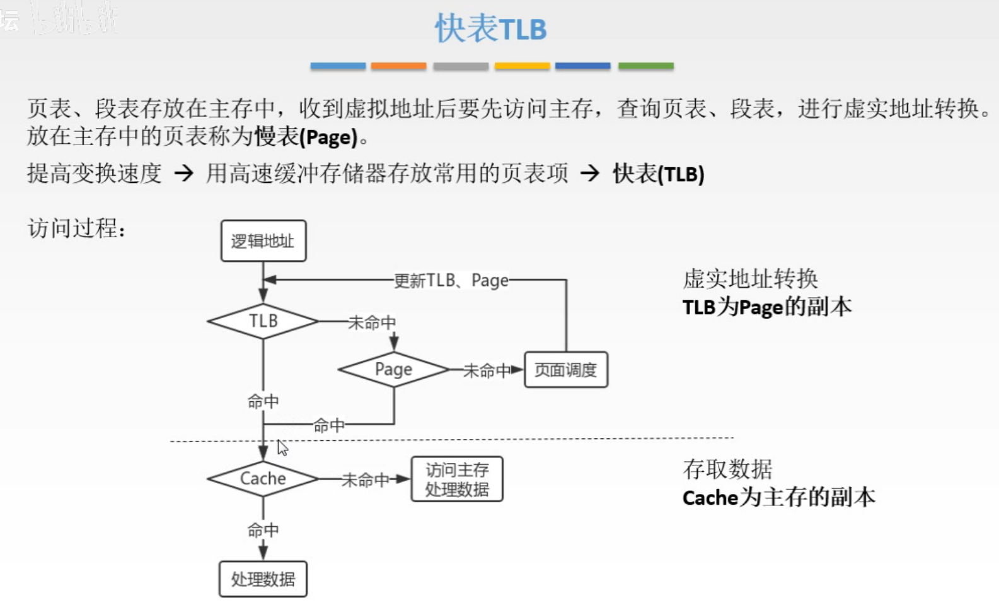
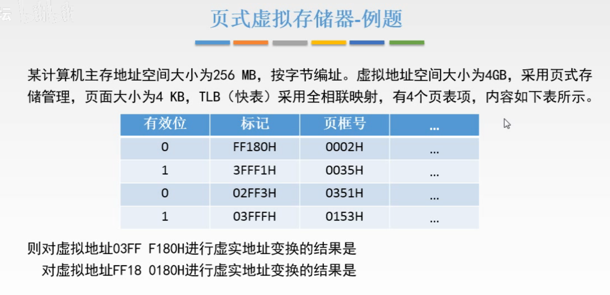
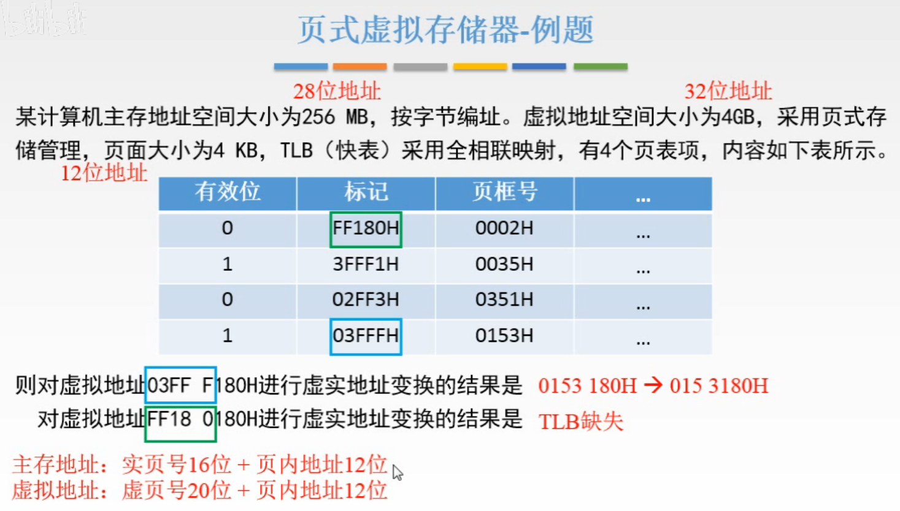
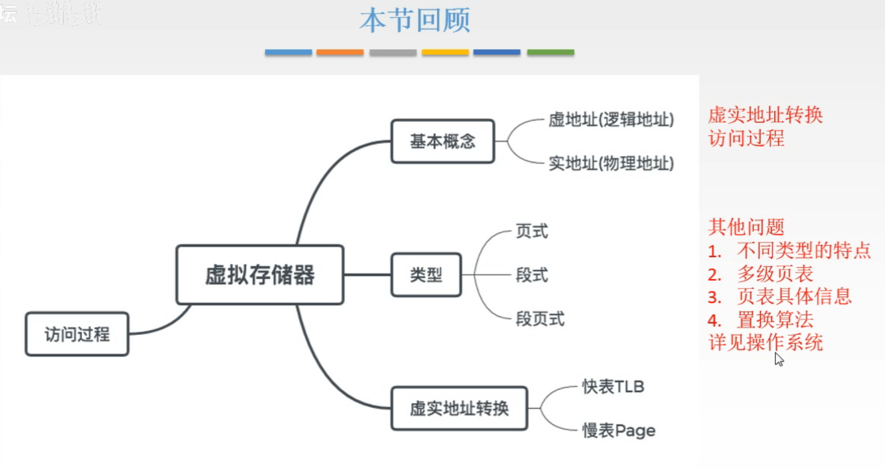

# 虚拟存储器

## 一. 虚拟存储器

前面讲的都是怎么解决CPU和主存速度差异的问题，也就是一直在讲怎么提速。

现在讲如果提高存储系统的容量。

这一节需要掌握：

1. 地址转换
2. 虚拟存储器的访问过程。

图1.虚拟存储器

首先是图1，这样的存储系统的结构，CPU-Cache-主存-辅存。

辅存通过I/O总线和主存连接。
当然，在访问辅存的时候，就不会以字节为单位了，毕竟太慢了，
例如磁盘的地址，结构为：磁盘号+盘面号+磁道号+扇区号。最小单位为一个扇区，传输时是一次传输一个扇区的内容。

可以注意到，每一个存储器，Cache、主存、辅存（不同类型的辅存地址也不一样），他们各自的地址形式都不太一样，这样就比较复杂，当我们想要访问一个地址时，就需要先搞明白很多东西，折腾起来就很复杂。

所以引入**虚拟存储器**的概念，虚拟存储器并不是实体的存储器，而是一个抽象概念，是整个存储系统，硬件+软件，封装给用户使用的一个逻辑模型。

虚拟存储器的作用是，用户只需要使用**虚地址**进行操作，由虚拟存储器给出虚地址对应的数据。
比如，在之前的例子中磁盘的地址编号显然比较复杂，假设为256G的磁盘，但通过虚拟存储器的作用，我们可以仅仅使用虚拟存储器提供的虚地址，假设为0...0（38位0）~1...1（38位1），来表示我们想进行操作的地址，而无需使用磁盘的复杂的地址。

**实地址**，或物理地址，为主存地址空间。由辅助硬件将虚地址映射到主存中的某个单元。

显然虚地址会比实地址大很多，毕竟主存比辅存小很多。
假设主存只有4G，即实地址的范围为 $0\sim4$ G，而虚地址的范围比实地址大，假设虚地址范围为 $0\sim256$ G。
所以实际上当我们使用虚地址时，并非所有的数据都在内存中，当虚地址所指向的地址未命中时，需要从辅存中调入。只是这个过程被虚拟存储器封装了。我们可以省事的当作一个存储器来使用就行了。

显然可知，虚地址与实地址的对应关系并非是一对一的关系。

在Cache与主存进行对应时，是以字块为单位。
同样，虚地址与实地址，依据单位的不同，分为3类。

### 1.1 页式虚拟存储器

图2.页式虚拟存储器

以页为基本单位的虚拟存储器。

虚拟空间和主存空间都以同样大小的页为基本单位进行划分，主存的页称为**实页**，虚存的页称为**虚页**。

将虚地址分为两段，**虚页号+页内地址**（感觉类似与Cache章中地址映射方式，Cache块地址+字块内地址）。
页内地址，显然是指出页内的访问数据的位置。
虚页号，则是与实页号对应。两者的对应关系由存储在主存中的**页表**决定。

通过虚地址如何找到页表中对应的实地址。

每一个进程都有一个**页表基址寄存器**，里面存着该进程的**页表起始地址**。王道视频图2里说的是，将页表起始地址与虚页号拼接起来，就找到了对应的页表位置，即找到对应的实页号。
（感觉像是页表基址寄存器存的是页表起始地址，而虚页号页就是这个表中的位置，类似Cache块地址和字块内地址的关系）

当然页表除了实页号外，还存储了有效位、脏位、替换算法位。

当通过虚地址的虚页号找到页表对应的实页号时，
如果有效位为1，说明该虚地址对应辅存已经调入主存，于是取出实页号，与页内地址进行拼接，形成实地址；
如果有效位为0，则说明该虚地址对应的数据还在辅存当中，于是将其调入主存，再进行一次虚页号到实页号的映射去访问。

按页划分，优点是页表简单，调入方便。

因为页的大小是固定的，所以一个程序基本不可能是页的整数倍，比如我这个程序一个需要使用2.1页大小，但实际还是要用3页大小，那么最后一页虽然我只需要0.1页大小，但还是占用了整页的大小，所以会导致最后一页有空间无法被利用而造成浪费（一个程序的存储空间只能该程序使用）。

### 1.2 段式虚拟存储器

图3.段式虚拟存储器

以段为基本单位。

前面的页就像书页一样，每页的都是固定的、相同大小的。
而以段划分，每一段是不同大小的。（类似写文章每个自然段是不一样长的吧）
且按段划分，每段是以程序的逻辑结构划分的。

同样的，虚地址分为**段号+段内地址**。
**段表基址寄存器**存放**段表起始地址**，段表起始地址与段号拼接起来就是段表中该段在主存中的起始地址。把段表中该段起始地址取出与段内地址相加，得到实地址。

因为段长是可变的，每一段的长度都可以不一样，所以相比页，按段划分更加灵活，就不会出现按页分那样只用0.1页也要占用1页，按段分只用0.1页就给你0.1页长的一段。
当然，也因为段长可变，分配空间比较麻烦，在段之间也容易留下空隙，不好利用。

### 1.3 段页式虚拟存储器

图4.段页式虚拟存储器

页式、段式的结合。

把程序按照逻辑结构分段，每一段再划分为固定大小的页。（先分段，再每段分页）
主存空间页划分为大小相等的页。

程序对主存的调入、调出仍然以页为基本单位。
每个程序对应一个段表，每段对应一个页表。
段长必须为页长的整数倍，段的起点页必须是某页的起点。

这样虚地址应该为：**段号+段内页号+页内地址**。

不过这样每次都需要查两次表。

### 1.4 快表TLB

把存在主存中的页表，称为**慢表**（Page）。

为了提高地址变换，用Cache存放常用的页表项，称为**快表**（TLB）。
这里考虑了局部性原理，只是把常用的页表项存入Cache。

快表和慢表的关系，与Cache和主存的关系是一样的。

图5.快表

分析一下访问过程：

虚地址，同时查TLB（Cache中）和Page（主存中），

如果TLB命中，得到了实地址，看看是否已经调入Cache了，
	如果Cache命中，那就直接从Cache中进行读取；
	如果Cache未命中，那就访问主存（因为得到实地址了嘛，那必然已经在主存中了）

如果TLB未命中，
	如果Page命中，得到了实地址，还是先看Cache中有没有，
		如果Cache命中，那就直接从Cache中进行读取；
		如果Cache未命中，那就访问主存（因为得到实地址了嘛，那必然已经在主存中了）
	如果Page未命中，说明要用的地址还在辅存当中，需要进行页面调度，页面调度是操作系统中的内容。页面调度完，更新两个表，然后从第一步开始重复步骤。

**如果主存块被调出，则会删除 Page 和 TLB 中对应的表项。**

这是显然的，假定我们虚拟地址访问的物理地址主存块为 A，其中数据为 D。
即便 TLB 命中，但 Cache 不命中，我们获得的物理地址也是指向主存中的主存块 A 的，其中数据为 D。
而如果，在主存块 A 调出时不删除（修改） Page 和 TLB 的对应表项，则我们很可能会从主存块 A 中读写的是换进来的数据，而非原本的数据 D 了。

## 二. 例题

图6.例题

**标记**，指虚地址中的虚页号；
**页框号**：指实页号；

分析：

主存地址空间大小为256MB，于是实地址为28位；
虚拟地址空间大小位4GB，于是虚地址为32位；
页面大小为4KB，于是页内地址为12位；

所以，
实地址=16位实页号+12位页内地址；
虚地址=20位实页号+12位页内地址；

给出的为快表（TLB）。

对虚地址03FF F180H进行虚实地址变换：
虚页号为03FFFH，查表得对应实页号为0153H，有效位为1，
于是结果为015 3180H。

对虚地址FF18 0180H进行虚实地址变换：
有效位为0，因为给出的是TLB，虽然TLB未命中，但是可能在Page命中，这种情况称结果为，TLB缺失。

图7.例题解答

## 三. 本节回顾

图8.本节回顾

因为虚拟内存主要内容还是在操作系统中，所以其他问题就在操作系统里看吧。

2020.09.09

