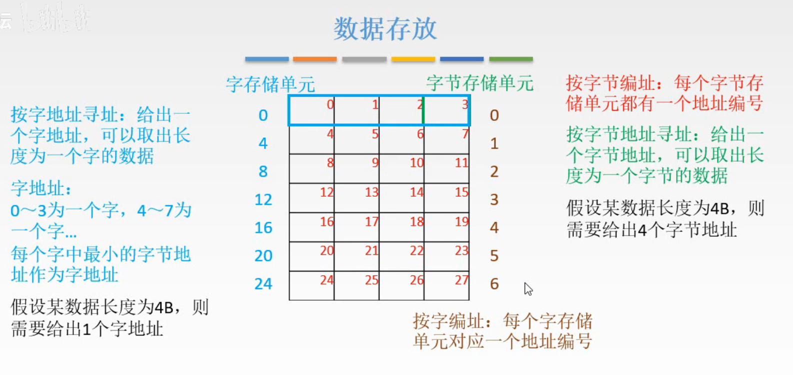
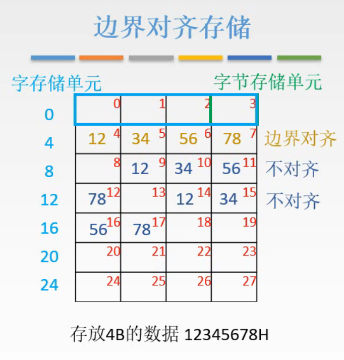
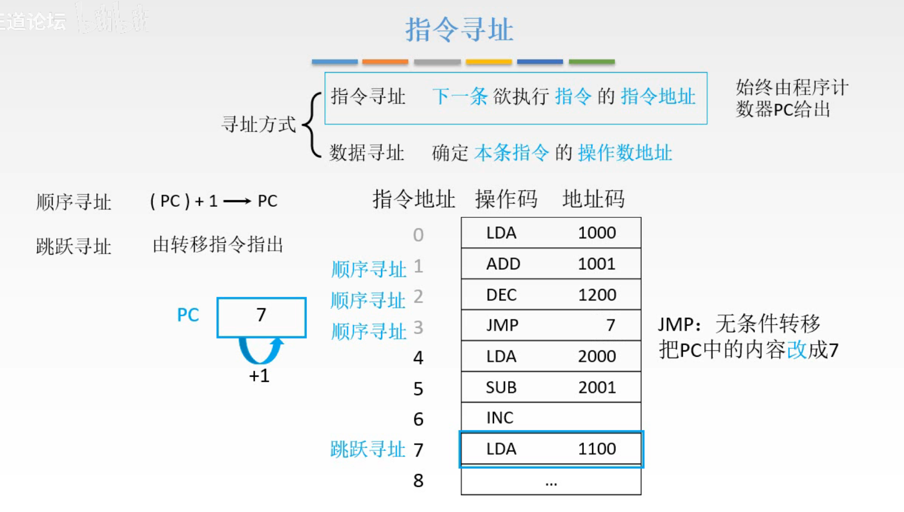
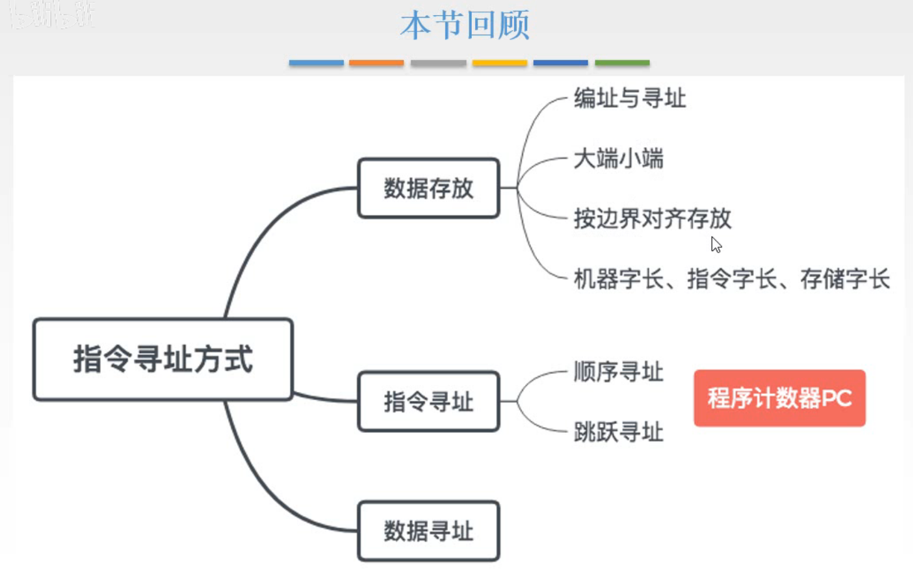

# 数据存放、指令寻址

## 一. 数据存放

### 1.1 复习一下

图1. 

就是复习一下。

编址，寻址。

按字节编址：每个字节存储单元都有一个地址编号。

按字节寻址：给出一个字节地址，可以取出一个字节长度的数据。

按字节编址下的按字寻址：给出一个字地址，可以一次取出长度为一个字的数据。
把低位的字节地址作为字地址。

同时保留按字寻址和按字节寻址，是因为有时候需要一次读取4B长度，那就按字寻址只需要1次读取，而按字节需要4次；有时候需要一次读取1B长度，那就使用按字节寻址。

按字编址：每个字存储单元对应一个地址编号。此时寻址就也能一次取出4B长度的数据，但是就无法单独取出1B的数据了。

（突然有个想法，不一定正确，总所周知， C 语言的 int 类型通常是占 32bit 也就是 4B 的，虽然对我来说我只是在使用指针，但说不定 C 语言底层在读 int 类型的数时，就是用的字地址一次读出 4B 而不是用字节地址读 4 次。
这大概也解释了为什么需要字节对齐。
感觉能解释通，但不确定。）

还有大端模式（12 34 56 78），小端模式（78 56 34 12）。

三个字长：

**机器字长**：
CPU一次能处理的二进制数据的位数。

**指令字长**：
一个指令字中包含二进制代码的位数。

单字长指令：指令字长=机器字长；
半字长指令：指令长度= $\frac{1}{2}$ 机器字长；
双字长指令：指令长度=2机器字长。

**存储字长**：
一个存储单元存储二进制代码的长度。

都是字节的整数倍。

### 1.2 边界对齐存储

图2.边界对齐存储

如图2，存入12345678H，那么为了一次能读出12345678H，显然最好是将其存入一个字内。
而如果不是一个字内，就需要两次读取了。

**边界对齐**：起始地址是字长的整数倍。

也就是12345678H的存入时，12H存入的字节存储单元应该是字存储单元的第一个字节（大端模式情况下）。

## 二. 指令寻址

指令寻址，是确定下一条欲执行的指令的指令地址。

数据寻址，指确定本条指令的操作数地址；在下一节讲。

图3.指令寻址

指令寻址，分为顺序寻址和跳跃寻址。

**顺序寻址**： $(PC)+1\rightarrow PC$ 。
**跳跃寻址**：由转移指令给出。

如图3，假设程序从指令地址0开始执行，
PC中当前为0，读取并执行指令地址为0中的指令，PC自增1；
PC中当前为1，读取并执行指令地址为1中的指令，PC自增1；
PC中当前为2，读取并执行指令地址为2中的指令，PC自增1；
PC中当前为3，读取并执行指令地址为3中的指令，为JMP：无条件转移，把PC中的内容改为7；
（这里改为7，后面章节再详细讲是怎么改为7的）
PC中当前为7，读取并执行指令地址为7中的指令，PC自增1；

## 三. 本节回顾

图4.本节回顾

2020.09.11