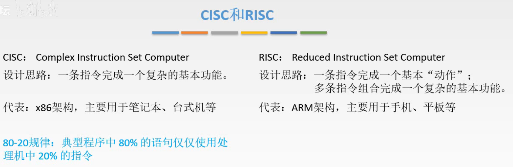
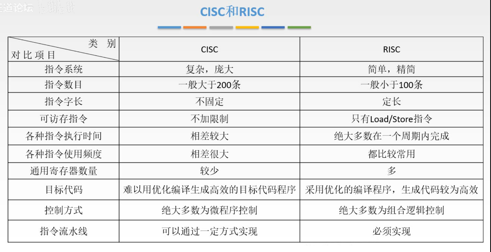
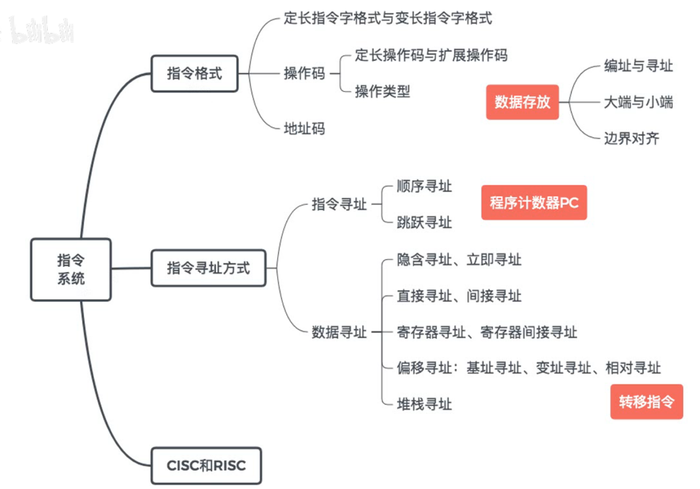

# CISC和RISC

图1.CISC和RISC

**CISC（Complex Instruction Set Compter，复杂指令系统计算机）**

设计思路：一条指令完成一个功能，如果是复杂的功能，也是为其设计一条指令来对应该功能。

结果呢，就会发现，实际上为复杂功能专门设计的指令，其实很少用到，实际上最常用的还是最基础的那些指令（80-20规律）。

当然CISC通常用在笔记本，台式机，这类对性能要求高的计算机上。

**RISC（Reduced Instruction Set Compter，精简指令系统计算机）**

设计思路：一条指令完成一个功能，而如果是复杂的功能，则通过已有的指令进行组合来完成。

通常用在手机，平板上。

图2.对比

指令数目：
CISC：因为对复杂的功能都是专门设计一个指令，所以指令数目很多。
RISC：是由基础的简单的指令组合完成复杂功能，所以指令数目少。

指令字长：
CISC：指令数目太多了，所以想定长就很困难，所以指令字长不固定。
RISC：指令数目少嘛，所以就方便设计成定长的。

可访存指令：
CISC：因为每个指令对应一个功能，所以复杂功能的指令中可能有访存的操作。
RISC：只有Load/Store指令用于访存。

各种指令执行时间：
CISC：相差比较大，复杂的和简单的对比起来自然是相差比较大。
RISC：绝大多数都在一个周期内完成。

各种指令使用频率：
CISC：相差很大，毕竟越复杂就越专用，越简单越泛用。
RISC：都比较常用，设计的时候当然选最常用的指令来作为组合复杂指令的单位啊。

通用寄存器数量：
CISC：较少，因为一个指令是专门的完成一个复杂操作，所以需要保存的中间结果少，于是设计的时候就可以少放点通用寄存器；还有一个问题是在硬件上，主要面积都用于了这堆指令的控制，留给通用寄存器的面积就比较少。
RISC：多，由于是多条指令配合完成复杂操作，所以可能产生很多中间结果，所以需要多的寄存器。同样还有一个原因，硬件上给指令的空间不用太多，寄存器也可以多放点。

目标代码：
CISC：难以用优化编译生成高效的目标代码程序。因为复杂的指令占用的硬件多。
RISC：采用优化的编译程序，生成代码较为高效。比如多条指令交给硬件执行时，可以先分析各指令对硬件的占用情况，通过一定的安排，使多条指令在同一时期占用的硬件不同，于是多条指令可以同时的运行。

控制方式：
CISC：绝大多数为微程序控制。因为把所有指令做在电路上太大了，所以在CPU中单独设计一个小的控制电路配合上一块小的存储电路来实现指令的控制。
RISC：绝大多数为组合逻辑控制。毕竟指令都比较简单，所以直接用一个电路来控制就行了。

指令流水线：
CISC：可以通过一定方式实现，不过目标代码说了，本身CISC就比较难优化，所以想实现流水线也比较复杂。
RISC：每条指令都很简单，所以流水线设计简单，那自然RISC都会使用流水线。

**RICS 一定使用流水线技术，但 CISC 对此没有要求** ，不过为了提高效率，CISC 也会使用流水线技术（虽然实现相对更复杂），所以使用流水线技术的不一定只是 RISC。

## 三. 本章回顾

图3.本章回顾

指令格式：如何用一串二进制代码表示指令。

设计时，可以一套指令中都采用同样的长度，为定长指令字格式；也可以一套指令中采用不同长度，为变长指令字格式。

对一个指令中的不同二进制位赋予不同含义，于是一个指令分为操作码字段和地址码字段。

操作码的设计，也可以分为定长操作码和变长操作码（扩展操作码）。
操作码肯定要对应不同的操作，所以简单的对操作进行了分类。

地址码的设计，零、一、二、三、四地址。

指令寻址方式：如何使机器对应我们的规则来处理指令。

先是介绍了一下数据存放，因为这段内容经常要访存。
首先要给主存中的存储单元进行编号（编址），编号后就可以按号码来找到要访存的存储单元（寻址）。

指令寻址：通过修改PC来寻址。

数据寻址：
立即、直接、间接、寄存器、寄存器间接、隐含寻址；
偏移寻址：基址寻址、变址寻址、相对寻址；
堆栈寻址。

最后就是CISC和RISC。

2020.09.12

补充知乎上看到的回答，感觉说的有点道理：

>要加快程序执行的速度，就需要加快指令执行的速度，由此指令系统的发展方向有两个：
>
>CISC：复杂指令集计算机系统，增加新的指令，增强指令的功能，但是会导致指令越来越多，指令系统变得复杂。
>
>RISC：精简指令集计算机系统，保留必要的指令，减少指令的数量。
>
>可以看到，CISC是将多条指令合成一条强功能指令，RISC是将强功能指令去掉，由最基本的指令来实现强功能指令的功能。一个是组合，一个是拆分，为什么都可以提高程序执行的速度呢？
>
>组合：指令一般都需要取指，译码，分析，执行的过程，如果将四条指令合成一条指令，那么就只需要一个取指译码分析的时间，而不是四个，于是加快了指令执行速度。
>
>拆分：RISC使用了流水线技术，根据需要将指令的执行逻辑上分为多个子过程，比如取指，译码，分析，执行，然后设置这四个功能部件，让指令可以重叠执行，如果指令像CISC那样不规整，流水线的效率就不高。
>
>硬布线：用电路的方式设置指令，速度快，但是修改起来难度比较大。
>
>微程序：指令放在控制存储器里面，速度比硬布线慢些，但是容易修改和增加新指令。
>
>CISC会导致指令越来越复杂，而且为了兼容的原则，原来的指令不能删除，如果采用硬布线的话，会导致指令系统的设计越来越复杂，而且修改起来也很困难，采用微程序就易于指令的修改，容易增加指令，因此CISC一般采用微程序控制。
>
>RISC是要精简指令，保留最基本的指令，因此指令较简单，另外为了使用流水线技术，指令也比较规整，因此RISC适合采用硬布线控制。

另一个知乎回答：

> RISC 不是一开始就有的，大概是八十年代的产物，是在 CISC 的微程序（51年）控制的大量生产环境实践的基础上抽出的高频指令诞生的（也就是我上面写的）。
>
> 因为数量相比于 CISC 要少很多，所以通过硬布线逻辑（组合逻辑电路）实现指令译码，最终获得 ALU 等各种组件的控制信号。
> （当然早期计算机设计采用的组合逻辑控制器，微程序控制器是在此基础上迭代而来）。

感觉这里说的和我上面写的对得上，一开始是 CISC，然后发现二八定律，发展出 SISC。

由于 SISC 指令的数量少，于是直接使用硬布线（组合逻辑电路）来实现不同指令对应发出的信号。

而 CISC 的指令数量多，而且是多个指令的复杂功能专门合并为一个复杂指令，于是通过微程序，即一条指令对应的其实是 ROM 中对应的一段微操作序列。

2021.06.20