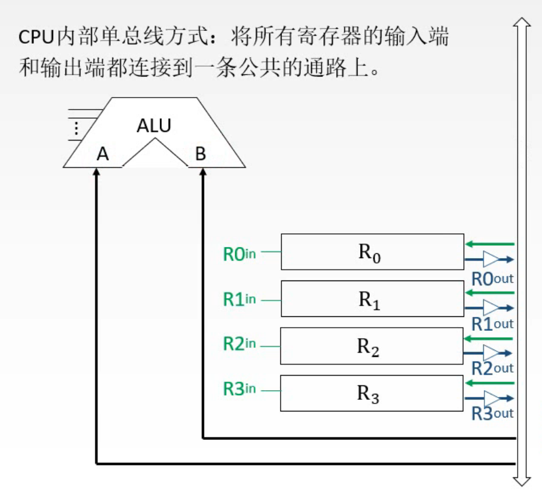
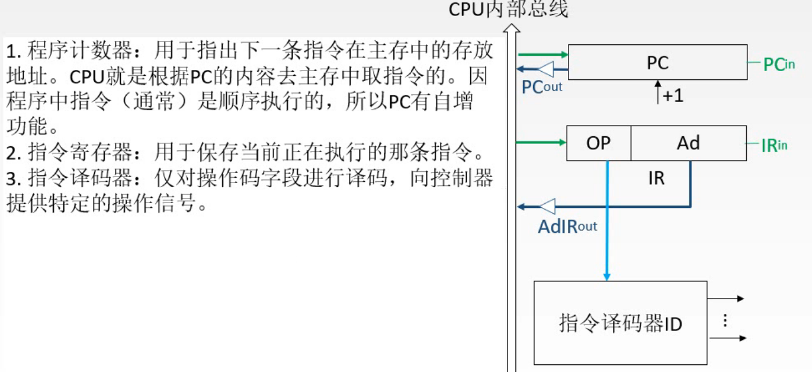

# CPU的功能和基本结构

图1.本章总览

至顶向下的顺序来，

1. 首先介绍CPU应该具备的功能和对应这些功能的结构，

2. 然后是分析指令的执行过程，

3. 对于指令的执行，CPU中自然会有数据的流动，所以需要数据通路来支持实现，

4. 以上过程都是在控制器的控制下执行的，所以控制器要完成控制的任务，又需要具备什么样的的功能，什么样的结构，工作原理是啥，
5. 这样基本的CPU框架就搭建好了，再对其进行优化，采用指令流水线的方式提高运行速度。

这一节讲CPU的功能和结构。

图2.复习一下计算机的结构

## 一. CPU的功能

图3.CPU的功能

CPU的功能：

1. **指令控制**：

   完成取指令、分析指令和执行指令的操作，即程序的顺序控制。

   毕竟CPU要控制程序的工作，自然是要具有取、分析、执行指令的功能的。

2. **操作控制**：

   产生完成每条指令所需的控制命令。

   一条指令的操作通常是多个操作信号的组合来实现的，所以把各种操作信号发送到相应的部件，从而控制这些部件按照指令的要求进行工作，这也是CPU应该具有的功能。

3. **时间控制**：

   对各种操作加以时间上的控制。

   操作信号的发送，应当按照一定的时间顺序来发送，所以应该CPU应具备时间控制功能。

4. **数据加工**：

   对数据进行算术运算和逻辑运算。

5. **中断处理**：

   对计算机运行过程中出现的异常情况和特殊请求进行处理。

## 二. 运算器与控制器的功能

图4.运算器和控制器的功能

CPU总体具有五个功能，CPU由运算器和控制器组成，来分析CPU内部部件的，运算器和控制器的功能。

**运算器**：

显然是对数据进行加工。

**控制器**：

协调并控制计算机各部件执行程序的指令序列，基本功能包括**取指令、分析指令、执行指令**。当然控制器还应具有中断处理的功能。

取指令：自动形成指令地址；自动发出取指令的命令。
分析指令：操作码译码（分析本条指令要完成什么操作）；产生操作数的有效地址。
执行指令：根据分析指令得到的"操作命令"和"操作数地址"，形成操作信号控制序列，控制运算器、存储器以及I/O设备完成相应操作。

中断处理：管理总线及输入输出；处理异常情况（如掉电）和特殊情况（如打印机请求打印一行字符）。

了解了功能后，下面分别来分析运算器和控制器各自的结构。

### 2.1 运算器的基本结构

#### 2.1.1 算术逻辑单元ALU

图5.ALU

运算器的核心，是**算术逻辑单元ALU**。

ALU的作用：主要功能是进行算术/逻辑运算。
输入两个操作对象A，B，根据接收到的控制信号，对A，B进行相应的操作，再输出出去。

ALU是一个**组合逻辑电路**，组合逻辑电路的特点在于，任一时刻的输出只取决于当时的输入，而且A+B+控制信号输入后，输入就会相应的产生。
所以ALU要得到正确的结果，需要保证A+B+控制信号全都是正确的，有效的信号。

#### 2.1.2 通用寄存器组

图6.ALU+通用寄存器组

因为计算过程中是经常可能产生中间结果，并且有时也经常把操作数存放在寄存器当中，自然，运算器中应当具有**通用寄存器组**。

通用寄存器组的作用：用于存放操作数（包括源操作数、目的操作数及中间结果）和各种地址信息。SP是堆栈指针，用于指示栈顶的地址。

当然寄存器其实并不只有通用寄存器组 $R_0\sim R_3$ ，后面还有其他寄存器，只是在说到通用寄存器组的时候，所指的是 $R_0\sim R_3$ ，不包含其他寄存器。

这里图6左方的示意图用的是 $R_0\sim R_3$ ，而书上用的是AX、BX、CX、DX、SP等来表示。

实际上是 $R_0$ 就等同于 $AX$ ，因为书上的例子里寄存器里面的内容可以详细拆为成了AH（高字节）和AL（低字节）。
如果想单独的对寄存器AX里的一个字节进行操作的话，就写AH或AL，如果对整个AX进行操作就写AX。

图7.寄存器的字母表示

因为前面也一直是用 $R_i$ 来表示寄存器，所以我还是和王道考研视频里一样继续用 $R_i$ 来表示啦。

#### 2.1.3 连接方式

##### 2.1.3.1专用数据通路

图8.专用数据通路

有了ALU和通用寄存器组，那么就需要将通用寄存器组中的数据传入ALU进行计算。

图8为**专用数据通路**方式，特点为：根据指令执行过程中数据和地址的流动方向安排连接路线。

也就是说，数据从 $R_i$ 传到 $ALU$ ，那么 $R_i$ 就需要与ALU连接起来（这就叫根据数据的流动方向），所以图8中每一个 $R_i$ 都与ALU有连线。
由于 $R_i$ 有可能传给A或B，所以 $R_i$ 与A，B都要连接。
当然图8这里连线只是简化地画了一根，实际上是很多根。

而注意到，如果现在的状况，只是使用导线连接起 $R_i$ 与ALU，相当于ALU同时并一直接收着 $R_0\sim R_3$ 的数据，显然无法得到正确的数据。
所以需要将 $R_i$ 的数据区分开，同时只能A、B只能接收一个寄存器的数据。

图9.寄存器->ALU的解决方法一，多路选择器MUX

解决方法一，采用**多路选择器MUX**。

MUX的作用是将多路信号处理为一路信号传输出去，工作模式是，由一个控制信号 $C_i$ 来决定传出哪路的信号。

如图9， $C_1=00$ 表示传入 $R_0$ 的信号到A， $C_2=01$ 表示传入 $R_1$ 的信号到B。

图10.寄存器->ALU的解决方法二，三态门

解决方法二，使用**三态门**。

每一路上有一个小的三角形 $\Delta$ ，每一个小三角形上都有一个控制信号 ${R_i}_{out}$ ，如果为1，则信号传递出去；如果为0，则信号不输出。
就是一个开关的作用嘛。

如图10， ${R_0}_{out}=1$ 时， $R_0$ 数据输出到A； ${R_0}_{out}=0$ 时， $R_0$ 数据无法输出到A。（应该是图10的最后一句写错了，应该是无法输出到A端才对）

**总结专用数据通路方式特点**：性能较高，基本不存在数据冲突现象，但结构复杂，硬件量大，不易实现。

分析一下：
性能较高：
绞高，自然是有比较的，和下面CPU内部单总线方式比较，专用数据通路每两个有数据传输的部件都有专用的连线，自然是性能较高。

基本不存在数据冲突现象：
传输的数据都在专用的数据通路中传输，由多路选择器MUX或三态门来控制输出哪一路，自然基本不存在数据冲突现象。

结构复杂，硬件量大，不易实现：
当然啦，这每两个有数据传输的部件都要连线，这得需要多少线。何况现实里怕不是最后就成了乱七八糟的一堆线。

##### 2.1.3.2 CPU内部单总线

图11.CPU内部单总线

**CPU内部单总线**：在整个系统内部设置一条公共的通路，任意两个部件的数据传输都是通过这条数据通路来实现的。
这条总线叫做**CPU内部总线**，或有时候也叫**ALU总线**。

**特点**：结构简单，容易实现，但数据传输存在较多冲突现象，性能较低。

例如图11中， $(R_0)\rightarrow R_1$ 则先将 ${R_0}_{out}$ 变为1，把 $R_0$ 中的数据传到CPU内部总线上，再将 ${R_1}_{in}$ 变为1，从公共通路传到 $R_1$ 中。
如果同一时刻 $R_2$ 和 $R_3$ 想要进行数据的传输，则需要等待刚才的过程完成，才能去请求总线的服务。

图12.总线连接ALU

从总线连接ALU的A、B端。
图12中的连接只是最简单的用导线连接上了，那么就是同样的问题，当从总线传输数据到ALU时，会同时传给了A，B，导致A、B无法接收到两个不同的数。

#### 2.1.3 暂存寄存器

图13.暂存寄存器

在A端前加入一个**暂存寄存器**，这样对A端来说，数据先传入暂存寄存器，再传入A。
这样，第二次的数据就不会同时传入A，B导致A，B的操作数都一样了。

图13中写的**暂存寄存器的作用**：用于暂存从主存读来的数据，该数据不能存放在通用寄存器中，否则会破坏其原有内容。

实际上这只是暂存寄存器作用之一，也就是在图13中举例的情况下的作用，直接将主存中的操作数通过总线传输到暂存寄存器，就免去了存入通用寄存器，从而避免了破坏通用寄存器中的操作数。

图14.暂存寄存器的其他作用

ALU的计算结果是会传递到总线上的，而ALU是组合逻辑电路，如果不加限制，只是用导线连接，那么ALU的结果就会一直直接传递到总线上，会改变总线中的数据。那么总线的中的数据就会一直被ALU的结果影响。

所以ALU的结果传递给一个暂存寄存器，然后给暂存寄存器后加上三态门控制其输出，从而解决这个问题。

（这也是为什么刚才说，刚才写的暂存寄存器的作用只是之一。）

而这个ALU之后的暂存寄存器还可以增加一些功能。
增加移位功能，又能暂存，也具有完成移位操作的功能；
增加累加功能，有的会把累加寄存器做在这个地方，当然大部分时候还是单独做一个累加寄存器挂到总线上，如图15。

#### 2.1.4 累加寄存器 ACC

图15.累加寄存器

**累加寄存器ACC**，作用：是一个通用寄存器，用于暂时存放ALU运算的结果信息，用于实现加法运算。

累加寄存器，本身也是一个通用寄存器，只是给了它一个特殊的功能。
当执行累加的操作时，累加寄存器会自动当作另一个操作数传到ALU的某一个输入端。
例如在乘除法时，进行的累加操作，其计算结果放在ACC中的，而下一次由是ACC中的数与另一个相加，然后计算结果又放在ACC中，循环。

#### 2.1.5 程序状态字寄存器PSW

图16.程序状态字寄存器

在计算过程中，有没有溢出，是正数还是负数，以及一些中断控制信息，为这些信息，专门设置了一个**程序状态字寄存器PSW**。

这个程序状态字寄存器中，**每一个二进制位**都有自己的含义，是一个可以**按位寻址**的寄存器，也就是说可以给出一位的地址，取出一位数据。

PSW作用：保留由算术逻辑运算指令或测试指令的结果而建立的各种状态信息，如溢出标志（OF）、符号标志（SF）、零标志（ZF）、进位/借位标志（CF）等。PSW中的这些位参与并决定微操作的形成。

当进行加法运算时，若最高位向前有进位，则 CF = 1，否则 CF = 0。
当进行减法运算时，若最高位向前有借位，则 CF = 1，否则 CF = 0。

#### 2.1.6 移位器

**移位器**，作用：对运算结果进行移位运算。

在前面暂存寄存器提到过，可以做到ALU后面，一般通常也是做在这里。

一般叫作 SR。

#### 2.1.7 计数器

**计数器**，作用：控制乘除运算的操作步数。

主要就是在乘数法会涉及到操作步数的计算。

计数器的作用就是数数，它的数数是需要CPU提供一些控制信号的，也就每隔固定的时间数一次。本质也就是计时。

图17.运算器的基本结构

### 2.2 控制器的基本结构

#### 2.2.1 程序计数器PC

图18.程序计数器PC

**程序计数器PC**，作用：用于指出下一条指令在主存中的存放地址。

CPU根据PC中的内容去主存中取指令，PC本质也是一个寄存器，只是我们专门用PC来存放指令地址，设计一个自动加1的功能。（所以题目如果没有写PC但是有+1，就说明这个寄存器是PC啦）

#### 2.2.2 指令寄存器IR

图19.指令寄存器

**指令寄存器**，作用：用于保存当前正在执行的那条指令。

因为指令分为操作码OP和地址码Ad两段，所以和CPU内部总线的连接，只需要将Ad部分传到总线上。OP部分不用传到总线上，而是传给指令译码器ID。

#### 2.2.3 指令译码器ID

图20.指令译码器ID

**指令译码器**，作用：仅对操作码字段进行译码，向控制器提供特定的操作信号。

将操作码OP对应的操作，翻译为对应的控制内容，但是这个控制内容不是现在就发给各个部件，因为控制内容还需要具有一定的顺序才能正确完成这个操作。

#### 2.2.4 微操作信号发生器

图21.微操作信号发生器

**微操作信号发生器**，作用：根据指令寄存器IR的内容（指令），PSW的内容（状态信息）以及时序信号，产生控制整个计算机系统所需的各种控制信号，其结构有集合逻辑型和存储逻辑型两种。

看下图22，微操作信号发送器，接收指令译码器+时序系统+PSW，三者的信号，输出一系列的控制信号，输出这些信号就是发送到其他部件的控制信号。可以看到图22中微操作信号发送器的输出的线画的颜色是绿色黑色，意思是对应其他部件的连线的颜色，表达控制的意思。

#### 2.2.5 时序系统

图22.时序系统

**时序系统**，作用：用于产生各种时序信号，由统一时钟CLOCK分频得到。

#### 2.2.6 存储器地址寄存器MAR

图23.存储器地址寄存器

**存储器地址寄存器**，作用：用于存放所要访问的主存单元的地址。

PC将指令地址通过CPU内部总线传送到MAR中，MAR再通过外部的地址总线和主存进行交流。

实际上，MAR、MDR设计上、逻辑上属于存储器，只不过通常做在CPU中。

#### 2.2.7 存储器数据寄存器MDR

图24.存储器数据寄存器

**存储器数据寄存器**，作用：用于存放向主存写入的信息或从主存读出的信息。

从主存读入数据，经MDR传入CPU内部总线；往主存写入数据，经MDR传入外部数据总线。

所以图24中MDR与CPU内部总线，与数据总线都是可以互相交流的。
为了区分二者的控制信号，MDR与数据总线的控制信号加一个E，为 $MDR_{in}E,MDR_{out}E$ 。	

实际上，MAR、MDR设计上、逻辑上属于存储器，只不过通常做在CPU中。

## 三. CPU的基本结构

图25.CPU的基本结构

把上述计算器与控制器的结构合并，就得到了CPU的基本结构。

把用户可见的寄存器（可编程）用橙色标注一下，用灰色标注一下用户不可见的寄存器。
用户可见的意思就是，这些寄存器是用户可以进行操作的，可以通过指令来进行编程，比如通过一些指令将某些数据送入ACC中，或者把ACC的数据送到某个地方进行处理等等，是用来辅助用户编程的。

而灰色的用户不可见的意思是，这些寄存器是硬件之间交流会自动控制的寄存器，其引入的目的不是为了让用户编程，而是为了方便硬件的设计，解决硬件的的一些问题（如暂存寄存器解决CPU内部总线传数据到ALU是同时给A，B的问题），在机器的运行过程中是自动的在使用这些硬件的，所以用户没有必要对其进行编程。

图26.

把这些结构分类归类一下，CPU的基本结构可以分为：ALU，寄存器，CU，中断系统。

前面没有讲中断系统，中断系统留着到最后一章中断系统再讲。

图27.

## 四. 本节回顾

图28.本节回顾

2020.09.19