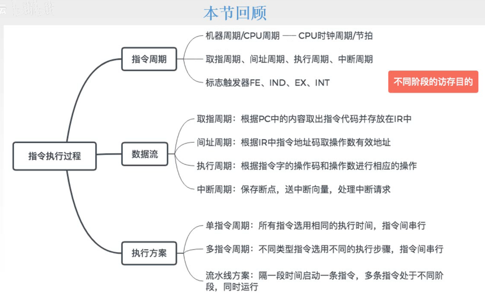

# 指令执行过程

上一节讲了CPU的功能和结构，这一节讲一条指令如何完成它的运行。

## 一. 指令周期

### 1.1 指令周期、机器周期、时钟周期

图1.指令周期、机器周期

**指令周期**：CPU从主存中每取出并执行一条指令所需的全部时间。

**机器周期**：指令周期由若干机器周期组成，机器周期又叫**CPU周期**。

而一个机器周期（CPU周期），还可以细分为多个时钟周期。
如图1中的取指周期、执行周期，在一个机器周期中执行的操作也是很多步骤，显然以机器周期来分析，不够微观。

通常用内存中读取一个指令字的最短时间来规定CPU周期（机器周期）。

**时钟周期**：一个机器周期包含若干时钟周期，是CPU操作的**最基本单位**，也称**节拍、T周期、CPU时钟周期**。
图2中一起一伏为一个节拍，即一个时钟周期。

指令周期>机器周期>时钟周期。

图2.指令周期、机器周期、时钟周期

感觉上的理解：
时钟周期是完成最微观的一个动作的时间，
机器周期是完成其中的一个步骤的时间，
指令周期是完成完整的一个指令的时间。

图3.指令周期可不等，机器周期可不等

可以注意到，图2，图3给出的图示，说明，
每个指令周期的机器周期个数可以不相等，每个机器周期内的时钟周期个数也可以不相等。

### 1.2 指令周期流程

指令周期的长度不同，那么每条指令，在其指令周期内是如何运行的，其运行流程是什么样的呢。

图4.指令周期流程

取指周期，然后判断是否需要间址寻址，是，进入间址周期再进入执行周期，否，进入执行周期；
进入执行周期，判断是否有中断，是，进入中断周期再进入下一条指令的取值周期，否，进入取值周期；
进入下一条指令的取值周期。

知道了指令周期的流程，如何判断、知晓当前处于指令周期的哪一个阶段呢？

图5.触发器

使用**触发器**来判断当前处于哪一个周期。

四个触发器对应四种机器周期，每次进入一个周期时，触发器变为1。
图5中给出了四种周期对应的二进制数。

有了触发器的指示，还可以根据触发器的状态来设计一些指令的执行。（到后面控制器的设计再讲）

这四种周期都有CPU的访存操作，其目的不同。
取指周期：取指令，读操作；
间址周期：取有效地址，读操作；
执行周期：取操作数，读操作；
中断周期：保存程序断点，写操作。

## 二. 指令周期的数据流

了解每个机器周期的内各自需要完成的工作。

### 2.1 取指周期

图6.取指周期的操作

从PC中的指令地址开始，到指令存入IR结束。

1.  $(PC)\rightarrow MAR$ ，
   把当前指令的地址送到MAR。
2.  $1\rightarrow R$ ，
   CU发出控制信号，此时为读信号，经过控制总线，传给主存，启动主存做读操作。
3.  $M(MAR)\rightarrow MDR$ ，
   MAR中的地址，经过地址总线，传给主存；主存把对应地址中的内容，经过数据总线，传给MDR。
4.  $(MDR)\rightarrow IR$ ，
   把MDR中的内容，此时为指令，传给IR。
5.  $(PC)+1\rightarrow PC$ ，
   CU发出控制信号，形成下一条指令地址。
   （通常是+1，当然也会有+2，+其他数的情况，具体看题。）

### 2.2 间址周期

图7.间址周期的操作

从取指周期结束开始，到有效地址存入MDR结束。

进入间址周期，说明是间址寻址，以一次间址为例：

1.  $Ad(IR)\rightarrow MAR$ 或 $Ad(MDR)\rightarrow MAR$ ，
   将取指周期中取到的指令中的地址码Ad传入MAR，两种写法都对，因为此时MDR和IR中的数据都是一样的。
2.  $1\rightarrow R$ ，
   CU发出控制信号，此时为读信号，经过控制总线，传给主存，启动主存做读操作。
3.  $M(MAR)\rightarrow MDR$ ，
   MAR中的地址，经过地址总线，传给主存；主存把对应地址中的内容，经过数据总线，传给MDR。
4.  $(MDR)\rightarrow IR$ 或 $(MDR)\rightarrow MAR$ 
   根据不同教材，第4步操作有所不同，
   一种是把MDR中的内容，此时为有效地址，传给IR，和取指周期中一样的操作；
   一种是既然MDR中此时已经是有效地址了，那就直接传给MAR就好啦。

一般来说间址周期的数据流就写前3步。

### 2.3 执行周期

图8.执行周期的操作

由于执行周期，不同指令的执行周期的操作不同，所以先不介绍了，到下一节再讲。

### 2.4 中断周期

图9.中断周期的操作

从SP进栈开始，到向量地址（要去做的另一个任务的地址）存入PC结束。

中断，是暂停当前任务去完成其他任务，自然完成其他任务后，需要恢复之前暂停的任务继续执行，所以需要**保存断点**。

一般使用堆栈来保存断点，这里使用SP表示栈顶，假设SP指向栈顶元素，进栈操作是先修改指针，后存入数据。

1.   $(SP)-1\rightarrow SP,(SP)\rightarrow MAR$ ，
   CU发出控制信号，SP中地址减1，将修改后的地址送入MAR。

这里堆栈，是从高地址（栈底）往低地址（栈顶），所以进栈是SP-1，找个空的栈顶来存。

实际上一般不这么写。

   本质上就是要把断点存起来，这里传给MAR的地址其实就是PC要保存到的地址，假设地址为a，通常这一步就写成 $a\rightarrow MAR$ 。也就是简单的看成CU直接控制把a传入MAR中。

   这也是为什么图9中CU到SP到MAR画的是灰色的，而CU到MAR画了一个蓝色的箭头。

2.  $1\rightarrow W$ ，
   CU发出控制信号，此时为写信号，经过控制总线，传给主存，启动主存做写操作。

3.  $(PC)\rightarrow MDR$ ，
   将断点送入MDR，前面已经发出了写信号，MDR中的内容自然就会写入主存。

   这样，完成了暂停，也就是把PC中的本该是下一个取指的地址保存好了。

4.  $\text{向量地址}\rightarrow PC$ ，
   CU控制将中断服务程序的入口地址（由向量地址形成部件产生），这个地址送入PC。

   中断服务程序的入口地址，就是其他任务的第一句指令，是由一个部件叫做向量地址形成部件产生的，所以这个地址又叫做向量地址。

   这样下一步CPU根据PC当中的内容去取指，就是去完成另一个任务了。

## 三. 指令执行方案

每条指令，可以拆分为多个操作。

### 3.1 单指令周期

对每条指令选用相同的执行时间来完成。指令为串行进行，一条执行完才进行下一条。

简单的说就是，给定一个时间，所有指令都在这个时间中完成就行了。

于是这种方案下，为了保证每条指令都能完成操作，这个限制时间自然是所有指令中最长的指令周期。

当然这会导致原本不需要这么长时间的指令，有空闲时间是没有利用的。
比如假设乘法指令最长，可能使用16个时钟周期，但是加法指令可能只用4个时钟周期就完成了，后12个时钟周期就浪费了。

不过设计简单。

### 3.2 多指令周期

对不同类型指令使用不同的执行步骤来完成。指令仍为串行进行。

设计复杂一点了。

我的理解是，把指令中拆分为多个机器周期，比如很多指令都有着取指，间址，执行，中断的操作，于是我们对这些拆分出来的、共有的操作进行设计合适的时钟周期，这样每个步骤（机器周期）不会出现空闲时间，自然每个指令周期也不会有空闲时间了。
（实际上我觉得单指令周期也可以理解为，指令也拆分为了多个步骤，但是每个步骤的耗时都设为了最大机器周期。多指令就是对不同指令的每个步骤进行了优化，缩短了其机器周期。）

也就不会出现短的指令未利用充分时钟周期的情况。

### 3.3 流水线方案

在每一个时钟周期就启动一条指令，尽量让多条指令同时运行，但各自处于不同的执行步骤中。

依据就是在不同的机器周期（步骤）中，所需要的硬件是不同的。

（在理想状态下，每个时钟周期，都能完成指令的一个机器周期。）

这样就实现了指令的并行执行。不同指令处于不同阶段，使用不同硬件。

## 四. 本节回顾

图11.本节回顾

2020.09.19