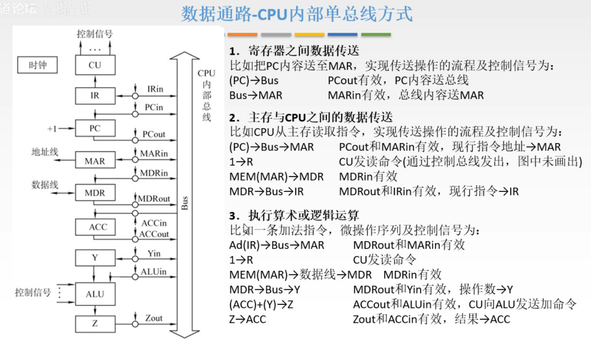
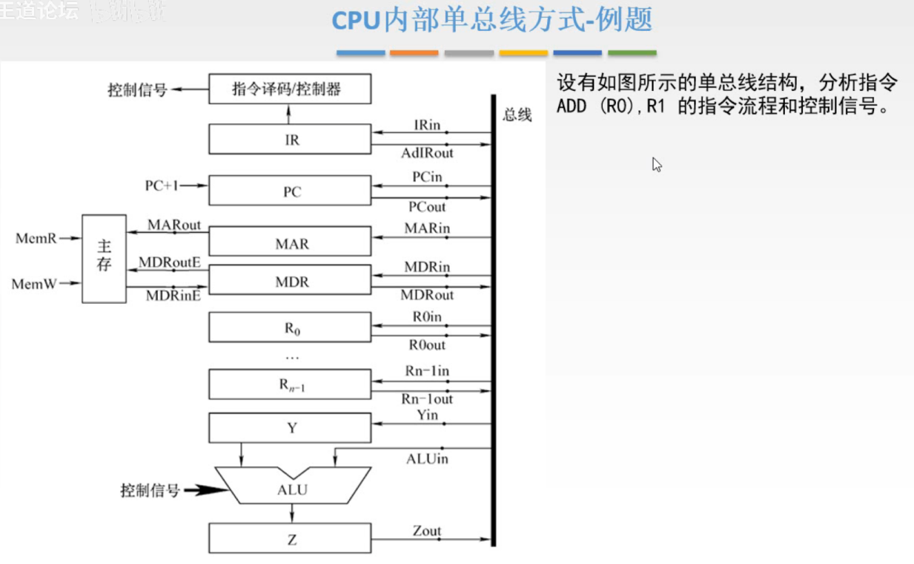
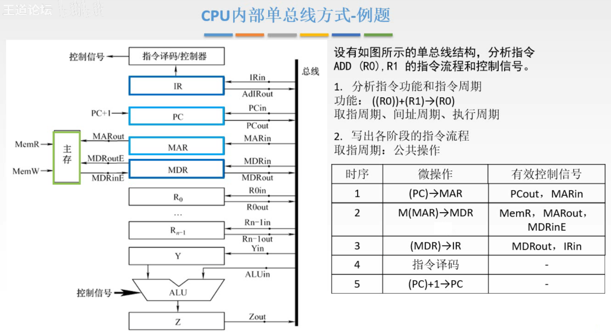
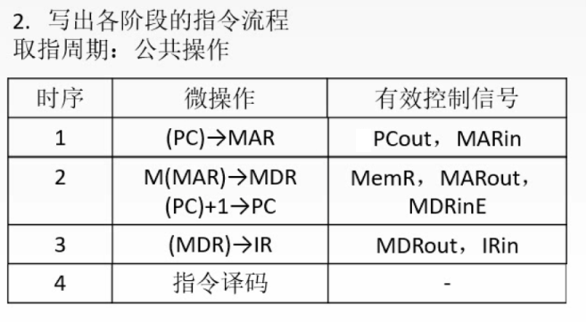
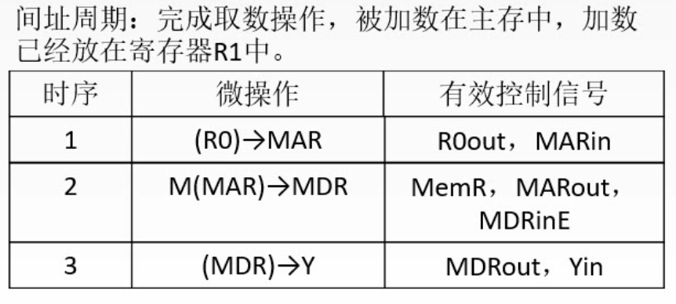
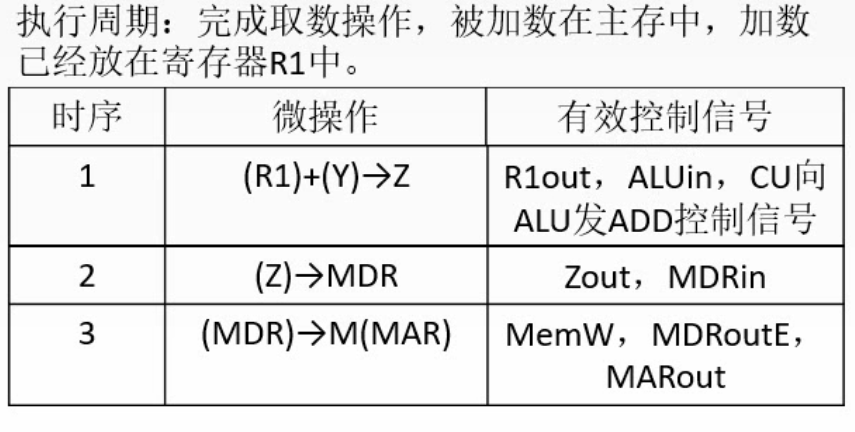
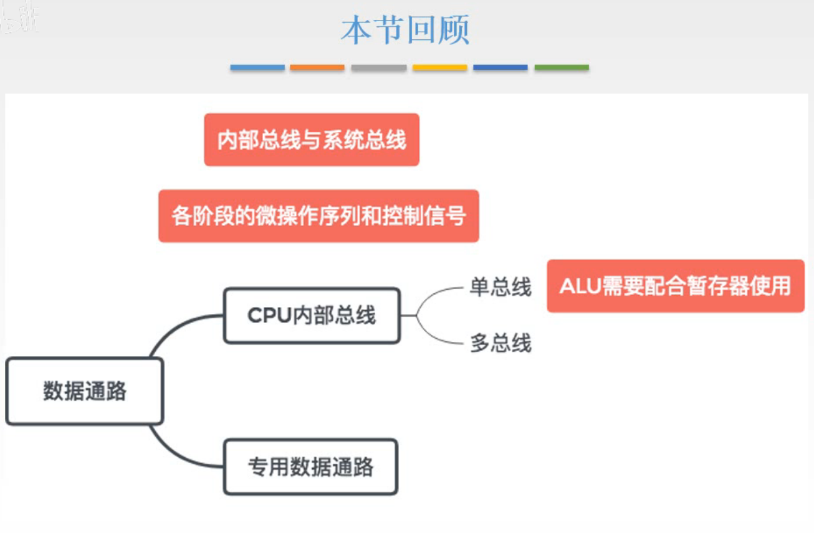

# 数据通路的功能与基本结构-单总线

这一节，学数据通路的建立，不同机器周期步骤的实现。

**数据通路**：数据在功能部件之间传送的路径。

**数据通路的基本结构**：

1. CPU内部单总线方式；
2. CPU内部多总线方式；
3. 专用数据通路方式。

这一节以CPU内部单总线方式来学数据通路的建立。

先补充一个概念：

图1.内部总线，系统总线

**内部总线**：是指同一个部件内各更小构成之间的总线，如CPU内部总线。

**系统总线**：指同一台计算机系统的各部件之间的总线，如CPU、内存、通道和各类I/O接口之间的总线。

## 一. 三种数据通路的建立

图2.三种数据通路的建立

图2中，$X_{out},X_{in}$ 分别控制通路的输入与输出，但是图2的 $X_{in}$ 的连线画错了，应该是单向的，是没有指向总线Bus的箭头的。

还有因为图2有些没画出来，所以下面3种数据通路的步骤是按图2写的，和例题有差异，例题的图要完整点。

图2的Y，Z就是暂存寄存器。

下面是三种数据传送的流程以及相应控制信号。
这个流程有时也叫做微操作序列。

### 1.1 寄存器之间的数据传送

比如将PC中的内容送至MAR：

1.  $(PC)\rightarrow Bus$ ， $PC_{out}$ 有效，PC内容送到总线。
2.  $Bus\rightarrow MAR$ ， $MAR_{in}$ 有效，总线内容送到MAR。

### 1.2 主存与CPU之间的数据传送

比如CPU从主存读取指令：

1.   $(PC)\rightarrow Bus\rightarrow MAR$ ， $PC_{out}$ 有效， $MAR_{in}$ 有效，PC内容送到MAR。

   这里就直接写成一行了，因为 $PC_{out},MAR_{in}$ 可以同时有效嘛。刚才寄存器之间的数据传输写成两步，是为了方便理解。

2.   $1\rightarrow R$ ，CU发送读命令到主存。

3.   $M(MAR)\rightarrow MDR$ ， $MDR_{in}$ 有效。

   图2中写的是MEM(MAR)，和只写M都一样的，都是主存的英文单词的前面字母嘛。
    $MDR_{in}$ 有效，其实这里原本是会有歧义的，因为MDR和CPU内部总线与外部数据总线都可以读写，但是这图2里标注且只标注了MDR与CPU内部总线的连线为 $MDR_{in}$ ，所以才这么写，也没有歧义。

4.   $(MDR)\rightarrow Bus\rightarrow IR$ ， $MDR_{out}$ 有效， $IR_{in}$ 有效，指令送到IR。

### 1.3 执行算术或逻辑运算

比如一条加法指令，假设这个加法指令一个操作数在主存当中，由IR中的地址码指出，另一个操作数在ACC中：

1.  $Ad(IR)\rightarrow Bus\rightarrow MAR$ ， $MDR_{out}$ 有效， $MAR_{in}$ 有效。

   这里写的是 $MDR_{out}$ 有效，是因为此时MDR的内容和IR是一样的，而图2中IR没有输出到Bus的连线。
   如果图2里提供了 $AdIR_{out}$ ，就可以写成 $AdIR_{out}$ 有效， $MAR_{in}$ 有效。

2.   $1\rightarrow R$ ， $MAR_{in}$ 有效，CU发送读命令到主存。

3.   $M(MAR)\rightarrow MDR$ ， $MDR_{in}$ 有效。

4.  $(MDR)\rightarrow Bus\rightarrow Y$ ， $MDR_{out}$ 有效， $Y_{in}$ 有效，操作数送到IR。

5.  $(ACC)+(Y)\rightarrow Z$ ， $ACC_{out}$ 有效， $ALU_{in}$ 有效，CU向ALU发送命令。

6.  $(Z)\rightarrow ACC$ ， $Z_{out}$ 有效， $ACC_{in}$ 有效，结果送到ACC。

## 二. 例题

不同机器周期步骤，其实就是通过以上三种组合来实现。

图3.例题

先补充两点，
指令为 $ADD\quad A,B$ ，一般前面的A叫做目的操作数，后面的B叫做源操作数，操作完的结果是存回目的操作数A的位置。
A，B，用R开头表示寄存器，直接写 $R_1$ 就表示操作数在寄存器 $R_1$ 中，加括号 $(R_0)$ 表示操作数的地址放在这个寄存器 $R_0$ 中（就是A，B是地址的含义，自然 $(R_0)$ 的意思是A的地址是 $R_0$ 的内容呗）。
还有前面带#的，比如是#R12，就表示立即寻址，后面的数据就是操作数。

图4.

第一步，分析指令功能和指令周期。

功能是： $((R_0))+(R_1)\rightarrow (R_0)$ 。
周期有：取指周期、间址周期、执行周期。

第二步，写出各阶段的指令流程。

取指周期：

1. 时序：1，
   微操作： $(PC)\rightarrow MAR$ ，
   有效控制信号： $PC_{out},MAR_{in}$ 。
2. 时序：2，
   微操作： $M(MAR)\rightarrow MDR$ ，
   有效控制信号： $MemR,MAR_{out},MDR_{in}E$ 。（ $MemR,MemW$ 是控制主存读写的信号）
3. 时序：3，
   微操作： $(MDR)\rightarrow IR$ ，
   有效控制信号： $MDR_{out},IR_{in}$ 。
4. 时序：4，
   微操作：指令译码，
   有效控制信号：自动的，所以不写。
5. 时序：5，
   微操作： $(PC)+1\rightarrow PC$ ，
   有效控制信号：PC可能硬件自带加1功能，可以不写，当然也可能要借助ALU来实现加1，根据题目来写，这里题目不用写。

图5.取指周期

可以注意到，PC加1的步骤，在时序1之后，PC就没有用到了，如果PC有自增的功能的话，也不影响数据的传送，所以时序1之后就自增1呗，还能省下一个时序。

图6.间址周期

间址周期：

1. 时序：1，
   微操作： $(R_0)\rightarrow MAR$ ，
   有效控制信号： ${R_0}_{out},MAR_{in}$ 。
2. 时序：2，
   微操作： $M(MAR)\rightarrow MDR$ ，
   有效控制信号： $MemR,MAR_{out},MDR_{in}E$ 。
3. 时序：3，
   微操作： $(MDR)\rightarrow Y$ ，
   有效控制信号： $MDR_{out},Y_{in}$ 。

图6，这里的间址周期写的是完成取数操作结束（时序3完成结束），前面讲的是间址周期结束于完成取有效地址操作（到时序2完成结束，虽然我前面貌似忘了写各个周期什么时候结束= =），包括王道的书上也是写的到完成取有效地址结束。
这是因为组成原理，不同老师的概念定义不一样，所以这例题的答案写的是完成取数操作结束。不过做题一般是让写整个流程，所以没啥影响。
我这里分开机器周期写也只是方便理解。

图7.执行周期

执行周期：

1. 时序：1，
   微操作： $(R_1)+(Y)\rightarrow Z$ ，
   有效控制信号： ${R_1}_{out},ALU_{in}$ ，CU向ALU发送ADD控制信号。
2. 时序：2，
   微操作： $(Z)\rightarrow MDR$ ，
   有效控制信号： $Z_{out},MDR_{in}$ 。
3. 时序：3，
   微操作： $(MDR)\rightarrow M(MAR)$ ，
   有效控制信号： $MenW,MDR_{out},MAR_{out}$ 。

这例题，就省略掉了写Bus了，是可以省的。

## 三. 本节回顾

图8.本节回顾

2020.09.19

