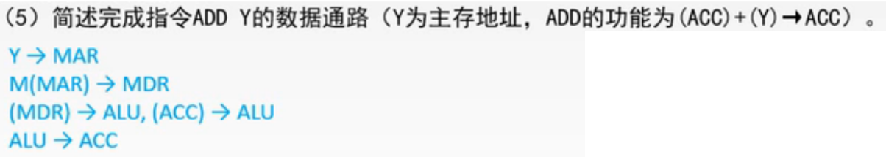

# 数据通路-专用数据通路

上一节讲了，在单总线的方式下，数据通路的建立与流程。

这一节讲，在专用数据通路方式下的数据通路的建立与流程。也就是专用数据通路方式下，写微操作序列和控制信号啦。

## 一. 专用数据通路方式的建立与流程

图1.专用数据通路方式

以取指周期为例：

图2.取指周期

1. 时序：1，
   微操作： $(PC)\rightarrow MAR$ ，
   有效控制信号： $C_0$ 。
2. 时序：2，
   微操作： $(MAR)\rightarrow 主存$ ，
   有效控制信号： $C_1$ 。
3. 时序：3，
   微操作： $1\rightarrow R$ ，
   有效控制信号： CU向主存发送读信号。
4. 时序：4，
   微操作： $M(MAR)\rightarrow MDR$ ，
   有效控制信号： $C_2$ 。
5. 时序：5，
   微操作： $(MDR)\rightarrow IR$ ，
   有效控制信号： $C_3$ 。
6. 时序：6，
   微操作： $(PC)+1\rightarrow PC$ ，
   有效控制信号： $C_0$ 。
7. 时序：7，
   微操作： $Op(IR)\rightarrow CU$ ，
   有效控制信号： $C_4$ 。
   这一步，之前是把译码这个步骤当作自动的过程，不过这里既然图里画出了IR和CU之间有通路有开关，那就写上这个数据流动。

## 二. 例题

题目：

图3.例题

第1问外，后面5问其实都是写出数据通路。

图4.例题的图

题目中写了，图中省略了所有的多路选择器，所以看到一个部件被连了几根线其实是有多路选择器MUX来控制输入哪一路的。

图5.第一问

第一问

a：MDR
b：IR
c：MAR
d：PC

图6.第二问

第二问

取指令的数据通路，因为只说了写数据通路，而图中也没给出控制信号的编号，所以写流程就行了，不用写控制信号了。

 $(PC)\rightarrow MAR$ ，
 $M(MAR)\rightarrow MDR$ ，
 $(MDR)\rightarrow IG$ ，

图7.第三问

第三问

因为ALU是只负责计算的组合逻辑电路，是不具备保存功能的，所以从主存拿出来的数据，在这图中没有给暂存寄存器，只能存在ACC中了。
描述数据的存/取的数据通路，所以不用管地址是怎么来的了，说明一下，设数据地址已经放入MAR中。

设数据地址已经放入MAR中，
取：
 $M(MAR)\rightarrow MDR$ ，
 $(MDR)\rightarrow ALU\rightarrow ACC$ ，穿过ALU，理解为没有计算，没有改变数据就好啦。

存：
 $(ACC)\rightarrow MDR$ ，
 $(MDR)\rightarrow M(MAR)$ ，

图8.第四问

第四问

一般为了防止有人知道有人不知道LAD这些指令是什么意思，题目会给出解释的。

 $X\rightarrow MAR$ ，
 $M(MAR)\rightarrow MDR$ ，
 $(MDR)\rightarrow ALU\rightarrow ACC$ ，

图9.第五问

第五问

 $Y\rightarrow MAR$ ，
 $M(MAR)\rightarrow MDR$ ，
 $(MDR)\rightarrow ALU,(ACC)\rightarrow ALU$ ，
 $ALU\rightarrow ACC$ ，（这里ALU没有加括号是因为本身ALU是不具备存储功能的，所以不用这么严谨加括号）

图10.第六问

第六问

 $Z\rightarrow MAR$ ，
 $(ACC)\rightarrow MDR$ ，
 $(MDR)\rightarrow M(MAR)$ ，

这个例题，比较简单，只要求写出数据通路，会有题目是要写出控制信号的。还有题目会要求让能并行的操作尽量并行，就是写出来流程之后把可以并行的写在同一行。

## 三. 本节回顾

图11.本节回顾

2020.09.20