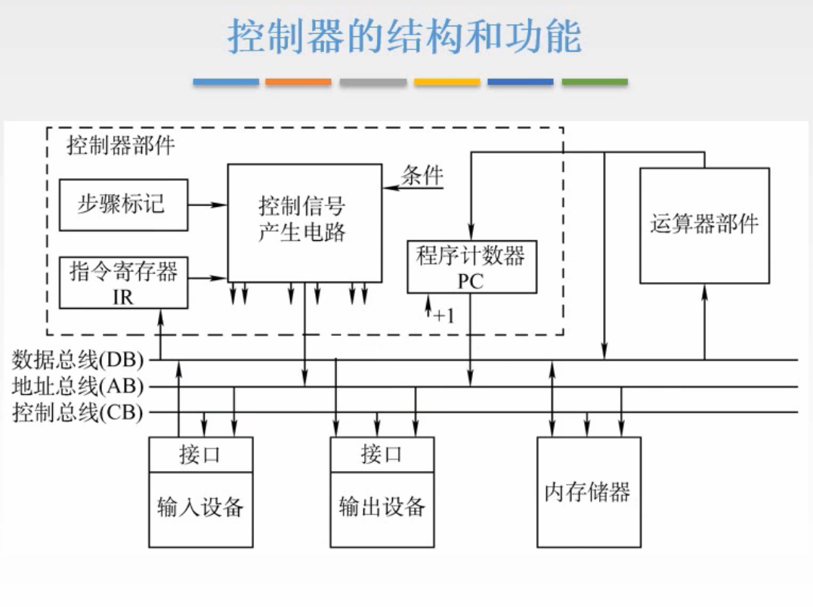
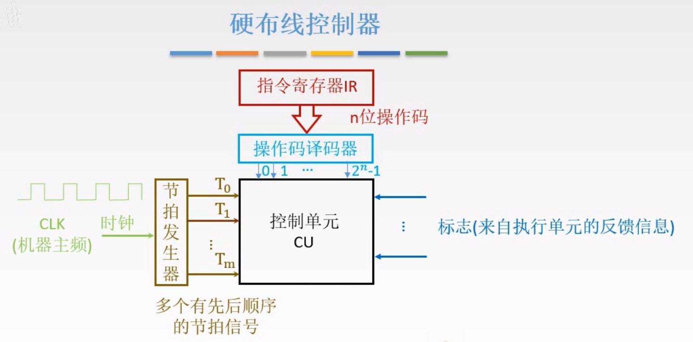

# 控制器的功能与工作原理-硬布线

回顾一下，最开始讲了CPU的功能与结构，
那么如何完成这些功能，将功能拆分成一条条的指令，
对指令又拆分成不同的执行阶段，不同的执行阶段要完成一系列的微操作，
如何实现这些微操作，依靠控制信号，在相应的时刻建立起对应的数据通路，

前两节讲了数据通路，其中控制信号只是写一下，知道有控制信号，
还剩下最后一个问题，如何发出控制信号，于是专门做了一个控制器来发出这些控制信号。而控制器又分为两种设计方式，硬布线与微程序。

硬布线主要设及到一些电路的设计，不是重点。
微程序主要是微指令的设计，重点。

这一节讲硬布线的方式。

## 一. 控制器的结构和功能

### 1.1 结构

图1.控制器的结构和功能

图1中，总线的上面部分是CPU，上面左边是控制部分，右边是运算器部分；下面部分是输入设备、输出设备、内存。这就是整个计算机啦。

控制器，控制整个系统的运行。

对于CPU内部的控制，前面数据通路已经讲过了，根据控制信号，构建一系列的数据通路，来完成微操作序列。

图2.对外部的控制

对外部的控制，通过系统总线来控制。

首先要控制一个设备，那么就要先定位到这个设备，通过地址总线来确定要控制的设备。
（前面的内容说地址总线是传递主存地址的，所以实际上地址总线的内容既可以表示主存地址，也可以表示那一个设备，至于如何区分是哪一种，在后面会学到。）

然后依靠控制总线，得到控制信号，来完成工作。

完成工作所需的数据，通过数据总线传送。
输入输出设备是经过接口连接到数据总线的，因为输入输出设备种类太多，数据类型比较多，所以通过接口把数据转换为CPU可以处理的数据类型。

可以注意到，一般来说地址信号，控制信号都是CPU向这些设备发出的，所以通常地址总线、控制总线都是单向连接的；数据总线涉及到相互的数据传送，则是双向连接的。

图3.

来看看一条指令周期的流程：

PC通过地址总线向内存发出地址信号；
内存把相应数据通过数据总线传到指令寄存器中
（当然因为数据总线的内容可能是指令也可能是数据，所以也可能是传到运算器部件中，由控制部件来判断是传到哪，前面讲过根据触发器来确定不同机器周期从而判断。）
IR将Op传送到控制信号产生电路中进行译码，
译码后就会产生相应的控制信号，传送到相应的位置，进行工作，就完成本条指令的执行，
然后是PC+1，如果是转移指令，可能还需要运算器来计算得到，所以有连线从运算器部件到PC。

### 1.2 功能

图4.总结一下控制器的功能

控制器是计算机系统的指挥中心，主要功能有：

1. 从主存中取出一条指令，并指出下一条指令在主存中的位置；
2. 对指令进行译码或测试，产生相应的控制信号，以便启动规定的动作；
3. 指挥并控制CPU、主存、输入和输出设备之间的数据流动方向。

## 二. 硬布线控制器

### 2.1 控制器的输入与输出

先分析一下控制器的输入与输出。

输入：

1. 指令寄存器，
    $Op(IR)\rightarrow CU$ ，控制信号的产生与操作码有关。

2. 时钟，
   一个时钟脉冲发送一个操作命令或一组需要同时执行的操作命令。

   因为CU是要输出有执行顺序的信号嘛，自然需要时钟来产生顺序这个概念。
   时钟的基本单位就是时钟脉冲。

3. 标志，
   某些操作是要满足一些特殊条件才执行的，所以输入标志，主要来源于PSW（也叫标志寄存器），比如条件转移指令（这里的条件其实就是标志寄存器当中的某一个二进制位），根据相应的标志位决定下一步操作

4. 外来信号，
   接收外部部件传来的，反馈的一些状态，比如中断请求信号INTR，总线请求信号HRQ。

输出：

1. CPU内部的控制信号，
   控制CPU内部，寄存器之间的数据传输，PC的修改、控制ALU进行相应的运算。
2. 到系统总线的控制信号，
   控制外部的部件，
   到存储器的：访存控制信号 $\overline{MREQ}$ ，读命令 $\overline{RD}$ ，写命令 $\overline{WR}$ ，
   到I/O设备的：访问I/O设备的控制信号 $\overline{IO}$ ，中断响应信号INTA，总线响应信号HLDA。

### 2.2 设计思路

现在再来想控制器的设计，有两种方案：

1. 硬布线（组合逻辑电路+触发器）
2. 微程序。

这里讲硬布线控制器，但是我们只完成组合逻辑电路的部分，实际上的硬布线控制器是组合逻辑电路+触发器构成的。毕竟二者组合才能构成时序逻辑电路，光一个组合逻辑电路是没法产生时序的。

图6.

为了方便分析，把指令译码和节拍发生器从CU中分离出来分析。

标志：

实际上是输入信号中的标志和外来信号，因为都可以看作是反馈信息，所以合并为一起来考虑。

**操作码译码器**：

假设n位操作码，可以表示 $2^n$ 不同的操作，于是设置 $2^n$ 根连线，经过操作码译码器，只使该操作码对应的连线为1，其他连线都为0（假设高电平有效），这样就CU根据连通的是哪根线进行对应的操作。

**节拍发生器**：

节拍发生器接收机器主频CLK，能够产生多个有先后顺序的节拍信号。

图7.节拍发生器产生的信号

图7画的是只有4个节拍信号，在每个节拍信号的起始端，CU可以产生给定的控制命令。
也就是 $T_0$ 高电平发出一次命令， $T_1$ 高电平发出一次命令，以此类推。

完成了一个步骤，其用时就叫做机器周期。也就是组成机器周期的节拍数越多，说明耗时越长。
这里图7都是4个节拍。就对应了前面几节说的取指周期、间址周期、执行周期、中断周期。

我好像懂了为什么可以起到时序作用了，因为 $T_0\sim T_3$ 的信号是有先后且循环的，那么当接收信号为 $T_0$ 时，发送一次命令；当为 $T_1$ 时，发送一次命令，这样就是顺序的执行了。
但是这样也不用分成几根线啊，直接用CLK，每次高电平发送命令不一样嘛？疑惑，等我学了后面看看有没有解释。（我懂啦在最下面）

图8.关于机器周期

再提一下，关于机器周期。

可以理解为所有指令的指令周期中的基准时间。
因为通常来说存取数据是耗时最长的，所以通常以存取周期来作为机器周期，由多个机器周期构成指令周期。
当存储字长等于指令字长时，取址周期也可以看作机器周期，因为取指和取值，都是一样的到主存取东西嘛，不一样长的话可能取指令要多次，比如指令字长是存储字长的两倍，要取两次。

图9.硬布线设计步骤

硬布线的设计步骤：

1. 分析每个阶段的微操作序列

   在前面几节已经分析过了，就是数据通路和控制信号。

2. 选择CPU的控制方式

3. 安排微操作时序

   也就是对应图7中每个时钟周期（节拍）要完成微操作序列的那几步。

4. 电路设计

   安排好每个节拍要做的事情，就可以对要做的事情进行电路设计。

### 2.3 CPU的控制方式

#### 2.3.1 同步控制方式

图10.同步控制方式

同步控制方式：
整个系统的控制信号均来自一个**统一的时钟信号**。

通常是设计成每个机器周期一样的，就算有些步骤不需要这么长，也给加到一个机器周期这么长。
但是也有机器周期不一样长的，如图10b，但时钟周期还是来自同一个统一的时钟信号。
（所以说重点是在来自一个统一的时钟信号，我还以为是机器周期一样长= =差点被误导）

优点：控制电路简单；缺点：运行速度慢。

#### 2.3.2 异步控制方式

图11.异步控制方式

异步控制方式：
**不存在基本信标信号**。

各部件按自身固有的速度工作，通过**应答方式**进行联络。

优点：速度快；缺点：控制电路复杂。

就是两个部件之间需要先问问，诶你现在空吗，空啊，好的我给你传数据，不空啊，快点啊我要给你传数据。

#### 2.3.3 联合控制方式

图12.联合控制方式

联合控制方式：
对各种不同的指令的微操作实行**大部分采用同步控制、小部分采用异步控制**的方法。

### 2.4 安排微操作的时序

上一步中，我们选择用同步控制的方式，且机器周期安排3个节拍。

#### 2.4.1 安排微操作时序的原则

图13.安排微操作时序的原则

安排微操作时序的原则：

1. 微操作的先后顺序不得随意更改。
2. 被控制对象不同的操作，尽量安排在一个节拍内完成。
3. 占用时间较短的微操作，尽量安排在一个节拍内完成，并运行有先后顺序。

#### 2.4.2 安排各机器周期的微操作时序

图14.取指周期的微操作时序安排

取指周期

图14左方是原本的取指周期的微操作，右方是安排后的微操作。

ID是操作码译码器。

可以发现 $(3)(6)$ 都只要求在 $(1)$ 之后就行，而 $(3)(4)(5)$ 的顺序不能更改因为后者要用到前者。
同时 $(3)(6)$ 这两个微操作，是控制的不同部件，所以把 $(6)$ 这一个微操作放在前面去，和 $(3)$ 在一次。

于是在 $T_0$ 内，完成  $(1)(2)$ 命令，因为二者是控制不同部件；
在 $T_1$ 内，完成  $(3)(6)$ 命令，因为二者是不同部件；
在 $T_2$ 内，完成  $(4)(5)$ 命令，虽然确实 $(4)(5)$ 是有先后顺序的，但是因为执行时间都很短，所以能在一个节拍内完成就完成。

图15.间址周期的微操作时序

间址周期

没什么好动的，在 $T_0$ 完成 $(1)(2)$ ，因为控制对线不同；在 $T_1$ 完成 $(3)$ ；在 $T_2$ 完成 $(4)$ 。

图16.执行周期

执行周期

图16是各个指令对应的微操作的时序。

又可分为：非访存指令，访存指令，转移指令。

虽然我截图了，但我并不想看= =。

考试的时候给出指令会给意思的。

图17.中断周期

中断周期

顺序也没调，就是前面 $(1)(2)(3)$ 在 $T_0$ 内完成。

也把这些操作称为中断隐指令，但并不是一条指令啊。

这样就完成了安排微操作的时序。

### 2.5 组合逻辑设计

组合逻辑设计又可细分为三个步骤：

1. 列出操作时间表。
2. 写出微操作命令的最简表达式。
3. 画出逻辑图。

#### 2.5.1 操作时间表

图19.操作时间表

操作时间表，左边是每个机器周期，每个节拍可能用到的微操作。
右边是前面执行周期说到的10条指令，从左往右前5条是非访存指令。

如果指令在对应的时期可能会用到该微操作，就填1，不会用到就填0。

图19中 $I$ 为1，进入间址周期， $\overline I$ 为1进入执行周期。
 $\overline {IND}$ 为1，进入执行周期，否则不进入。

#### 2.5.2 最简表达式

根据图19，可以写出微操作的逻辑表达式。

以 $M(MAR)\rightarrow MDR$ 为例，

实际上 $FE,IND,EX,T_i,CLA...BAN$ 都是一个信号，也就是操作码译码器接入 CU 的线。CU接收这些信号，依照这个表达式的逻辑来建立电路，如果结果为1，则输出 $M(MAR)\rightarrow MDR$ 命令。

#### 2.5.3 逻辑图

根据 $M(MAR)\rightarrow MDR$ 的逻辑表达式来画逻辑图。

图21.逻辑图

我懂了。

为什么不直接用CLK，而是用节拍发生器？

每个微操作都有自己的类似图21的电路，决定是否输出控制信号。
当一个指令经过指令译码，就会把信号传到微操作电路中，比如ADD指令，那么所有的微操作电路的ADD都为1。
那么现在就只差节拍信号了。此时注意了节拍发生器的作用，如果没有节拍发生器，直接用CLK（比如图21的 $T_1$ 连线变为了CLK），那么导致所有的微操作电路都接通CLK，通电，导致同时复数个的微操作电路发出了控制信号。
而有了节拍控制器，当依次为 $T_0,T_1,T_2$ 时，连通的是不同的微操作电路，于是就实现了微操作控制信号的依次输出。

我（2021.07.01 ）再补充，其实就是由于有些微操作命令信号是具有先后顺序的，所以得用节拍发生器区分开，比如取指周期中的 (PC)->MAR 和 M(MAR)->MDR。如果不考虑节拍，那么二者的逻辑表达式是一样的。而考虑了节拍，才会实现 M(MAR)->MDR 只在 (PC)->MAR 执行后才执行。

为什么叫硬布线？

因为是把每个微操作的逻辑表达式写出来，然后实现，做成硬件。比较复杂，而且做成硬件之后想要增加新的控制功能，那就很难了，又要重新设计重新布线。但是速度快啊，毕竟是硬件，组合逻辑电路部分电流流过去就出结果了。
（我感觉就是连线很多，硬是头铁给连上，所以叫硬布线，哈哈哈）

### 四. 本节回顾

图22.本节回顾

这一节其实并不是重点，基本不会考大题，其实是几乎不考= =，毕竟我也感觉这出题做起来也太麻烦了。

2020.09.20

