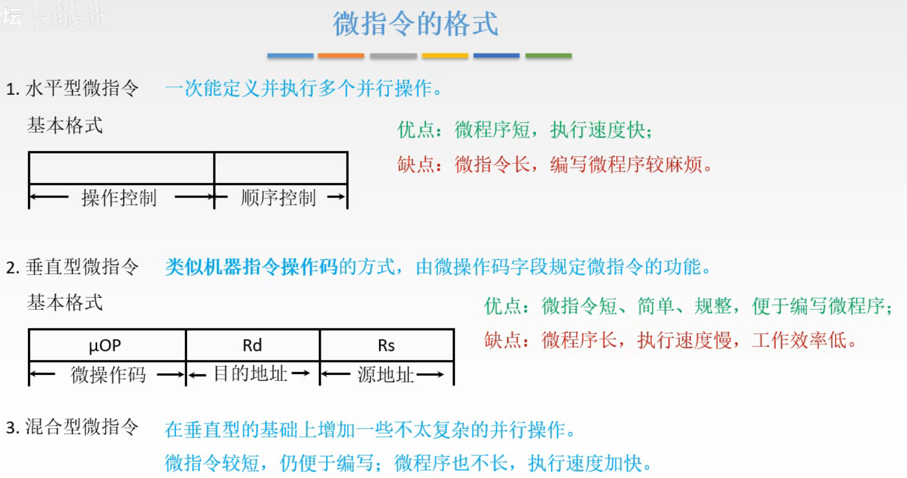

# 控制器的功能与工作原理-微程序

硬布线设计方式讲过了，这一节讲微程序的方式。

这节就是重点了。

图1.对比硬布线和微程序

硬布线方式，就是把发出微操作控制信号做成一个组合逻辑电路。

微程序方式，类似于查表，把要发出的微操作控制信号，存储在专用的控制存储器中，也就是现在控制存储器中每个存储单元存的是不同微操作的控制信号，然后把每条指令编写成一个微程序（微程序由为多个微指令组成），传给控制存储器，控制存储器就会依次根据微指令指出的存储单元的微操作控制信号。
（写的很乱看下面解释就理解了。）

## 一. 微程序的基本思想

图2.分解指令

一条指令，是由多个微操作组成的，把发出的微操作控制信号称为**微命令**，即一条指令是由依次发出的微命令完成的。

而一个微命令本质就是发出一个控制信号。

假设有8个微命令，我们直接将其控制信号存储起来，使之对应8位二进制位，如果一个微命令对应的二进制位为1，则发出该控制信号，否则不发出。比如0000 0100时，发出微命令3。

这0000 0100称为**微指令**。
（当然采用这样一位对应一个微命令，比较浪费，下面微指令的编码方式会讲到。）

图3.相容性、互斥性微命令

当然，有些微指令是可以在一个节拍中完成，称为**相容性微命令**，这些微命令可以同时产生，共同完成某一些微操作的微命令。反之，在机器中不允许同时出现的微命令，为**互斥性微命令**。

于是微指令可以有多个位同时为1，如0000 0101，则会同时发出微命令1和微命令3。这样就提高了速度。

所以一条指令，就可以拆分为多条顺序执行的微指令。
称一条指令对应的微指令序列为**微程序**。

图4.指令、微程序、微指令、微命令

所以当一条指令传来，是变为多条微指令（微程序）去顺序执行微指令序列的。意味着，需要先将每条指令的对应的微程序，也就是微指令序列写好。通常是将微程序存放在只读存储器ROM中。这样每条指令都可以在ROM中找到自己对应的微程序，即微指令序列。

图5.微指令基本格式

刚才微指令举得例子是0000 0100，但实际上，除了指出要释放哪些微命令控制信号，所以还需要指出微指令的顺序，也就是指出下一个微指令的地址。
所以微指令的基本格式为：微操作码（操作控制）+微地址码（顺序控制）。

图5蓝色框里说的意思是，因为每条指令都会有取指周期，而取指周期的操作都是相同的，所以相同的操作就只需要在ROM中存为一个微程序。而没有必要每个指令都完整的存入取指周期的微程序，只用各指令自己的、不同的操作的微程序，这样节省了ROM的空间。
所以实际上每条指令在ROM中对应的是自己的、独特的微程序，其中并不含有取指周期的的微指令。

## 二. 微程序控制器的基本结构

图6.微程序控制器的基本结构

虚线框内就是微程序控制单元。

IR中的操作码Op，传入给微地址形成部件，

微地址形成部件，接收到操作码Op，产生该操作码对应的初始微地址，也就是该指令对应的微程序的第一个微指令的地址，传给顺序逻辑。

顺序逻辑最后说，现在假设是继续执行微地址形成部件传来的微地址。

微地址寄存器CMAR，接收到微地址，然后传给地址译码，

通过地址译码，将微地址转化为存储单元的控制信号，传给控制存储器CM。

控制存储器CM，通常用ROM制作，接收到控制信号，输出对应的存储单元中的微指令，到微指令寄存器CMDR，

微指令寄存器CMDR，接收到CM传来的微指令，
其中微指令的微操作码部分，发出为1的位对应的微命令，传给CPU内部和系统总线；
微地址码用于指出该微程序下一个微指令的微地址，传给顺序逻辑。

顺序逻辑，控制微指令序列，接收CLK、标志（这里标志指来自PSW的）和CMDR的下地址，判断传给CMAR什么微地址。比如可能会遇到转移指令，比如现在是下地址传给了顺序逻辑，那么顺序逻辑就会根据下地址生成微地址给CMAR，而不是从微地址形成部件给的微地址了，就是这么一个选择用哪个的作用。

## 三. 控制存储器CM

图7.控制存储器

图7中左方为控制存储器CM中的微程序存储示意图。

微程序都是按顺序存储，一条微指令的下地址部分指出的下一条微指令地址为自身地址+1。

因为取指周期微程序为公共的微程序，每个指令对应的微程序中并不包括取指周期的微程序。

所以每个指令的对应的微程序执行完后，最后一条微指令的下地址部分指出的下一条微指令为取指周期微程序的第一条微指令，于是这样就实现了下一条指令的开始。

图8.公共的微指令

一个考点，通常是取指周期是公共的，所以如果问指令集中有n条指令，那么控制存储器中至少有n+1个微程序。

当然图7中是把取指周期、间址周期、中断周期的微程序都做成的公共的，所以以图7来说就是至少有n+3个。

但间址周期、中断周期不一定是公共的，取指周期才是默认公共的。

## 四. 微指令的格式

开始设计在控制存储器中的微指令的格式。

图9.微指令的格式

1. **水平型微指令**：
   一次能定义并执行多个并行操作。

   优点：微程序短，速度快。
   缺点：微指令长，编写微程序麻烦。

2. **垂直型微指令**：
   类似机器指令操作码的方式，由微操作码规定微指令的功能。

   优点：微指令短，简单、规整，便于编写微程序。
   缺点：微程序长，执行速度慢，工作效率低。

3. **混合型微指令**

   在垂直型的基础上增加一些不大复杂的并行操作，微指令较短，仍便于编写；微程序也不长，执行速度加快。

## 五. 微指令的编码方式

对于水平型微指令，其微操作码部分如何编码。

微指令的编码方式又叫做微指令的控制方式，是指如何对微指令的控制字段进行编码，以形成控制信号。编码的目的是在保证速度的情况下，尽量缩短微指令字长。

### 5.1 直接编码方式（直接控制方式）

图10.直接编码方式

也就是最简单就能想到了1位对应一个微操作命令，如果某位为1则该位对应的微操作命令有效。

如图10，最高位对应 $(PC)\rightarrow MAR$ 的微命令，最低位代表 $1\rightarrow R$ 的微命令，此时其他位都为0，于是此时这两个微操作同时进行。

优点：简单，速度快，并行性好。
缺点：微指令字长太长，有n个微命令就需要n位微操作码。

### 5.2 字段直接编码方式

图11.字段直接编码方式

把微操作码分为多段，每一段通过译码电路，就可以表示更多的状态。

比如把微操作码以3位为一段，比起原本直接编码方式，3位二进制位，只能表示控制3个微命令，而将3位二进制位经过译码电路就可以变为8位。
当然注意到，这样的话变成的8位只能够有一位为1，没法像直接编码一样可以并行，但是我们可以把这3位控制的微命令设计为互斥性微命令呀，把可以并行的相容性微命令设计在不同段，这样就解决了字段直接编码的并行。
比如图11中001表示 $(PC)\rightarrow MAR$ ，所以我们可以设计这段都是PC的微命令，同一时刻也只需要一个关于PC的微命令。

又由于同一互斥的微命令个数不一定一样多，假设关于PC的互斥的微命令有6个，关于MAR的互斥的微命令有9个，那么关于PC的一段就需要3位，关于MAR的一段就需要4位。
就是想说明每段不一定要等长。

还有就是每一段需要留出一个状态，表示不发出任何微命令，通常用000表示不操作。所以3位，最多表示7个互斥的微命令。

注意到一段的位数能太多，因为位数太多，译码线路复杂而且耗时久。

优点：可以缩短微指令字长。
缺点：要通过译码电路后再发出微命令，比直接编码慢。

图12.字段直接变址例题

这题，知道每段长度不一定需要相等，留出一种状态表示不操作，就会做。
看图就行。

### 5.3 字段间接编码方式

了解就好。

图13.字段间接编码方式

一些字段的某些微命令需由另一个字段中的某些微命令来解释，由于不是靠字段直接译码发出的微命令，故称为字段间接编码，又称隐式编码。

看图就是经过了两次译码，那确实更慢。

优点：可进一步缩短微指令字长。
缺点：削弱了微指令的并行控制能力，所以通常作为字段直接编码方式的一种辅助手段。

## 六. 微指令的地址形成方式

刚讲了微指令的微操作码的编址，这里将微地址码部分是如何生成的。

图14.微指令的地址形成方式

要知道且理解过程的：

1. 由微指令的下地址字段给出，

   微指令格式中有一个下地址字段，直接指出了下一条微指令的地址，该方式由称为**断定方式**。

2. 根据机器码指令的操作码形成，

   微地址形成部件根据接收到的指令的操作码，形成对应的微地址。

了解知道就好的：

3. 增量计数器法，

   类似于PC自动+1，这里是 $(CMAR)+1\rightarrow (CMAR)$ 。

4. 分支转移

   微指令中的下地址字段会给出转移方式和转移地址。

5. 通过测试网络形成

6. 由硬件直接产生微程序入口地址

   比如开机第一条微指令地址，由专门的硬件产生，也可以强制输入= =。
   中断周期也是由硬件产生中断周期微程序首地址的。

图15.断定方式例题

就看图15就行了，没什么可说的。

## 七. 补充基本概念

前面就是为了讲的连贯通顺有逻辑，所以省掉了一些内容。这里补充一下，同时区分一下可能会混淆的概念。

图16.基本概念与区分

1. 微命令，微操作

   微命令是微操作的控制信号（所以我前面都尽量没用发出微命令的控制信号这种话啦）
   微操作是微命令的执行过程。

2. 微指令，微周期

   微指令是若干微命令的集合。
   微周期通常指从控制存储器中读取一条微指令并执行相应微操作所需的时间。

3. 主存储器，控制存储器

   主存储器用于存放程序和数据，在CPU外部，用RAM实现。
   控制存储器CM用于存放微程序，在CPU内部，用ROM实现。

4. 程序，微程序

   程序是指令的有序集合，完成特定功能。
   微程序是微指令的有序集合，一条指令的功能由一段微程序来实现。

5. 地址寄存器MAR，微地址寄存器CMAR；
   指令寄存器IR，微指令寄存器CMDR或 $\mu IR$ 。

## 八. 微程序控制单元的设计

和硬布线控制单元设计一样，来讲微程序控制单元的设计。

第一步都是一样的，所以就不讲了，从第二步开始。

### 8.1 写出对应机器指令的微操作命令及节拍安排

图18.对比硬布线

最后一步，硬布线是将操作码送入指令译码器ID，而微程序是送入微地址形成部件。

注意到微程序方式，图18取指周期可以分为3条微指令，于是要考虑一条微指令结束后如何进入下一条微指令，取指周期结束后如何进入下一周期。

如何进入下一条指令，
通过上一条指令的下地址字段指出，即将下地址字段送入CMAD， $Ad(CMDR)\rightarrow CMAR$ 。

取指周期结束后如何进入下一周期，
取指后是根据该指令的操作码来形成该指令对应微程序的第一条微指令，于是需要将指令的操作码送入微地址形成部件，形成微地址，再送入CMAR，下一周期开始就根据CMAR中的微地址开始。即取指周期的最后加一步应为 $OP(IR)\rightarrow 微地址形成部件 \rightarrow CMAR$ 。为了体现和微地址形成部件有关，所以中间写上微地址形成部件。

图19.微程序方式的取指周期节拍安排

所以在原本的3条微指令之间加入 $Ad(CMDR)\rightarrow CMAD$ ，在最后一条指令后加入 $OP(IR)\rightarrow 微地址形成部件 \rightarrow CMAR$ 。
变成了6条微指令。

这里王道的书上，王道的视频，和哈工大的视频里最后一个写的都不一样，图19我是用的哈工大的视频的节拍安排。
主要是我觉得 $T_4,T_5$ 的OP（IR），为什么不合并为一步呢？如果说用时没法在一步完成，那 $T_5$ 不能写成 $微地址形成部件\rightarrow CMAR$ 吗？

### 8.2 确定微指令的格式

图20.确定微指令的格式

决定采用水平型还是垂直型微指令，如果采用水平型，是直接编码、字段直接编码还是字段间接编码，字段直接编码的每段是几位。

### 8.3 编写微指令的码点

图21.编写微指令的码点

就是按照第三步的设计进行编码。

## 九. 微程序设计的分类

图22.微程序的设计分类

1. 静态微程序设计：微程序无需改变，采用ROM。

2. 动态微程序设计：通过改变微指令和微程序从而改变机器指令，有利于仿真，采用EPROM。

3. 毫微程序设计：

   毫微指令与微指令的关系，类比微指令与机器指令的关系。

   微程序设计用微程序解释机器指令，毫微程序设计用毫微程序解释微程序。

## 十. 硬布线和微程序方式对比

图23.硬布线与微程序对比

硬布线，是由组合逻辑电路根据当前的指令码，状态和时序，即使产生的控制信号。
是做成硬件的，所以速度快。
但是硬件太多，设计出来很繁琐，最后不同指令对应的控制型号也不规整。
通常用于RISC CPU，RISC的指令数量少，所以做电路的时候可以只用做一些电路就足够了。
扩充性，想新加功能就很困难了，毕竟得改硬件，加硬件。

微程序，微指令存放在控制存储器中，执行指令时读出微指令，根据微指令来输出微命令。
看到读，那肯定慢呀。
比较规整。
通常用于CISC CPU，CISC就是一个复杂的操作合并为一个指令嘛，刚好嘛把这个复杂操作的指令就做成一段微程序连续存储在控制存储器就好啦。
易扩充修改，毕竟困是将微指令存着的，既然可以存，那就可以用能修改的存储器，方便扩充修改。

## 十一. 本节回顾

图24.本节回顾

2020.09.21

