# 指令流水线的基本概念和性能指标

前面讲了CPU是怎么工作的，也完成了控制器的设计了。

自然，开始考虑如何提高效率。

## 一. 指令流水的概念

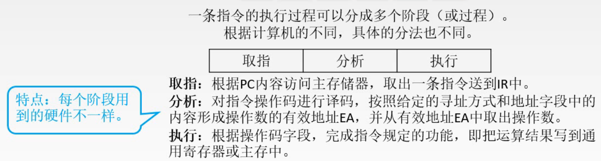

图1.简单分析一下

一条指令的执行过程，可以分为多个阶段，在这里以分为3个阶段为例，分为取指、分析、执行阶段。

可以注意到，划分的在着3个阶段，每个阶段所用到的硬件是不一样的。

很容易可以想到，类似与存储器的流水线，我们也来使指令也是流水线的方式来执行。

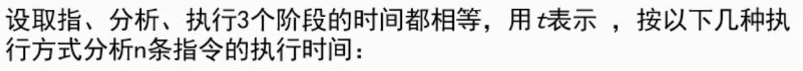

图2.假设

以一个例题来分析，假设分为的取指、分析、执行阶段，其用时都为t。

### 1.1 顺序执行方式

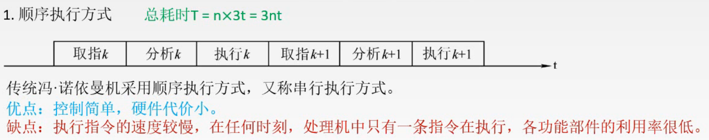

图3.顺序执行方式

最简单的**顺序执行方式**，又称串行执行方式。

也就是一条指令结束后，下一条指令才开始执行。

执行n条指令，总耗时 $T=3nt$ 。

### 1.2 一次重叠执行方式

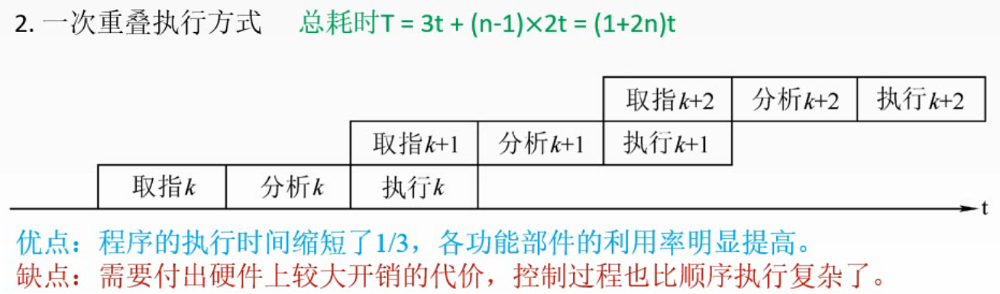

图4.依次重叠执行方式

**一次重叠执行方式**。

因为各阶段使用的硬件是不同的，所以可以并行运行。

一次重叠就是重叠了一次嘛，看图很好理解，在执行阶段同时开始下一指令的取指阶段。

这时就需要增加硬件来控制并行运行了，控制过程更复杂。

执行n条指令，总耗时 $T=3t+(n-1)\times2t=(1+2n)t$ 。

### 1.3 二次重叠执行方式

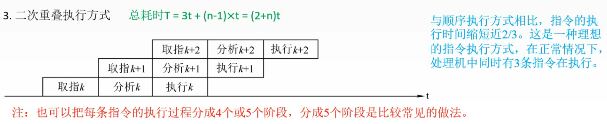

图5.二次重叠执行方式

**二次重叠执行方式**。

毕竟各阶段使用的硬件是不同的，那我为啥不最大化利用，使用二次重叠执行方式呢？

这里只写到二次重叠执行方式，是因为我们是假设指令分为3各阶段的，如果指令分为4、5个阶段，那就还有三次、四次重叠执行方式。

优缺点和一次重叠执行方式类似的。

执行n条指令，总耗时 $T=3t+(n-1)\times t=(2+n)t$ 。

## 二. 流水线的表示方法

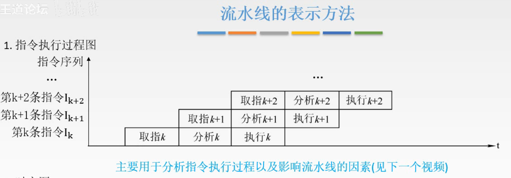

图6.指令执行过程图

指令执行过程图，这名字其实是王道考研视频里讲解的人自己取的名字，因为她说没有人给这个图命名。

X轴是时间，Y轴是指令序列，k指第k条指令。
显然这个图会越画越高。

主要用于分析指令执行过程以及影响流水线的因素。

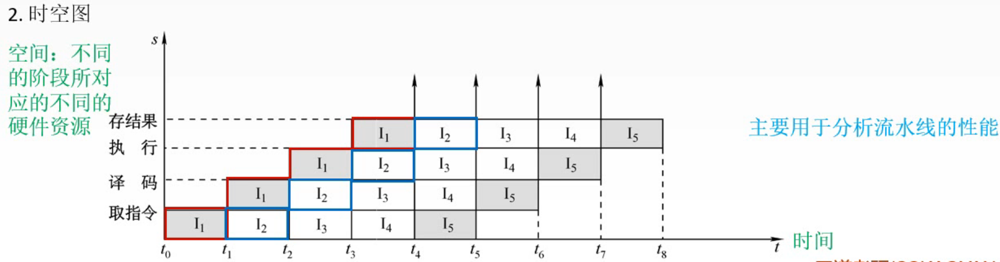

图7.时空图

时空图，X轴是时间，Y轴是各操作的硬件占用情况。

方框代表当前时期对应操作的硬件在被使用， $I_i$ 是指这是第 $i$ 条指令在使用。

时空图就不会越画越高了，像这个时空图就最高只会到存结果这么高。

主要用于分析流水线的性能。

当然以上的图都是理想情况下的图，下面也是理想状态的图，目的是先介绍基本概念嘛，关于流水线的影响因素在下一节讲。

## 三. 流水线的性能指标

三个性能指标

### 3.1 吞吐率TP

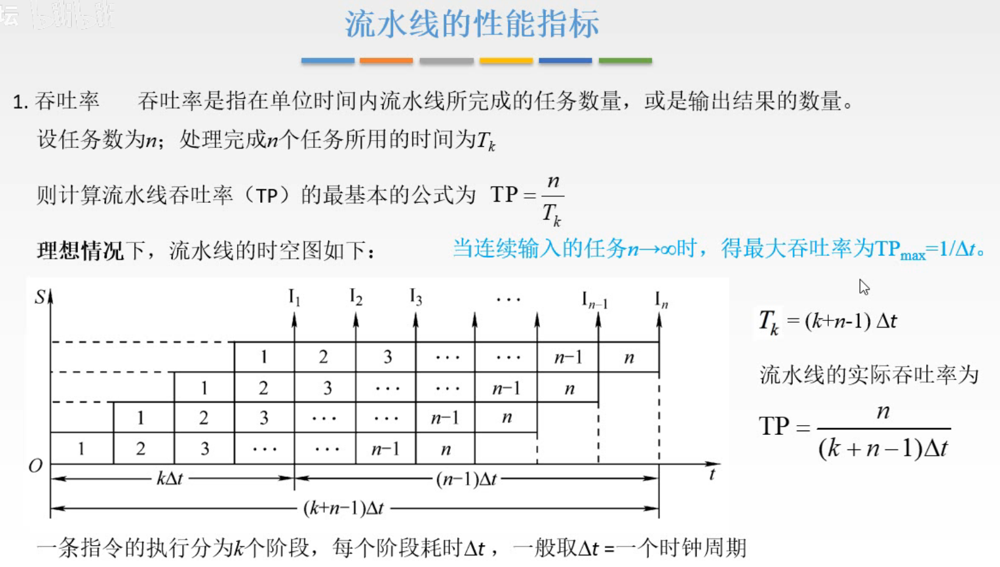

图8.吞吐率

**吞吐率**：单位时间内流水线完成的任务数量，或是输出结果的数量。

设任务数为n，处理n个任务用时为 $T_k$ ，则**流水线吞吐率（TP）**为 $\begin{aligned}TP=\frac{n}{T_k}\end{aligned}$ 。

假设一条指令分为k个阶段，每个阶段耗时 $\Delta t$ ，（一般取 $\Delta t$ 为一个时钟周期），则 $T_k=(k+n-1)\Delta t$ 。

于是流水线的吞吐率为 $\begin{aligned}TP=\frac{n}{(k+n-1)\Delta t}\end{aligned}$ 。

取个极限，当n非常大的时候 $\begin{aligned}TP=\frac{1}{\Delta t}\end{aligned}$ 。

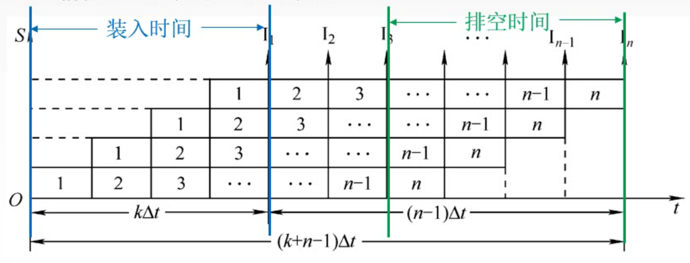

图9.加速比

第一条指令的执行时间，称为**装入时间**；最后一条指令的执行时间称为**排空时间**。

在夹在这两个时间的中间部分的时间是充分利用的（理想情况下）。

### 3.2 加速比S

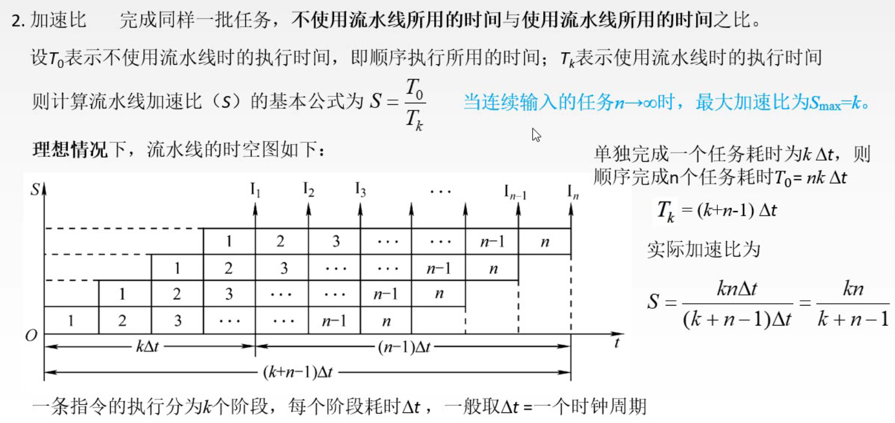

图10.加速比

**加速比**：完成同样一批任务，不使用流水线耗时与使用流水线耗时之比。

设 $T_0$ 表示不使用流水线的耗时，也就是顺序执行方式的耗时。

则**流水线加速比（S）**为 $\begin{aligned}S=\frac{T_0}{T_k}\end{aligned}$ 。

假设一条指令分为k个阶段，每个阶段耗时 $\Delta t$ ，

则流水线加速比为 $\begin{aligned}S=\frac{nk\Delta t}{(k+n-1)\Delta t}=\frac{nk}{(k+n-1)}\end{aligned}$ 。

取个极限，当n非常大的时候 $\begin{aligned}S=k\end{aligned}$ 。
也就是相当于n个任务在并行运行了。

### 3.3 效率E

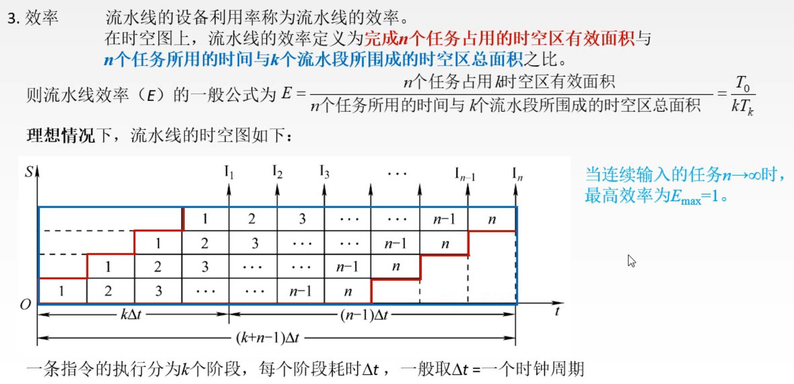

图11.效率

**效率**：流水线设备的利用率。

从时空图上来看就是从任务开始到结束，有硬件使用的面积与总面积之比。

则**流水线效率（E）**为 $\begin{aligned}E=\frac{T_0}{kT_k}\end{aligned}$ 。
流水线也无法减少硬件的使用次数，所以有硬件使用的面积等于顺序执行的面积，为 $T_0\times1$ 。
分成k个阶段，k就是高度，总面积为 $kT_k$ 。

假设一条指令分为k个阶段，每个阶段耗时 $\Delta t$ ，

则流水线效率为 $\begin{aligned}E=\frac{nk\Delta t}{k(k+n-1)\Delta t}=\frac{n}{(k+n-1)}\end{aligned}$ 。

取个极限，当n非常大的时候 $\begin{aligned}E=1\end{aligned}$ 。
也就是相当于硬件充分利用。

## 四. 本节回顾

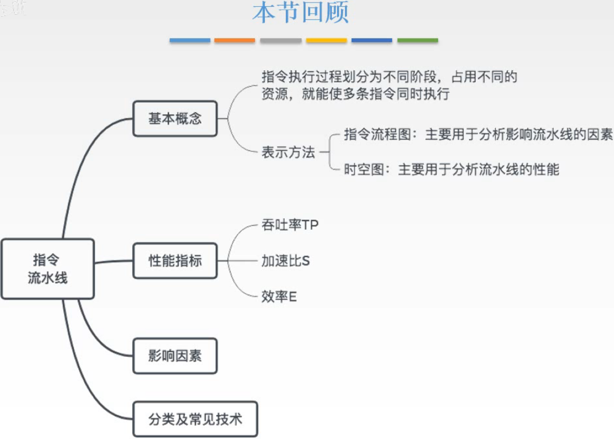

图12.本节回顾

2020.09.21