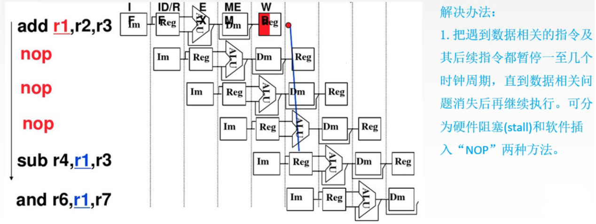
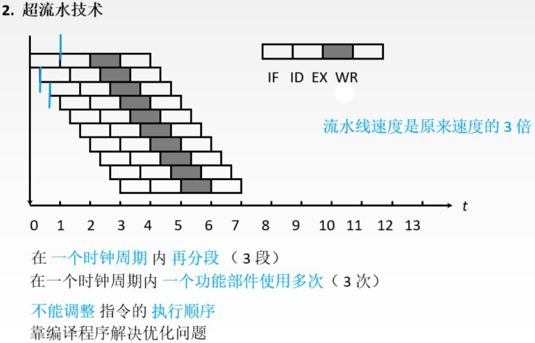

# 流水线影响因素、流水线分类

上一节讲了流水线的性能指标，是建立在理想状况下来介绍的，但经常会出现不会是理想状况的情况，这一节介绍这些影响因素以及解决方法。

## 一. 机器周期的设置

图1.机器周期的设置

图1是分为5个阶段，IF取指，ID译码，EX执行，M访存，WB写回。
这里取指和访存能分成2个阶段的原因是把指令和数据分开存储了，访问的不是同一个存储器，否则取指和访存是可能冲突的。

各个阶段的耗时并不一致，为了方便流水线的设计，将每个阶段耗时设计为相等的，如图1，应该将机器周期设计为100ms。

图2.缓冲寄存器

那么机器周期为100ms，而有的阶段根本不需要这么久就完成了。

于是在其后加上一个**缓冲寄存器**，或称为**锁存器**，其作用是保存本流水段的执行结果，提供给下一流水段使用。

这样虽然该阶段很快就完成了，但是其结果是暂时保存在缓冲寄存器中，而非立即送入下一阶段。于是就使得每个阶段的耗时相同了。

## 二. 流水线的影响因素

### 2.1 结构相关（资源冲突）

图3.结构相关（资源冲突）

多条指令在同一时刻争用同一资源形成的冲突称为结构相关。

在图1中分为了5个阶段，其中取指和访存，是因为指令与数据是分开存储器存储的。
而图3，指令与数据存储在同一存储器，于是导致在Load的访存阶段和Instr3的取指阶段，同时都要使用存储器，于是造成了冲突。

解决方法：

1. 后一相关指令暂停一周期，
   也就是Instr3的Mem延后一个周期到现在的Reg位置才开始。
2. 资源充分配置，
   也就是前面说过的，把指令和数据分开存储，指令存储器，数据存储器，这样就避免了取指和访存的冲突。

图4.指令存储器和数据存储器

### 2.2 数据相关（数据冲突）

图5.数据相关（数据冲突）

前一条指令的结果是后一条指令的输入，则为数据相关。

如图5， $add\quad r_1,r_2,r_3$ ，把 $r_2$ 和 $r_3$ 相加存入 $r_1$ 中，所以 $r_1$ 中的数据在第5个机器周期才存入。
如果是顺序执行自然没有问题，但在流水线中，后面的指令在第5个机器周期之前就需要用到 $r_1$ 的数据，所以出现了问题。

**解决办法**：

1. 把遇到数据相关的指令及后续指令都暂停一指几个时钟周期，知道数据相关问题消失后再继续执行。
   可分为硬件阻塞（stall）和软件插入NOP两种方式。

图6.解决方法1-硬件阻塞（stall）

硬件阻塞stall的方式，发现需要的数据还没有准备好，重复执行一次这个指令，一直到下一个阶段的数据准备好。

图7.解决方法1-软件插入NOP

软件插入nop，软件的方式是在编写指令的时候就在会发生数据相关的指令之间插入nop指令，空指令。

注意的是，nop指令是完整的指令，是会完整执行的，是会占用这些部件的。如图7nop指令的5个阶段也画了出来。只不过nop指令执行了也并不改变任何内容。

2. 数据旁路技术。

图8.解决方法2-数据旁路技术

可以注意到，实际上在ALU计算完成后，计算结果就已经出来了，所以并不一定需要等待计算结果存入主存再去拿，而是在ALU计算后的阶段，都可以将计算结果就传给后面的指令。

如图8，第二条指令的 $r_1$ 来源于第一条指令的ALU后，同样的，第三条指令的 $r_1$ 从第一条指令的4阶段传过来。

3. 编译优化。

图9.解决方法3-编译优化

也就是通过编译器调整指令顺序，比如把一些用不到 $r_1$ 的指令放到前面先执行。

**数据相关例题**：

图10.数据相关的例题

IF取指，ID译码，EX执行，M访存，WB写回。

按序发射，按序完成的方式，指指令按照顺序来执行，前面例子说过可以将没有使用 $r_1$ 的指令先执行，按序发射就是不能这样。按序完成后面再介绍。

没有采用转发技术处理数据相关，指没有使用数据旁路技术。

图11.例题解答

把指令的操作写出来。

显然I3取指后R2和R1还没写回，所以需要等待。
l4也需要等待I3把数据存回R2.

所以I3和I1，I2存在数据相关、I4和I3存在数据相关。

**数据相关的类型**

图12.数据相关的类型

三类：RAW、WAR、WAW。
其中A是after，所以就是写后读、读后写、写后写。没有RAR，因为读不会改变数据，谁先读无所谓嘛。

RAW（写后读）：

图12中例子，I2读数据时，I1还没写入R5。

WAR（读后写）：

图12中例子，啊虽然我觉得正常情况没问题，但是王道视频里说，当乱序发射时，会被优化成I2比I1先执行，就导致了R2中数据先被覆盖了（那感觉I2还得被优化成先I1好几条指令啊。）

WRW（写后写）：

图12中例子，因为计算机也不会只设计一个ALU嘛，实际上是有多个ALU的那么I1和I2的运算，I1明显复杂，所以导致I2先算完，先写入R3了。

如果是"按序发射、按序完成"，那么只会出现RAW的数据相关。

### 2.3 控制相关（控制冲突）

图13.控制相关

当流水线遇到转移指令和其他改变PC值得指令而造成断流，就是控制相关。

当遇到转移指令时，可能并不会一开始就转移，如图13，是在4阶段后转移。那么前面阶段做的操作就等于白做了。因为通常指令是PC+1来进入流水线的嘛。

这样流水线的效率就降低了。

同样的如果等待着确定转移或不转移了，也是降低了流水线效率。

解决方法：

1. 尽早判断转移是否发生，尽早生成转移目标地址。

   也就是尽早的把转移条件给出来，别放在后面阶段才说我要跳转了。

2. 预取转移成功和不成功两个控制流方向上的目标指令。

   比较笨，就是我跳转和不跳转两种情况的指令都执行，但是这样的话就需要额外的资源。

3. 加快和提前形成转移条件码。

4. 提高转移方向的猜准率。

   按照统计学规律，当遇到这条指令时，判断转移的概率是多少，不转移的概率是多少，从而后面执行转移或不转移的指令。

### 2.4 影响因素回顾

图14.影响流水线的因素回顾

## 三. 流水线分类

图15.流水线的分类

1. 部件功能级、处理机级、处理机间级流水线。

   按照**流水线的使用级别**不同划分。

   **部件功能级流水**，就是在部件内部还可以细分构成流水线，比如浮点加法又细分为4个阶段，于是其内部也可以以流水线的方式运行。

   **处理机级流水**，就是前面一直说的把指令分成多个阶段，这一级别的流水。

   **处理机间流水**，感觉这里处理机就是计算机的意思嘛？那就是一个处理机完成专门的任务，多个处理机形成流水。

2. 单功能流水线、多功能流水线。

   按**流水线可以完成的功能**划分。

   **单功能流水线**，实现一个固定的、专门的功能的流水线。

   **多功能流水线**，通过各段间不同连接方式，可以同时或不同时地实现多种功能的流水线。

图16.流水线的分类

3. 动态流水线、静态流水线

   按**同一时间各段之间的连接方式**划分。

   **静态流水线**，同一时间内，流水线各段只能按同一种功能的连接方式工作。

   **动态流水线**，同一时间内，某段在实现某种运算时，另一些段在进行另一种运算。可以提高流水线效率，但流水线控制变复杂。

4. 线性流水线、非线性流水线

   按**各功能段之间是否有反馈信号**划分。

   **线性流水线**，从输入到输出，每个功能段只允许经过一次，不存在反馈回路。（感觉就是咻~划过去，木有回头路）

   **非线性流水线**，存在反馈回路，某些功能段将数次通过流水线，这种流水线适合进行线性递归的运算。（感觉就是复用）

## 四. 流水线的多发技术

### 4.1 超标量技术

图17.超标量技术

每个时钟周期内可**并发多条独立指令**。

要配置多个功能部件。毕竟你这光是同时3个取指，那就得有3个IR。

不能调整指令的执行顺序。
即，遇到数据相关时，就没法调整顺序了，毕竟3条指令并发，还想调整指令也太难了。

当然要通过编译优化，把可以并行的指令搭配在一次，才能多条一起并行嘛。

### 4.2 超流水技术

图18.超流水技术

原本的流水线是一条指令的进入下一个阶段，下一条的才进入本阶段。

**超**流水就是不用等一个阶段了，把一个时钟周期内再分为3段，一个时钟周期内一个功能部件使用多次。
注意的是，原本按阶段分，每个阶段是需要设置缓冲寄存器的，这里内部是不需要设置的。

不能调整指令的执行顺序。
即，遇到数据相关时，就没法调整顺序了，毕竟还想调整指令也太难了。

靠编译程序解决优化问题。

### 4.3 超长指令字

图19.超长指令字

还是依靠编译程序挖掘出指令的并行性。

把**多条**能并行的指令组合成**一条**，所以图19里不像图17超标量技术那样是3条指令并行，因为超长指令字将其合并为一条指令了。

既然是合并的，所以该合并成的指令的长度就会长很多，有很多操作码和地址码。

由于是并行运行，所以需要多个执行的部件，比如多配几个ALU。（我感觉就是如果所有硬件只有一个，超长指令字可能不能运行，这么多配几个执行部件，其实就是因为并行要用到同一部件，所以多给你给避免争用吧）

---

需要在这里补充一下：

因为做到了 2017 统考真题：

> 下列关于超标量流水线特性的叙述中，正确的是（）
>
> Ⅰ. 能缩短流水线功能段的处理时间 。
>
> Ⅱ. 能在一个时钟周期内同时发射多条指令。
>
> Ⅲ. 能结合动态调度技术提高指令执行并行性。
>
> 答案是：Ⅱ 和 Ⅲ。

于是我搜了一下，虽然下面信息来源是百度百科：

> 来自 " 超标量 " 的百度百科：
>
> 与超长指令字（VLIW , Very Long Instruction Word）结构的数字信号处理器相似，超标量结构的处理器每个时钟周期也并行发射和执行多条指令。区别在于，VLIW 的处理器采用静态调度，而超标量结构的处理器采用动态指令调度，在指令执行时根据资源、数据相关等情况，决定是否并行执行指令。超标量结构是当代多发射微处理器所广泛采用的微体系结构。
>
> 在超标量微处理器中，每个周期可同时发射执行多条指令，但指令的高发射频率也意味着相关所发生的频率也很高；而且其结构决定了相关的复杂性。因此，相关的检测和解决策略的优劣将直接影响超标量处理器的性能。为了有效地处理相关，需采用静态和动态调度技术相结合的方法。静态调度可在编译过程中减少相关的产生；而动态调度可根据处理器的动态信息,发掘出更多的 ILP （指令级并行）。动态调度简化了编译器的设计，减小了编译代码对硬件的依赖，但却是以大量的硬件开销为代价的。
>
> 来自 " 超长指令字 " 的百度百科：
>
> 由于超长指令字处理器不需要动态调度，也不需要进行重定向操作，所以它的控制逻辑相当简单。

总结就是，超标量技术能结合动态调度技术提高指令执行并行性；但是超长指令字长根本不用动态调度技术。

至于超流水线，没有找到与动态调度技术相关的内容，所以不知道、不确定。

（2021.07.03）

## 五. 本节回顾

图20.本节回顾

2020.09.22