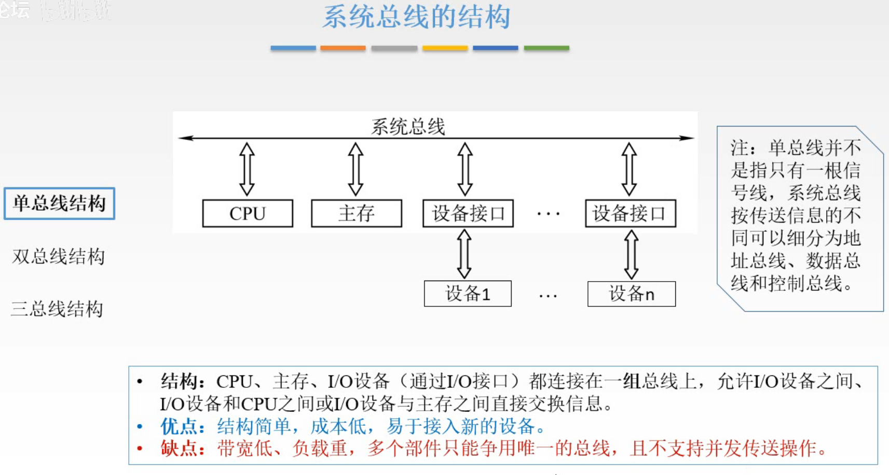

# 总线的概念与分类

## 一. 本章总览

图1.本章总览

先是概述，介绍为什么要引入总线这种结构，然后介绍总线的分类，经典结构，以及总线的性能指标。

然后介绍仲裁，也就是多个设备同时争用总线时，如何解决。

解决了谁使用的问题，接着就是数据是如何通过总线传输，如何控制这个过程。

最后，是为了让各种各样的设备都能够接入总线，所以设立一个标准。

## 二. 总线的定义

图2.为什么要用总线

在早期的计算机中，因为外部设备比较少，大多采用分散连接方式，也就是就几个外部设备，那我就直接每个外部设备都和主机的各个部件连接起来，无非就是多几根线的事情。

但是当外部设备越来越多的时候，每新增一个外部设备，那这个外部设备就要和其他的部件都连接起来，如果外部设备之间还要交换数据，那线就更多了。

所以引入了总线的结构，不同部件都通过总线来传输信息，只需要设计好设备与总线之间的连接就好了，每次新增设备也就只用连接总线的线啦。

为了更好的解决I/O设备和主机之间连接的灵活性问题，计算机的结构从分散连接发展为总线连接。

图3.总线的定义

**总线**是一组能为多个部件分式共享的公共信息传送线路。

共享，指总线上可以挂接多个部件，各个部件之间互相交换的信息都可以通过这组线路分时贡献。

分式，指同一时刻指允许有一个部件向总线发送信息，如果系统中有多个部件，则它们只能分时地向总线发送信息。

## 三. 总线的物理实现

图4.总线的物理实现

这些插槽就是总线给出的接口，很细的白线就是总线。

不同的插槽其实就对应了不同的在本章最后一节会讲到的总线的标准。这里先不讲。

## 四. 总线的特性

图5.总线的特性

总线的特性其实就是在设计总线标准时应该考虑的因素：

1. 机械特性：尺寸、形状、管脚数、排列顺序
2. 电气特性：传输方向和有效电平范围
   单向传递，从哪头到哪头，还是双向都可以传；
   0到0.3V为0，4.7到5V为1，还是其他范围对应0/1。
3. 功能特性：每根传输线的功能（地址、数据、控制）
4. 时间特性：信号的时序关系

## 五. 总线的分类

图6.总线的分类

总线分类一般从三个角度来分类。

### 5.1 按数据传输格式

图7.按数据传世格式分类

按数据传输格式来分类：

1. **串行总线**：

   只有一根传输线，如图7，当从A到B传输1011时，串行总线是一位一位的传输的。

   优点：只需要一根传输线，成本低，广泛应用于长距离传输，应用于计算机内部时，可节省布线空间。
   缺点：数据发送和接收时，需要考虑装卸（把多位数据拆分成一位一位地发送）和装配（把接收到的一位一位的数据恢复成多位数据）。

2. **并行总线**：

   多根传输线，如图7，从A到B传输1011，则从4根传输线，每根传1位传输到B。

   优点：总线的逻辑时序比较简单，电路实现比较容易。
   缺点：信号线数量多，占用更多布线空间；远距离运输成本高。

   由于工作频率较高时，并行的信号线之间会产生严重干扰，对每条线等长的要求也越高，所以无法持续提升工作频率。
   所以实际情况并行总线并不一定比串行总线传输数据快。这一点在下一节分析。

### 5.2 按总线功能

图8.按总线功能

按总线的功能来分类

1. 片内总线

   片内总线是芯片内部的总线，是连接**芯片**内部不同结构的总线。

   比如CPU芯片内部寄存器与寄存器之间、寄存器与ALU之间的公共连接线。

   前面学CPU的时候用过一个叫CPU内部总线的，内部总线是指部件内的总线，而一个部件的实现，不一定做成一个芯片。

2. 系统总线

   系统总线是计算机系统内各功能部件（CPU、主存、I/O接口）之间互相连接的总线。

   依照系统总线传输信息内容的不同，可分为3类：

   2.1 数据总线：用来传输各功能部件之间的数据信息，是**双向**传输总线，位数与机器字长、存储字长有关。

   2.2 地址总线：用来指出数据总线上源数据或目的数据所在的主存单元或I/O端口的地址，是**单向**传输总线，位数与主存地址空间的大小有关。

   2.3 控制总线：用来传输控制信息，包括CPU送出的控制命令和主存（或外设）返回CPU的反馈信号。而控制线因为从CPU送出的控制信号的线是单向的，返回CPU的反馈信号的线是单向的，但整体是双向的，所以称为有入有出，不简单地称为双向。

3. 通信总线

   用于计算机系统之间或计算机系统与其他系统（如远程通信设备、测试设备）之间信息传送的总线，又称为外部总线。

图9.系统总线

图9给回顾一下系统总线。

啊还有，图9输出设备与数据总线的连接线画长了一截，应该是连到数据总线上的。

顺带区分一下数据通路和数据总线，
数据总线是传递数据的载体、媒介。
数据通路是数据流经的路径，我理解的是，对应指令发出控制信号使得一段时期内数据只能按照定好的通路进行流动以完成指令，这段时期的路线就是数据通路。

### 5.2 按时序控制方式

按时序控制方式：

1. 同步总线。
2. 异步总线。

知道就行，后面学总线如何控制数据传输一节会再讲到。

## 六. 系统总线的结构

详细讲讲系统总线，其结构有三种设计方式。

### 6.1 单总线结构

图10.单总线结构

**单总线结构**

只有一组总线。
不是一根传输线啊，总线是有很多根线的，这里一组总线指包括了地址、数据、控制总线。

系统总线上连接着CPU、主存、设备接口，其中设备通过设备接口与总线连接。

特点：CPU、主存、I/O设备（通过I/O接口）都连接在一组总线上，任何两个部件之间的数据交流都通过总线。
优点：结构简单，成本低，易于接入新设备。
缺点：带宽低、负载重，多个设备只能用争用唯一的总线，且不支持并发传送操作。

因为只用一组总线嘛，优点不解释了。缺点，带宽低，因为同时只能两个部件之间传输信息嘛，其他就只能等了，自然也是不支持并发操作的，并发就是多个同时嘛。
负载重的意思是需要的电流大，比较容易烧坏。

还有就是涉及到I/O设备的数据传输，其速度显然很慢，而CPU和主存的交流相比快的多了，但用单总线结构，意味着I/O设备这个慢的会拖累CPU这种快的。

### 6.2 双总线结构

图11.双总线结构

**双总线结构**

用两组总线，分为主存总线和I/O总线。

1. 主存总线：用于CPU、主存和通道之间进行数据传送。
   主存总线支持**突发（猝发）传送**，就是送出一个地址，然后进行连续多个数据的传输。就是本来CPU发一个地址主存给一个数据，但是改进一下CPU发一个地址，主存把这个地址及其后面连续的数据发给CPU，就省去了CPU多次发送地址的时间。
   当然也可以是CPU给出一个地址，然后连续向主存写入数据。
2. I/O总线：用于多个外部设备与通道之间进行数据传送。

**通道**：是具有特殊功能的处理器，能对I/O设备进行同一管理。通道程序放在主存中。

优点：将低速的I/O设备从单总线上分离出来，实现存储器总线和I/O总线分离。
缺点：需要增加通道等硬件设备。

### 6.3 三总线结构

图12.三总线结构

**三总线结构**

有三组总线，分为；

1. 主存总线：
2. I/O总线：
3. DMA总线：DMA（Direct Memory Access，直接内存访问）
   将高速外设接到DMA总线上，需要的时候可以直接访问主存，低速外设就别接到DMA上来拖慢速度了。
   高速外设还是要接入I/O总线的。

优点：提高了I/O设备的性能，使其更快地相应命令，提高系统吞吐量。
缺点：系统工作效率较低。

**任一时刻只能使用一种总线**。
这个设计主要着眼于提高I/O设备的性能。

### 6.4 四总线结构

图13.总线结构

**四总线结构**

四总线简单了解一下。

关键不在于记总线名字了，主要是补充几个概念。

CPU和Cache通过CPU总线连接，主存连接在系统总线上，而主存和CPU、Cache的速度差距很大，所以在CPU总线与系统总线之间通过**桥接器**连接。

桥接器：用于连接不同的总线，具有数据缓冲、转换和控制功能。

另外的概念：

越靠近CPU的总线速度越快。

每级总线的设计遵循总线标准（过几节再讲标准）。

## 七. 本节回顾

图14.本节回顾

2020.09.22

