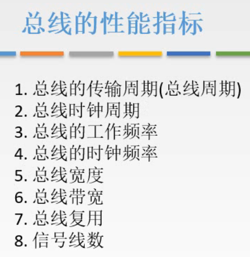
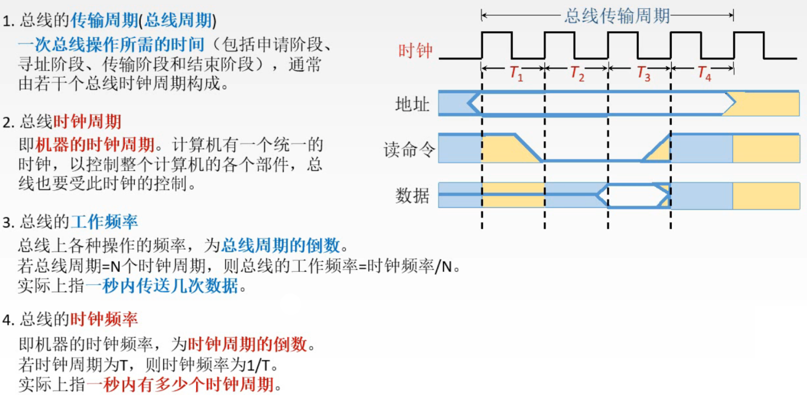
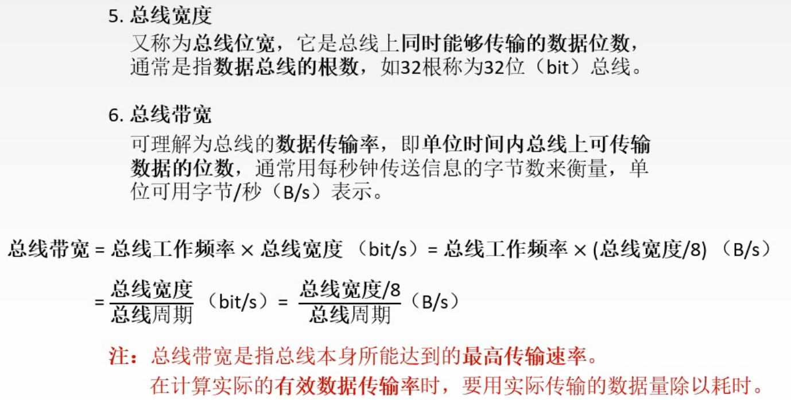
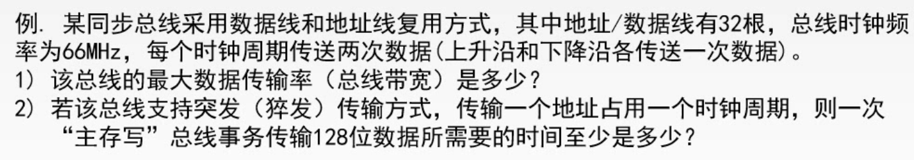
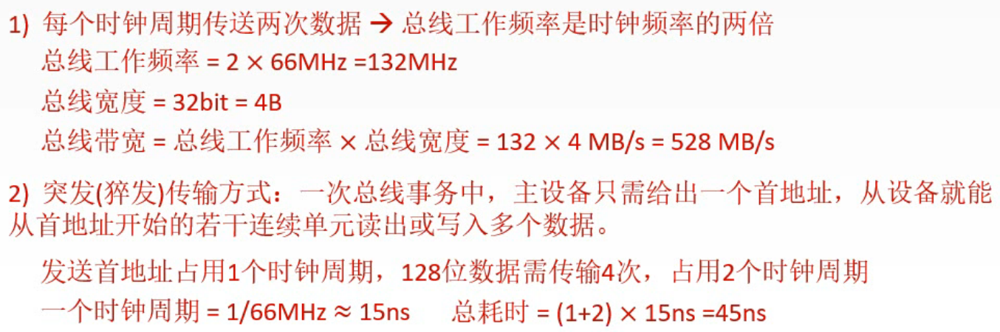
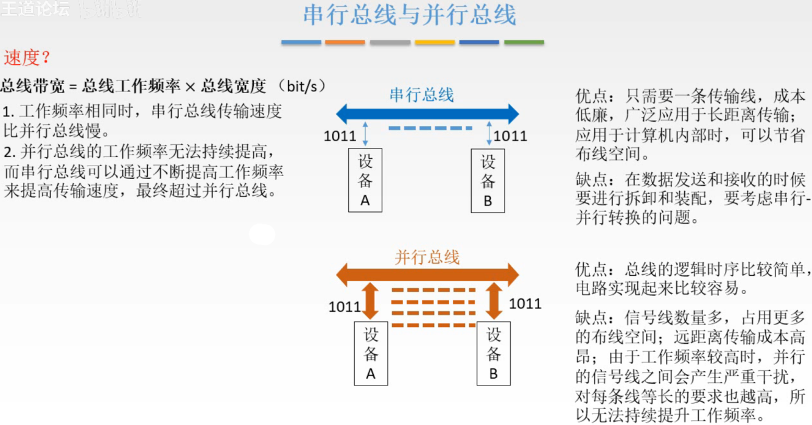
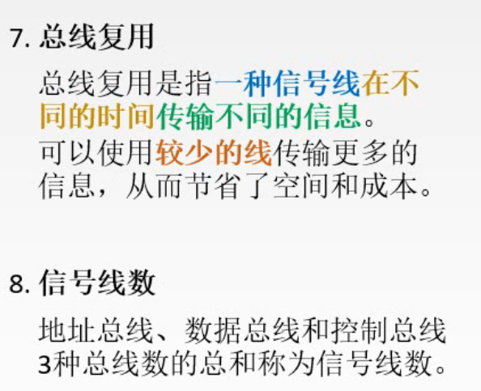
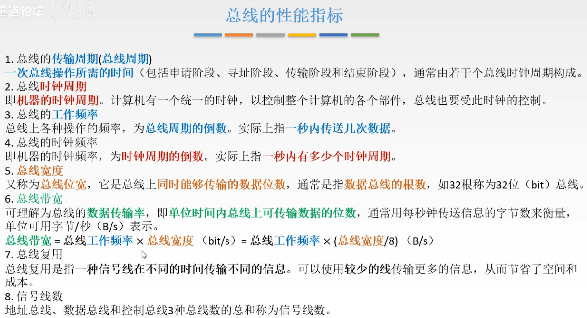

# 总线的性能指标

## 一. 总线的性能指标

图1.8个性能指标

总线共有8个性能指标，

前6个是关心总线的性能速度，
后2个就是减少总线数量。

图2.前4个性能指标.

### 1.1 总线的传输周期（总线周期）

**一次总线操作所需时间**，包括申请阶段、寻址阶段、传输阶段和结束阶段。

如图2右方的图，通常总线传输周期由多个总线时钟周期构成。
当然，可能有的总线就是快，一个总线时钟周期就完成了一次操作，或者完成了多次操作。

### 1.2 总线的时钟周期

即机器的时钟周期。

计算机内有一个统一的时钟，以此控制整个计算机的各个部件，总线也是受此时钟控制的。

### 1.3 总线的工作频率

就是总线周期的倒数。

一秒内能完成多少次总线操作。

### 1.4 总线的时钟频率

就是时钟周期的倒数。

一秒内有多少个时钟周期。

图3.总线宽度、总线带宽

### 1.5 总线宽度

又称**总线位宽**，即总线上同时能够传输的数据的位数。

通常是指数据总线的根数，入32根数据总线称为32位总线。

### 1.6 总线带宽

总线的数据传送率，单位时间内总线上可传输数据的位数（最大的传输速率）。

通常用每秒传送信息的字节数来衡量，单位：字节/秒，B/s。
$$
\begin{aligned}总线带宽&=总线工作频率\times 总线宽度(bit/s)\\&=总线工作频率\times \frac{总线宽度}{8}(B/s)\\&=\frac{总线宽度/8}{总线周期}\end{aligned}
$$
简单的单位换算，周期频率转换。

注意的是**带宽**是指理论上的**最大**传输率。

实际的传输率应该是用传输的数据量除以用时。

一个**例题**：

图4.例题

数据线和地址线复用方式，指传输地址和传输数据都是用的同一组线，只是在不同时刻传输的是地址或数据。

总线的时钟频率66MHz，根据后面的描述，转换成总线工作频率或总线周期。

每个时钟周期传送两次数据，结合总线的时钟频率，可算出总线工作频率或总线周期。

突发（猝发）传输方式，CPU

图5.例题解答

第一问

总线位宽32位，除以8等于4B。

总线周期为半个时钟周期，$\begin{aligned}\frac{1}{2}\times\frac{1}{66MHz}=\frac{1}{132MHz}\end{aligned}$ 。

总线带宽 $=4B\times 132MHz=528MB/s$ 。

第二问，

发送一个地址，题目给出占用一个时钟周期，
然后连续写入128位数据，32根线，需要使用4个总线工作周期。

一共需要5个总线工作周期，即3个时钟周期。

总耗时 $\begin{aligned}3\times\frac{1}{66MHz}=45.45ns\end{aligned}$ 。
图5没有保留两位小数啊。

图6.串行、并行总线的带宽

解释一下为什么上一节说串行总线并不一定比并行总线慢。

因为总线带宽不仅和总线宽度有关，还和总线工作频率有关。

而并行总线，频率越高，相互之间信号干扰越严重，所以无法提高到很高。

而且频率越高，越对总线长度的相等要求越高，因为等长，并行传输的数据才能同时到达识别为同一数据，而频率提高，就越会导致稍微有点长度不等就容易识别出错。这也是无法提高到很高频率的原因之一。

所以，当工作频率相同时，自然是并行总线快，但是，因为串行总线可以提高到很高的频率，于是传输速度可以超过并行总线。

实际上，现在的高速应用中都是使用串行总线。

图7.总线复用、信号线数

### 1.7 总线复用

一种信号线在不同时间传输不同信息。

由此可以使用较少的线传输更多信息，节省空间和成本。

也就是类似图4例题中的地址线和数据线复用，用同一组线在不同时间传输地址或数据。

### 1.8 信号线数

地址总线、数据总线、控制总线，3种总线的信号线数的总和。

## 二. 本节回顾

图8.来个合集

2020.09.22