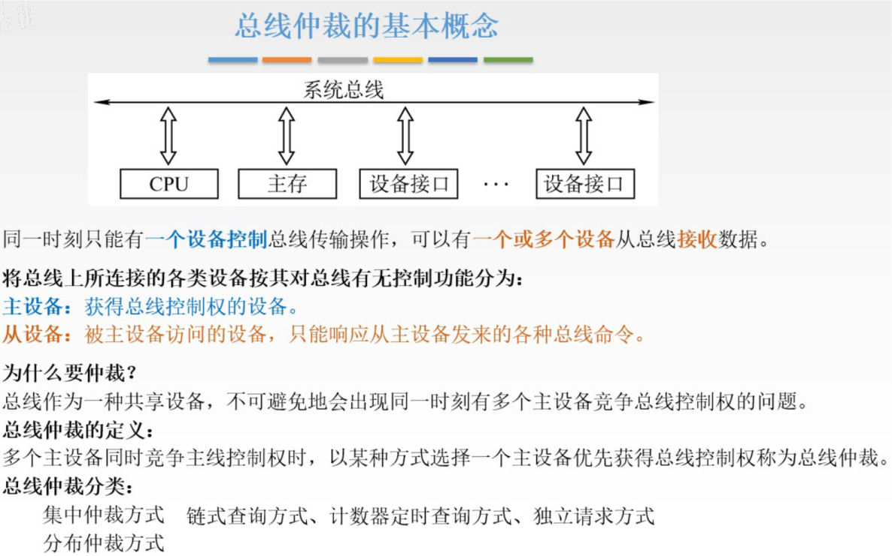
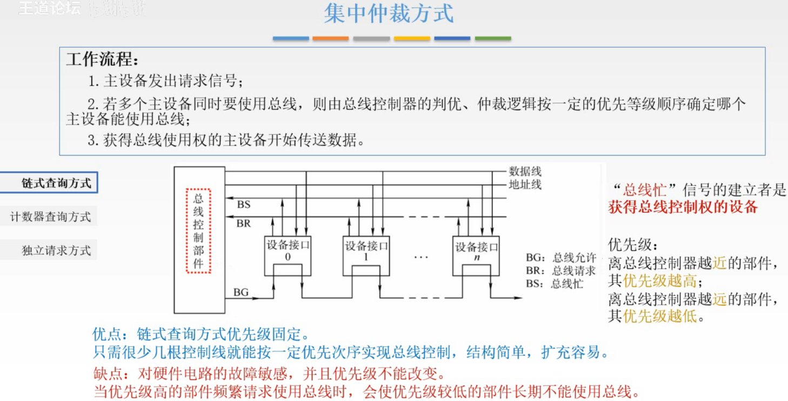
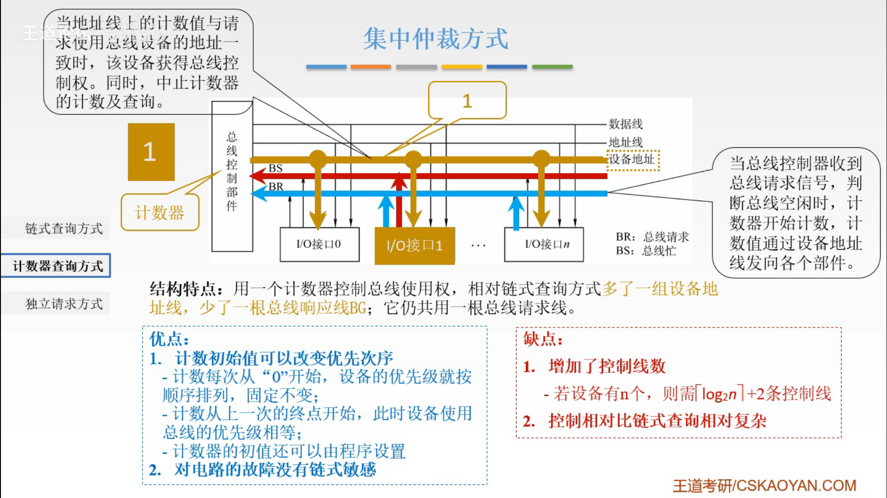
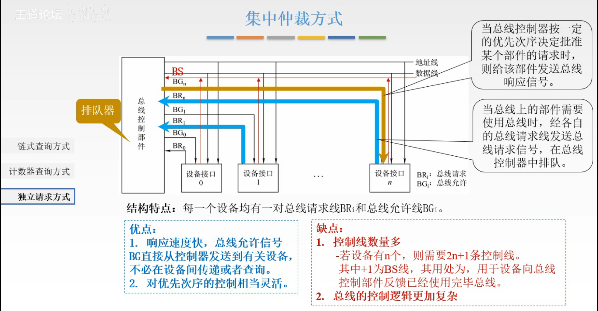
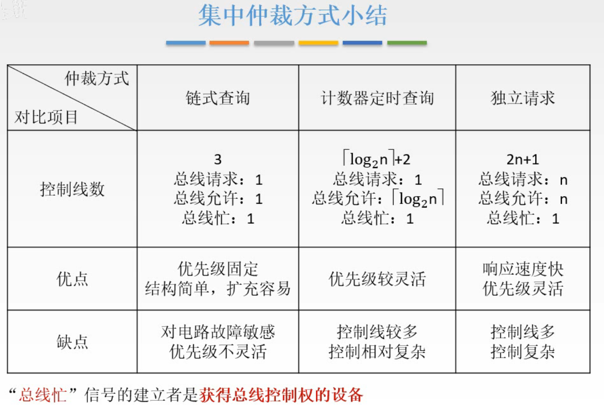
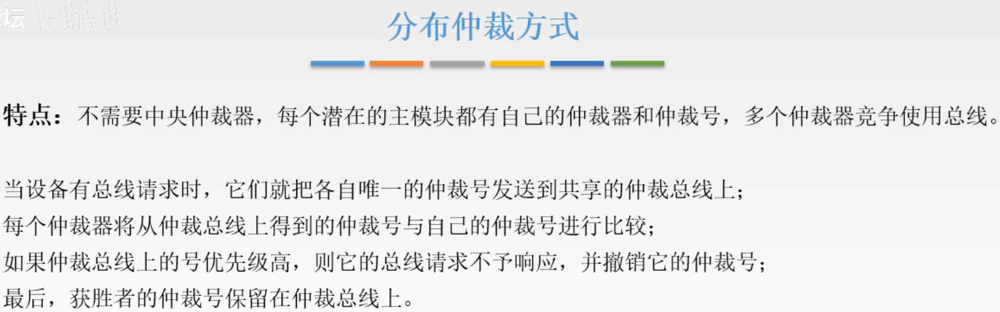
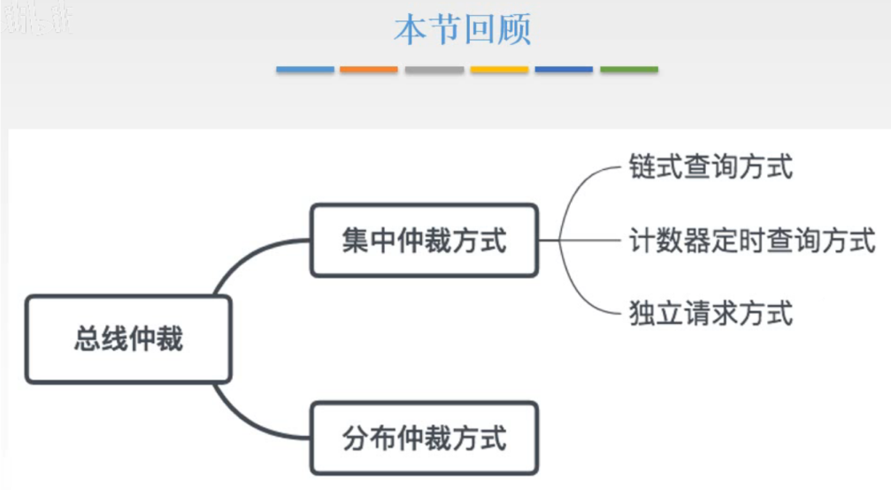

# 总线仲裁

仲裁就是用来解决同一时间多个设备争用总线的问题。

今年考研大纲，总线仲裁删除了集中仲裁方式、分布仲裁方式。所以我简单过一下。

也不是就不看了，毕竟学是自己学到了。

## 一. 总线总裁的基本概念

图1.总线仲裁的基本概念

看图吧。

总线仲裁分为两类：

1. 集中仲裁方式：

   包括：链式查询方式，计数器定时查询方式、独立请求方式。

2. 分布仲裁方式。

## 二. 集中仲裁方式

图2.链式查询方式

毕竟考纲删了，所以我就简单的把流程说一遍。

假设设备接口1和设备接口n，同时通过BR线提出了总线请求，传至总线控制部件。

总线控制部件接收到请求后，查询BS线信号，当前是否有设备正在使用总线。

发现没有设备占用总线，总线控制部件通过BG发出信号，

BG信号不断传递，直到传递到的某个设备有总线请求，于是该设备获得总线的控制权，
（我感觉就是后面的被短路了= =）

该设备对BS发出信号，说明总线正在被占用，总线控制部件接收到BS信号，控制BG信号停止传递。

图3.计数器查询方式

总线控制部件内部设置一个计数器，假定以0开始。

假设设备接口1和设备接口n，同时通过BR线提出了总线请求，传至总线控制部件。

总线控制部件接收到请求后，查询BS线信号，当前是否有设备正在使用总线。

发现没有设备占用总线，总线控制部件，启动计数器工作，假定以0开始，代表着设备地址，通过设备地址线发出信号至对应的I/O接口，
设备地址线是一组线，而非一根线。

这里，设备地址线传信号给I/O接口0，而接口0没有请求，
于是计数器+1，设备地址线传信号给I/O接口1，接口1有请求，

该接口1对BS发出信号，说明总线正在被占用，总线控制部件接收到BS信号，控制设备地址线停止传递信号，计数器归0。

实际上，计数器可以设置不归零，也可以设置不以0开始，以达到改变设备优先级的效果。

图4.独立请求方式

总线控制部件内部设置一个排队器。

每个设备接口具有自己的总线请求线BR、总线允许线BG，

假设设备接口1和设备接口n，同时通过各自的BR线提出了总线请求，传至总线控制部件，

总线控制部件接收到请求后，查询BS线信号，当前是否有设备正在使用总线。

发现没有设备占用总线，总线控制部件，把信号交给排队器，由排队器经过一系列复杂的判断，得出将总线使用权给哪个设备接口。

假设是给设备接口n，通过设备接口的BG发送信号给设备接口n，设备接口n接收到信号后对BS线发出信号。

图5.集中仲裁方式小结

## 三. 分布仲裁方式

图6.分布仲裁方式

**没有总线控制部件**。
每个主模块都有自己的仲裁器和唯一的仲裁号，多个仲裁器竞争使用总线。

当设备由总线请求，将各自的唯一的仲裁号发送到共享的仲裁总线上，

每个仲裁其将冲仲裁总线上得到的仲裁号与自己的仲裁号进行比较，

如果自己饿仲裁号细优先级低，则自己的总线请求不予响应，并撤销其仲裁号，

最后优先级最高的总裁号保留在总裁总线上。

## 四. 本节回顾

图7.本节回顾

回顾其实也就是主要回顾图5集中仲裁方式小结啦。

2020.09.22