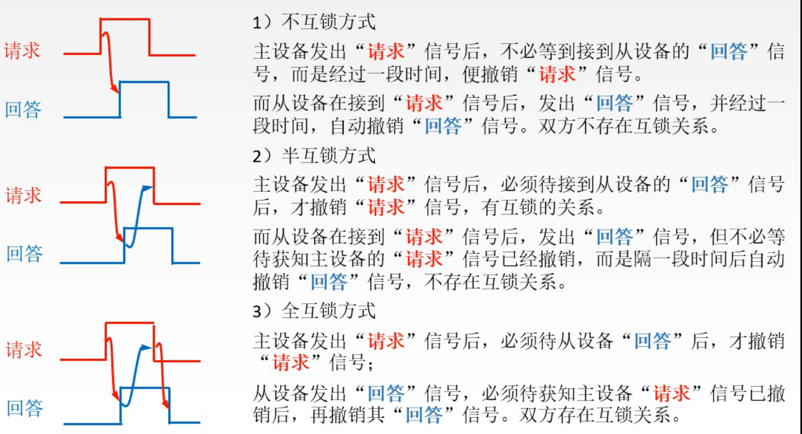
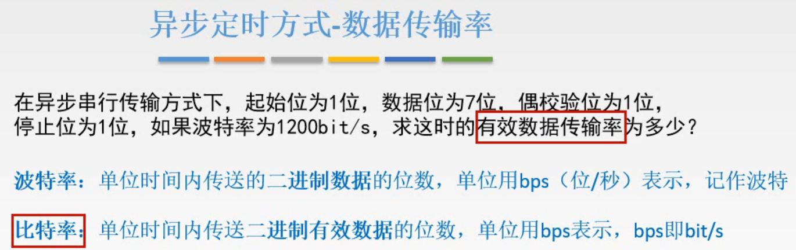

# 总线操作与定时

获得了总线使用权的设备如何使用总线来完成操作，两个通过总线互相传递数据的设备如何进行沟通，从而正常完成工作。

## 一. 总线传输的四个阶段

图1.总线传输的四个阶段

首先分析总线周期，总线周期可以划分为四个阶段：

1. 申请分配阶段：
   要使用总线的主设备（**主模块**）提出申请，经总线仲裁机构决定将下一传输周期的总线使用权授予某一申请者。

   该阶段还可细分为传输请求和总线仲裁两个阶段。

2. 寻址阶段：

   获得使用权的主模块通过总线发出本次要访问的**从模块**的地址及相关命令，启动从模块工作。

3. 传输阶段：

   主模块和总模块进行数据交换，可单向或双向进行数据传送。

4. 结束阶段：

   主模块有关信息均从系统总线上撤除，让出总线使用权。

## 二. 总线定时方式

图2.总线定时

**总线定时**：

主模块和从模块，在一个总线周期中，需要时间上的配合的控制，这种控制称为总线定时，其本质是一种协议或规则。

分为4种方式，王道视频里说考纲里是前两个，后两个半同步、分离式通信看看，了解一下就好。

1. 同步定时方式（同步通信）

   由**同一时钟**控制数据传送。

2. 异步定时方式（异步通信）

   采用**应答方式**，没有公共时钟标准。

3. 半同步通信

   同步，异步结合。

4. 分离式通信

   充分挖掘总线每瞬间的潜力。

图3.上升沿、下降沿

补充一个小知识点。

如图3，时钟由0变为1称为上升沿，由1变为0称为下降沿。

### 2.1 同步定时方式（同步通信）

图4.同步通信（同步定时方式）

同步定时方式：

系统采用一个同一的时钟信号来协调发送和接收双方的传送定时关系。

这里以CPU通过总线读数据为例来解释：

在 $T_1$ 的上升沿，CPU发出地址信息，

在 $T_2$ 的上升沿，CPU发出读命令，从设备开始准备数据，要求从设备在 $T_3$ 上升沿之前准备好，

在 $T_3$ 的上升沿，从设备通过总线开始传输数据到CPU内部的寄存器中，要求在 $T_4$ 上升沿之前传输好，

在 $T_4$ 的上升沿，CPU撤销读命令，从设备不再向数据总线传输数据，撤销从设备对数据总线的驱动。

可以注意到，要求在规定的时间内完成每一步，才能正常的完成工作，但如果从设备的速度不够快，达不到这个要求，在下一个周期的上升沿没有完成本周期的工作，怎么办呢。
那就这次数据完蛋了呀。

所以可以想到同步通信多用于二者速度差距不大的情况撒。

图5.同步定时方式

优点：速度快，较高传输速率；总线控制简单。
缺点：主从设备数据强制性同步；不能及时进行数据通信的有效性检验，可靠性较差。

缺点就是因为主/从设备的速度很可能是不一样的，强制性使得主/从设备都按一个节奏来工作。而且一个周期一个周期的往下推，中间并未留有时间进行有效性检验，所以可靠性比较差。

同步通信适用于总线长度较短及**总线所连接部件的存取时间比较接近**的系统。

### 2.2 异步定时方式（异步通信）

图6.异步定时方式

异步定时方式：

**没有**同一时钟，也没有固定的时间间隔，完全依靠双方相互制约的"握手"信号来实现定时控制。

主设备发出交换信息的"请求"信号，经过总线给从设备，从设备接收到"请求"信号，经过总线向主设备发出"回答"信号。

一眼就知道，这个方法就解决了工作速度慢的设备跟不上快的设备的问题。

根据"请求"和"回答"信号的撤销是否互锁，分为3类。

图7.异步通信3种类型

1. 不互锁方式：

   主设备发出"请求"信号，不确认是否接收到从设备的"回答"信号，过一段时间就直接撤销"请求"信号。

   从设备发出"回答"信号，不确认主设备的"请求"信号是否撤销，过一段时间就直接撤销"回答"信号。

2. 半互锁方式：

   主设备发出"请求"信号，等待确认了从设备的"回答"信号，才撤销"请求"信号。

   从设备发出"回答"信号，不确认主设备的"请求"信号是否撤销，过一段时间就直接撤销"回答"信号。

3. 全互锁方式

   主设备发出"请求"信号，等待确认了从设备的"回答"信号，才撤销"请求"信号。

   从设备发出"回答"信号，等待确认主设备的"请求"信号撤销，才撤销"回答"信号。

其实就是为了确认对方收到了信号。

图8.异步通信特点

优点：总线周期长度可变，能保证两个工作速度相差很大的部件或设备之间可靠地进行信息交换，自动适应时间配合。
缺点：比同步控制方式稍微复杂一些，比同步定时方式慢。

来个**例题**

图9.异步通信例题

题目先补充概念。

**波特率**：单位时间内传送**二进制数据**的位数，单位：bps，位/秒。

波特率是所有传送的二进制数据的位数，而非有效数据的位数。

**比特率**：单位时间内传送**二进制有效数据**的位数，单位：bps，位/秒，bit/s。

虽然波特率和比特率的单位是一样的，但是含义是不一样的，注意啦。

题目采用的串行传输方式，也就是一根线一位一位的传，所以要给出一个数据的起始位和停止位，来确定多少位是一个数据。题目给的是1位起始位和停止位。

校验位就不说了，校验一下数据。

图10.异步通信例题解答

很简单嘛，波特率都给了。

一次传输1+7+1+1=10的数据，有效数据就是7。

所以比特率为 $1200bit/s\times0.7=840bit/s$ 。

### 2.3 半同步通信

下面，半同步、分离式通信就是了解一下，毕竟不在考纲。

图11.半同步通信

半同步通信：

就是结合同步通信和异步通信，所以叫做半同步通信。

在同一时钟的基础上，新增一个"等待"信号 $\overline{WAIT}$ 。

如图11，可以看出总线的传输周期可变了，不像同步通信卡得那么死。

图11中原本在第3个上升沿，从设备应该已经准备好了数据，开始传输的，但是没有准备好，于是发出"等待"信号，等了两个周期，到从设备准备好数据，开始传输。

### 2.4 分离式通信

图12.分离式通信

分离式通信：

因为前面的方式，实际上在从模块准备数据时，这个时期总线其实没有，只有在传输信息时，总线在有用。
那么既然如此，就把这个从模块准备数据的周期利用起来，给其他设备用一个周期的总线呗。

这样的话也就是把原本的一个完成的总线周期，拆成了2个子周期。

1. 子周期1：主模块申请使用总线，使用完后放弃总线的使用权。
2. 子周期2：从模块申请使用总线（其实此时从模块反而变成主模块了吧），将信息发送至总线。

特点：

各模块均有权申请使用总线。
采用**同步通信方式**，不等对方回答。（还是同步通信，只是把中间的那个周期让出来了）
各模块准备数据时，不占用总线。
总线利用率高。

## 三. 本节回顾

图13.本节回顾

2020.09.23