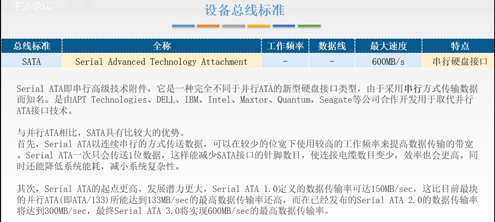
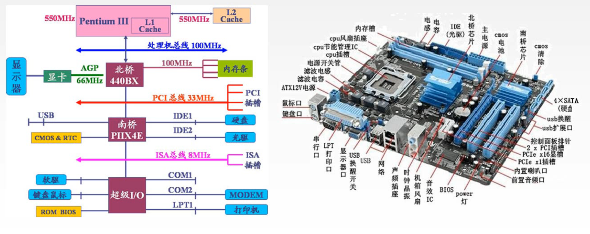

# 1105 总线标准

前面解决了总线的结构，多个设备争用总线给谁用，两个设备使用总线如何完成配合完成数据传输。

现在是设计总线标准，使得多种多样的外部设备，只要符合总线标准，就可以通过总线接口直接接入总线。

对于不同领域不同类型的外部设备，选择其特点选择合适的总线标准，这样不同类型的外部设备只需要关心自己的设备如何设计，而不用关系如何与其他的设备进行交流，因为只需要接入总线给自己这类型提供的专门接口就行了。

## 一. 总线标准的基本概念

图1.总线的基本概念

总线标准是国际公布或推荐的互连各个模块的标准。

分为3类：

1. 系统总线标准：ISA、EISA、VESA、PCI、PCI-Express等

   系统总线，连接计算机各个部件的总线。

2. 设备总线标准：IDE、AGP、RS-232C、USB、SATA、SCSI、PCMIA等

   设备总线，用于把外设接入计算机系统。

3. 局部总线标准：PCI、PCI-E、VESA、AGP等。

   局部总线，少数模块之间交换数据的总线，比如CPU到北桥的总线，这样可以把高速的部件通过局部总线与CPU相连，避免了低速部件拖累系统工作速度。

两个概念：

1. 即插即用（Plug-and-play），
   是总线可以提供的一个功能，当把部件插入总线时，该部件就可用了，其配置是自动完成的，总线需要提供一些可以存储驱动程序并且可以简单处理这些驱动程序的硬件。
2. 热插拔（hot-plugging或Hot Swap），
   也是总线可以提供的一种功能，设备可以不用断电了插入/拔出总线。也需要总线提供支持。

图2.总线标准

这里的总线标准，一个是给出总线标准的名字，要知道是总线标准；二是红框中的总线标准，要知道其特点、特性，并行or串行。

## 二. 系统总线标准

图3.ISA、EISA

**ISA、EISA**

**ISA（Industry Standard Architecture，工业 标准 架构）**最开始是用于8位CPU的PC/XT电脑的系统总线，所以又被称为PC总线或XT总线。

不过现在通常说的ISA总线是指16位的总线了（毕竟时代在进步），又称为AT总线。

ISA的**数据传送需要CPU或DMA接口来管理**，所以传输速率低，占用CPU资源，占用硬件中断资源（因为需要CPU来管理嘛）。
并且**不支持总线总裁**。

ISA总线（8位的）最大传输速率为8MB/s，16位的就是16MB/s，带宽=工作频率x位宽，显然是**并行总线**。

so，要增加带宽，要么增加频率，要么增加位宽，历史上选择了增加位宽，于是出了扩展版。

**EISA（Extended ISA）**，数据线为32根，自然带宽也变为了32MB/s。

EISA与ISA完全兼容，也就是能插入ISA的，也能插入EISA。

从CPU中分离出了总线控制权（减少了对CPU的占用），支持多个总线主控器（增加了总线仲裁功能）和**突发传送**。

可惜速度还是太慢了，后面就被PCI总线取代了。

## 三. 局部总线标准

图4.PCI

**PCI**

**PCI（Peripgeral Cpmponent Interconnect，外围 组件 互连）**

注意到从系统总线变为了局部总线，因为所有东西都挂在系统总线上，速度慢的部件拖累系统速度，所以分开，把高速的东西比如CPU、Cache挂在局部总线上。

同样是**并行总线**，更高的工作频率，更宽的位宽，带宽也更大。

特性：

1. 高性能：**不依附某个具体的处理器，支持突发传送**。

   不依附具体处理器，意思是不需要只能配合专门的处理器才能使用。

2. 良好的兼容性。

   可以兼容以前的ISA、EISA。

3. **支持即插即用**。

4. 支持多主设备。

   有仲裁的能力。

5. 具有与处理器和控制器子系统完全并行操作的能力。

   总线提供一些缓冲区域，两个速度不同的部件可以通过缓冲区域来交流，避免了快的等慢的，相当于并行。

6. 提供数据和地址奇偶校验的能力。

7. **可扩充性好，可采用多层结构提高驱动能力**。

   驱动是指给外设通电，外设越多，需要提供越大的电路，而一组总线上的电流是有上限的。
   而PCI总线可以采用多层结构，当某一层电流已经最大时，再新增一层PCI总线来接入新外设。

8. 采用多路复用奇数，减少了总线引脚个数。

图5.AGP

AGP（Accelerated Graphics Port，加速 图形 端口）

 PCI总线上挂着显卡、声卡、网卡、硬盘控制器等高速外围设备。然后PCI通过一些方式与CPU总线可交换信息，就将高速设备和CPU连接了起来，但是3D显卡的速度越来越快，这种连接方式对3D显卡来说还是太慢了。

于是AGP，**专用于显卡使用的局部总线**出现啦。

现在连接普通高速设备用PCI，连接显卡用AGP。

图6.PCI-E

**PCI-E**

**PCI-E（PCI-Express，PCI-特别快）**，又叫做**第三代I/O技术**，其目的是取代PCI和AGP。

**串行总线**，当然不可能只有一根线，只是说PCI-E总线里的每根线是串行传输的。

果然还是串行快，毕竟频率可以提高到很高，速度远超PCI。

而且PCI-E的连接方式是**点对点串行连接**，每个PCI-E上的设备都具有自己独立的数据连接，各个设备之间并发的数据传输互不影响。

支持双向传输模式，可允许全双工模式。

**支持热拔插**。

图7.VESA

VESA（Video Electronics Standrad Architectture）

是视频电子标准协会针对视频现实的高数据传输率要求而推出的VESA总线，又称**视频局部总线**（VESA local bus），针对多媒体PC要求**高速传送活动图形的大量数据**而产生的。

就是把需要高速传输的外设直接挂到CPU总线上。

## 四. 设备总线标准

图8.USB

**USB**

**USB（Universal Serial Bus，通用 串行 总线）**

**为设备总线，是设备和设备控制器之间的接口**。

特点：

1. **可以热插拔、即插即用**

2. **具有很强的连接能力和很好的可扩充性**

   采用菊花链的方式连接外设，可使用USB集线器链式连接127个外设。

3. **标准统一**

   有USB之前不同类型外设使用的不同接口接入，有了USB大部分都变成了使用USB接入了。

4. **高速传输**

   USB也是串行嘛。

5. **连接电缆轻巧，可为低压（5V）外设供电**

   有供电功能，没有功能功能的总线遇到需要供电的设备，出了接入总线，还需要给设备拉一根电源线。

图9.RS-232C

RS-232C

一般叫它串行通信总线，应用于**串行二进制交换的数据终端设备（DTE）**和**数据通信设备（DCE）**。

图10.IDE（ATA）

IDE（ATA）

用来接入硬盘和光驱的，**并行**。

图11.SATA

SATA

用来接入硬盘的**串行**接口。

图12.SCSI

SCSI

用于计算机和只能设备之间的系统级的接口。

设计了独立的SCSI卡来控制数据的读写，减少了对CPU的占用。

图13.PCMCIA

PCMCIA

## 五. 本节回顾

图14.

不同的总线通过桥接器连接。

这样不同的总线在自己的局部中，是以自己的速度在工作的（就是把速度差不多的分在一组总线）

每组总线遵循自己的总线标准，这样不同总线之间的交流，每组总线提供一个接口就可以互相交流了。

图15.

这里就是给你看看，大致是这么个连接方式。图15左右图不是对应的。

## 六. 补充-视频线标准``

本来应该是下一章I/O里的内容，不过还是标准，所以放在这里了。

图16.视频线标准

VGA（Video Graphics Array）

也成为D-sub端口，传输模拟信号。

DVI（Digital Cisual Interface）

传输数字信号。

HDMI（High Definition Multimedia Interfacce）

传输速度快，并且传送图形同时也把声音传过来。
前面VGA、DVI传图像，还得另外插线把声音传过来。HDMI一根就行了。

2020.09.24