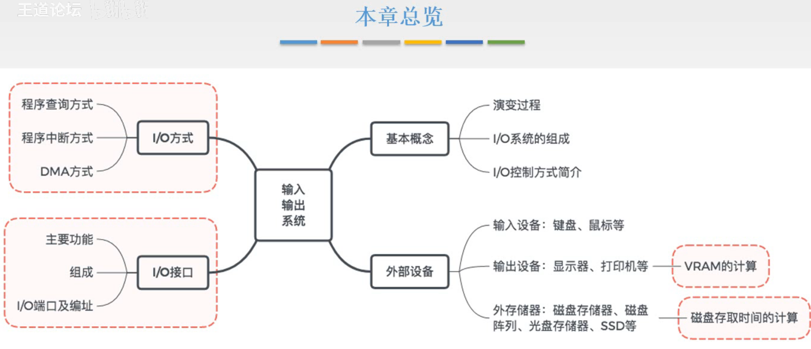

# I/O系统基本概念

图1.本章总览

这一节介绍I/O系统的基本概念，先建立其对I/O系统的基本印象。

然后介绍I/O设备，及它们的工作原理，重点在于显存的计算和磁盘存取时间的计算，工作原理就看看就好。

外设要接入计算机通过I/O接口接入，接着就分析I/O接口，其功能与结构，以及如何与主机通信。

最后是I/O方式，CPU如何控制主机和外设进行交流，有什么方式。

## 一. I/O系统演变过程

图2.I/O演变过程

1. 早期

   早期以CPU为核心，CPU和I/O分散连接，串行工作。

   分散连接，每个I/O都要有一组线连接到CPU上，非常麻烦。

   串行工作，采用**程序查询方式**，由CPU通过程序不断查询I/O设备是否已做好准备，从而控制I/O设备与数据交换信息。
   也就是在I/O设备准备的过程中，CPU不会去做其他事，而是一直在查询I/O设备的状态。

   显然串行工作慢。

2. 接口模块和DMA阶段

   引入了总线结构，CPU和I/O总线连接，并行工作。

   这个时期对应的控制方式是**中断控制**。CPU发送信号给外设后，就可以做其他事了，外设准备好后给CPU信号中断请求，CPU接受到后中断在做的其他事，来和外设进行数据交流。

   但是由于高速外设，速度比较快了，中断就会太频繁了。

   **DMA方式**，所以开辟了一条DMA总线，当高速外设需要和主存进行数据交流时，CPU只需要把这个任务交给DMA，就可以去干其他事了，接下来的任务就由DMA控制器来控制了。
   这样关于外设和主存的数据交流，就不用去中断CPU了。

   但是DMA方式还是需要CPU把任务交给DMA，同时DMA可连接的外设数量与类型不太灵活。

3. 具有**I/O通道**结构的阶段

   所以设计了一些专门用来管理外设的处理器，称为I/O通道，也就是用于这个用途的专门的处理器。

   在I/O通道的管理下，每个通道可以接入多个外设，CPU不需要把任务完整的给通道，而是只用发出简单的启动，停止，通道将执行通道程序，自动的完成相关操作。（通道是有自己的指令的）

4. 具有**I/O处理机**的阶段

   更进一步，扩展I/O通道的功能，发展出由I/O处理机来管理外设。

   此时I/O处理机与CPU的运算能力基本上是一样的，在有的计算机中，如果CPU坏了，I/O处理机还能代替CPU来管理整个系统。

## 二. I/O系统基本组成

一般来说I/O系统由I/O软件和I/O硬件两部分构成。

图3.I/O软件

I/O软件

包括驱动程序、用户程序、管理程序、升级补丁等。

通常采用I/O指令和通道指令实现CPU和I/O设备的信息交换。

1. I/O指令

   格式如图2所示，操作码+命令码+设备码。

   I/O指令的操作码是用来识别是I/O指令的。（和通常指令的操作码意思不一样）所以I/O指令其实是CPU指令集的一部分。
   I/O指令的命令码才是对应做什么操作（这才是通常指令的操作码的含义）
   I/O指令的设备码指出对哪个设备进行操作。

2. 通道指令

   通道指令就不介绍详细格式了。

   是通道自身的指令，用于指出数据的首地址、传送字数、操作命令。

   通道指令存放在主存中。

   CPU会执行启动I/O设备的指令（不是I/O指令，是CPU指令，任务是启动I/O设备），但是会传给对应通道，通道接收到后，从主存取对应的通道程序，运行，由此代替CPU对I/O设备进行管理。
   所以CPU还是会执行指令的，但是没有通道的话，CPU是要详细指出谁、从哪、到哪。有通道的话，CPU只需要发出启动、停止的命令。
   （我感觉是不是CPU只是把传输数据的通道打开，然后要传数据的两个部件自己跟通道说你们要哪的数据要传哪去。毕竟CPU只开启关闭，也没说地址什么的啊）

图4.I/O硬件

I/O硬件

包括外部设备、设备控制器和接口、I/O总线等。

在<计算机组成原理>中，把外部设备控制器和被控制的部分统称为外设。
设备控制器，控制外设的工作，也能可I/O接口进行交流。
I/O接口的任务就是把设备控制器的电信号，转换为主机能识别的格式。

在<操作系统>中，定义可能不一样。看图5。

图5.I/O接口

主要在于对接口的定义上。

接口理解为两个部件之间交接部分。

那主机和被设备控制器控制的部分，中间的I/O接口和设备控制器也可以看为二者之间的接口。

在<操作系统>中，正是对这一部分叫做设备控制器，如图5。

## 三. I/O方式

对控制方式进行一个简单的介绍，后面会再详细讲。

图6.程序查询方式

**程序查询方式**：

开始，CPU在执行程序，

然后执行到一个时间点，这个程序需要进行I/O操作，于是CPU发出启动I/O工作的信号，

而I/O设备需要时间来准备，而且本身比较慢，
在这个过程中，CPU不断查询I/O的状态，来不断确定I/O有没有把准备好，
直到查询到I/O反馈准备好了，就控制进行数据的传输，

传送结束后，再继续执行程序。

在中间的部分，CPU是没有做其他事的，而是一直在查询I/O的状态。

图7.程序中断方式

**程序中断方式**

开始，CPU在执行程序，

然后执行到一个时间点，这个程序需要进行I/O操作，于是CPU发出启动I/O工作的信号，

而I/O设备需要时间来准备，
在I/O准备的过程中，CPU继续做自己的工作，
直到I/O反馈准备好了，I/O设备发出中断请求，

CPU收到I/O请求后，画一小段时间把当前工作保存一下，
然后运行CPU处理中断服务程序，控制I/O设备进行数据传送，

数据传送结束后，CPU继续刚才保存的地方继续执行。

图8.DMA方式

**DMA方式**

开始，CPU在执行程序，

然后执行到一个时间点，这个程序需要进行I/O操作，于是CPU发出启动I/O工作的信号，

而I/O设备需要时间来准备，
在I/O准备的过程中，CPU继续做自己的工作，
直到I/O反馈准备好了，I/O设备发出DMA请求，

CPU收到I/O请求后，如果 CPU 此时需要访存，则暂停CPU的访存，也就是这段时间CPU不访问存储器，
在CPU不访存的这段时间内，由DMA控制器来控制主存和I/O之间的数据传送，
这段时间也就占用一个存取周期。

如果说CPU本身这个时候就不需要访存，那么就不用暂停。
只有CPU需要访存，才暂停等一下。

## 四. 本节回顾

图9.本节回顾

主要由程序控制，通常用于速度比较低的外设：

1. 程序查询方式

   实际上有多个外设时，CPU查询I/O设备状态，是按照优先级一个一个查询的，比如查询外设1，没准备好，查询外设2，没准备好，查询外设3，准备好了，处理外设3。

   而外设要传送的数据都是先送到一个公用的缓冲区的，所以可能在CPU查询过程中，查到3时，1准备好了放入了数据，2也准备好了，覆盖掉了1的数据。

   显然这种情况最可能出现在外设速度很快的时候，所以通常用于速度比较低的外设。

   在有一个外设的场景，使用程序查询方式的目的就是能够很快的、即时的从外设接收数据。

2. 程序中断方式

   因为速度太快的外设，频繁中断CPU，所以用速度慢的外设用程序中断。

主要由硬件控制，通常用于速度比较快的外设：

设计了专用的硬件，速度快，适用于速度快的外设。

2020.09.23

